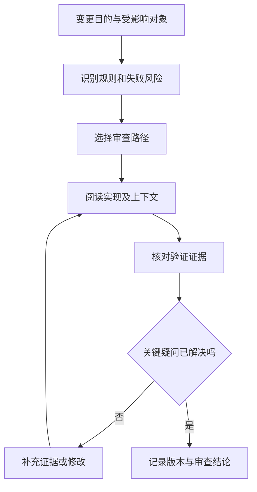

# 代码审查与变更证据

> 本文面向变更作者、审查者与需要理解审批依据的协作人员。读完能按风险组织审查，辨认测试与演示的证明范围，并留下可对应实际版本的审查结论。

## 审查的对象是一项可解释的变化

**代码审查**（code review）是对变更目的、实现及其影响的工程判断。它通常通过差异开展，但判断范围包括需求、接口、数据、依赖、运行条件和维护成本。只看新增行容易漏掉被删除的限制；只看代码风格也无法发现规则本身错误。

Google 的工程实践将设计、功能、复杂度、测试、命名、注释和文档列为审查关注点，并强调审查周边上下文。本文据此组织检查思路；具体团队的验收规则仍应由团队明确。[审查关注点](https://google.github.io/eng-practices/review/reviewer/looking-for.html)

设一个虚构的仓库申请系统新增“审批人可批量拒绝”。作者提交循环处理代码与一张成功截图。审查者应先理解业务意图：审批人是否有权处理每一项申请？其中一项失败后其他项如何呈现？重复提交是否会产生重复通知？这些问题决定了应检查的实现路径与证据，不能由截图回答。

好的变更入口应能说明触发条件、前后行为、范围及验证结果。若混入无关重构，先考虑拆分；若接口与调用方必须同步改变，则保持同一可理解的整合单位，分别解释两边责任。变更大小的价值在于降低理解成本，不是追求固定行数。

## 从风险推导检查路径

审查者可以先建立一条简短因果链：输入从何处进入，规则在哪里判断，状态在哪里提交，副作用如何发生，失败如何返回。高风险点通常出现在边界转换和共享状态上。批量拒绝的循环看似简单，权限范围与事务边界却决定能否安全执行。

这里的风险不一定是安全漏洞。错误计数、数据丢失、升级失败、无法回滚或显著增加维护难度，都可能需要重点审查。对低影响文案修改，不应套用整套并发分析；对权限或数据迁移，仅凭普通单元用例通过也不足以判断。

| 变化类型 | 优先关注 | 对应证据 |
| --- | --- | --- |
| 规则改变 | 合法与非法边界，旧行为兼容 | 决策表、边界用例与预期结果 |
| 权限改变 | 身份、对象范围、默认拒绝 | 越权与不同角色的负向用例 |
| 并发改变 | 原子性、顺序、重复执行 | 竞争场景分析及针对性验证 |
| 数据迁移 | 旧数据、兼容窗口、恢复方法 | 代表性数据迁移与校验记录 |
| 界面交互 | 真实操作路径、错误反馈、可访问性 | 演示或截图加可复现步骤 |
| 依赖升级 | 传递影响、行为变化、运行约束 | 版本差异与项目回归结果 |

表格用于选择证据，不表示每项变更必须采用相同测试层级。检查强度应和可能损失、可恢复性及不确定性相匹配。

## 证据必须说明它证明了什么

**变更证据**是支持某个具体判断的记录。测试通过能支持被覆盖条件下的预期；类型检查能发现其规则内的类型错误；静态分析提示潜在问题；人工演示展示某条路径的可见结果。它们各有范围，组合起来才便于判断。

一条可复核的记录至少说明目标版本、环境条件、步骤、预期、实际结果与局限。例如“在提交 X 的测试环境，用审批人 A 对属于其范围的三项申请执行批量拒绝；三项均变为拒绝，通知各一条；未覆盖并发请求”。其中 A 与申请数据可以使用虚构或脱敏内容。没有必要为了证明行为而在评审材料里暴露真实业务数据。

审查测试代码时，应检查断言是否对应规则。如果用例只断言返回成功，却没有确认状态与通知次数，重复副作用仍可能被漏掉。可以提出一个反问：把目标缺陷重新引入，这个用例是否应当失败？这能检验断言是否真正约束行为。Google 也要求把测试本身作为审查对象。[测试审查说明](https://google.github.io/eng-practices/review/reviewer/looking-for.html)

覆盖率表示部分执行范围，并不说明断言质量或业务组合是否足够。一次“全部测试通过”还需说明哪些测试、对应哪次提交以及是否有跳过项。测试命令退出成功，但关键集成测试因条件缺失未运行，应明确记录，不能把该结果扩展为完整验证。

作者的实现解释是阅读线索，无法代替结果证据。AI 生成的自我总结也一样：它可能正确概括目的，却遗漏真实差异、失败条件或测试未执行的事实。审查者应读实际变更并核对输出，需要了解 AI 协作边界时可参见 [AI 编码责任](/software/guide/ai-coding-responsibility)。

## 给出可操作的反馈

反馈宜包含位置、触发条件、后果和修改方向。比如“批量循环只在入口检查角色；审批人可通过申请编号处理其他范围的对象。请在读取后校验对象范围，并覆盖越权对象用例”，比“权限不严谨”更容易执行和复核。

可以区分阻断问题、需澄清问题和建议。团队若没有统一级别，至少说明该意见是否阻止接受变更。个人偏好的命名和项目已有规范之间应有明确区别；自动工具可检查的风格不宜占据主要讨论时间。

争议应围绕规则、证据和后果展开。如果作者与审查者对业务规则认识不同，先请有决策权的人确认规则；如果对技术风险认识不同，设计能够区分两种判断的实验或读取更直接证据。同步讨论后的决定应回写到评审记录，使未参加讨论的人也能理解。

Google 的审查标准强调改善整体代码健康，也允许接受有明确改进但尚不完美的变更。该原则需要与当地约束一起使用：不能把“整体改善”解释为可以忽略已知越权或数据破坏问题。[审查标准](https://google.github.io/eng-practices/review/reviewer/standard.html)

## 审批结论如何保持有效

审查针对一个范围和版本。作者在审批后改动权限逻辑，旧审批不应自动被视为对新逻辑的认可。即使只有解决冲突，也可能引入新的语义；应重新检查变化部分及其关联路径，并确认整合结果的验证。

多人审查可以按专长分工，但要明确覆盖：有人负责数据迁移，有人负责权限和业务规则，仍需要确认接口连接处没有遗漏。“另一位会看”如果没有分工记录，容易形成空白。审查结论可以写明已检查范围、尚未覆盖事项及接受条件，避免一个批准图标承担超出实际工作的信息。

紧急修复需要缩短等待时，可以集中审查最高风险路径，并留下事后补充事项、负责人和期限。紧急流程是否允许、谁可决定，应由团队已有约定确定。修复服务与补齐长期验证是不同任务，不能因为前者成功就关闭所有后续工作。

审查也有边界：它不能穷举输入、证明所有并发交错或替代运行观察。实际发布还应考虑 [验收与回归](/software/quality/acceptance-regression) 和 [发布回滚](/software/delivery/release-rollback)。有价值的审查结果不是“保证没有错误”，而是清楚说明重要疑问如何得到回答，以及哪些风险仍需后续处理。

## 实例：一项失败如何影响批量结果

批量拒绝三项申请，其中第二项在处理前已经由别人批准。实现可以整批拒绝提交，也可以返回逐项结果；两种方式都需要明确契约。若选择逐项结果，应显示哪些项成功、哪些状态冲突，并确认重试失败项不会再次处理已成功项。

审查者可以要求对应场景的状态与通知核对，并阅读状态检查和写入之间是否存在竞争窗口。仅有“循环捕获异常继续”代码，不足以证明结果符合业务约定；异常被捕获后若仍返回整批成功，又会误导使用者。

最终意见应指向明确条件，例如“状态冲突项不能显示为已拒绝”，并说明需要什么证据来关闭。作者补充实现后，再核对更新版本与测试断言，避免把讨论中的承诺当作已经落地的行为。

## 参考资料

<Refs>

- [Google Engineering Practices：What to look for in a code review](https://google.github.io/eng-practices/review/reviewer/looking-for.html)、[The Standard of Code Review](https://google.github.io/eng-practices/review/reviewer/standard.html)；访问日期：2026-10-03。
- [验证与验收](/software/guide/verification-acceptance)：理解不同检查的目的。
- [Pull Request 工作流](/software/collaboration/pull-request-workflow)：准备、审查与整合入口。
- [测试层级](/software/quality/test-levels)：选择适合风险的验证范围。

</Refs>
