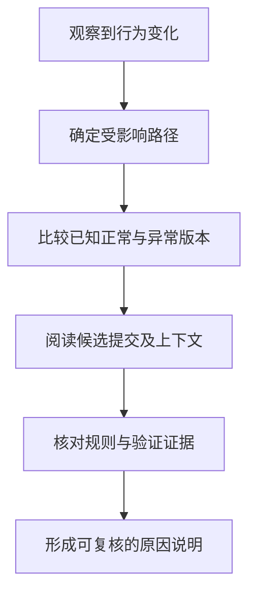

# 提交、差异、历史与撤销

> 本文面向需要检查变更、定位回归或恢复误操作的开发者与协作参与者。读完能说明差异比较的双方，按目的组织提交，并区分恢复文件、调整本地历史和撤销共享变更。

## 从一个错误修复读懂提交

设一个虚构的库存工具允许数量恰好等于可用库存的申请。开发者修改判断条件，同时整理了文件格式、更新提示文字。编辑器里这些变化连续发生，进入历史时却应回答一个更具体的问题：未来的人能否判断“这次为什么改，哪些变化构成同一个目的”？

**提交**（commit）保存项目快照及其父关系。**差异**（diff）是比较两个状态得到的变化视图。提交本身并不是一张增删行清单；同一提交对不同父提交或不同基准比较，得到的差异可以不同。基础模型见 [Git 仓库模型](/software/collaboration/git-repository-model)。

**原子提交**（atomic commit）强调一个可解释、可审查的变更目的。它没有固定行数要求。修改判断、补充对应边界用例和调整说明，可能应属于同一提交；无关格式清理则容易遮蔽真实修复。把相互依赖的修改机械拆成不能运行的版本，也会增加定位困难。团队可以约定中间提交的可构建要求，但应说明适用范围。

提交说明宜写触发条件、行为变化与理由。例如“允许恰好耗尽剩余库存的申请；旧条件将等量申请误判为超量”，比“修复问题”更方便追溯。说明表达作者意图，快照表达实际内容，测试或其他证据支持行为判断；三者需要相互对照。

## 看差异之前先确认双方

Git 官方文档明确区分工作区、暂存区和提交之间的比较。下面是普通仓库中的常见读法；示例没有在当前项目执行。[git diff 文档](https://git-scm.com/docs/git-diff)

| 想回答的问题 | 只读入口 | 比较双方 |
| --- | --- | --- |
| 哪些编辑还没有选入提交？ | `git diff` | 暂存区与工作区 |
| 现在提交会引入什么？ | `git diff --staged` | 当前提交与暂存区 |
| 两个指定版本的文件如何不同？ | `git diff BASE TARGET` | 两个指定快照 |
| 分支从共同起点引入什么？ | `git diff BASE...TOPIC` | 两者合并基点与 TOPIC |

最后两行回答不同问题：目标分支也在前进时，直接比较两端会混入目标分支自己的变化。三点比较适合观察主题分支相对共同起点的变化，但它仍不等于最终合并结果。审查前应记录基准和目标标识，避免一句“差异没问题”无法对应实际版本。

阅读差异时，先看文件范围，再看改变的行为，最后检查周边上下文。红绿行只能说明文字发生变化。库存比较从 `>` 改成 `>=` 是否正确，要由“等量申请是否允许”的规则决定；变量名写着 `available`，还需要确认它是否已经扣除了预留量。对生成文件、大量重命名或二进制文件，应找到源文件、生成方式或可见效果，不能仅凭差异规模判断风险。

暂存后继续编辑很常见：工作区可能已有修复，暂存区却仍是旧判断。提交前复核暂存差异可以避免“本地看起来正确，提交内容仍错误”。未跟踪文件也不应只靠普通差异视图检查，需结合状态列表确认新文件是否纳入。

## 历史阅读是一条证据链

历史追踪一般从现象走向规则，再走向变更。日志用于找候选提交，单次提交视图用于看实际改动，关联议题和评审记录用于理解当时约束。行级归属工具能提示最后改变某行的提交，但该提交可能只是格式化或搬移，不能直接作为责任判断。

“首次失败版本”需要相同或已说明差异的运行条件。源码不同、依赖不同、数据不同都可能引起回归。若利用二分定位，判断脚本或人工步骤必须稳定，并允许把无法构建的版本标为不可判定；随机失败会使搜索结果偏离真正原因。一次提交里同时做格式整理和业务重写，则会扩大每个候选点的解释成本。

历史可以保存错误决定及其纠正，这通常比擦除记录更有利于共享协作。需要纠正作者信息、整理尚未共享的工作时，可以采用团队允许的历史整理流程；已经被别人用作基准的提交，改写后必须处理对方历史的关系。

## 撤销先选择要改变的状态

“回退”可能指四件不同的事：丢弃尚未提交的文件编辑、取消暂存、移动本地分支、追加一个抵消旧变更的新提交。它们有不同影响范围。

| 目的 | 常见操作 | 状态影响与边界 |
| --- | --- | --- |
| 将文件从下一次提交移出 | `git restore --staged -- FILE` | 默认从 HEAD 恢复暂存区，工作区内容保留 |
| 丢弃指定文件的未暂存编辑 | `git restore -- FILE` | 默认从暂存区恢复工作区，覆盖该处编辑 |
| 整理未共享的末尾提交 | `git reset --soft TARGET` | 移动当前分支，保留暂存区和工作区 |
| 撤销已经共享的普通提交 | `git revert COMMIT` | 通常追加反向提交，可能发生冲突 |
| 找回本地曾指向的提交 | `git reflog` | 查看本地引用更新记录，再确认对象是否仍存在 |

Git 的 [restore](https://git-scm.com/docs/git-restore)、[reset](https://git-scm.com/docs/git-reset)、[revert](https://git-scm.com/docs/git-revert) 与 [reflog](https://git-scm.com/docs/git-reflog) 文档分别描述这些语义。执行写操作前，应先读状态、保存需要保留的内容、确认路径与目标标识，并检查执行后的差异。这里的命令是语义示例，不构成对任意工作区的批量清理步骤。

`reset` 还存在不同形式：带路径的形式调整暂存内容，不等于移动整个分支；移动分支时，`--mixed` 通常还重置暂存区，`--hard` 会覆盖工作区并可能覆盖阻碍恢复的未跟踪文件。把某次成功经验中的 `--hard` 直接搬到另一个项目，容易丢失尚未保存的工作。

共享提交通常采用 `revert`，让后续协作者看到纠正过程。但它反转的是代码改动，无法收回已发送的消息、恢复被删除的数据库记录或撤销外部副作用。合并提交的撤销还需要指定主线父提交，并会影响后续合并的变化引入方式，应单独分析历史关系。发布回滚涉及制品、配置和数据，见 [发布、观察与回滚](/software/guide/release-observe-rollback)。

## 恢复能力的实际边界

引用移动后，原提交可能仍存在于对象库中；reflog 可以提供线索。它记录的是本地引用更新，不能代替远端备份，也不是普通克隆会共享的项目历史。记录会过期，对象也可能被清理。未提交、未暂存且没有其他备份的编辑，不能假定 Git 总能恢复。

恢复时宜先给确认的旧提交建立保留引用，再决定是否移动当前分支。这样可以阅读两份历史，而不会把寻找过程和替换过程混在一起。涉及错误合并或重写历史时，还要检查其他人是否已经从旧提交继续工作，沟通恢复基准。

常见失败有三个：差异视图只看新增行而忽略删除的约束；把提交时间当作父关系；把源码恢复成功当作运行系统恢复成功。可靠的变更记录应留下明确目的、范围、版本和验证条件，使下一次排查可以复核同一组事实。

## 实例：共享修复后又发现副作用

假设库存修复已经合并，随后发现新判断允许某类已关闭申请重新预留。先保存受影响版本及复现步骤，比较修复前后条件，确认问题是否确由该提交引入。若选择追加反向提交，需要核对后续变更是否依赖新判断；反向补丁发生冲突时，不能直接接受任一侧，应该保留其他有效修复。

若旧判断同样错误，简单反转会重新引入旧缺陷。团队可以选择前向修复，补足关闭状态的判断并验证两类边界。决定应说明恢复的是哪个行为、会暂时保留什么限制，并让评审者看到对应差异。代码撤销和业务恢复之间不存在必然等号。

如果异常操作已经形成预留记录，还需要独立核对数据。记录范围、修正依据和处理结果，并保证不会误删合法申请。此时 Git 历史支持解释代码原因，数据修正记录支持解释业务状态，两份证据各有用途。

## 参考资料

<Refs>

- [Git：git diff](https://git-scm.com/docs/git-diff)、[git restore](https://git-scm.com/docs/git-restore)、[git reset](https://git-scm.com/docs/git-reset)、[git revert](https://git-scm.com/docs/git-revert)、[git reflog](https://git-scm.com/docs/git-reflog)；访问日期：2026-10-03。
- [认识变更与版本](/software/guide/changes-and-versions)：从日常编辑进入版本管理。
- [分支、合并与冲突策略](/software/collaboration/branches-merges-conflicts)：理解共享历史的整合。
- [代码审查与变更证据](/software/collaboration/code-review-evidence)：把差异与行为证据连接起来。

</Refs>
