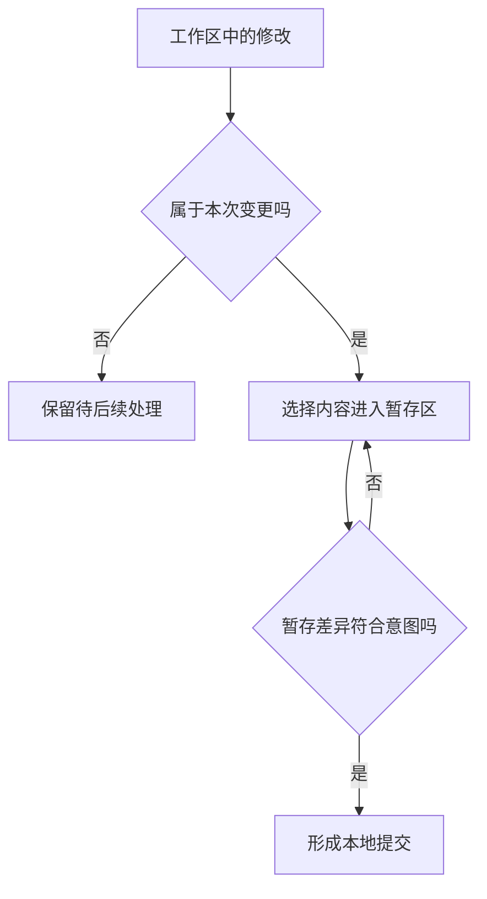
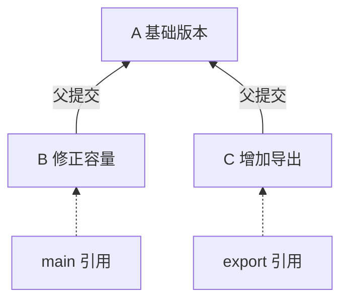

# Git 仓库模型

> 本文面向需要阅读研发进度、参与软件协作的非程序员，以及刚接触版本管理的开发者。读完能解释文件保存、暂存、提交和推送分别发生了什么，读懂分支与提交的关系，并判断一个修改究竟保存在哪里。

## Git 记录什么：可追溯的项目快照

Git 是版本控制系统：它记录项目内容的历史，让团队比较、恢复和整合不同阶段的工作。这里的**仓库**是保存版本对象和历史关系的数据库；它与当前可打开、可编辑的项目文件有关，但二者并不相同。

一次**提交**（commit）可以理解为一个有标识的项目快照。快照描述该次提交选定的、受版本管理的内容与目录结构；提交还记录作者、说明和历史关系。后来看到的增删行，是把两个版本比较出来的结果。Git 官方《Pro Git》用快照解释这一模型，未变化的内容可被复用，并非每次提交都重新复制整个目录。[Git 的快照模型](https://git-scm.com/book/en/v2/Getting-Started-What-is-Git%3F)

快照只覆盖被纳入的内容。电脑上的临时文件、未跟踪的新文件、外部数据库和运行环境，并不会因为“项目用了 Git”就自动进入历史。因此，“可以取回这次提交的源码”与“可以立即重现当时运行的系统”是两个需要分别证明的能力；后者还涉及[依赖与锁文件](/software/toolchain/dependencies-lockfiles)以及环境配置。

## 工作区、暂存区、仓库：三个位置回答三个问题

**工作区**（working tree）是当前展开到磁盘上的文件；**暂存区**（staging area，也称 index）描述下一次提交准备采用的内容；**本地仓库**保存已形成的提交、对象和引用。对普通的暂存后提交流程，可以这样区分：

| 位置 | 回答的问题 | 修改后的状态 | 可以据此确认什么 |
| --- | --- | --- | --- |
| 工作区 | 我现在正在编辑什么？ | 文件已保存，但可能尚未暂存 | 编辑器中的内容已写到当前文件 |
| 暂存区 | 下一次提交准备收进什么？ | 已选定某个内容版本 | 普通提交会采用这份准备好的快照 |
| 本地仓库 | 我已经留下哪些历史记录？ | 已形成有标识的提交 | 本地可以查询这次记录及其关系 |

这三个位置的作用见 [Git 官方说明](https://git-scm.com/book/en/v2/Getting-Started-What-is-Git%3F)。暂存提供了一次选择机会：一次工作可能同时涉及业务修复、文案和临时调试，团队可以按可解释的目的形成提交，方便后续审查或撤销。

图中的判断依据是本次变更的目的。文件数少并不一定容易审查：一个文件同时改变容量规则和管理员权限，也可能需要拆成两个清楚的变更。

### 暂存的是某个内容版本

设虚构的小型活动报名系统存在容量判断错误。开发者先修正容量逻辑并暂存，随后又修改取消报名的提示文字。如果没有重新暂存，普通提交会包含前一次选定的容量修复，后改的文案仍留在工作区。同一个文件同时显示“已暂存”和“未暂存”，正是这两份内容存在差异的结果。[暂存与记录修改](https://git-scm.com/book/en/v2/Git-Basics-Recording-Changes-to-the-Repository)

一个很实用的读法是比较三份内容：

- 工作区对暂存区：还有哪些编辑没有选入下一次提交。
- 暂存区对当前提交：如果现在提交，历史会增加哪些变化。
- 某个提交对其父提交：这一条历史记录实际引入了什么。

常用的只读入口是 `git status`、`git diff` 和 `git diff --staged`。前者看状态，后两者分别看未暂存与已暂存差异。图形客户端通常也有相应视图；理解比较双方比记住按钮位置更重要。[差异比较的含义](https://git-scm.com/book/en/v2/Git-Basics-Recording-Changes-to-the-Repository)

## 提交关系构成历史，分支是指向历史的引用

### 提交不只是按时间排列的文件夹

每个提交都有对象标识，并记录父提交。初始提交可以没有父提交，普通提交通常有一个父提交，合并提交可以有多个父提交。这些关系构成一张没有循环的历史图：可以沿父关系向前追溯变化的来源。提交时间有参考价值，父关系才说明历史如何连接。[提交对象与父关系](https://git-scm.com/book/en/v2/Git-Branching-Branches-in-a-Nutshell)

### 分支名称会移动，提交记录有自己的标识

**分支**（branch）是指向某个提交的可移动引用。在通常的分支工作状态下，新提交形成后，当前分支移到新提交；其他分支可以继续停在原处。`HEAD` 通常指向当前分支；直接检出某个提交时，也可能进入不依附分支的状态。

图中 `main` 与 `export` 从 A 分开演进。判断能否整合 B 与 C，需要比较它们的内容和业务规则，而不是比较分支名称或谁最后修改文件。图中实线指向父提交，虚线表示分支引用；分支不是另一份固定的历史副本。

`main`、`master` 等名字没有内置的质量保证。“主分支必须经过审查”来自团队约定和托管平台规则。两条分支既可能指向同一提交，也可能拥有不同的后续提交；这就是分支能支持并行工作的原因。[分支与 HEAD](https://git-scm.com/book/en/v2/Git-Branching-Branches-in-a-Nutshell)

### 合并成功还需要判断业务是否一致

Git 可以依据历史整合文件变化。当同一处内容存在难以自动选择的修改时，会要求人工处理冲突。没有文本冲突仍可能有业务冲突：一条分支允许活动满额后进入候补，另一条分支把满额视为终止报名；如果只拼接代码，系统可能出现相互矛盾的行为。

因此，合并后的判断要回到需求：容量是否仍受约束、重复提交是否仍只产生一份有效报名、名单导出是否仍受权限控制。版本工具负责记录和整合内容，业务正确性需要审查与验证；具体协作过程见 [PR 工作流](/software/collaboration/pull-request-workflow)。

## 本地与远端：共享的是提交和引用

**远端**（remote）是本地配置的一处其他仓库地址及其名称。`origin` 是克隆时常见的默认名称，可以改名，也可以配置多个远端；地址可以位于托管服务、其他服务器，甚至同一台机器的另一处目录。它不等同于 GitHub，也不天然代表唯一权威副本。[远端的含义](https://git-scm.com/book/en/v2/Git-Basics-Working-with-Remotes)

| 动作 | 发生的变化 | 还需要确认什么 |
| --- | --- | --- |
| 保存文件 | 工作区内容改变 | 是否暂存、是否形成提交 |
| 本地提交 | 本地历史增加记录 | 是否已共享到指定远端 |
| 推送（push） | 尝试向指定远端传送对象并更新引用 | 远端是否接受、更新了哪条分支 |
| 获取（fetch） | 取回远端对象并更新相应远端跟踪引用 | 是否要整合到自己的当前分支 |
| 拉取（pull） | 获取后整合到当前分支，方式由选项和配置决定 | 使用合并还是变基、结果是否符合预期 |

推送需要目标仓库允许写入；别人已经推进远端历史、保护规则或权限限制都可能导致拒绝。推送被拒绝时，应先理解远端变化及规则，再选择整合方式。[共享与获取远端内容](https://git-scm.com/book/en/v2/Git-Basics-Working-with-Remotes)

本地的 `origin/main` 是**远端跟踪引用**，可理解为最近一次相关同步得到的远端状态记录。它不会持续监听服务器；本地 `main`、本地 `origin/main`、服务器上的 `main` 是三个需要分别辨认的对象。看到“与 origin/main 一致”，仍要注意这个记录是否新鲜。[远端跟踪引用](https://git-scm.com/book/en/v2/Git-Branching-Remote-Branches)

## 实践：用具体版本沟通进度

当协作者说“报名修好了”，可以把进度表达成可核对的事实：修复位于哪个提交、哪个远端分支，审查是否完成，在哪个环境验证过。发一个提交标识，能减少“我这边是旧版”的歧义；只发分支名称仍可能遇到分支继续移动的问题。

提交范围宜围绕一个可解释的目的，并包含使这个目的成立所需的关联修改。过大提交难以定位错误；机械地把一个不可分割的规则拆成多次不完整修改，也会增加阅读成本。提交说明应解释“为什么需要改变”以及重要边界，差异本身负责展示“具体改了哪些行”。

## 常见误解与边界

| 误解 | 容易出现的后果 | 判断方法 |
| --- | --- | --- |
| 保存文件就是提交 | 换机器后找不到修改 | 查工作区、暂存区和历史记录 |
| 暂存后继续编辑会自动进入本次提交 | 提交内容与眼前文件不同 | 提交前重新阅读暂存差异 |
| 提交后团队都能看到 | 修改只存在本地 | 查指定远端是否接受了推送 |
| 获取远端就更新了当前文件 | 当前分支仍停在旧版本 | 区分获取与后续整合 |
| 没有冲突就代表结果正确 | 容量、权限等规则相互抵触 | 以需求和验收标准验证整合结果 |
| Git 能还原所有电脑内容 | 环境、外部数据或未跟踪文件缺失 | 明确版本库的实际记录范围 |

Git 历史提供恢复线索，但未提交的编辑仍可能被覆盖或删除；共享历史的改写也会影响协作者。恢复操作前先确认目标版本与现有修改，不能把版本控制当成任意操作都安全的承诺。

## 参考资料

<Refs>

- [Git 官方《Pro Git》：What is Git?](https://git-scm.com/book/en/v2/Getting-Started-What-is-Git%3F)（访问日期 2026-10-03）— 快照及三个状态
- [Git 官方《Pro Git》：Recording Changes to the Repository](https://git-scm.com/book/en/v2/Git-Basics-Recording-Changes-to-the-Repository)（访问日期 2026-10-03）— 跟踪、暂存与差异
- [Git 官方《Pro Git》：Branches in a Nutshell](https://git-scm.com/book/en/v2/Git-Branching-Branches-in-a-Nutshell)（访问日期 2026-10-03）— 提交父关系、分支与 HEAD
- [Git 官方《Pro Git》：Working with Remotes](https://git-scm.com/book/en/v2/Git-Basics-Working-with-Remotes)（访问日期 2026-10-03）— 远端、获取和共享
- [Git 官方《Pro Git》：Remote Branches](https://git-scm.com/book/en/v2/Git-Branching-Remote-Branches)（访问日期 2026-10-03）— 本地分支与远端跟踪引用
- 站内相关：[文件、目录与仓库](/software/guide/files-directories-repositories) · [项目结构](/software/toolchain/project-structure) · [依赖与锁文件](/software/toolchain/dependencies-lockfiles) · [PR 工作流](/software/collaboration/pull-request-workflow) · [验收标准](/software/requirements/acceptance-criteria)

- 深入阅读：[提交、差异与撤销](/software/collaboration/commits-history-undo) · [分支与冲突](/software/collaboration/branches-merges-conflicts) · [标签与版本基线](/software/collaboration/tags-versions-baselines)

</Refs>
