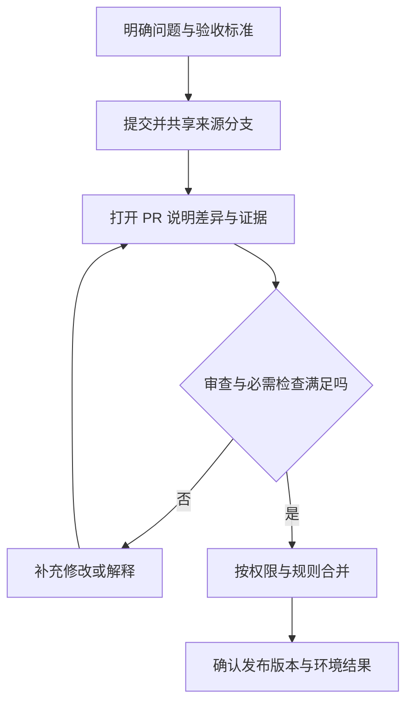

# Pull Request 工作流

> 本文面向参与软件交付的产品、测试、开发和维护人员。读完能区分 Issue、提交、推送、PR、合并和发布，理解审查与自动检查各自证明什么，并用明确条件判断一项变更是否适合进入目标分支。

## 仓库托管为 Git 增加协作流程

Git 记录快照和提交关系；**仓库托管平台**把仓库放在团队可访问的位置，并提供账号权限、讨论和审查等协作入口。GitHub、Gitee、GitLab 属于这一类平台。更换平台时，Git 的基础模型仍然成立，协作规则则要按具体仓库核对。

**Pull Request**（PR，拉取请求）是在托管平台上提出的一项合并建议：希望把来源分支的变化整合到目标分支。GitHub 文档把它描述为提议、讨论和合并变更的场所。GitLab 使用 **Merge Request**（MR，合并请求）这个名称。两个术语都需要辨认来源、目标、差异和合并条件，名称本身不保证相同的权限或检查配置。[GitHub PR 定义](https://docs.github.com/en/pull-requests/get-started/about-pull-requests)、[GitLab MR 文档](https://docs.gitlab.com/user/project/merge_requests/creating_merge_requests/)

本文以 GitHub 的公开文档说明具体机制。使用 Gitee 或 GitLab 时，可沿同一逻辑阅读项目规则：谁可提出变更、谁负责审查、哪些检查必需、谁可以合并；界面和规则的具体实现以各平台及仓库配置为准。

## Issue、提交与 PR 分别管理什么

**Issue** 是跟踪问题、任务、想法或缺陷的记录。它承载问题背景、期望行为、讨论和责任；PR 承载为解决问题而提出的具体文件变化。二者可以关联，但不需要机械地一一对应：一个问题可能分几次交付，一次变更也可能解决几个有共同原因的问题。[GitHub Issues](https://docs.github.com/en/issues/tracking-your-work-with-issues/learning-about-issues/about-issues)

| 对象或动作 | 核心内容 | 所表达的进度 |
| --- | --- | --- |
| Issue | 要解决什么，为什么，怎样判断完成 | 问题已记录或进入处理 |
| 提交（commit） | 某个内容快照及其历史关系 | 形成了版本记录 |
| 推送（push） | 共享提交并更新远端引用 | 指定远端已接收相应内容 |
| PR/MR | 来源到目标的合并提议及讨论 | 变更已进入协作评审 |
| 合并（merge） | 把变化整合进目标分支 | 目标分支已接受这项变更 |
| 发布或部署 | 将选定版本提供到目标环境 | 还需确认环境、版本与运行结果 |

PR 打开时，相关修改通常已经形成提交并共享到平台上的来源分支；打开 PR 不是替代 Git 提交。PR 仍然可以继续修改、被关闭或暂不合并。即使合并进入 `main`，也不能仅凭这个状态报告“用户已经可以使用”：仓库可能自动部署，也可能等待发版、人工批准或后续环境验证。[GitHub PR 的阶段](https://docs.github.com/en/pull-requests/get-started/about-pull-requests)

## 从提议到合并：把门槛放在实际变更上

图中的循环意味着审查针对一份具体变化。补交修改后，需要重新判断已有评论、批准和测试结果是否仍覆盖当前内容；流程跑过一次并不能永久证明后续修改正确。

### 提议：先让别人看得懂问题与范围

PR 的**来源分支**（head branch）包含希望整合的变化，**目标分支**（base branch）是计划接收变化的位置。来源可以来自同一仓库，也可以来自另一个仓库的分叉副本（fork）。先核对仓库与两个分支，再读差异；把维护修复误投到另一个版本分支，会改变实际交付范围。[GitHub PR 组成](https://docs.github.com/en/pull-requests/get-started/about-pull-requests)

描述宜围绕一个具体问题，回答四件事：原来在哪种条件下出错；修改后预期是什么；如何验证；还存在哪些限制。只列“修改三个文件”缺少目的，写“功能已完善”缺少可核对的结果。截图适合证明界面变化；日志、测试结果或数据状态更适合证明重复提交、容量和权限行为。

### 审查：人工判断需求、机制与影响

GitHub 的审查决定包括评论（Comment）、批准（Approve）和要求修改（Request changes）。普通评论不等于批准；批准表达审查者认为变化可以合并，也不自动代表所有其他条件已经满足。能否阻止合并，还取决于仓库规则及审查者权限。[PR 审查类型](https://docs.github.com/en/pull-requests/reference/pull-request-reviews)

人工审查宜关注自动检查难以回答的问题：实现的是否是约定需求；权限是否在可信位置执行；失败后的结果是否清楚；改动是否影响旧行为；维护人员是否能理解与诊断。审查者应把阻断问题与可选改进区分清楚，说明需要哪项证据或修改才能关闭问题。

关闭一条讨论表示它已被处理或确认，不等于争议自动消失。对容量、授权等重要问题，应留下结论和依据，方便合并人员判断，也方便后续追溯。

### 检查：让机器验证可执行的约束

**持续集成**（CI）通常在变更时自动运行构建、测试、静态检查等任务。检查结果证明其实际执行的断言在相应条件下成立；它不能覆盖未设计的业务规则，也不能替代对测试内容的审查。

| 证据 | 可以帮助判断 | 需要留意的边界 |
| --- | --- | --- |
| 构建成功 | 选定环境中可生成结果 | 不能证明容量或权限规则正确 |
| 自动测试通过 | 已执行样本满足相应断言 | 样本、数据与断言可能遗漏风险 |
| 人工审查批准 | 审查者接受看到的差异 | 后续变化可能需要重新审查 |
| 合并条件满足 | 仓库允许当前变更进入目标分支 | 只反映已配置的规则 |
| 目标环境验证 | 指定版本在指定环境满足观察条件 | 环境和数据边界要明确 |

## 合并条件：平台允许与工程就绪都要判断

GitHub 的分支保护可要求审查批准、指定状态检查和讨论处理等条件；这些要求需要配置。仓库管理员或有绕过权限的角色，也可能在规则允许的范围内绕过限制。设置了保护规则，并不意味着所有角色、所有分支、所有检查都受到同样约束。[分支保护](https://docs.github.com/en/repositories/configuring-branches-and-merges-in-your-repository/managing-protected-branches/about-protected-branches)

合并前，建议逐项判断：

1. 问题和验收标准明确，变更范围符合本次交付。
2. 当前来源与目标正确，差异包含预期文件，没有无关内容。
3. 重要审查意见已经形成可追溯的处理结论。
4. 必需检查满足要求，并且对应当前待合并内容。
5. 与目标分支整合后的行为有足够证据，未解决风险已有明确处理。
6. 操作者有合并权限，发布依赖与后续责任清楚。

这是一组工程建议，具体项目可按风险裁剪。平台显示“允许合并”是规则判断；维护人员仍应判断规则是否足以覆盖本次风险。

### 新提交和目标分支变化会改变判断基础

批准后又修改权限逻辑，先前审查就未必覆盖当前差异。GitHub 可以配置使旧批准失效，或要求最近一次可审查推送获得新的批准。保护规则也可要求分支跟上目标分支；实际采用什么机制应查看配置。[审查有效性与分支保护](https://docs.github.com/en/repositories/configuring-branches-and-merges-in-your-repository/managing-protected-branches/about-protected-branches)

目标分支继续变化时，两个 PR 各自测试通过，组合后仍可能不兼容。繁忙仓库可使用合并队列，让变化与最新目标分支及队列中先前的变化一起接受必需检查。它仍依赖检查设计及正确的触发配置。[合并队列](https://docs.github.com/en/repositories/configuring-branches-and-merges-in-your-repository/configuring-pull-request-merges/managing-a-merge-queue)

不要把检查状态简单理解成“每项测试都执行并成功”。GitHub 中有些跳过的任务会报告成功；对关键行为，应核对检查是否真正执行、覆盖什么内容。绿色标记的业务意义取决于检查设计。[状态检查的含义](https://docs.github.com/en/pull-requests/reference/status-checks)

### 合并方式决定历史如何保留

| 方式 | 对历史的主要影响 | 选择时考虑 |
| --- | --- | --- |
| 合并提交 | 保留来源提交并增加明确合并点 | 中间提交是否有独立阅读价值 |
| 压缩合并（squash） | 将 PR 的变化合成目标分支的一次提交 | PR 是否代表一个完整逻辑变化 |
| 变基合并（rebase） | 把来源提交依次接到目标历史上，形成线性记录 | 各提交是否已经整理清楚 |

可用方式由仓库设置决定。选择依据是历史阅读与维护需求；任何方式都不会替代审查和验证。需要追溯时，应同时保留 PR 讨论和最终进入目标分支的版本信息。[GitHub 合并方式](https://docs.github.com/en/pull-requests/reference/pull-request-merges)

## 一个局部例子：容量修复如何交付

虚构报名系统在最后一个名额被并发申请时可能超额。Issue 可以记录触发条件及“有效报名总数不超过容量”的目标；PR 则说明修复机制，并附上能检查最终报名状态的并发验证。此处的案例只是说明协作方法，不代表已经运行过测试。

审查者需要确认重复请求不会额外占位、取消行为仍正确、失败请求得到清晰反馈。若作者又调整取消规则，应更新描述和相应证据。合并后，交付记录还要标出发布版本、目标环境与验证结果，才能把仓库中的修复与实际可用行为连接起来。

## 常见失败模式

| 失败模式 | 后果 | 改进方法 |
| --- | --- | --- |
| PR 没有问题背景 | 审查者无法判断范围与取舍 | 关联问题及[验收标准](/software/requirements/acceptance-criteria) |
| 顺手混入大量无关变化 | 关键规则被淹没，回退困难 | 围绕可独立判断的目的组织变更 |
| 批准后继续修改，却沿用旧证据 | 最后进入的内容未被有效审查 | 重新评估受影响的审查与检查 |
| 检查通过只看总状态 | 跳过关键任务或断言无效 | 阅读检查执行情况与业务结果 |
| 把冲突处理当成机械选择 | 文件可合并，业务行为相互矛盾 | 复核整合后的规则与相关回归 |
| 把合并或关闭 Issue 当成上线 | 交付进度与用户体验不一致 | 单独记录版本、部署与环境验证 |

## 参考资料

<Refs>

- [GitHub Docs：About pull requests](https://docs.github.com/en/pull-requests/get-started/about-pull-requests)（访问日期 2026-10-03）
- [GitHub Docs：About issues](https://docs.github.com/en/issues/tracking-your-work-with-issues/learning-about-issues/about-issues)（访问日期 2026-10-03）
- [GitHub Docs：Pull request reviews](https://docs.github.com/en/pull-requests/reference/pull-request-reviews)（访问日期 2026-10-03）
- [GitHub Docs：About protected branches](https://docs.github.com/en/repositories/configuring-branches-and-merges-in-your-repository/managing-protected-branches/about-protected-branches)（访问日期 2026-10-03）
- [GitHub Docs：Status checks](https://docs.github.com/en/pull-requests/reference/status-checks)（访问日期 2026-10-03）
- [GitHub Docs：Managing a merge queue](https://docs.github.com/en/repositories/configuring-branches-and-merges-in-your-repository/configuring-pull-request-merges/managing-a-merge-queue)（访问日期 2026-10-03）
- [GitHub Docs：Pull request merges](https://docs.github.com/en/pull-requests/reference/pull-request-merges)（访问日期 2026-10-03）
- [GitLab Docs：Create merge requests](https://docs.gitlab.com/user/project/merge_requests/creating_merge_requests/)（访问日期 2026-10-03）— 仅用于 MR 术语与来源、目标概念
- 站内相关：[Git 仓库模型](/software/collaboration/git-repository-model) · [问题与范围](/software/requirements/problem-scope) · [验收标准](/software/requirements/acceptance-criteria) · [软件项目全貌](/software/guide/software-project-overview) · [AI 编程责任边界](/software/guide/ai-coding-responsibility)

- 深入阅读：[代码审查与证据](/software/collaboration/code-review-evidence) · [版本与基线](/software/collaboration/tags-versions-baselines)

</Refs>
