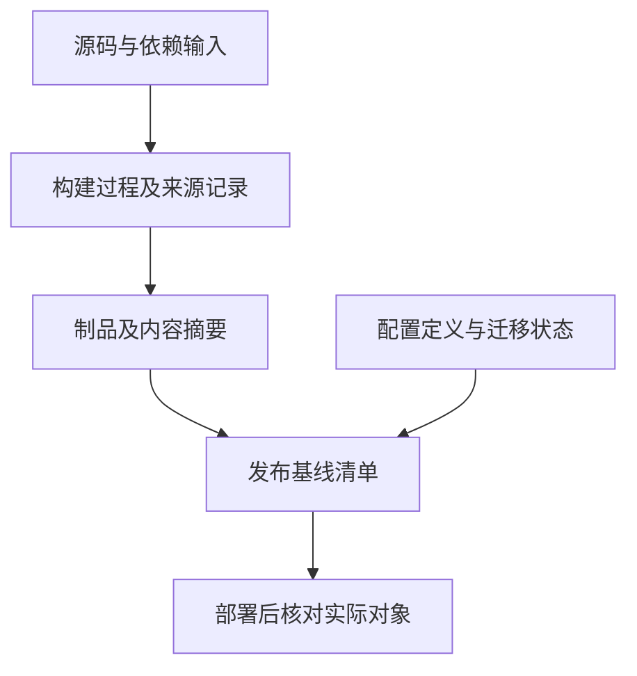

# 标签、版本与配置基线

> 本文面向需要发布、支持旧版本或核对运行对象的开发与运维人员。读完能区分标签、版本号和基线，建立源码到制品的对应关系，并判断一次回滚是否具备必要条件。

## 一个版本名字不能说明整个系统

虚构的报表工具发布了 `2.3.0`。同一名字下，有人从不同提交构建，有人更新了依赖锁文件，还有环境使用新的配置格式。故障报告写着“2.3.0 导出失败”，支持者仍无法定位对象：版本名相同，实际输入与制品却不同。

**标签**（tag）为 Git 对象提供名称；**版本号**（version）表达产品或接口的发布序列与兼容约定；**配置基线**（configuration baseline）确定一组受控对象及其状态，作为后续比较和变更的参照。这三者可以互相关联，但不能相互替代。

配置管理中的“配置”范围比环境变量更广，可包括源码、需求、依赖、构建输入、制品、配置定义和迁移记录。NASA 的配置管理章节强调受控对象、当前基线、变更状态和审计记录。普通软件项目可按规模简化实施，不必复制航天项目的审批层级。[NASA 配置管理](https://www.nasa.gov/reference/6-0-crosscutting-technical-management/)

## 标签标识源码位置

Git 区分轻量标签与附注标签：前者直接为对象命名，后者有独立标签对象，包含创建信息、说明及可选签名。附注标签适合携带发布信息，轻量标签可用于临时标记。[Git tag 文档](https://git-scm.com/docs/git-tag)

标签在 Git 中并非技术上不可修改。团队通常约定已发布标签不可重用，并通过托管平台权限、制品仓库规则和审计实施约束。若误发布，宜产生新的版本记录，保留旧对象及处理说明；把旧名称偷偷指到新提交，会使已下载者与后来下载者看到不同内容。

签名支持验证对象是否由对应密钥签署及内容是否一致；身份信任仍依赖密钥管理和验证策略。签名不证明代码正确，也不自动证明构建来自该源码。标签签名、构建来源证明和运行时检查解决不同问题。

源码提交标识也不等于制品标识。同一源码可能因依赖解析、编译器、时间输入或环境差异产生不同输出。即使期望可复现构建，也应保存实际发布制品的摘要，不能只写“从这个标签构建”。

## 版本号建立兼容沟通

**语义化版本**（Semantic Versioning，SemVer）以明确声明的公共 API 为前提：主版本变化表示不兼容 API 变化，次版本表示兼容功能增加，修订版本表示兼容修复。已经发布的版本内容不得更改；预发布标识与构建元数据有各自规则。[SemVer 2.0.0](https://semver.org/)

“公共 API”可以是库函数、HTTP 接口、命令行参数、公开数据格式或其他被承诺的契约。若没有说清承诺范围，“没有删除函数”也可能掩盖行为不兼容。比如排序从稳定改为不稳定、错误码含义变化、默认超时变短，都可能影响依赖者。

对只维护一个在线版本的应用，团队可以使用日期、发布序号或内部版本标识；重要的是规则可解释，并能找到对应对象。SemVer 是兼容沟通协议，不能强迫所有产品都采用相同编号，也不是自动升级成功的保证。

| 对象 | 建议记录 | 能回答的问题 |
| --- | --- | --- |
| 公共接口版本 | 兼容承诺及变更说明 | 使用方需要怎样调整？ |
| 源码标签 | 标签对象及提交标识 | 当时选用了哪份源码？ |
| 发布制品 | 类型、版本、不可变摘要 | 实际部署的是哪一份输出？ |
| 运行配置 | 配置定义版本及有效配置标识 | 该环境按什么参数运行？ |
| 数据状态 | 已应用迁移与兼容范围 | 新旧程序能否读取这些数据？ |

配置记录应引用机密的受控版本或来源，不能把口令写进发布清单。配置定义可以纳入 Git，机密值应由合适的管理系统提供，详见 [配置、机密与数据](/software/guide/configuration-secrets-data)。

## 将发布对象连接为基线

一次可核对的发布，至少需要回答：源代码从哪里来，构建用了什么，产出是什么，准备在什么条件下运行。SLSA 的来源证明用于记录制品如何产生及其输入关系；它有助于验证来源，仍需要验证方按照自己的信任策略检查。[SLSA Provenance](https://slsa.dev/spec/v1.2/provenance)

图中基线清单并不要求使用特定平台。小项目可以维护结构清楚的发布记录，大项目可以由流水线生成并校验。关键在于名称、摘要、引用和状态能相互对应，而且变更后有新的记录。

例如报表工具的清单记录发布 `2.3.1`、源码提交 X、锁文件标识 L、构建环境标识 B、制品摘要 H、配置定义 C 和迁移 M。X、L 等是示意符号，实际记录应使用系统可解析的标识。验证记录也应指向 H 或对应构建输出，而不是笼统写“测试过 2.3 系列”。

运行配置可能需要独立调整，不必每次都构建源码，但仍应留下有效配置变化、操作者、适用环境和验证结果。允许独立调整的参数、需要重新发布的参数、不可在线改变的参数，应在接口和运行说明中明确。

## 回滚需要分析兼容方向

源码可取回，只证明历史存在。制品可取回，才说明可以部署原输出。部署原输出能否恢复服务，还取决于当前配置、数据和外部接口是否兼容。

| 发布变化 | 仅恢复旧制品是否足够 | 需要核对 |
| --- | --- | --- |
| 内部逻辑修复，数据格式未变 | 可能足够 | 旧行为、配置及外部副作用 |
| 增加可选数据字段 | 可能兼容 | 旧程序是否忽略新字段 |
| 删除旧程序使用的列 | 通常不足 | 数据恢复或前向修复方案 |
| 配置格式升级 | 取决于解析器 | 旧程序是否接受当前配置 |
| 外部通知已经发出 | 无法仅靠源码撤回 | 补偿、说明与对账过程 |

兼容窗口可以通过先增加、后迁移、最后删除的方式建立，但要规定窗口内允许哪些程序和数据组合。旧版本持续写入旧字段时，新版本只读新字段，仍可能发生数据分化。迁移与升级策略见 [依赖升级、弃用与兼容](/software/maintenance/upgrades-compatibility)。

## 管理基线的常见失效

可变的 `latest` 标签方便操作，却不能单独作为历史审计依据。记录它当时解析到的摘要，才方便核对。同一个版本重新上传不同内容，会破坏缓存、签名和故障定位的假设；不同环境分别构建同一版本，也需要承认输出可能不同。

另一个风险是清单与实际部署脱节。流水线记录计划部署 H，人工操作实际部署了 H2，故障分析若只看计划会得到错误结论。应通过运行对象的版本或摘要核对实际状态，并把差异作为待处理事项。对不可获取摘要的遗留平台，明确替代证据及其局限，不能虚构精确性。

基线管理应服务于复核和恢复。对象太少会丢失关键条件，对象太多且无人维护则产生虚假的完整性。优先控制影响构建、行为、兼容与恢复的对象，并为它们分配维护责任和变更规则。

## 实例：同一个名称对应不同输出

设测试环境使用标签 T 构建制品 H，生产发布时再次从 T 构建出 H2。二者可能由于依赖或环境不同而产生差异。此时“标签已测试”只说明源码位置，不能证明生产输出是验证对象。若流程允许，应将已经验证的确定制品晋级到目标环境；若必须重新构建，应记录输入差异并验证新输出。

故障记录宜保存实际制品标识、源码位置和有效配置标识，再与发布清单核对。发现名称相同而摘要不同，应先确认是哪份输出发生异常，不能按照名称合并所有结果。摘要一致也只支持内容对应，仍需说明环境和数据差异。

发布清单可以引用已有记录，不必重复保存全部内容。引用必须可访问并有保留策略；如果旧构建日志已过期、制品已被自动清理，即使标签仍在，也可能无法复核当年的发布条件。

保留期限应覆盖实际支持期和核查需要，并为清理后的记录说明替代证据。不能默认托管平台会永久保存每次构建输出。

## 参考资料

<Refs>

- [Git：git tag](https://git-scm.com/docs/git-tag)、[SemVer 2.0.0](https://semver.org/)、[SLSA v1.2 Provenance](https://slsa.dev/spec/v1.2/provenance)、[NASA 配置管理章节](https://www.nasa.gov/reference/6-0-crosscutting-technical-management/)；访问日期：2026-10-03。
- [变更与版本](/software/guide/changes-and-versions)：理解发布名称与历史位置。
- [构建与持续集成](/software/delivery/build-ci)：记录构建输入和输出。
- [发布与回滚](/software/delivery/release-rollback)：确认恢复能力。

</Refs>
