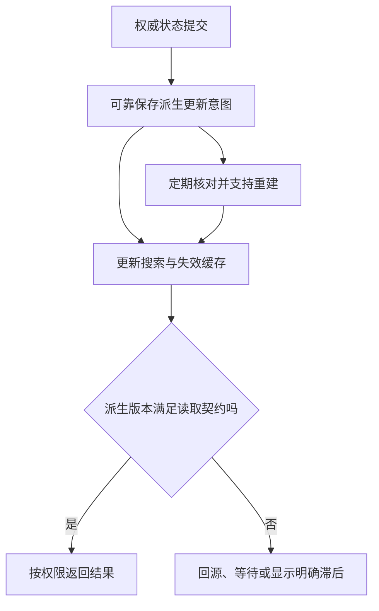

# 缓存、搜索与存储的应用边界

> 面向组合数据库、缓存、搜索和对象存储的开发者。读完能确定每项数据的权威来源，定义新鲜度、失效和重建策略，避免把快的读取路径或可搜索副本当成全部业务约束的裁判。

## 不同系统解决不同访问问题

**缓存**保存可复用结果以减少重复工作，**搜索索引**按检索需求组织派生数据，**对象存储**按键保存文件与二进制对象。它们可能都能“存数据”，但访问语义、更新流程与约束范围不同。应用需要先确定权威事实，再决定派生路径。

**权威来源**是冲突时用来判定正确状态的位置。资料元数据与权限可以由关系数据库管理，正文文件由对象存储持有，搜索索引用于发现资料，缓存用于加速部分读取。这是示例分工，不是强制架构；小系统可能直接使用数据库能力，减少同步边界。

本文讨论应用契约和故障处理。Redis、搜索引擎与云存储平台的容量和部署选型，分别复用[数据库选型](/cloud/data/database)、[存储](/cloud/infra/storage)等主文，不为同一概念复制另一份平台综述。

## 先给派生数据规定允许过时的范围

**最终一致**在本文指派生结果可能暂时落后，经过正确同步后趋于一致。它不是“永远不准确也没关系”，必须定义允许延迟、可观察水位和恢复路径。权限撤销、已删除资料与普通标题更新，可能需要不同可见性保证。

| 读取路径 | 可优先承担 | 不应无条件承担 |
| --- | --- | --- |
| 权威数据库 | 业务状态、关系与事务约束 | 所有大文件和复杂检索负载 |
| 缓存 | 已定义新鲜度的重复读取 | 无过期保证的权限和容量裁决 |
| 搜索索引 | 检索、相关性排序与过滤候选 | 立即可见与完整事务判断 |
| 对象存储 | 附件、导出和大对象 | 与数据库跨系统原子提交 |
| 浏览器缓存 | 公共资源与约定响应复用 | 用缓存内容证明当前授权 |

搜索结果可以返回候选 ID，再在受控读取中核对最新权限与删除状态，或让索引具有足够的权限过滤并明确定义滞后边界。不能因为用户看不到导航入口，就把全部私密正文写进公共搜索索引。

图中的更新意图需要可靠性，数据库提交后只在内存中发送一次事件，不能保证索引最终赶上。可以采用发件箱或其他明确同步机制，具体见[消息与幂等](/software/backend/messages-jobs-idempotency)。

## 缓存失效是并发问题

**旁路缓存**（Cache Aside）通常先查缓存，缺失时从权威来源读取并填充。写入后删除或更新缓存，有助于缩小旧值窗口，但不自动保证强一致。一个旧读取在删除后迟到填充，可能重新放回旧值；这需要根据新鲜度要求评估版本键、条件写入、短期过期或其他协调机制。

**TTL**（Time to Live）规定保存期限，提供过时上界的部分依据，不是业务更新的即时通知。不同数据共享同一固定 TTL，可能形成集中失效。可考虑分散期限与有限并发回源，但用户正在查询的未知对象也要控制，以防不断穿透缓存查询数据库。

**缓存击穿**常指热点项失效导致大量同时回源，**缓存雪崩**常指大量项或缓存服务同时失效导致回源压力骤增。术语在不同资料中不完全统一，工程上更应描述触发条件。按键合并同时读取、预先刷新、限制回源并发及降级，可以分别处理对应情形，不能仅靠“增加缓存实例”。

缓存键需要包含影响结果的维度，如语言、可见范围、查询条件和数据版本。以 URL 为唯一键缓存用户响应，可能跨用户复用。避免直接放入完整私人输入，键的高基数也要受控。缓存值应有格式版本，升级后能够识别旧结构，而不是让反序列化失败随机传播。

Redis 官方淘汰文档说明达到内存限额后按策略删除键或拒绝部分写入；`noeviction` 并不表示无限内存，而是在相应条件下返回错误。LRU 等机制也有具体实现边界。[Redis Key Eviction](https://redis.io/docs/latest/develop/reference/eviction/)应用应接受缓存可能缺失并限定内存，不能把去重的唯一持久记录放进随时淘汰的区域而不另有保证。

## 搜索可见性与查询含义

**倒排索引**把词项映射到匹配内容，适合全文检索；分词、字段映射和相关性排序影响结果。搜索接口应说明精确匹配、语言处理、范围过滤和分页边界。一次检索返回前十项，不证明其他项目不存在；总数也可能有统计口径和成本边界。

Elasticsearch 文档说明写入后的变化经 **refresh** 才对搜索可见，具有近实时搜索特征。请求写入成功与马上搜索得到不是同一个承诺；具体间隔与配置需按部署核对，不能泛化为所有搜索服务固定一秒。[Near Real-Time Search](https://www.elastic.co/docs/manage-data/data-store/near-real-time-search)

为检索立即可见强制刷新可能增加成本，应按任务选择等待、查询权威对象或约定新鲜度，而不是每条写入一律刷新。索引更新要能处理重复、乱序和删除，使用对象版本防止旧事件覆盖新文档。索引结构变化常需要重建与切换，重建期间也要接住新变化。

## 文件与元数据跨越原子边界

对象上传与数据库记录是两个系统动作。先上传再记库，记录失败可能留下孤儿文件；先记库再上传，上传失败可能留下不可用引用。可使用待上传、已确认和清理状态，校验对象身份、大小和摘要，定期核对未完成记录。这不是简单单库事务可以解决的原子性。

Amazon S3 官方说明对象 PUT 和 DELETE 等具有相应强一致性，这不能推广为所有对象存储的同样保证，也不能推导为 S3 与关系数据库联合事务。[S3 一致性](https://docs.aws.amazon.com/AmazonS3/latest/userguide/Welcome.html#ConsistencyModel)缓存、CDN 或复制路径仍可能有独立行为，最终读取路径需整体核对。

**签名 URL**是在限定条件和时间内授予对象访问的链接，持有者可能按链接能力使用它。对象键不应被当成秘密或权限，随机名称不能替代访问控制。用户上传文件要限制类型、大小与处理路径，不可信文件名不能直接成为服务器路径或可执行输入。

导出文件也需要保留期限与权限，不能把公开可访问对象当作“临时文件”长期遗留。删除业务对象后，关联文件与索引删除需要可靠清理和必要重试；清理操作应核对引用，防止删除被其他合法记录共享的对象。

## 选择与验证要包含失效场景

以虚构资料门户为例，先用权威数据库满足访问，再根据实际查询量和体验评估缓存与搜索。新增组件必须带来可解释收益，并补上同步、监测、重建和运维责任。本文未实现或测量该应用，以下为验收计划。

| 场景 | 应验证的契约 | 失败线索 |
| --- | --- | --- |
| 缓存全部失效 | 回源有界、核心任务可用 | 数据库被无限并发冲击 |
| 权限撤销与删除 | 不按旧派生数据继续公开 | 搜索和缓存无身份边界 |
| 索引更新乱序 | 新版本不会倒退 | 只按收到时间覆盖 |
| 上传后记录失败 | 孤儿可识别并清理 | 文件存在但无人负责 |
| 索引全量重建 | 水位可核对、变化不丢 | 只统计文档总数 |

观测应包括命中率、回源压力、更新延迟、最老待处理项、存储清理差异和错误。命中率与吞吐只是效率证据，版本和权限检查才支持正确性判断。任何派生系统都应能说明失效后怎样重建，必要时怎样安全降级。

## 重建不是简单清空再启动

派生数据重建要选择权威快照或水位，处理重建期间的新变化，并在校验后切换读路径。只比较总条数，可能漏掉内容错误、版本倒退和权限字段缺失；应核对关键不变量、版本范围与抽样任务。旧索引和缓存的退出也要有期限，避免误切回过时内容。

成本判断应包括同步工作、存储副本、重建时间与故障降级。一个缓存服务减少数据库读取，却新增高频更新和维护负担，未必符合小系统目标。先保留可解释的权威路径，再根据实际负载新增派生系统，通常更便于演进。

派生数据的删除证据需要独立保留。主表删除成功而索引与文件清理失败时，应能查到待清理身份和重试状态；反复清理也必须避免删除后来复用或替换的合法对象。

## 参考资料

<Refs>

- [Redis：Key Eviction](https://redis.io/docs/latest/develop/reference/eviction/)（访问日期 2026-10-03）
- [Elastic：Near Real-Time Search](https://www.elastic.co/docs/manage-data/data-store/near-real-time-search)（访问日期 2026-10-03）
- [Amazon S3：Data Consistency Model](https://docs.aws.amazon.com/AmazonS3/latest/userguide/Welcome.html#ConsistencyModel) · [RFC 9111：HTTP Caching](https://www.rfc-editor.org/rfc/rfc9111.html)（访问日期 2026-10-03）
- 站内相关：[数据模型](/software/data/data-models) · [消息与幂等](/software/backend/messages-jobs-idempotency) · [恢复](/software/data/data-quality-recovery) · [存储平台](/cloud/infra/storage)

</Refs>
