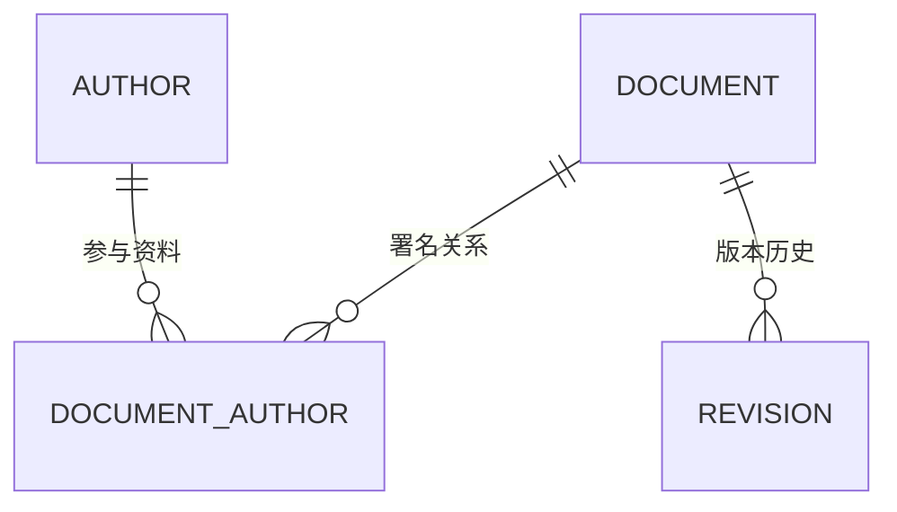

# 数据模型、关系与约束

> 面向把业务需求落到持久数据的开发者与审查人员。读完能确定对象身份、关系与生命周期，把可由数据库守住的规则写成约束，并解释空值、时间、重复记录和删除对应用行为的影响。

## 模型表达事实，表是实现选择

**数据模型**是对对象、属性、关系和约束的明确表达。**实体**是需要独立身份和生命周期的业务对象，例如资料与作者；**关系**描述对象之间怎样关联；**约束**限制合法状态。先决定业务事实，再选择表、文档或其他持久形式，避免直接照页面字段建库。

**主键**唯一标识一条记录，**业务键**是业务中有唯一意义的属性或组合。随机 ID 可以保持稳定身份，却不能阻止同一外部编号重复导入；显示标题可以修改，也通常不适合作主键。应分别定义技术身份和业务去重规则。

本系列讨论应用如何设计、查询、演进和恢复数据。存储引擎、复制与云平台形态的比较见[数据库选型](/cloud/data/database)，不在每篇重复内核综述。本文的具体 SQL 与语义以已实际查阅的 PostgreSQL 18 为范围，迁移到其他引擎需核对方言和约束行为。

## 从问题清单取得实体与关系

以虚构资料库为例，一份资料有稳定 ID、标题、公开状态与创建时间，多个作者可以共同署名，作者也可以参与多份资料。作者关系应使用关联表表达，而不是把姓名用逗号拼成字符串。关联表还可以承载署名顺序和贡献角色。

**一对多**表示一个对象可关联多个另一类对象；**多对多**通常在关系型模型中通过关联表表达。**基数**描述数量范围，**可选性**描述关系是否必须存在。二者都影响外键、唯一性与接口验证：必须有作者与最多一个主作者是两条不同规则。



图表达资料与版本是一对多，资料与作者通过关系连接。它没有承诺每份资料必有作者，这条业务要求需要另行实现和验证；图形符号不自动生成完整约束。

**规范化**是根据数据依赖组织关系，减少不合理重复和更新异常。把作者信息复制到每份资料里，作者改名就可能只改一部分；拆出作者实体可以减少这种问题。另一方面，发布时的署名快照可能故意保留当时文字，那是历史事实，不应该被当前作者名称无声覆盖。是否重复要看含义，不是看到两列相同就删除。

## 用约束守住多个写入入口

数据库会接收服务端、任务、导入和管理脚本等写入，只有应用函数中的校验容易被另一入口遗漏。**NOT NULL**约束要求值存在，**UNIQUE**要求规定范围内不重复，**FOREIGN KEY**要求引用关系符合规则，**CHECK**校验单行条件。它们是应用校验之外的重要防线。[PostgreSQL 约束](https://www.postgresql.org/docs/18/ddl-constraints.html)

下面是未执行的教学 SQL，只表达关键关系，并非完整应用模型。

```sql
CREATE TABLE document_author (
  document_id bigint NOT NULL REFERENCES document(id),
  author_id bigint NOT NULL REFERENCES author(id),
  position integer NOT NULL CHECK (position > 0),
  PRIMARY KEY (document_id, author_id),
  UNIQUE (document_id, position)
);
```

它防止同一作者在同一资料重复关联，并约束署名位置唯一。它不能保证位置连续，不能保证作者有编辑权限，也不能保证每份资料至少一名作者。这些属于另外的不变量，可能需要事务中的业务判断。写约束时应列出“守住什么”和“尚未守住什么”。

PostgreSQL 的 CHECK 不用于可靠表达依赖其他行的持续约束，适合用外键、唯一或其他明确机制处理相应关系。不要把“有效报名总数不超过容量”藏进读取其他表的检查函数，就认为所有并发安全。[CHECK 边界](https://www.postgresql.org/docs/18/ddl-constraints.html#DDL-CONSTRAINTS-CHECK-CONSTRAINTS)

| 规则 | 可优先考虑的机制 | 需要另行判断 |
| --- | --- | --- |
| 标识存在且唯一 | 主键 | 标识是否代表同一业务对象 |
| 外部编号不重复 | 范围内唯一约束 | 空值、大小写与账号范围 |
| 引用有效作者 | 外键 | 作者当前状态与访问权限 |
| 数量为非负 | CHECK 加非空 | 跨行总量与并发变化 |
| 只有一个当前生效版本 | 唯一或部分唯一索引 | 转换过程及兼容实现 |

## 空值与精度必须有业务含义

**NULL**表达未知、缺失或不适用等情形，但一个字段最好明确使用哪种含义。空字符串与 NULL 不同；`= NULL` 不是判断空值的正确方法，需要相应空值判断。把缺失都替换成零，会把“尚未测量”和“测量值为零”混淆，统计也会失真。

PostgreSQL 默认唯一约束把 NULL 视为不相等，可以允许多条带空值的记录；`NULLS NOT DISTINCT` 可改变这一行为。其他引擎可能不同，不能仅凭“有唯一约束”推断空值重复被禁止。应为真实样本验证缺失、空串、大小写和归一化规则。

精确数值与近似浮点数也要按含义选择。需要精确累计的值应明确精度、范围与舍入位置；展示舍入不能改变权威值。代码、API 和数据库的数值范围要一致，大整数在某些客户端数值类型中可能失去精度，因此可能需要字符串契约。

## 时间点、日期与业务日不同

**时间点**表示某一实际发生时刻，**日历日期**表示某日，**当地时间**还需要时区上下文。生日和某日生效的规则不应因为时区转换变成前一天；预约当地九点还需考虑夏令时和地区规则。

PostgreSQL `timestamp with time zone` 将输入转换为 UTC 进行内部保存，输出按会话时区转换，不保留原输入时区名称。需要恢复原地区含义时，应另存合适的时区标识；`timestamp without time zone` 不会自动提供时间点语义。[日期时间类型](https://www.postgresql.org/docs/18/datatype-datetime.html)

创建时间、业务发生时间、接收时间与修正时间不一定相同。外部事件可能晚到，不能拿数据库插入时间代替事实发生时间。对排序、过期和审计，应规定采用哪一种时间，以及相等或未知时怎样处理。

## 删除与历史决定后续恢复成本

**硬删除**移除当前记录，**软删除**用状态或标记保留。软删除便于某些恢复和审计，也要求所有读取、唯一性、索引和权限考虑已删除对象。漏一个过滤条件就可能重新公开，不能把软删除当成天然安全。

外键删除策略应按生命周期选择：拒绝删除可以保护仍被引用对象，级联删除适合真正随父对象消失的从属数据，置空则需要关系允许缺失。不能为了“删得干净”对所有关系都级联，可能连独立历史证据一起清除。附件存储又是另一边界，删除表行不会自动删除对象存储文件。

版本历史可以记录完整快照、差异或事件，选择由恢复、审计与查询需求决定。事件记录不是只增不改就自然可信，还要保证身份、顺序、版本和保留政策。模型演进应保留旧数据语义，而不是只让新代码能够编译。

## 模型怎样验收

对上述资料库，准备重复署名、重复位置、不存在作者、空值和删除引用等样本，检查数据库确实拒绝对应非法状态。同时从所有应用入口验证用户权限与生命周期规则。本文没有执行 SQL；测试应记录引擎版本、模式、输入与最终数据。

| 失败模式 | 后果 | 复核方向 |
| --- | --- | --- |
| 直接照表单建表 | 多步骤信息与历史混在一起 | 重访实体身份和生命周期 |
| 唯一性只在页面检查 | 并发或导入产生重复 | 数据库唯一边界与错误映射 |
| 可选字段统一空串 | 缺失与实际值混淆 | 明确空值契约与查询 |
| 软删未进入查询规则 | 已删数据重新出现 | 所有读取和索引范围 |
| 时间没有语义 | 排序、过期和展示出错 | 时间点、日期与时区分别定义 |

模型质量最终体现在能否表达正确事实并防止错误更新。合理约束会减少后续补丁，但不能替代事务、迁移与恢复流程。

## 字段说明也是模型的一部分

为关键字段记录单位、允许范围、来源、空值含义与更新者，使 API 和导入映射使用同一语义。名称为 `size` 的字段若没有说明字节、字符还是条目数，程序即使类型一致也可能产生错误。状态枚举要说明转换和历史兼容，不能只列字符串清单。

审查模型时，可以从一项更新追问所有受影响对象：修改作者姓名是否改变历史署名，撤回资料是否影响已有下载，合并作者是否重写引用。答案决定需要当前事实、快照还是事件，先明确这些责任再增加字段，能减少日后难以逆转的迁移。

范围本身也应成为模型事实。外部编号在哪个来源内唯一、作者关系属于哪份修订，都需要明确字段与约束，而不是让调用代码隐含判断。含义相同的字段才能复用，名字相同却范围不同的字段应分开说明。

## 参考资料

<Refs>

- [PostgreSQL 18：Constraints](https://www.postgresql.org/docs/18/ddl-constraints.html) · [Date/Time Types](https://www.postgresql.org/docs/18/datatype-datetime.html)（访问日期 2026-10-03）
- [PostgreSQL 18：Partial Indexes](https://www.postgresql.org/docs/18/indexes-partial.html)（访问日期 2026-10-03）
- 站内相关：[数据库引擎与云平台选型](/cloud/data/database) · [事务与索引](/software/data/transactions-indexes) · [ORM 与迁移](/software/data/orm-migrations) · [国际化](/software/frontend/accessibility-internationalization)

</Refs>
