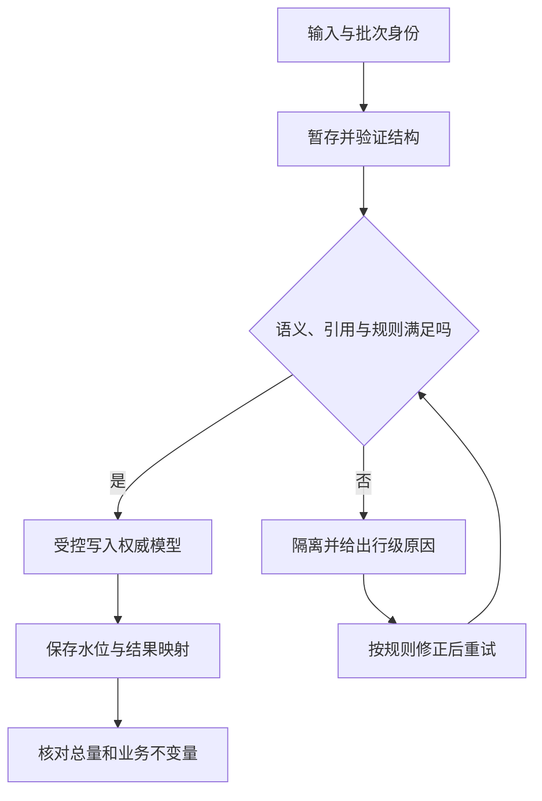

# 导入、数据质量与恢复

> 面向处理批量数据与承担恢复责任的开发者。读完能把导入设计成可追溯、可重试的批次，区分备份存在与恢复可用，并从恢复点到业务重新开放制定可验证的检查链。

## 数据进入与恢复都需要校验边界

**数据导入**把外部数据映射到应用权威模型，**数据质量**判断数据是否满足结构、语义、关系和业务要求，**恢复**则在故障后重建可接受状态。文件能解析不等于内容正确，备份任务成功也不等于系统能够恢复。

数据来源可以是公开或虚构样本，生产任务还需有明确授权、来源与保留规则。本文不涉及真实个人数据，不提供直接生产执行命令；具体数据库机制以 PostgreSQL 18 已核验文档为范围。基础设施灾备和云平台设计复用[可靠性与容灾](/cloud/architecture/reliability-dr)，这里关注应用数据和任务完整性。

导入脚本、管理员工具和恢复后的回放都是写入入口，不能因为它们在页面之外就绕过模型约束、权限或状态机。为了导入方便禁用约束，后续又没有校验，会把临时动作变成长期非法数据。

## 导入先落暂存，再决定如何采纳

**暂存区**（Staging）保存尚未成为权威事实的输入及必要来源信息。可以先按文件和批次记录校验摘要、解析规则版本、行号与处理状态，再通过明确映射产生目标记录。这样失败不会直接污染业务表，也能解释每个结果来自哪一行。

首先验证编码、分隔符、表头、字段数与格式，然后验证业务语义、引用与重复。外部 ID 要明确范围，空值与空串要按契约解释，日期要规定时区和日历含义。同名对象不能自动合并成同一身份，模糊映射应进入差异清单。

| 质量层 | 典型检查 | 拒绝或采纳依据 |
| --- | --- | --- |
| 文件与结构 | 编码、表头、必需列、行数范围 | 能稳定解析到已定义字段 |
| 值域 | 长度、枚举、数值精度与日期 | 满足模型和接口范围 |
| 关系 | 外部编号、引用对象和重复 | 能建立明确身份与合法关系 |
| 业务 | 当前状态、配额和动作权限 | 不绕过权威规则 |
| 批次完整性 | 总数、成功、拒绝与待处理 | 所有输入都有可解释去向 |

**幂等导入**要求同一逻辑批次重复执行不制造额外业务效果。批次 ID、外部对象 ID 和规则版本分别表达不同身份；仅以文件名去重不可靠，文件名可能重复但内容不同。内容摘要有助于识别输入，仍不必然等于业务操作身份。

暂存不是无限堆积区，需要访问范围与保留期限。错误记录不应复制完整敏感行到普通日志；保留定位与修正所需信息即可。错误原因要区分可修正值、无法映射身份与系统暂时失败，才能选择合适重试。

## 大批量写入与失败范围

**COPY**是 PostgreSQL 的批量传输机制，`COPY` 指定文件时由服务器读取服务器可见路径，`STDIN` 经连接传输，psql 的 `\copy` 使用客户端文件。这些权限和路径范围不同，不能把本机路径当成数据库服务器路径。[COPY](https://www.postgresql.org/docs/18/sql-copy.html)

快速装载并不免除约束与校验。通常先装暂存表，再以可审查查询产生业务记录。错误处理选项因版本而异，允许跳过部分行时，必须记录拒绝数量和原因；“命令成功”不能掩盖有效输入丢失。本文未执行 COPY，也不把新版本参数推广到其他引擎。

一批全部原子提交易于解释，但大事务占用资源、保持锁并增加恢复成本。分批提交限制影响，也要求稳定水位、幂等和跨批不变量判断。应按业务决定整体原子性或部分完成，不能让实现的批大小悄悄改变用户看到的成功含义。

| 策略 | 适用考虑 | 必须补充的边界 |
| --- | --- | --- |
| 整批事务 | 批次适中且要求全成全败 | 锁、日志、超时和回退成本 |
| 分批提交 | 大输入或需中断恢复 | 水位、重复、并发和部分结果 |
| 暂存后审查 | 映射复杂或错误需人工判定 | 采纳权限、规则版本与期限 |
| 条件更新 | 防止导入覆盖新修改 | 版本不符时进入差异处理 |

## 备份范围要匹配恢复目标

**恢复点目标**（RPO）表示可接受的数据丢失范围，**恢复时间目标**（RTO）表示恢复可接受服务所允许的时间。它们是业务要求，需要通过实际恢复机制与演练判断能否达到，不是产品开启备份后自动成立的保证。

**逻辑备份**保存数据库对象与数据的逻辑表示，便于部分恢复和跨环境操作。PostgreSQL `pg_dump` 对单数据库形成一致快照；集群角色等全局对象需另行处理，多数据库分别导出也不代表同一全局快照。[SQL Dump](https://www.postgresql.org/docs/18/backup-dump.html)

**物理备份**保存数据库文件或相应基础备份，**预写日志**（WAL，Write-Ahead Log）记录用于恢复的变化。**时间点恢复**（PITR）结合基础备份与足够完整的连续日志恢复到指定目标。日志缺口会影响恢复能力，不能只保留最近一个基础备份就承诺任意时间点。[连续归档与 PITR](https://www.postgresql.org/docs/18/continuous-archiving.html)

WAL 恢复不包含手工修改的数据库配置文件，应用配置、秘密引用、角色、对象存储附件和外部操作记录也可能有独立备份边界。一个数据库恢复成功，不能自动重建完整应用。备份清单应列出各项恢复来源、版本依赖与取得权限。

## 副本不是逻辑误操作的备份

副本可以帮助服务连续性，通常也会复制误删除或错误更新，不能代替独立历史备份。备份本身需要完整性检查、访问限制、保留和必要的隔离；凭据泄露或错误清理不能同时毁掉唯一恢复来源。

选择恢复目标时，要先确定错误开始时间与影响范围。误操作之后可能还有合法写入，直接退回之前时刻会丢掉这些事实。可先恢复到隔离环境，从恢复副本提取受影响记录，再通过受控修正采纳；需要全库回退时，应明确合法后续操作的补回方案。

恢复环境要避免自动向外发送通知、重跑外部动作或加入生产消费者。旧任务可能重新变为待处理，外部副作用却已经发生，应依据操作 ID 和外部对账确认，不能因为数据库恢复了就全部重放。

## 恢复后的验收链

恢复首先证明介质可读、日志链可用和版本兼容，再检查模式、约束、行数及业务不变量，最后验证核心任务、派生数据与外部一致性。缓存和搜索可能保存恢复前的新状态，需要按恢复后的权威版本失效或重建。

对虚构资料库，可以验证作者关系无孤儿、资料状态与版本历史一致、附件引用可读取、导入批次总量平衡，并检查最新合法编辑是否保留。这是演练设计，本文没有取得实际恢复时间或数据损失结果。

| 检查阶段 | 可审计证据 | 不能独立证明 |
| --- | --- | --- |
| 备份完成 | 文件、清单、摘要与任务状态 | 可以成功还原 |
| 数据库还原 | 实际恢复日志与目标位置 | 业务与外部系统一致 |
| 数据校验 | 约束、不变量与差异清单 | 用户流程全部可用 |
| 核心任务验证 | 指定版本与输入的结果 | 所有历史功能和峰值容量 |
| 重新开放 | 权威状态、派生路径与责任确认 | 后续不会出现新问题 |

演练要记录实际时间分解，包括取得备份、还原、校验、重建与重新开放。只测下载时间不能评价 RTO。失败后更新缺口和恢复说明，再以相同目标复验；没有执行过恢复就应明确标注“尚未验证”。

常见失败是导入直接覆写新数据、行跳过没有统计、备份缺角色或附件、恢复副本仍连接生产外部系统、只验收表数量，以及恢复后旧缓存重新覆盖正确事实。完成恢复的证据必须连接到业务结果，而非一个绿色任务状态。

## 恢复说明要能够被另一位维护者使用

记录备份位置的取得方式、版本要求、校验入口和重新开放条件，避免说明依赖某个人记忆中的机器路径。演练人员应能依据清单定位缺失项并留下结果。恢复计划会随模型、存储和外部集成变化而过时，相关变更应触发范围复核。

恢复权限与执行责任同样需要准备。备份加密密钥、访问角色和隔离环境若在故障时无法取得，文件存在也无法使用。演练应通过实际授权路径读取所需资料，检查依赖是否独立可恢复，而不是默认管理员届时可以临时解决。

## 参考资料

<Refs>

- [PostgreSQL 18：COPY](https://www.postgresql.org/docs/18/sql-copy.html) · [SQL Dump](https://www.postgresql.org/docs/18/backup-dump.html)（访问日期 2026-10-03）
- [PostgreSQL 18：Backup and Restore](https://www.postgresql.org/docs/18/backup.html) · [Continuous Archiving and PITR](https://www.postgresql.org/docs/18/continuous-archiving.html)（访问日期 2026-10-03）
- 站内相关：[数据模型](/software/data/data-models) · [ORM 与迁移](/software/data/orm-migrations) · [缓存与搜索](/software/data/cache-search-storage) · [可靠性与容灾](/cloud/architecture/reliability-dr)

</Refs>
