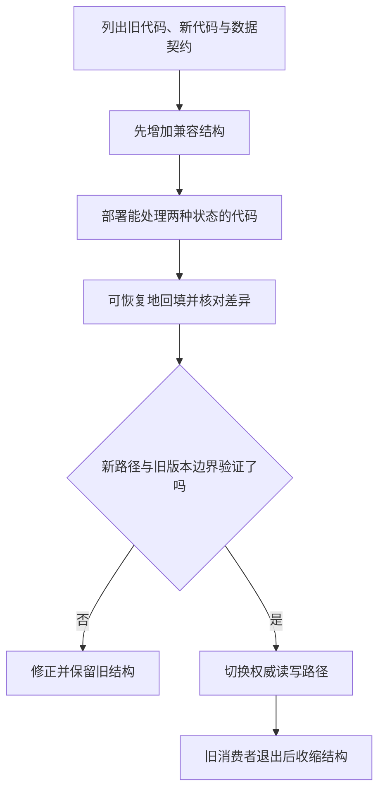

# ORM、迁移与兼容

> 面向使用数据访问库和发布数据库变更的开发者。读完能识别 ORM 没有消除的查询与事务责任，设计旧新代码并存的迁移顺序，并把结构变更、历史数据回填和回退边界分别验收。

## ORM 是映射工具，不是数据库替身

**对象关系映射**（ORM，Object-Relational Mapping）把程序对象与关系型数据连接，提供查询构造、对象装载、变化跟踪等能力。它减少重复代码，却不会自动选择正确模型、补全索引、消除 N+1 查询或确定业务事务范围。代码中的对象赋值，最终仍要通过数据库语句和资源完成。

**数据库迁移**是把数据结构与相关数据从一个已知状态演进到另一个状态的受控过程。**兼容**指某个代码、结构或数据版本能按契约与其他版本共同工作。源码回退和数据库回退不同：删列后旧值可能无法恢复，新代码写入的数据也可能无法被旧代码理解。

本篇关注应用访问和模式演进，不比较云数据库平台，也不要求使用特定 ORM。具体示例机制以 Django 5.2、SQLAlchemy 2.0 与 PostgreSQL 18 文档为范围；不同工具的默认事务、DDL 和迁移操作需要独立核对。

## 查询便利会隐藏真实成本

**N+1 查询**是先取得 N 个对象，再为每个对象额外查询关系，导致查询数量随对象数增长。对象属性访问看似本地操作，惰性装载可能在此时访问数据库。Django 官方建议先测量，并明确使用 `select_related`、`prefetch_related` 等机制取得所需关系，而不是无差别预取所有数据。[Django 查询优化](https://docs.djangoproject.com/en/5.2/topics/db/optimization/)

关联预取也有取舍：连接可能放大行与重复字段，批量预取可能增加内存和大 IN 集合。只需要少数字段时，可以投影结果而不构造完整对象。验证要看实际 SQL 数量、行数、参数与计划，不能只看 ORM 调用行数。

| 访问方式 | 可优先考虑 | 需要观察 |
| --- | --- | --- |
| 完整 ORM 对象 | 生命周期操作与明确关系 | 装载范围、脏数据跟踪与内存 |
| 投影或字典结果 | 列表和只读报表 | 字段与消费者契约 |
| 查询构造器 | 复杂查询但需要结构化组合 | 生成 SQL、参数与引擎差异 |
| 参数化原生 SQL | 特定引擎能力或复杂计划 | 注入边界、映射与维护责任 |

使用原生 SQL 不代表必然更快，ORM 也不代表必然低效。应该由任务语义与测得成本决定，保留可读查询和可检查边界。动态排序等结构仍需允许列表，参数绑定不能任意替代列名。

## 会话与事务的寿命要明确

**工作单元**（Unit of Work）跟踪一组对象变化并在适当时机写出；**身份映射**让一次会话内同一数据库身份通常对应同一对象。它们帮助组织访问，但会让对象状态与数据库当前事实产生差异。长寿命会话可能保留过时对象或大量引用。

SQLAlchemy 文档将 Session 描述为有状态的事务相关对象，说明常见使用与关闭边界；并发线程或任务不应随意共享同一可变 Session。[Session Basics](https://docs.sqlalchemy.org/en/20/orm/session_basics.html)请求结束后继续把装载对象交给后台任务，也可能触发已关闭会话的访问或错误事务归属。后台任务应建立自己的访问上下文。

**flush**通常将待写变化发送给数据库，不必等同于事务提交。真正提交失败仍需按工具要求回滚或清理会话。helper 需要参与调用者事务时，要显式传递事务上下文；另开连接的“嵌套函数”可能产生独立提交，破坏原子性。具体行为需以工具版本验证。

## 迁移计划需要同时看旧新版本

迁移文件记录结构变化与依赖，不是简单 SQL 日志。Django 文档解释迁移中的历史模型状态及依赖关系，数据迁移应使用相应历史模型，而不能直接依赖日后改变的当前模型。[Django Migrations](https://docs.djangoproject.com/en/5.2/topics/migrations/)

**模式漂移**是实际数据库与迁移记录或模型预期不同。直接手改线上表却不记录，会使新环境无法重建，后续迁移也可能失败。生成迁移之后应审查实际动作：工具可能把重命名识别成删旧建新，类型变化可能重写表或拒绝旧值。

**扩展后收缩**（Expand and Contract）先增加兼容能力，再迁移使用者，最后移除旧结构。它避免要求所有实例瞬时切换，却需要阶段记录和明确退出条件。不能一直双写两列而没人知道哪一列权威。

## 一个字段演进的可审计过程

假设虚构资料库把模糊的 `author_name` 改成作者实体与关系。先添加新表和可选关系，不删除旧字段。新代码能读旧数据并创建明确关系，回填依据规则识别名字；同名不同人不能自动合并，存在歧义的数据进入差异清单。

回填按稳定键分批，保存水位和规则版本，失败后可继续。并发修改可能使回填覆盖新事实，需要版本条件、读写协调或明确来源优先级。完成后检查未映射数、重复关系和字段一致性，而不是只看脚本退出码。再切换读取，观察实际任务与旧消费者，最后才移除旧列。

这是设计示意，未执行迁移。回退策略应按阶段写：在未删旧字段时可以回退应用，但需确认新写入仍满足旧代码；删除后必须依赖备份、保留副本或新的修复迁移。不能因为迁移工具有反向函数就认为信息损失可逆。

## 锁与 DDL 成本需要提前核对

**DDL**（Data Definition Language）改变数据库对象结构。类型、默认值、索引与约束变化的成本由引擎版本和操作决定，不能把“只加一列”当成恒定轻操作。锁等待本身就可能影响线上请求，要观察持锁事务与变更期限。

PostgreSQL `ALTER TABLE` 文档说明不同形式取得的锁和校验行为。对支持的约束可以先 `NOT VALID` 再 `VALIDATE CONSTRAINT`，把新增写入防护与历史校验分阶段处理；仍须检查对应类型、锁与版本范围，不能推广到所有约束。[ALTER TABLE](https://www.postgresql.org/docs/18/sql-altertable.html)

`CREATE INDEX CONCURRENTLY` 减少普通构建阻挡写入的影响，也增加工作和等待，失败可能留下无效索引，且不能像普通创建一样放进任意事务块。[CREATE INDEX](https://www.postgresql.org/docs/18/sql-createindex.html)迁移工具的事务包装要与这些规则协调，否则开发环境成功的操作可能在生产执行路径失败。

| 变更 | 要验证的重点 | 回退边界 |
| --- | --- | --- |
| 新增可选字段 | 旧代码是否忽略、新代码是否允许缺失 | 新值可能被旧写入覆盖 |
| 增加约束 | 历史违规数据、锁与校验 | 删除约束不恢复被拒操作 |
| 改类型或语义 | 转换精度、无效值与消费者 | 转换可能损失信息 |
| 重命名或删列 | 旧实例、任务、导出与查询 | 删值不能仅靠代码回退 |
| 创建大索引 | 资源、等待、失败状态 | 清理与重建有额外成本 |

## 验收不能只用空数据库

从空库重建检查迁移依赖，从真实历史结构与虚构数据升级检查转换，从旧新应用组合检查兼容。样本包括 NULL、长文本、重复值、旧枚举和部分完成回填。分别核对结构、数据不变量和任务行为，保留版本及迁移记录。

还需演练中断、重启和重复运行，确认批次不会重复制造关系或覆盖新修改。发布失败时应先识别实际阶段，避免盲目“回滚全部”。已提交迁移应通过明确后续迁移修正，随意编辑历史文件会使不同环境产生不同路径。

常见失败是 ORM 一行产生大量 SQL、会话跨请求共享、迁移把重命名变成删列、回填无水位、删除旧列早于旧任务退出，以及备份从未试恢复。工具能降低执行工作，却不能代替阶段决策与结果证据。

## 迁移责任要能交接

一次结构变化应有唯一执行入口、目标数据库、当前阶段和失败判定。多个实例启动时自动同时迁移，可能竞争锁或使用不同工具版本；是否采用这种方式需要明确协调。把迁移作为独立受控步骤，通常更容易保留执行者、产物和结果证据。

迁移完成还要核对后台任务、报表、导出与临时管理脚本，不能只检查主服务。旧消费者停止的依据应是实际版本和调用记录，等待若干天并不自动证明它已退出。收缩阶段的删除动作应以这些证据为前提。

模型类型变化还要核对序列化边界。数据库支持的大整数、精确小数或特殊日期，ORM 对象与客户端可能使用不同表示，升级后即使表结构不变也可能改变接口结果。兼容验收应包含字段意义与精度，不只比较建表语句。

## 参考资料

<Refs>

- [Django 5.2：Database Access Optimization](https://docs.djangoproject.com/en/5.2/topics/db/optimization/) · [Migrations](https://docs.djangoproject.com/en/5.2/topics/migrations/)（访问日期 2026-10-03）
- [SQLAlchemy 2.0：Session Basics](https://docs.sqlalchemy.org/en/20/orm/session_basics.html)（访问日期 2026-10-03）
- [PostgreSQL 18：ALTER TABLE](https://www.postgresql.org/docs/18/sql-altertable.html) · [CREATE INDEX](https://www.postgresql.org/docs/18/sql-createindex.html)（访问日期 2026-10-03）
- 站内相关：[数据模型](/software/data/data-models) · [SQL 查询](/software/data/sql-query-plans) · [事务](/software/data/transactions-indexes) · [恢复](/software/data/data-quality-recovery)

</Refs>
