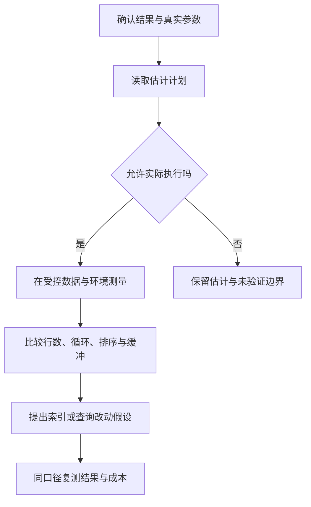

# SQL 查询与执行计划

> 面向编写查询和诊断应用数据访问的开发者。读完能先验证结果语义，再用执行计划解释访问路径、估计与实际偏差，并按过滤、排序、分页和关联模式评估索引，而不是把“用了索引”当成优化完成。

## SQL 描述结果，计划描述实现路径

**SQL**（Structured Query Language）用关系操作表达所需结果。**执行计划**是数据库选择的实现路径，例如扫描、连接、排序和聚合。相同 SQL 在不同数据分布、统计信息和配置下可能选择不同计划，因此一份旧计划不能永久代表应用行为。

查询先要正确，再谈成本。返回行数、重复、空值、排序和权限范围，都是语义。把多对多连接后的重复用 `DISTINCT` 删除，可能掩盖错误关系；一份更快但遗漏数据的查询不是合格优化。

本文具体机制以 PostgreSQL 18 官方文档为范围。引擎内核、分析型平台与云资源选型另见[数据库选型](/cloud/data/database)和[OLAP](/cloud/data/olap)；这里围绕应用请求如何取得正确且可解释的结果。

## 连接与过滤为什么会改变结果

**连接**（Join）根据关系组合行，内连接只保留匹配，左外连接保留左侧行并为空缺右侧补 NULL。一个左侧对象匹配多个右侧对象，会产生多行，不是数据库凭空复制数据。统计时要确认聚合的是对象、关系还是连接后的行。[表表达式](https://www.postgresql.org/docs/18/queries-table-expressions.html)

在左外连接中，将右表过滤放入 `ON`，与放入 `WHERE` 可能不同。前者限制匹配，后者可能删除右侧为 NULL 的结果。查询“列出所有资料及其公开附件”时，若在 WHERE 要求附件为公开，没有附件的资料也可能被过滤掉。

**聚合**将行按组计算结果，`COUNT(*)` 和对某列计数在 NULL 情况下含义不同。多表关联后数量相乘，可能使汇总重复累计。可以先在适当关系层聚合再连接，或明确使用存在性查询；选择应基于结果含义，不能仅为缩短 SQL。

| 任务 | 语义检查 | 常见错误 |
| --- | --- | --- |
| 取得对象与可选附件 | 无附件对象仍存在吗 | WHERE 使外连接变成实际内筛选 |
| 判断有没有关系 | 是否只需要布尔存在 | 连接返回大量重复后再去重 |
| 统计对象总数 | 计数基于哪种实体 | 多表关联造成重复累计 |
| 分页取得结果 | 顺序是否稳定且唯一 | 无 ORDER BY 或并列键不确定 |
| 筛选可见对象 | 权限条件在数据库查询中吗 | 先取全部再客户端过滤 |

## 从应用访问模式写查询

假设虚构资料目录按状态筛选，并按发布时间和 ID 倒序浏览。示意查询如下，未实际执行，参数由数据库驱动绑定；不是把用户输入直接拼进 SQL。

```sql
SELECT id, title, published_at
FROM document
WHERE state = $1
  AND (published_at, id) < ($2, $3)
ORDER BY published_at DESC, id DESC
LIMIT $4;
```

这是续页的**键集分页**：游标保存上页边界值，使用同一排序关系继续。首页通常使用另一个不含边界的查询。字段空值、并列值、排序变更和发布期间新数据都要有契约；分页不自动保证跨多个请求看到同一快照。

偏移分页易于定位页码，但深偏移可能需要跳过大量结果，数据变化还可能导致重复或遗漏。键集分页也不是普遍替代，随机跳页和多个排序维度会更复杂。接口应只承诺实际实现的连续浏览或页码能力。

**参数化查询**把值交给驱动绑定，减少把数据解释成 SQL 的风险。参数通常不能代替表名、列名和排序关键字；这些动态结构应由服务端允许列表选择。`LIMIT` 也需约束，不应让一个未受控输入要求返回所有数据。

## 怎样读 EXPLAIN

`EXPLAIN` 显示计划与估计，`EXPLAIN ANALYZE` 实际执行并报告运行信息。PostgreSQL 的 cost 是计划比较使用的估计单位，不等于毫秒；估计行数与实际行数的差异，可以帮助寻找统计信息或相关性判断问题。[Using EXPLAIN](https://www.postgresql.org/docs/18/using-explain.html)

分析通常先从底层扫描读起，查看过滤后保留多少行，再看连接循环、排序和聚合。嵌套循环内侧节点多次执行时，不能只看单次数字；观察 loops 与每次行数，判断累计工作。缓冲访问与磁盘读取也要结合缓存条件，不应把缓存命中等同于没有成本。



`EXPLAIN ANALYZE` 会实际执行被分析语句，其写入和函数副作用也会发生，即使客户端收到的只是计划。包在事务里回滚也不能自动撤销序列变化、外部调用等副作用，锁和资源开销仍会发生。应在可控环境和适当权限下测量，不把诊断命令当成只读安全动作。[EXPLAIN 命令](https://www.postgresql.org/docs/18/sql-explain.html)

## 索引应匹配过滤和排序

**索引**提供额外访问路径，也增加存储和写入维护。多列 B-tree 的列顺序与查询条件有关，不能给每个字段单独加索引就认为所有组合得到支持。上述目录查询可评估状态与排序键组合，但要用数据分布和计划验证。

不能绝对断言“少了最左列就完全不能用”。PostgreSQL 18 官方文档说明特定条件下可用 skip scan，多次索引搜索利用后续列条件，是否选择取决于估计成本和前置列取值分布。应用仍应围绕主要访问模式设计，而不是期待优化器替所有索引不匹配兜底。[多列索引](https://www.postgresql.org/docs/18/indexes-multicolumn.html)

顺序扫描不总是坏事：小表或需要读取大量行时，它可能比多次索引和表访问更合适。返回宽字段、排序大量行与聚合巨大连接结果都可能主导成本。只加索引、不减少不必要结果和关系工作，容易把瓶颈移到另一阶段。

统计信息过时或参数分布倾斜，会让估计失准。应该保留慢参数与快参数，观察计划是否适合实际负载；准备语句、驱动与计划缓存机制也可能影响选择，具体需按实现验证。不要把某次计划截图写成固定执行法则。

## 查询验收与性能记录

建立小的语义样本：无关联、多关联、空值、相同发布时间、隐藏状态与分页插入。先确认结果，再在符合实际量级和分布的测试数据中测量。记录引擎版本、表定义、索引、统计信息、查询参数、缓存条件和完整计划，才能复核结论。

| 改动 | 预期收益 | 必须同步检查 |
| --- | --- | --- |
| 只选所需列 | 减少传输与对象构造 | 消费者是否依赖其他字段 |
| 关联前聚合 | 减少重复工作 | 聚合实体与 NULL 语义 |
| 增加组合索引 | 支持主要过滤与排序 | 写入成本、其他负载与容量 |
| 改用键集分页 | 控制续页访问成本 | 空值、并列键和游标契约 |
| 改写条件 | 改善访问路径 | 边界结果完全一致 |

应用层还应记录一项请求实际执行了多少 SQL、取回多少行，以及连接池等待。数据库计划快而页面慢，可能是 N+1 查询、序列化或网络问题。不能把数据库执行时间直接当成用户任务总耗时。

常见失败包括只测小样本、把估计 cost 当实测时间、只看是否 Index Scan、对写语句运行 EXPLAIN ANALYZE 后宣称“没有修改”，以及用固定索引强迫所有参数。优化应保存假设、证据与边界；本文未执行查询或性能测试，不提供任何提升数字。

## 从慢请求定位到具体语句

在应用中为数据库调用记录可关联的语句类别、参数范围和耗时，避免把完整私人值直接进入日志。某类查询总耗时高，可能因为执行很多次，也可能单次很慢。先区分频率与单次成本，再选择批量读取、查询改写或索引，不要把两类问题混成同一“慢 SQL”。

查询超时还可能来自锁等待，而不是所见计划的计算成本。把池等待、锁等待和实际执行分开，有助于找到阻塞事务及其业务入口。为诊断运行相同查询时要考虑观测自身的资源影响，不能持续在高峰重复重查询以取得更多证据。

输出大小也属于访问设计。即使数据库很快返回，大量结果的传输和对象构造仍可能延迟应用；列表应只返回任务所需内容，完整导出走独立受控流程。减少结果必须保持产品契约，不能无提示截断用户需要的数据。

优化前后还应比较极端合法参数，例如没有匹配、匹配大部分行与高度倾斜值。一次平均参数的优势可能在另一范围转成退化。保存参数类别及分布，才能判断候选索引是否服务于真实请求，而不是只支持演示样本。

计划记录应保留完整节点关系，局部截图可能遗漏重复循环或上层排序。对照优化前后的结果与计划时，解释每项改动影响哪段工作，避免把偶然缓存变快归因于查询改写。

## 参考资料

<Refs>

- [PostgreSQL 18：Table Expressions](https://www.postgresql.org/docs/18/queries-table-expressions.html) · [Using EXPLAIN](https://www.postgresql.org/docs/18/using-explain.html) · [EXPLAIN](https://www.postgresql.org/docs/18/sql-explain.html)（访问日期 2026-10-03）
- [PostgreSQL 18：Multicolumn Indexes](https://www.postgresql.org/docs/18/indexes-multicolumn.html)（访问日期 2026-10-03）
- 站内相关：[数据模型](/software/data/data-models) · [事务与索引](/software/data/transactions-indexes) · [ORM 与迁移](/software/data/orm-migrations) · [后端性能](/software/backend/backend-frameworks-performance)

</Refs>
