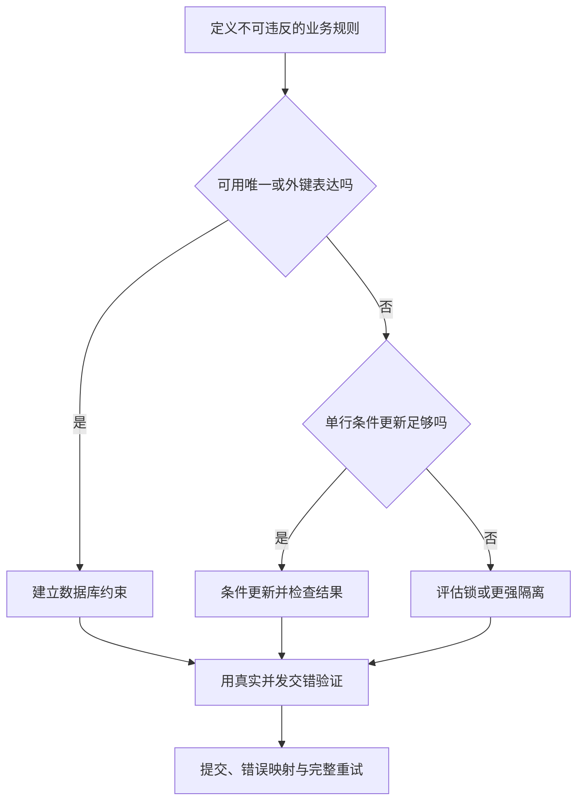

# 事务、并发与索引的应用选择

> 面向需要防止重复、超额与并发覆盖的应用开发者。读完能从业务不变量选择约束、条件更新、锁或隔离级别，设计完整事务重试，并把性能索引与正确性约束分别验收。

## 事务把相关变化作为一个单位

**事务**（Transaction）让一组数据库操作以受控方式提交或回滚。**ACID**概括原子性、一致性、隔离性和持久性；其中一致性依赖应用和数据库约束共同定义合法状态，不意味着数据库知道所有业务规则。**隔离级别**规定并发事务之间的可观察行为，不能只因为代码写了 BEGIN 就假定执行串行。

本文关注应用选择，具体语义以 PostgreSQL 18 为准。其他引擎同名隔离级别可能提供不同保证，云数据库的复制、可用性与内核机制见[数据库选型](/cloud/data/database)。应用需要独立判断哪些不变量由单库事务覆盖，哪些越过网络或多个存储系统。

一个事务只保护它真正包含的操作。 helper 若使用另一个连接，可能在外面独立提交；事务内发送邮件，回滚也不能收回邮件。提交后响应断开，调用者仍可能不知道已提交，数据库原子性不能消除端到端未知结果。

## 从不变量反推机制

以虚构共享计算配额为例，资源使用量不得超过配额，同一操作不得重复占用。先查询使用量，再在另一个步骤增加，两个请求都可能看到同一旧值。前端禁用按钮不能协调不同客户端，内存锁也不能协调多个服务实例。

**条件更新**把检查与变化放进一条受保护语句，示意如下，未执行；参数由驱动绑定。

```sql
UPDATE resource_quota
SET used = used + $2
WHERE id = $1 AND $2 > 0 AND used + $2 <= capacity
RETURNING used;
```

应用检查返回行数；没有更新可能是对象不存在或配额不足，需要按契约进一步判断。`used` 和 `capacity` 还需非空、非负等约束。若占用明细与计数必须一致，应在同一事务保存，并为操作 ID 建立唯一边界；重复失败时整个事务回滚，不能留下已增加的计数。



决策路径优先采用清楚可审查的约束与操作，再评估更广协调。降低机制复杂度有利于维护，但前提是确实守住全部不变量。

## PostgreSQL 隔离语义不能靠名称猜

**Read Committed**是 PostgreSQL 默认级别，普通 SELECT 使用语句开始时的快照，两次语句可能看到不同的并发提交。**Repeatable Read**使用更稳定的事务快照，在 PostgreSQL 中防止幻读，但仍可能有串行化异常。**Serializable**让已提交事务的行为等价于某种串行顺序，可能通过拒绝冲突事务来实现。[事务隔离](https://www.postgresql.org/docs/18/transaction-iso.html)

**写倾斜**指两个事务依据共同条件，分别更新不同数据，合起来破坏规则。例如规则要求至少一台资源保持可用，两个事务各看到另一台可用，各关闭自己，最后全部不可用。锁一条任意行或稳定读取快照都不必然防住，需保护共享协调点或采用足够隔离并处理失败。

| 选择 | 可以帮助保证 | 必须接受的责任 |
| --- | --- | --- |
| 唯一约束 | 同一范围没有重复身份 | 捕获冲突并解释已有结果 |
| 单行条件更新 | 相应行条件与变化协调 | 检查更新结果、其他记录同事务 |
| 显式行锁 | 冲突修改按约定互斥 | 锁顺序、期限与死锁处理 |
| 乐观版本条件 | 避免无声覆盖当前版本 | 重新读取并重判业务 |
| Serializable | 防止相应串行化异常 | 完整事务重试与副作用隔离 |

Serializable 不意味着数据库把所有事务物理逐个运行，也不保证应用永不收到错误。提高全局隔离而不实现重试，会把原来隐藏的数据错误换成新的请求失败；采用前要把处理路径补全。

## 锁、死锁与重试纪律

**悲观锁**通过提前协调冲突数据避免某些并发变化，`SELECT FOR UPDATE` 等在适当场景可保护行。锁不到不存在的行本身，范围或跨行规则也不能随便推导为已受保护。PostgreSQL 锁行为应按具体语句与对象范围核对。[显式锁](https://www.postgresql.org/docs/18/explicit-locking.html)

**死锁**是多个事务循环等待彼此持有资源。统一取得锁的顺序、保持事务短、避免在锁内等待外部网络，都可以降低风险，仍需处理数据库选择中止的事务。日志应保留事务动作和对象范围，避免只给用户“系统繁忙”。

对序列化失败或死锁等可重试错误，应重试整个业务事务，从重新读取与判断开始；只重发最后一条 SQL 可能使用失效条件。限制次数和总预算，适当退避，区分唯一冲突、非法输入和暂时并发失败。事务包含不可重复外部动作时，自动重试会重做副作用，应转到可靠消息或其他明确协议。

序列值在 PostgreSQL 中并不因事务回滚而恢复，因此 ID 中有间隙并不证明记录丢失。业务若要求连续编号，需要独立设计，不应把自增主键当作无间断审计序列。持久性也取决于数据库配置与平台契约，提交确认和灾难恢复另有边界。

## 索引的正确性与性能职责

**唯一索引**既是访问路径也可限制重复；普通索引主要改变访问成本。**部分索引**只包含满足谓词的行，可以表达“同一对象只有一个生效记录”等条件唯一性。它需要明确状态谓词，其他引擎与 ORM 支持要核对，不能把部分唯一索引任意作为普通外键目标。[部分索引](https://www.postgresql.org/docs/18/indexes-partial.html)

性能索引应服务于真实过滤、关联和排序。它增加写入维护、存储和迁移成本；给每列都加索引通常缺少工作负载依据。事务因扫描大量行而持锁更久，合适访问路径可能改善并发，但普通索引不会自动让不安全的检查后写入变成原子操作。

创建索引本身也影响线上访问。PostgreSQL 的 `CREATE INDEX CONCURRENTLY` 可避免普通创建方式阻挡写入的相应问题，但增加扫描和等待，存在失败后无效索引及事务使用限制；“并发创建”不意味着完全无锁、无资源成本。[CREATE INDEX](https://www.postgresql.org/docs/18/sql-createindex.html)

## 可复核的并发验收

准备两个独立数据库会话或对应服务请求，明确安排读取、更新和提交交错。对配额例子，让两个请求竞争最后可用量，检查有效明细总量与计数一致、不超过容量；再对相同操作 ID 并发执行，确认只有一次效果。这是验证方案，本文没有运行结果。

| 场景 | 应断言的权威状态 | 失败线索 |
| --- | --- | --- |
| 最后配额并发申请 | 使用量不超额、明细一致 | 只看失败响应没查最终数据 |
| 重复操作 | 一个业务效果或复用结果 | 计数与明细分别提交 |
| 事务中途失败 | 相关写入全部按契约回滚 | helper 使用事务外连接 |
| 死锁或序列化失败 | 有限完整重试 | 只重试最后一句或无限重试 |
| 索引构建失败 | 状态可识别且可恢复 | 迁移记录成功但索引无效 |

验收要覆盖读取结果、约束错误与实际事务范围。正确性机制应先证明守住不变量，再在真实负载中优化争用和延迟；不能为了跑分删除唯一约束或把锁缩小到已无法覆盖规则。

## 冲突结果怎样交给调用者

约束冲突可能表示重复操作，也可能表示新的输入确实不合法，二者要通过稳定身份区分。相同幂等键已经完成时可以复用结果；不同操作争用同一业务唯一键时，应按规则报告冲突。不能将所有唯一错误都解释成成功，否则调用者可能得到另一个主体的对象。

事务内读取到的临时结果，不应在提交确认前作为最终事实向外发布。提交失败后要丢弃该结果并重新执行必要判断。为长批量工作拆分事务时，还需重新定义跨批状态，不能沿用原先整批全成全败的承诺。

索引变更验收应观察写入与后台维护成本，不只测受益查询。新索引支持一个入口，却可能使批量导入、更新和备份显著增加工作。应由总体访问模式和正确性约束决定是否接受，而不是让单条查询的最快结果支配全部决策。

并发测试的调度要保留证据。只同时启动两个线程，不保证它们进入关键冲突窗口；可以用明确屏障或受控会话顺序安排交错。结果正确一次也不说明检查后写入没有风险，测试应对应实际机制和预期错误路径。

## 参考资料

<Refs>

- [PostgreSQL 18：Transaction Isolation](https://www.postgresql.org/docs/18/transaction-iso.html) · [Explicit Locking](https://www.postgresql.org/docs/18/explicit-locking.html)（访问日期 2026-10-03）
- [PostgreSQL 18：Constraints](https://www.postgresql.org/docs/18/ddl-constraints.html) · [Partial Indexes](https://www.postgresql.org/docs/18/indexes-partial.html) · [CREATE INDEX](https://www.postgresql.org/docs/18/sql-createindex.html) · [INSERT / ON CONFLICT](https://www.postgresql.org/docs/18/sql-insert.html)（访问日期 2026-10-03）
- 站内相关：[数据模型](/software/data/data-models) · [SQL 与执行计划](/software/data/sql-query-plans) · [ORM 与迁移](/software/data/orm-migrations) · [云数据库选型](/cloud/data/database)

</Refs>
