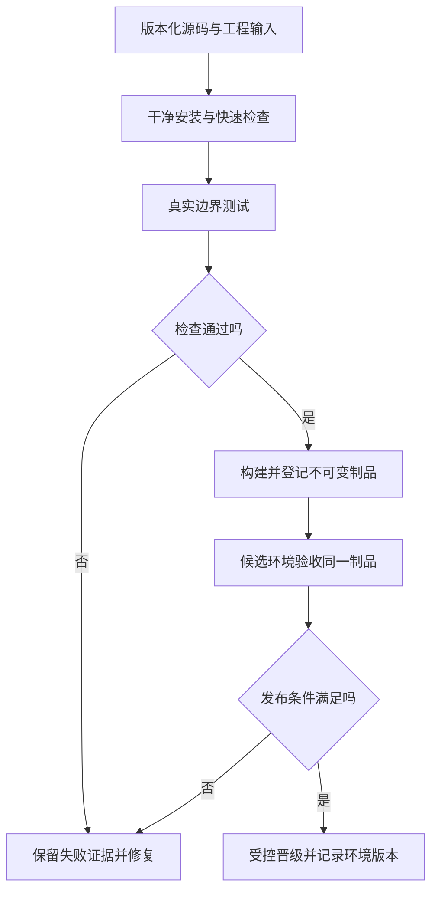

# 构建与 CI 流水线

> 面向开发者、交付负责人和项目接管者。读完能从源码追踪到交付制品，解释持续集成究竟提供了什么证据，并设计不会因重新构建或权限混用而失去可信度的流水线。

## 构建把工程输入变成交付对象

**构建**将源码、依赖、配置和工具输入转换成可交付产物，例如静态文件、服务端包或容器镜像。**制品**是构建输出的交付对象。安装成功不代表构建成功，构建成功不代表功能满足要求，更不代表已经进入生产。

**持续集成**（Continuous Integration，CI）让频繁整合的变更经过自动检查，以较早发现不兼容和错误。**流水线**组织触发事件、任务、依赖和结果。GitHub Actions 工作流由仓库中的 YAML 定义，可被事件、手工或定时触发，任务在执行器上运行步骤。[工作流概念](https://docs.github.com/en/actions/concepts/workflows-and-actions/workflows) 具体产品的语法不同，交付证据要求却可以相同。

报名系统的交付链应能回答：哪个提交产生哪个制品，使用哪些依赖和工具，哪些检查针对该对象完成，哪个环境正在运行它。用 `latest` 文件名或可移动标签表示当前版本，无法独立回答这些问题。

## 一次构建要保存哪些输入

**内容摘要**（digest）用哈希表示内容，可用于发现取得的制品是否与登记对象一致；它不独立证明来源可信、内容安全或业务正确。摘要与构建记录、可信保存和权限控制组合，才形成可追踪链。

| 输入或记录 | 需要保存 | 解决的问题 |
| --- | --- | --- |
| 源码 | 提交标识、仓库与构建入口 | 区分正在审查和实际构建的版本 |
| 依赖 | 清单、锁文件、来源与安装选项 | 减少解析漂移，解释取得的内容 |
| 工具 | 运行时、编译器、构建器和平台 | 解释不同机器结果差异 |
| 配置 | 构建参数与非敏感指纹 | 区分构建时和运行时变化 |
| 检查 | 用例范围、实际结果与运行标识 | 支持对候选版本的判断 |
| 输出 | 制品位置、摘要、大小与元数据 | 找到可晋级及可恢复对象 |

**可复现构建**严格指在给定源码、环境和指令下可以得到逐字节相同输出，Reproducible Builds 项目给出这一界定。[定义](https://reproducible-builds.org/docs/definition/) 锁文件和干净安装减少漂移，但时间戳、路径、远程资源与工具输出仍可能造成差异。工程中声称“可复现”时，应说明验证的是依赖版本、字节还是行为，并保存实际比较证据。

## 流水线按证据与权限划分阶段

快速静态检查适合尽早反馈；真实依赖测试与构建可以根据依赖关系调度；候选制品生成后应在独立环境验证关键旅程。发布步骤需要访问目标环境，而外部贡献代码的检查一般不需要这些权限。流程不能因为“都是自动化”就共享所有密钥。

**晋级**指将已经验证的同一制品用于下一环境，通常改变运行配置而不重新编译。若前端把环境地址在构建时写入包，每个环境会产生不同制品，需要分别验收或改变配置方案。不能一方面重新构建，另一方面宣称发布了同一对象。

SLSA 的**来源证明**（provenance）描述产物怎样构建，包括构建定义、执行与关联信息。[SLSA v1.1](https://slsa.dev/spec/v1.1/provenance) 它支持追踪和策略检查，不能独立保证编译器无恶意或功能正确。使用来源证明时还需判断谁生成、如何保护及谁有权覆盖记录。

## 缓存与并行都要保持正确性

**缓存**复用可再次取得的中间结果以缩短时间。缓存键应覆盖影响结果的关键输入，例如锁文件、工具与平台；它不能成为唯一的制品保存位置。缓存被清空后流水线仍应能够构建，不应依赖某个人机器遗留的包或文件。

依赖独立的检查可以并行，数据库迁移与使用同一资源的验收则可能需要顺序或隔离。测试分片应按运行标识分离数据，否则并行只是把原本顺序隐含依赖变成随机错误。流水线的依赖图要表达真实成功条件，不能用一个步骤结束时间推断另一任务已经完成。

| 情况 | 决策 | 验证方式 |
| --- | --- | --- |
| 安装依赖耗时较长 | 缓存下载或受控中间结果 | 清空缓存仍可成功构建 |
| 检查彼此无共享状态 | 并行运行 | 结果绑定同一提交，数据隔离 |
| 多次发布竞争同一环境 | 串行化或取消过期候选 | 防止旧任务覆盖新版本 |
| 构建涉及远程资源 | 固定并登记内容与摘要 | 源变化时能解释结果 |
| 需支持多个架构 | 分平台构建与验证 | 记录每个平台产物，而非只看汇总标签 |

## 流水线也是可执行的供应链

GitHub 官方安全指导建议限制令牌权限、固定第三方动作引用，并指出带高权限上下文检出不可信 PR 代码的风险。[安全使用](https://docs.github.com/en/actions/reference/security/secure-use) 工程上应把依赖脚本、动作、构建插件和执行器都视作会运行代码的输入。

公开 PR 的检查应限制密钥和网络访问；受信任发布任务只接收可验证来源的制品。短期身份凭据也需要限制仓库、分支、环境和任务范围，不能以“临时令牌”推定权限安全。自托管执行器需要清理与隔离，工作目录清空不意味着宿主环境没有持久修改。

日志与制品应避免包含密钥、名单与个人数据。工具自动遮蔽不保证每种变换后的值都被删除；对输入错误与失败输出也要核查。质量报告可以公开的程度，与运行环境秘密的访问范围应分别确定。

## 一个小系统的候选交付包

以下为未执行的方案。触发后读取指定提交，使用登记运行时和锁文件安装；运行静态检查、规则与真实数据库测试；生成服务包和静态资源；计算摘要并保存构建记录；用该制品部署候选环境；核验登录、报名、拒绝、取消和导出，再登记发布与恢复所需的信息。

候选包除了程序，还宜包含启动方式、配置键清单、健康检查、数据迁移标识和兼容范围。密钥值不进入包。若迁移需要独立执行，发布记录要连接迁移结果；应用构建通过不能替代数据库结构变化的检查。

## 失败结果与制品保留同样重要

发布门槛需区分成功、失败、取消、跳过和未运行。一个任务因为条件不匹配而跳过，不能视为它检查过当前候选；某个并行任务失败但汇总脚本返回成功，也可能错误放行。流水线应明确必需结果，失败时保留最小日志、输入指纹与报告，允许独立定位而不暴露秘密。

制品保留期限应覆盖真实回退和接管需要，并验证保存位置可取得、权限可用、摘要一致。保存了源码却删除旧基础镜像或私有依赖，临时重建可能得不到原对象；保存旧制品也不代表配置和数据兼容。建议将当前与可恢复版本共同登记，定期在隔离环境验证取得和启动路径。失败构建的部分输出不宜混入正式候选库，避免与已验收对象混淆。

## 常见失败模式与适用边界

| 失败模式 | 后果 | 处理方向 |
| --- | --- | --- |
| 构建时下载未固定资源 | 同提交得到不同结果 | 固定来源并保存内容摘要 |
| 测试后重新构建上线 | 验收对象与运行对象不同 | 晋级同制品或重新验收 |
| 旧流水线覆盖新发布 | 环境版本倒退 | 环境串行与过期候选控制 |
| 把缓存当正式制品库 | 清理后无法恢复 | 独立持久保存发布制品 |
| 报告缺版本标识 | 无法支持本次变更 | 检查结果关联输入及输出 |
| 自动化拥有全部权限 | 一个步骤影响整个交付链 | 分阶段最小权限与可信输入 |

CI 适合持续提供证据，不能自动替项目判断所有风险。检查定义、环境与发布门槛也应版本化和审查；流水线绿色只说明已配置步骤按其口径完成。

## 参考资料

<Refs>

- [GitHub Actions：Workflows](https://docs.github.com/en/actions/concepts/workflows-and-actions/workflows)（访问日期 2026-10-03）— 触发、任务和步骤
- [GitHub Actions：Secure use reference](https://docs.github.com/en/actions/reference/security/secure-use)（访问日期 2026-10-03）— 权限、第三方动作与不可信代码
- [SLSA v1.1：Provenance](https://slsa.dev/spec/v1.1/provenance)（访问日期 2026-10-03）— 构建来源信息
- [Reproducible Builds：Definitions](https://reproducible-builds.org/docs/definition/)（访问日期 2026-10-03）— 逐字节复现定义
- 站内相关：[依赖与锁文件](/software/toolchain/dependencies-lockfiles) · [验收与回归](/software/quality/acceptance-regression) · [环境与 IaC](/software/delivery/environments-iac) · [容器与镜像](/software/delivery/containers-images)

</Refs>
