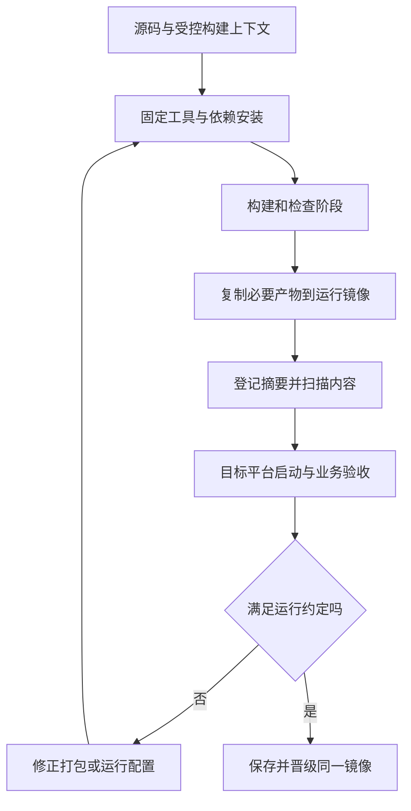

# 容器、镜像与打包

> 面向准备交付服务程序的开发者。读完能区分镜像与容器、理解打包与隔离的边界，并设计能追踪、检查和恢复的应用镜像。

## 镜像是模板，容器是运行实例

**镜像**是包含文件系统内容及运行元数据的打包对象；**容器**是由镜像与运行配置创建的进程环境。一个镜像可以启动多个容器，每个实例还可能有不同秘密、网络、挂载和资源限制。镜像能构建不意味着目标环境能启动，也不意味着实例拥有持久数据。

常规 Linux 容器通过**命名空间**隔离部分系统视图，通过**控制组**（cgroups）计量和限制资源；它们通常共享宿主内核。Docker 官方安全文档同时讨论内核、守护进程、配置和能力边界。[Engine security](https://docs.docker.com/engine/security/) 容器不能笼统等同完整虚拟机或绝对安全沙箱，特权、宿主挂载和内核漏洞都影响隔离。

报名服务装入镜像后，数据库、上传文件和导出结果仍需明确持久保存方式。容器的可写层不应作为唯一业务数据来源。复制同一镜像只复制程序输入，不复制运行中的数据库状态，也不会自动建立高可用。

| 对象 | 职责 | 常见误解 |
| --- | --- | --- |
| Dockerfile | 描述构建步骤与默认运行方式 | 写了文件就保证可复现 |
| 镜像 | 保存程序与必要运行文件 | 包含全部环境和数据 |
| 标签 | 易读的镜像引用名称 | 标签永远指向同一内容 |
| 摘要 | 标识特定镜像内容 | 内容可信、业务正确 |
| 容器配置 | 端口、身份、挂载、秘密与资源 | 镜像相同则行为必相同 |

## 分层与构建上下文影响内容

**构建上下文**是构建器可访问的输入文件集合。把整个工作目录交给构建，可能带入缓存、版本库、秘密和无关输出；忽略文件应明确排除不需要的输入，并检查真实生成镜像。Docker 构建实践建议选择合适基础镜像、减少上下文与合理利用缓存。[构建实践](https://docs.docker.com/build/building/best-practices/)

**镜像层**保存文件系统差异。先复制秘密再在后续层删除，不能据此证明秘密从历史层消失；构建参数和普通环境变量也不适合传入需要保密的凭据。Docker 的构建秘密机制提供构建阶段临时挂载等方式。[Build secrets](https://docs.docker.com/build/building/secrets/) 使用后仍需检查工具日志和最终输出，防止构建程序主动复制秘密。

**多阶段构建**使用多个构建阶段，只将必要产物复制到最终阶段。[多阶段机制](https://docs.docker.com/build/building/multi-stage/) 编译器和测试工具可以留在构建阶段，运行阶段只保留程序及运行依赖；它减少不必要内容，但不自动保证所有运行依赖已齐全或镜像无漏洞。

## 固定输入不等于字节复现

基础镜像标签可能改变。按摘要固定可以减少无意变化，但也会固定旧内容，需要定期检查更新与漏洞。固定源码、依赖和基础镜像后，时间戳、安装脚本、远程下载、平台与构建工具仍可能影响产物。[可复现构建定义](https://reproducible-builds.org/docs/definition/) 因此不能仅因有 Dockerfile 就声称逐字节可复现。

**多架构镜像**通过清单引用不同 CPU 平台的内容。一个总引用不意味着每个平台都执行过测试；原生扩展、系统库和指令集可能不同。构建时需记录目标平台，运行时核对平台匹配，关键路径应在实际支持的平台验证。

| 决策 | 适用条件 | 验证与代价 |
| --- | --- | --- |
| 固定基础镜像摘要 | 需要明确交付输入 | 建立更新策略，避免长期冻结 |
| 多阶段构建 | 编译工具大于运行需求 | 检查复制范围和运行依赖 |
| 更精简运行镜像 | 能解释必要库与诊断方式 | 排障工具少，调试需另一路径 |
| 同时支持多架构 | 用户部署平台不同 | 每个平台独立构建与行为检查 |
| 运行时注入配置 | 同一制品晋级多环境 | 应用需支持启动校验和配置记录 |

镜像摘要与标签可共同保存：标签用于识别发布意图，摘要用于确定内容。回退需取得旧摘要及兼容配置，不能仅重拉一个同名标签后假设回到了旧版本。

## 运行约定决定容器能否交付

应用应明确监听地址与端口、启动命令、运行用户、健康检查、资源需求、临时目录与关闭行为。仅监听回环地址可能使外部入口无法连接；镜像中的端口声明不自动发布宿主端口。配置缺失宜启动时失败并给出脱敏错误，而不是等到第一次请求才暴露。

**优雅关闭**是收到终止通知后停止接收新工作，并在有界时间内处理或安全中断正在进行的工作。实际终止宽限期由平台配置决定。报名写入不能依赖“永远有时间完成”；请求中断后的重试仍需幂等与事务保护。后台导出应有可恢复任务状态，不能只保存在进程内存。

运行用户和权限应尽量限制。容器内非 root 用户是重要措施，但宿主挂载、守护进程控制和平台配置同样重要。给应用挂载 Docker 控制接口可能大幅扩展权限；资源限制能控制消耗，却不自动防止数据访问。需要更强隔离时，应根据威胁模型评估虚拟机或沙箱等边界。

## 启动命令会影响信号和退出

Dockerfile 的 `ENTRYPOINT` 支持不同形式，shell 包装可能影响应用收到终止信号的方式；Docker 官方说明 exec 形式与 shell 形式的差异。[ENTRYPOINT](https://docs.docker.com/reference/dockerfile/#entrypoint) 程序即使实现关闭处理，也要确认信号能到达真正工作进程，容器退出码能表达任务结果。

教学上应验证三类退出：正常停止、超出宽限期的强制终止、进程因资源不足被结束。检查正在进行的请求和任务怎样留下可恢复状态，替换实例后是否重复执行。关闭行为与平台限制一起决定结果，不能在本地等待很久成功后，推定目标平台较短窗口也安全。数据库事务和外部任务仍需各自保持一致性，不能依靠关闭回调必定执行。

## 一个应用镜像的验收方法

以下为未执行的教学方案。选择登记基础镜像与目标架构；用锁文件安装依赖；构建服务包；将必要运行文件复制到最终阶段；使用受限用户启动；注入合成测试配置；经真实入口检查报名、取消、满额拒绝与权限拒绝；检查数据存放外部，容器替换后业务状态保持。

| 验证项 | 预期观察 | 本文状态 |
| --- | --- | --- |
| 输入追踪 | 提交、依赖、基础镜像和最终摘要可关联 | 方案，未执行 |
| 运行完整性 | 干净环境无需构建工具即可启动 | 方案，未执行 |
| 内容检查 | 无密钥、名单、无关源码或缓存 | 方案，未执行 |
| 故障关闭 | 退出后重试无重复写入 | 方案，未执行 |
| 持久性 | 替换容器不丢业务记录与导出结果 | 方案，未执行 |

**软件物料清单**（SBOM）列出制品包含的组件，有助于漏洞与许可检查。清单需要匹配真实镜像与生成方法；扫描“无已知高危”不等于没有未知漏洞，也不证明密钥未泄漏。来源、权限、内容与行为应分别检查。

## 常见失败模式与适用边界

| 失败模式 | 后果 | 改进 |
| --- | --- | --- |
| 容器退出就丢数据 | 写入临时可写层 | 明确外部持久存储及备份 |
| 本地能跑，服务器不能启动 | 架构或系统库不匹配 | 核对平台并验证原生依赖 |
| 删除秘密后宣称安全 | 旧层或日志仍含秘密 | 从构建输入避免泄漏并检查内容 |
| 所有实例使用可移动标签 | 版本混杂与不可追踪 | 部署摘要并保存记录 |
| 缩小镜像只追求体积 | 运行库、证书或诊断路径缺失 | 以完整运行约定验收 |

容器适合打包和标准化交付，编排与平台治理见[托管与平台工程](/software/delivery/hosting-platforms)，Kubernetes 机制见[既有云原生主文](/cloud/native/kubernetes)。打包完成仍需目标平台的网络、身份、持久数据和恢复验证。

## 参考资料

<Refs>

- [Docker：Building best practices](https://docs.docker.com/build/building/best-practices/)（访问日期 2026-10-03）
- [Docker：Multi-stage builds](https://docs.docker.com/build/building/multi-stage/) · [Build secrets](https://docs.docker.com/build/building/secrets/)（访问日期 2026-10-03）
- [Docker：Engine security](https://docs.docker.com/engine/security/)（访问日期 2026-10-03）— 内核、权限与隔离边界
- [Docker：Dockerfile / ENTRYPOINT](https://docs.docker.com/reference/dockerfile/#entrypoint)（访问日期 2026-10-03）— 启动形式与信号
- [Reproducible Builds：Definitions](https://reproducible-builds.org/docs/definition/)（访问日期 2026-10-03）
- 站内相关：[构建与 CI](/software/delivery/build-ci) · [环境与 IaC](/software/delivery/environments-iac) · [托管与平台](/software/delivery/hosting-platforms) · [Kubernetes](/cloud/native/kubernetes)

</Refs>
