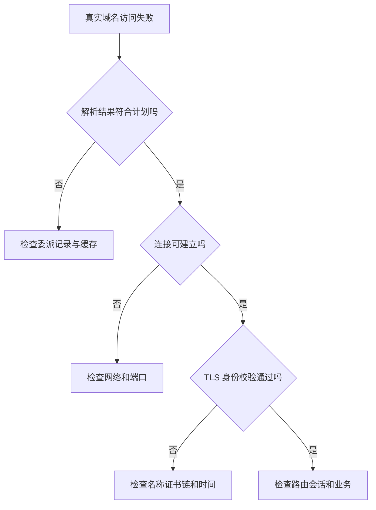

# 域名、DNS、HTTPS 与入口

> 面向把应用接入真实域名的开发者和维护者。读完能按解析、连接、TLS 和路由逐层定位失败，理解证书与权限的区别，并在切换入口时考虑缓存与恢复。

## 一个地址穿过多层系统

**域名**是分层命名空间中的名称；**域名系统**（DNS）将名称解析成地址或其他记录。注册域名、管理权威 DNS、运行应用和签发证书是相关但不同的能力。持有域名不意味着应用已部署，DNS 返回地址也不意味着该地址上的服务可用。

浏览器访问 `https://signup.example.test/activities` 时，会查 DNS、建立网络连接、完成 TLS、发送 HTTP 请求，再由入口选择后端。示例域名用于说明，不代表真实服务。**反向代理**代表后端接收请求，**负载均衡**按规则选择实例，**内容分发网络**（CDN）可在边缘处理或缓存内容，几种职责可以由同一产品承担。

| 层次 | 失败表现 | 优先检查 |
| --- | --- | --- |
| DNS | 名称不存在或返回旧地址 | 权威记录、委派与解析器缓存 |
| 网络 | 连接超时或被拒绝 | 路由、端口、防火墙与入口监听 |
| TLS | 证书名称或链错误 | 访问域名、有效期、链与终止位置 |
| HTTP 路由 | 错误后端、404 或重定向循环 | Host、路径、代理和应用配置 |
| 业务 | 登录失效或越权 | 会话、授权与真实使用旅程 |

逐层证据有助于缩小范围，但错误码不是确定根因。例如 502 可能来自后端连接、协议或启动失败，需要结合入口和应用日志确认。

## DNS 的委派和缓存决定切换节奏

**权威服务器**保存某个区域的正式记录，**递归解析器**代表客户端查询并缓存结果。RFC 1034 定义 DNS 分层、委派和缓存基本机制。[RFC 1034](https://www.rfc-editor.org/rfc/rfc1034) `A` 记录指向 IPv4 地址，`AAAA` 指向 IPv6，`CNAME` 表示名称别名；不能把所有记录都当“域名到 IP”的文本替换。

**生存时间**（TTL）告诉缓存记录可保持的时间。降低 TTL 影响后续取得的新缓存，不能立即清除已经按旧 TTL 缓存的结果。名称不存在等负向答案也可能被缓存；真实客户端和中间解析器行为需观察。因此“控制台保存成功”不等于全球请求已经切换。

入口迁移宜提前调整缓存策略、保持旧入口在过渡期可用，并检查不同网络的实际解析。若同时更换 IPv4 而忘记 IPv6，部分用户可能仍到旧服务；别名链和不同记录类型也要一起核对。DNS 不适合作为每次请求精细灰度的唯一机制。

图要求逐层检查，不鼓励关闭安全验证“先试试”。跳过 TLS 校验会删除关键证据。

## HTTPS 保护链路，不替代业务授权

**传输层安全**（TLS）在连接双方之间建立身份校验、机密性和完整性保护，TLS 1.3 的机制见 RFC 8446。[RFC 8446](https://www.rfc-editor.org/rfc/rfc8446) HTTPS 是在 TLS 保护下使用 HTTP。证书名称应匹配实际访问的主机，证书链需要被客户端信任；有效期和客户端时间也会影响判断。

证书证明的是连接端点身份的相关条件，不能证明页面没有漏洞、网站业务真实或用户有管理权限。普通账号在 HTTPS 下读取管理员名单仍是越权；数据库凭据和存储数据还需各自保护。

**TLS 终止**是在某一入口完成 TLS 解密，随后将请求转给后端。浏览器到入口加密，不自动意味着入口到应用也加密；是否需要后端 TLS，应依据网络和威胁模型明确。应用应只信任受控代理提供的转发头，不能让任意客户端伪造外部协议、来源地址或主机判断。

## 证书申请与续期也是运行路径

自动证书管理通常需要证明域名控制权。Let's Encrypt 官方说明 HTTP-01 与 DNS-01 等挑战的差异：HTTP 路径可达、DNS TXT 记录和通配符需求影响选择。[挑战类型](https://letsencrypt.org/docs/challenge-types/) 申请成功只代表当次流程，续期仍依赖 DNS 权限、挑战路径和自动化运行。

| 方案 | 适用条件 | 要验证的边界 |
| --- | --- | --- |
| 平台托管证书 | 入口平台支持对应域名 | 配置、续期、停用和导出责任 |
| HTTP 验证 | 挑战路径可从外部到达 | 重定向、入口与访问策略影响 |
| DNS 验证 | 有受控 DNS 更新权限 | 凭据最小范围、传播与清理 |
| 后端独立 TLS | 需要保护内部链路 | 信任链、名称、轮换和监测 |

**HTTP 严格传输安全**（HSTS）让支持的浏览器在策略期限内使用 HTTPS；子域和预加载会扩大约束范围。[MDN HSTS](https://developer.mozilla.org/en-US/docs/Web/HTTP/Reference/Headers/Strict-Transport-Security) 启用前应确认相关域名持续支持 HTTPS。它能改善传输策略，但不会修复错误证书或应用授权。

## 路由与缓存需要按内容区分

入口可按主机和路径将页面、接口和资源交给不同后端。反向代理路径改写、应用基础路径和重定向地址必须一致，否则页面能打开但接口报错。HTTP 语义规定方法、状态和缓存相关判断的基础。[RFC 9110](https://www.rfc-editor.org/rfc/rfc9110.html) 不应随意把带副作用的请求改成可缓存读取，也不能靠重定向补救所有路径错误。

静态带内容摘要的资源可以采用与 HTML 不同的缓存策略；登录会话、个人状态与管理员名单需要明确防止共享缓存泄漏。发布时若新 HTML 引用新资源，而入口暂时返回旧文件，可能造成运行失败；旧资源保留策略和缓存刷新都应纳入发布计划。

**跨源资源共享**（CORS）是浏览器对跨源脚本读取响应的机制，不是服务端身份授权。允许来源不应代替接口权限；非浏览器调用不依赖相同浏览器限制。会话 Cookie 的域、路径、安全属性和跨站行为也需要在实际域名验证。

## 保存分层诊断的观察口径

检查 DNS 时记录查询名称、类型、使用的解析器、返回地址、状态与 TTL；需要时再对照权威答案。`NXDOMAIN` 表示相关名称不存在，`NODATA` 表示没有所问类型的记录，不能都笼统称为“服务器断网”；负向缓存的规则见 RFC 2308。[负向缓存](https://www.rfc-editor.org/rfc/rfc2308.html) 同一台机器可能有系统、浏览器和代理等不同缓存路径，清一处缓存不保证所有路径刷新。

检查 TLS 与路由时保留真实主机名，直接改用 IP 地址会改变证书名称校验和虚拟主机选择。若使用受控方式指定连接地址，仍应保持目标域名语义，并明确这是诊断条件；它不能代替正常 DNS 路径的验收。检查 CORS 还要看浏览器实际发出的预检与请求，官方指南解释其浏览器机制。[MDN CORS](https://developer.mozilla.org/en-US/docs/Web/HTTP/Guides/CORS) 所有诊断动作及示例在本文均未实际执行。

## 入口切换的验收与恢复

以下是未执行的教学方案：登记旧入口、旧记录与 TTL；准备新入口和证书；在受控测试条件下用真实主机名验证 TLS、路由和关键旅程；切换记录或流量；从多个实际网络观察解析与业务；保持旧路径直到过渡条件满足，再清理。

| 核验项 | 成功条件 | 仍不能证明 |
| --- | --- | --- |
| 解析 | A、AAAA 和别名符合计划 | 所有客户端缓存已刷新 |
| TLS | 名称、链、时间与协议可接受 | 应用安全无漏洞 |
| 路由 | 页面、接口和资源到正确后端 | 业务终态正确 |
| 会话 | 登录与退出在实际域名正常 | 所有角色权限已覆盖 |
| 恢复 | 可回到已知入口并观察 | DNS 立即切回全部客户端 |

DNS 回退同样受缓存影响，旧入口应保留兼容能力。若旧入口已删除，修改记录无法立即让服务恢复；若数据和身份系统同时迁移，入口恢复也不意味着数据一致。

## 常见失败模式

| 失败模式 | 后果 | 修正 |
| --- | --- | --- |
| 只检查控制台记录 | 漏掉委派与旧缓存 | 查询权威与真实解析路径 |
| 关闭证书校验排障 | 隐藏名称和信任问题 | 保留安全校验并分层检查 |
| 只配 IPv4 | 部分用户仍访问旧入口 | 同查 A、AAAA 与别名 |
| 忽略代理头信任范围 | 协议判断错误或被伪造 | 仅信任受控代理 |
| 缓存管理员内容 | 用户之间数据泄漏 | 按内容与身份制定缓存策略 |

## 参考资料

<Refs>

- [RFC 1034：DNS concepts and facilities](https://www.rfc-editor.org/rfc/rfc1034)（访问日期 2026-10-03）
- [RFC 2308：Negative Caching](https://www.rfc-editor.org/rfc/rfc2308.html) · [MDN：CORS](https://developer.mozilla.org/en-US/docs/Web/HTTP/Guides/CORS)（访问日期 2026-10-03）
- [RFC 8446：TLS 1.3](https://www.rfc-editor.org/rfc/rfc8446) · [RFC 9110：HTTP Semantics](https://www.rfc-editor.org/rfc/rfc9110.html)（访问日期 2026-10-03）
- [Let's Encrypt：Challenge Types](https://letsencrypt.org/docs/challenge-types/)（访问日期 2026-10-03）
- [MDN：Strict-Transport-Security](https://developer.mozilla.org/en-US/docs/Web/HTTP/Reference/Headers/Strict-Transport-Security)（访问日期 2026-10-03）
- 站内相关：[托管与平台](/software/delivery/hosting-platforms) · [发布与回滚](/software/delivery/release-rollback) · [SLO 与健康检查](/software/operations/slo-health-oncall)

</Refs>
