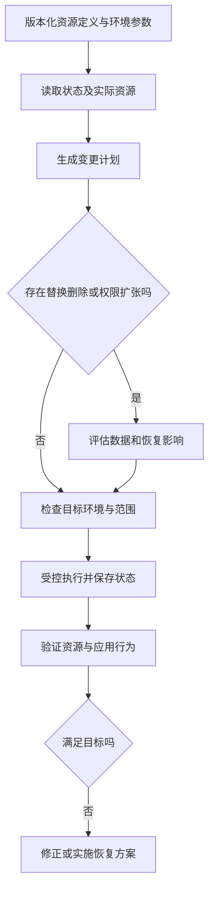

# 环境、配置与基础设施即代码

> 面向需要把应用交付到不同环境的开发者和平台人员。读完能说明环境差异、配置与秘密的边界，并把基础设施变更组织成可审查、可追踪的过程。

## 环境不只是一个名字

**环境**是应用运行所需的资源、配置、身份、网络、数据与外部依赖的组合。开发、测试、预发布和生产是用途划分，命名不自动形成安全隔离。两个目录都连接同一生产数据库，即使分别叫 `dev` 和 `prod`，仍可能互相影响。

**配置**是改变程序运行行为的参数；**秘密**是需要限制访问的敏感值，例如凭据和签名密钥。非敏感配置适合版本化，秘密宜在授权的运行阶段注入，并记录引用或版本而不输出值。环境变量是一种传递渠道，本身不等于安全存储。

**基础设施即代码**（Infrastructure as Code，IaC）用可版本化的定义管理网络、计算、存储和权限等资源。声明式工具描述期望状态，再计算如何使实际资源接近它；代码审查改善可追踪性，却不会取消实际资源删除、替换和权限放大的后果。

| 对象 | 建议管理方式 | 边界 |
| --- | --- | --- |
| 应用制品 | 同一不可变制品晋级 | 构建时配置会产生不同对象 |
| 普通配置 | 版本化定义与环境参数 | 不把完整连接凭据当普通文本 |
| 秘密 | 受控秘密存储与运行注入 | 记录引用，验证轮换与失败行为 |
| 资源定义 | IaC 与变更计划 | provider 和权限决定实际能力 |
| 业务数据 | 独立备份、迁移与访问控制 | 不因资源代码回退而自动恢复 |

## 定义、状态和真实资源有三种角色

以 Terraform 为例，**状态文件**记录配置中的资源与现实对象之间的映射及相关属性。[State 文档](https://developer.hashicorp.com/terraform/language/state) 状态不是业务数据库备份，也不是永远正确的实时资源视图。手工改变云资源、其他自动化操作或执行中断，会影响后续判断。

**变更计划**（plan）比较配置、状态与读取到的资源信息，提出增加、修改或删除动作。[plan 文档](https://developer.hashicorp.com/terraform/cli/commands/plan) 它是审查材料，不是实际完成的证据。计划执行前如果输入或资源变化，原结论可能失效；读取资源本身也依赖身份和网络。

**漂移**是实际资源与管理定义之间的偏差。发现漂移后，先判断它是应保留的应急变更、未经授权修改还是定义错误。直接覆盖可能恢复旧配置，也可能撤销必要的故障缓解。应把真实意图纳入代码或修复资源，保存原因，而非只让计划显示“无变化”。

图中的执行必须依据真实环境权限和既有授权。本文只是机制说明，没有创建或修改资源。

## 隔离与一致性需要同时设计

测试环境应能够发现生产会发生的关键差异，例如数据库约束、TLS 入口、身份与队列行为；又应避免共享生产写入权限和真实数据。可以使用相同模块生成规模不同的环境，但“小规模”不会自动保留相同网络、配额或性能特征。

| 决策 | 适用条件 | 代价与核验 |
| --- | --- | --- |
| 独立账号或项目 | 影响范围、权限需强隔离 | 额外治理与成本，核验跨环境权限 |
| 独立命名空间 | 共享平台上的应用隔离 | 仍共享控制面和资源，核验边界 |
| 临时验收环境 | 变更频繁、资源可快速重建 | 生命周期与清理，禁止真实数据 |
| 长期预发布环境 | 外部接入和兼容需稳定验证 | 维护漂移，防数据成为隐藏依赖 |
| 环境配置覆写 | 差异少且有显式清单 | 防重复默认值与遗漏键 |

**配置模式**规定键、类型、默认值和必填规则。启动时校验缺失或非法配置，可以比请求到来后才报错更早发现问题。默认值只适合确有安全含义的参数；生产数据库地址或签名密钥不宜静默回退到本地占位。

配置摘要应剔除秘密值，保留可审计的版本引用。记录“配置与上次相同”需要有明确比较方法；不要打印全部环境变量来排查问题。秘密轮换还要验证新旧凭据过渡、连接重建和失败路径，而非只检查存储中已经有新值。

## 状态与计划是敏感交付资产

Terraform 官方说明，配置中的秘密可能进入状态与计划；`sensitive` 主要隐藏部分显示，并不阻止值被保存。[敏感数据文档](https://developer.hashicorp.com/terraform/language/manage-sensitive-data) 因此不要把状态、计划或完整输出提交到普通源码仓库。远程保存仍需加密、访问限制、审计和恢复策略。

**状态锁**防止多个执行者同时写同一状态。Terraform 只有在后端支持时才能提供对应锁机制，关闭锁或错误强制解锁会引入并发写风险。[状态锁文档](https://developer.hashicorp.com/terraform/language/state/locking) 锁住状态并不锁住所有云资源，也不阻止控制台手工修改；环境还需要统一变更入口和责任约定。

环境分离应核对后端路径、目标账号、区域和身份，不能只依赖命令行当前目录。发布日志宜清楚显示非敏感目标标识，防止把测试计划执行到生产。执行凭据应仅拥有所需资源范围的权限，计划执行和实际变更的身份也需可追踪。

## 一次基础设施变更怎样验收

以下为未执行的教学方案：报名服务需要增加一个独立异步导出组件。先定义队列、执行身份和结果存储，列清读取名单与写结果的权限；在隔离环境生成计划，检查是否意外替换数据库或开放公网；审查后执行；验证资源存在、身份权限符合最小范围、应用能提交与完成导出且普通用户被拒绝。

资源创建完成是基础设施层证据，应用任务完成是业务层证据。两者应共同记录版本、环境与实际结果。执行中断时先核对实际创建的对象和状态，避免重跑导致重复资源；资源导入、重命名和状态调整需按工具机制处理，不能手工编辑状态作为常规修复。

## 一次执行不等于跨资源事务

IaC 执行可能依次完成多个资源动作，在中间遇到网络、配额或权限错误。不能假定失败后平台自动撤销全部已完成动作；应按执行记录、状态和实际资源核对结果。Terraform 的 `apply` 说明执行计划及错误处理相关规则，具体资源仍由 provider 和 API 决定。[apply 文档](https://developer.hashicorp.com/terraform/cli/commands/apply)

重试前要区分已经存在、正在创建和真正失败的对象，检查是否产生计费资源、孤立权限或依赖不完整。业务流量是否已经进入也影响恢复策略。部分完成时，代码和状态记录应保留，避免删除状态后再创建同名对象。计划审查需要为这种中间状态留出核对与恢复步骤，而不是把成功路径当作唯一情况。

## 回退并不总是恢复旧资源

把 IaC 文件回到旧提交，会重新计算资源变化，不保证原资源原样回来。删除数据库后重新创建同名实例，得到的是新的对象和空数据；网络替换可能改变地址与连接；权限缩小可能切断恢复所需路径。回退方案应区分修改配置、重新部署资源、恢复数据和业务对账。

| 失败模式 | 后果 | 改进 |
| --- | --- | --- |
| 状态和计划直接进仓库 | 秘密与拓扑泄露 | 独立受控存储与审计 |
| 用测试参数默认值部署生产 | 误连依赖或缺关键保护 | 启动校验与目标标识核对 |
| 看计划无误就宣称完成 | 没有实际执行和行为证据 | 保存执行与应用验证记录 |
| 忽略资源替换 | 数据、地址或权限变化 | 提前准备迁移和恢复 |
| 应急手改永不收编 | 下次执行覆盖必要配置 | 记录漂移并回到统一管理 |

具体云资源的字段、替换语义、配额和权限应再查对应 provider 与产品官方文档。本文核验 Terraform 的通用机制，没有为某个云产品配置提供可直接执行保证。

## 参考资料

<Refs>

- [Terraform：State](https://developer.hashicorp.com/terraform/language/state) · [terraform plan](https://developer.hashicorp.com/terraform/cli/commands/plan)（访问日期 2026-10-03）
- [Terraform：terraform apply](https://developer.hashicorp.com/terraform/cli/commands/apply)（访问日期 2026-10-03）— 执行与错误边界
- [Terraform：State Locking](https://developer.hashicorp.com/terraform/language/state/locking)（访问日期 2026-10-03）— 后端支持与强制解锁边界
- [Terraform：Manage sensitive data](https://developer.hashicorp.com/terraform/language/manage-sensitive-data)（访问日期 2026-10-03）— 显示遮蔽与状态保存的区别
- 站内相关：[构建与 CI](/software/delivery/build-ci) · [托管与平台](/software/delivery/hosting-platforms) · [发布与回滚](/software/delivery/release-rollback) · [恢复与对账](/software/operations/recovery-reconciliation)

</Refs>
