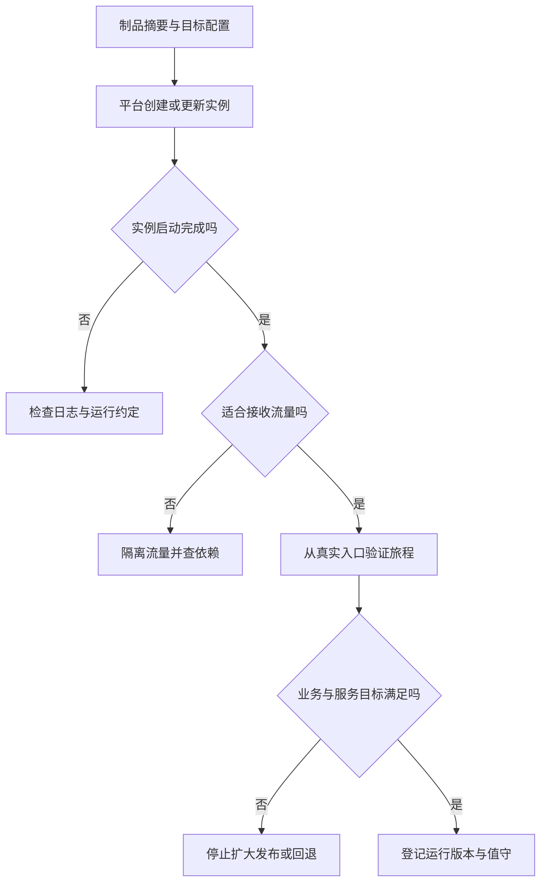

# 托管、部署与平台工程

> 面向选择运行平台、上线应用和接管服务的开发者。读完能按工作负载判断托管形态，划清应用与平台责任，并验证“部署完成”是否真正转化为用户可用。

## 托管负责提供运行条件

**托管**是由某个平台或团队提供程序运行所需的基础条件；**部署**是把指定制品和配置放入目标运行环境；**发布**是让用户开始使用某个版本或功能。部署可以完成却没有用户流量，发布也可能只改变功能开关而没有新部署。

**平台工程**将常见交付与运行能力组织成团队可使用的服务，例如标准构建、环境申请、秘密注入、日志、发布与恢复入口。它的目标是减少重复操作和降低变更风险，并不等于一定建设 Kubernetes 集群或复杂门户。

对虚构报名系统，需要分别安置静态页面、HTTP 服务、数据库、导出任务和结果文件。静态托管不能直接执行服务端事务；HTTP 请求容器不一定适合无限期后台任务；本地文件不一定在实例替换后保留。选平台前先画工作负载及持久数据边界。

| 形态 | 更适合的负载 | 团队仍需承担 |
| --- | --- | --- |
| 静态托管 | 已构建页面与资源 | 后端接入、缓存与入口验证 |
| 托管应用或容器 | 符合平台约定的 HTTP 服务 | 数据、身份、配置、限流与业务恢复 |
| 函数与任务平台 | 有界请求、事件或批处理 | 重试、幂等、状态与执行限制 |
| 虚拟机 | 特殊运行环境和系统控制 | 系统更新、进程、容量与备份 |
| 托管 Kubernetes | 多工作负载及统一编排需要 | 应用配置、网络权限、数据与集群边界治理 |

表是工作负载建议，不是产品排名。价格、地区、配额和支持能力应按实际产品再核验，不能从某种形态推定免费、无限或自动高可用。

## 运行约定会约束应用设计

**运行约定**是平台要求应用遵守的端口、启动、退出、文件、资源和请求规则。Cloud Run 官方约定包含监听平台指定端口、绑定可被入口连接的地址，以及服务、任务与实例生命周期差异。[容器约定](https://docs.cloud.google.com/run/docs/container-contract) 本文用它说明核对方法，不把单一平台的限制当作全部托管平台共同规则。

无状态服务把持久业务状态放在受控外部存储，方便实例替换与扩展。**无状态**不意味着没有数据，也不意味着请求之间没有业务关系。报名会话、幂等标识和导出任务状态需要有明确归属；只保存在单实例内存中，流量切换或重启就可能丢失。

平台自动扩容可能增加数据库连接、缓存请求和下游负载。增加副本只增加某一层能力，并不保证整体容量。请求超时、实例启动和终止宽限期都需要应用配合，异步任务应避免依赖 HTTP 响应之后仍持续拥有执行资源。

## 从期望状态到实际可用

**编排**按期望状态管理运行实例。Kubernetes Deployment 使用控制器维持指定副本和滚动更新等行为。[Deployment](https://kubernetes.io/docs/concepts/workloads/controllers/deployment/) 控制器确认资源状态，不独立理解报名是否超额、权限是否正确或导出是否可用。

**就绪检查**（readiness）判断实例是否适合接收流量；**存活检查**（liveness）判断是否需要重启；**启动检查**（startup）给启动过程单独的判断窗口。[探针文档](https://kubernetes.io/docs/tasks/configure-pod-container/configure-liveness-readiness-startup-probes/) 三者处理后果不同，不能共用一个无条件“成功”接口来代表服务健康。

数据库暂时失败时，把所有实例的存活检查都判失败可能造成重启风暴。就绪判断也不能无限级联移除全部服务；应根据应用是否有降级能力、故障范围和依赖性质设计，保留明确解释。健康检查是控制信号，不替代用户旅程指标。

## 平台选型按责任与限制比较

小系统往往先需要简单、可信、能恢复的交付路径。团队没有集群维护能力时，复杂平台可能增加故障面；有多个服务与特殊网络需求时，简单托管也可能不足。决策应记录必要条件、维护能力和验证方法，而非以“行业常用”作为唯一理由。

| 判断项 | 要核对的问题 | 对决策的影响 |
| --- | --- | --- |
| 运行形态 | 请求、持续工作、定时任务是否被支持 | 决定是否拆开服务与任务 |
| 持久数据 | 本地文件生命周期、外部存储连接 | 决定数据归属与恢复方案 |
| 网络与身份 | 私网、入口认证、执行身份边界 | 决定依赖可达与最小权限 |
| 发布能力 | 流量切分、旧制品保留、版本观测 | 决定灰度与恢复可操作性 |
| 容量与资源 | 并发、配额、启动延迟和限额 | 决定峰值保护与负载验证 |
| 维护与成本 | 谁值守、谁升级、费用怎样归属 | 决定长期承受能力 |

**共享责任**需要落到具体动作。托管数据库可能承担部分底层维护，应用团队仍需管理模式、索引、权限、备份恢复验证和数据对账；托管 TLS 仍需正确域名、入口路由和证书续期观察。服务协议应查实际范围，不能由“托管”二字推断。

## 平台能力应有可用的标准路径

**标准交付路径**是一套经过验证、可重复使用的应用创建与运行方式，通常包含模板、文档和自动化。它应提供合理默认值，又允许特定负载在有依据时调整。模板越复杂不意味着能力越强；开发者需要知道输入、输出、限制和失败后的联系人。

例如平台可提供“报名 HTTP 服务”路径：登记制品摘要，校验必填配置，注入秘密引用，创建受限身份，配置启动与就绪检查，输出真实域名和日志入口，登记恢复操作。开发者仍负责容量规则、业务日志、幂等和数据变更，平台不能替这些行为作验收。

标准路径本身也需版本化，更新时说明新旧应用影响。若模板默认扩大权限或更改健康检查，一次平台更新可能影响所有服务。应先验证代表性应用，再逐步推广，保留可恢复的旧配置和兼容说明。

## 部署验收与交接

以下为未执行方案：用同一候选制品部署隔离环境；检查实例启动和资源限制；通过实际域名验证 TLS、登录和路由；以合成账号验证报名、满额拒绝、取消与管理员导出；替换实例后检查业务状态仍在；验证错误日志能定位版本，值守者能够找到发布及恢复入口。

| 交接对象 | 必须说明 | 验证方式 |
| --- | --- | --- |
| 运行版本 | 制品摘要、配置与数据结构 | 比较登记与实际运行信息 |
| 依赖 | 数据库、身份、任务和存储 | 测试可达及失败路径 |
| 观察 | 用户指标、日志与告警责任 | 从一个合成请求定位全链 |
| 恢复 | 旧制品、兼容配置和数据边界 | 隔离环境实际演练 |
| 维护 | 负责人、权限、升级和停用 | 按交接记录完成一次操作 |

## 退出能力应进入托管决定

选平台时也要说明服务怎样迁出或停用：能否导出数据和必要配置，外部域名怎样切换，旧制品怎样在替代环境运行，秘密与执行身份如何重新建立。标准容器格式降低部分打包差异，不消除平台网络、身份、队列和存储 API 的绑定。

小系统可以用一次隔离迁移验证最关键的退出路径，不必先承诺所有平台完全通用。迁移时应核对数据时间点、入口缓存、任务重试与恢复责任；停用时应清理运行资源、公开入口和剩余凭据，同时按要求保留数据或证据。应用没人使用并不代表资源已停止计费，也不代表入口和旧身份不会继续被访问。

## 常见失败模式

| 失败模式 | 后果 | 改进 |
| --- | --- | --- |
| 部署成功等同验收成功 | 实例活着，入口或业务失败 | 从真实入口验证目标旅程 |
| 无状态理解为内存保存状态 | 重启或扩容丢任务 | 外部持久状态与幂等 |
| 扩容只看应用副本 | 下游连接被压垮 | 联合容量和依赖限额 |
| 过度依赖模板默认 | 特殊负载不符合约定 | 明确限制并做代表性验证 |
| 平台与应用互相推责 | 故障无人响应 | 为动作和证据指定责任 |

平台机制细节复用[Kubernetes 主文](/cloud/native/kubernetes)，本文重点是应用交付、责任和验收。平台选型应随负载、团队能力和合规约束变化重新评估。

## 参考资料

<Refs>

- [Cloud Run：Container runtime contract](https://docs.cloud.google.com/run/docs/container-contract)（访问日期 2026-10-03）— 用于说明运行约定核对方法
- [Kubernetes：Deployments](https://kubernetes.io/docs/concepts/workloads/controllers/deployment/)（访问日期 2026-10-03）— 期望副本与滚动更新
- [Kubernetes：Liveness、Readiness and Startup Probes](https://kubernetes.io/docs/tasks/configure-pod-container/configure-liveness-readiness-startup-probes/)（访问日期 2026-10-03）— 探针含义与后果
- 站内相关：[容器与镜像](/software/delivery/containers-images) · [环境与 IaC](/software/delivery/environments-iac) · [入口与 HTTPS](/software/delivery/dns-https) · [Kubernetes](/cloud/native/kubernetes)

</Refs>
