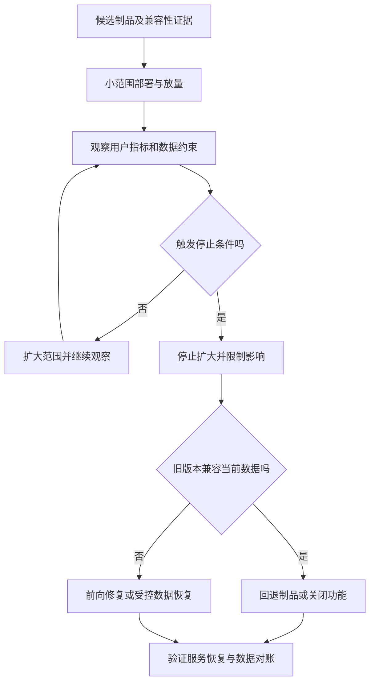

# 发布、功能开关与回滚

> 面向上线负责人、开发者和应用维护者。读完能区分部署、放量、开关与回滚，制定有停止条件的发布计划，并理解程序回退为何不能自动撤销数据和外部副作用。

## 发布是一项有反馈的变更

**发布**让用户开始使用新版本或功能；**回滚**恢复先前运行版本或配置以限制影响。服务部署完成只是候选具备运行条件，用户流量、功能可见性和数据变更可能在不同时间发生。

**滚动更新**逐步替换运行实例，常出现新旧版本共存；**蓝绿发布**准备两套运行环境并切换入口；**金丝雀发布**让部分代表性流量先使用候选版本，观察后再扩大。Google SRE 将金丝雀作为降低发布风险的反馈机制。[金丝雀发布](https://sre.google/workbook/canarying-releases/) 少量流量通过只能支持该观察范围，低流量或未触发关键路径时尤其如此。

| 策略 | 适合条件 | 主要约束 |
| --- | --- | --- |
| 整体替换 | 简单系统、允许明确维护窗口 | 中断与恢复时间需验证 |
| 滚动更新 | 新旧版本可以共同运行 | 接口、数据和会话兼容 |
| 蓝绿切换 | 有双环境能力与清晰入口 | 成本、共享数据与切换观察 |
| 金丝雀 | 能分流并比较用户表现 | 样本、基线与停止条件 |
| 功能开关 | 代码路径可以安全控制 | 开关治理、状态与默认值 |

没有策略能让不可兼容数据变更自动安全。选择前先问：新旧程序能否读写同一数据，入口能否恢复，旧制品是否可取得，运行者是否有执行权限。

## 兼容性让恢复仍然可能

**向后兼容**在这里指旧程序或消费者能继续使用新接口或数据；真实含义应写明比较双方和操作。新增可空字段可能兼容，删除旧程序必需字段则通常不兼容。新版本写入旧版本无法理解的新状态，也会让程序回退后失败。

**扩展后收缩**先增加兼容结构，让新旧版本都能运行；迁移和校验数据；切换读取或写入路径；确认旧版本不再依赖后，再删除旧结构。这种分阶段方式降低瞬间不兼容风险，但增加过渡期逻辑与对账责任，不能永久保留双写而无人检查。

Kubernetes Deployment 回滚恢复相应工作负载的版本状态，不替应用恢复数据库、秘密、外部任务或业务数据。[Deployment 文档](https://kubernetes.io/docs/concepts/workloads/controllers/deployment/) 即使平台显示旧副本正常，也需要重新验证目标旅程和数据兼容。

图把“回滚可用”当条件，而不是每次出错的必然答案。恢复动作要基于故障证据和已有演练。

## 功能开关控制行为，不是授权

**功能开关**按布尔或其他配置值选择程序行为。OpenFeature 的评估 API 包含默认值、类型和错误处理等约定。[Flag Evaluation](https://openfeature.dev/specification/sections/flag-evaluation/) 具体提供者、同步与缓存策略会影响开关实际生效时机，需要独立核验。

例如管理员导出新版格式可以先对合成账号或指定小群体启用；关闭后恢复旧格式。若新版已经写入不同任务状态或发出通知，关闭开关不会撤销这些副作用。前端隐藏按钮也不能作为权限控制，服务端仍要独立授权。

| 开关设计项 | 应明确的规则 | 验证方法 |
| --- | --- | --- |
| 默认值 | 配置失效时选择哪条路径 | 模拟提供者不可达与非法值 |
| 分组 | 同一用户或任务是否稳定命中 | 跨实例与重试观察 |
| 范围 | 入口、异步任务与数据路径 | 检查是否出现半启用状态 |
| 责任 | 谁可修改、审计和应急关闭 | 权限与操作记录 |
| 生命周期 | 何时移除旧路径和开关 | 关联任务、测试及数据迁移 |

短期开关应有移除计划，长期产品配置应按正式配置管理。开关组合数量增长会增加测试空间，需要保留重要组合与过渡状态。紧急关闭操作要可找到、可授权、可观察，不能只存在于某位开发者本机。

## 数据回退需要独立决定

**数据库时间点恢复**（Point-in-Time Recovery，PITR）把数据库恢复到选定历史状态；PostgreSQL 用基础备份和连续归档 WAL 支持这一过程，所需链条必须完整。[连续归档](https://www.postgresql.org/docs/current/continuous-archiving.html) 恢复历史时间点可能同时移除故障之后的合法报名，不能将它称为无损撤销某次发布。

逻辑修复可以只调整受影响记录，但需要识别范围、验证规则、保存证据和对账。已发送通知、已生成导出文件或其他外部副作用也需单独处理。**补偿操作**按业务规则修正先前动作造成的效果，未必是原操作的严格逆操作。[补偿事务模式](https://learn.microsoft.com/en-us/azure/architecture/patterns/compensating-transaction) 重试补偿也要避免重复副作用。

程序、配置、数据和流量应分别列出恢复动作。回退计划需要解释哪些动作可直接恢复、哪些必须前向修复、哪些会损失合法数据，以及如何与业务负责人共同决定。风险不明确时优先停止继续写坏数据，保留现场，不盲目执行历史恢复覆盖。

## 发布计划需要预先写出停止条件

以下为未执行的教学方案。报名容量校验有改动时，先在真实数据库验证并发、重试和取消；登记候选与旧制品摘要，确认数据兼容；选择能触发写入的代表性流量；观察成功、系统失败、规则拒绝、延迟及计数一致；按预定条件扩大或停止。

| 阶段 | 证据 | 需要作出的决定 |
| --- | --- | --- |
| 发布前 | 验收、兼容、配置与恢复演练 | 是否存在阻断项 |
| 小范围 | 真实请求、候选与基线比较 | 是否继续扩大 |
| 扩大 | 样本是否覆盖核心旅程 | 是否需要延长观察 |
| 异常 | 用户影响、数据风险与恢复条件 | 回退、关开关或前向修复 |
| 恢复后 | 服务目标与业务终态 | 是否可以恢复正常变更 |

停止条件可以是确认越权、容量约束破坏、错误显著增加或观测失效，具体阈值要依据项目 SLO 与风险设定。没有可用观察时不应凭页面演示继续放量。新旧版本比较也需考虑流量结构不同，不能把用户类型差异当版本因果。

## 发布单元与业务单元要对齐

流量分组应考虑用户、活动和任务的稳定性。一次报名在旧实例创建、随后查询在新实例读取，如果状态语义不兼容，比例很小也会出错。异步导出跨越发布窗口时，任务需要携带足以解释的格式或版本信息，执行者不能只按“当前最新”假设输入。

候选与基线的比较也应分旅程和负载，确认错误是否来自同一种用户行为。观察期应覆盖核心操作完成与异步终态，而非仅等待固定几分钟。没有足够样本时可以延长观察、使用隔离合成场景或明确缩小结论，不能把“未见错误”写成“已经证明安全”。

## 常见失败模式与边界

| 失败模式 | 后果 | 改进 |
| --- | --- | --- |
| 灰度只有静态读取 | 写入问题未触发 | 选择代表性关键旅程 |
| 旧制品或配置已删除 | 紧急回退不可执行 | 保留并验证取得路径 |
| 回滚假设撤销数据 | 合法记录丢失或结构不兼容 | 独立恢复决定与对账 |
| 开关失效默认危险路径 | 提供者故障扩大风险 | 明确默认值并测试失败 |
| 人工改实例临时救火 | 后续自动化覆盖或版本混杂 | 登记应急变化并回归管理 |

安全发布依赖可追踪制品、兼容演进、有效观测和实际恢复能力。文档计划只说明设计，完成演练后才可以写出本环境的验证结论。

## 参考资料

<Refs>

- [Google SRE：Canarying Releases](https://sre.google/workbook/canarying-releases/)（访问日期 2026-10-03）
- [Kubernetes：Deployments](https://kubernetes.io/docs/concepts/workloads/controllers/deployment/)（访问日期 2026-10-03）— 更新与回滚对象范围
- [OpenFeature：Flag Evaluation API](https://openfeature.dev/specification/sections/flag-evaluation/)（访问日期 2026-10-03）
- [PostgreSQL 18：Continuous Archiving and PITR](https://www.postgresql.org/docs/current/continuous-archiving.html)（访问日期 2026-10-03）
- [Microsoft：Compensating Transaction](https://learn.microsoft.com/en-us/azure/architecture/patterns/compensating-transaction)（访问日期 2026-10-03）
- 站内相关：[构建与 CI](/software/delivery/build-ci) · [验收与回归](/software/quality/acceptance-regression) · [应用观测](/software/operations/application-observability) · [恢复与对账](/software/operations/recovery-reconciliation)

</Refs>
