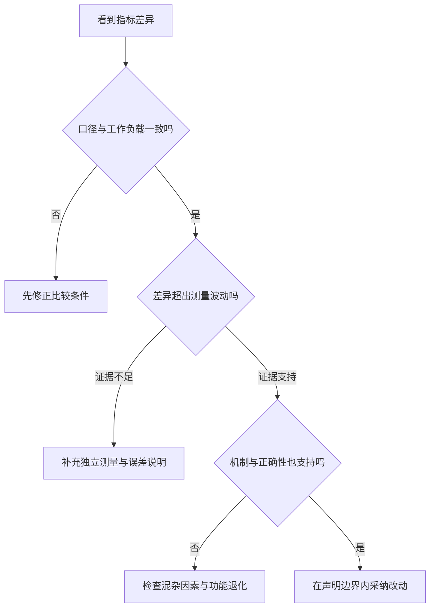

# 工程数学与度量基础

> 面向需要阅读性能报告、制定验收条件或判断优化是否有效的开发者与项目负责人。读完能核对单位、分母、统计窗口和采样方式，区分平均表现与尾部风险，并把一个测量结果改写成边界清楚、可以复核的工程结论。

## 度量先定义对象，再计算数字

**度量**是按约定把系统行为转成数值。延迟、失败率、吞吐量看似直观，但如果不知道统计对象和边界，数字可能在回答不同问题：延迟从点击到页面反馈，还是从服务收到请求到发出响应？失败率按网络尝试、业务操作还是用户人数计算？

数学运算不负责选择合理的对象。虚构活动系统中，一次用户报名可能因重试产生三次 HTTP 请求；请求成功率不能直接充当报名完成率。工程建议为每个指标保存名称、单位、起止点、分母、统计窗口和排除规则，再讨论阈值。需求中的验收口径见[验收标准](/software/requirements/acceptance-criteria)。

本文所有数值案例均是假设数据的算术或模型推导，不是本仓库、某产品或活动系统的实测结果。这里建立通用判断基础，算法规模分析见[时间与空间复杂度](/software/algorithms/complexity)，负载设计见[性能、负载与可靠性测试](/software/quality/performance-reliability-tests)。

## 单位与比率决定能否比较

### 数量、速率与时间不能混算

1 秒等于 1,000 毫秒；MB 通常按十进制表示 10^6 字节，MiB 按二进制表示 2^20 字节。bit 是位，byte 是字节，一个字节为 8 位。看到 `100 MB/s` 和 `100 Mb/s` 时，不能只比较数值。[NIST 单位前缀](https://www.nist.gov/pml/special-publication-330/sp-330-section-3)

**吞吐量**描述一段时间内完成了多少工作，例如请求/秒。并发数描述同时有多少工作在系统内，二者的单位不同。一个系统接受 100 个请求、完成 80 个请求，应分别记录到达量、完成量和剩余状态，不能把入口接收速度报告为成功处理速度。

量纲检查可以发现明显错误：`请求/秒 × 秒 = 请求`，而 `请求/秒 + 毫秒` 没有可直接相加的业务意义。存储估算中，`记录数 × 每条平均字节数` 只给出逻辑内容的粗估，不含索引、对象开销、压缩和副本；要将这些额外项明确列出。

### 百分比要说明参照值

假设一个相同任务的耗时从 200 ms 降为 100 ms，耗时降低率为 `(200−100)/200 = 50%`，加速比为 `200/100 = 2`。在完全串行、其他成本相同等条件下，其单位时间完成量可能翻倍，即增加 100%；不能把这些口径统称“性能提高 50%”。

比例从 1% 变为 2%，增加了 1 个百分点，相对增长为 100%。比较失败率时最好同时列失败数和总数，避免一个很小分母产生醒目但不稳定的百分比。

聚合比例应先合并分子、分母。假设时段甲 100 次尝试失败 1 次，时段乙 900 次失败 90 次，则总失败率为：

```text
总失败率 = (1 + 90) / (100 + 900) = 9.1%
```

直接平均 1% 与 10% 得到 5.5%，给两个时段相同权重，回答的是“平均时段失败率”，不是所有尝试的失败比例。即使计算正确，若接口、身份或请求大小的构成变化，总体比例也可能掩盖局部恶化。应同时查看有意义的分组。

## 均值与百分位回答不同问题

**均值**是数值总和除以数量；**中位数**按顺序处于中间，偶数个样本时通常取中间两值的均值，描述典型位置。延迟常有较长的右侧尾部，少量很慢的请求可以拉高均值。均值有利于总耗时核算，中位数和尾部分位数补充用户体验，两者都不能独自代表完整分布。[NIST 位置度量](https://www.itl.nist.gov/div898/handbook/eda/section3/eda351.htm)

**百分位数**按分布中的累计比例确定位置。p95 可理解为所选分布约 95% 的值不超过的边界。具体样本算法可能使用取秩、插值等规则；样本量、重复值和近似算法都会影响数值，报告应注明定义。[NIST 分布与分位数](https://www.itl.nist.gov/div898/handbook/eda/section3/eda362.htm)

假设有 100 个完整请求样本，其中 95 个耗时 100 ms，5 个耗时 2,000 ms。采用最近秩定义，第 `ceil(0.95 × 100)` 个有序值为 p95，其中 `ceil` 表示向上取整：

| 指标 | 推导值 | 所支持的解释 |
| --- | --- | --- |
| 均值 | `(95 × 100 + 5 × 2000)/100 = 195 ms` | 此样本平均耗时，不能说明所有请求接近 195 ms |
| 中位数 | 100 ms | 此样本典型位置，没有呈现 5 次长等待 |
| p95 | 第 95 个值为 100 ms | 此样本中至少 95% 不超过 100 ms |
| p99 | 第 99 个值为 2,000 ms | 较靠后的样本位置出现长等待 |

这里 p95 很低仍留下 5 次明显慢请求；p99 也不是最大值或未来请求的保证。小样本的高百分位可能只依赖极少数观察，重复测量后跳动很大。不能把两个实例的 p95 直接平均为整个服务的 p95，应合并原始观察或可聚合的分布再计算。

监控系统常用**直方图**保存不同区间的数量，节省逐条保留原始值的成本，但区间宽度会影响分位数估算精度。Prometheus 文档明确区分可聚合的分布与预先计算的分位数；其 summary 中的分位数不能按实例简单平均。[Prometheus 分布聚合](https://prometheus.io/docs/practices/histograms/)

## 采样决定结论覆盖谁

**总体**是希望描述的全部对象，**样本**是实际观察到的一部分。样本很多，也可能一直只覆盖最快的接口。活动系统若只测活动列表，不能推出报名写入、满额拒绝和名单导出都达到同样表现。

工程上应记录工作负载：操作组合、数据规模、请求大小、身份、缓存状态、同时任务数、到达方式和持续时间。反复读取同一个缓存条目，回答的是缓存命中的场景；冷启动首次请求回答的是另一场景。可以分别报告，不能在事后任意删除较慢阶段来获得更好的结论。

尤其要解释缺失数据：只记录完成请求，可能漏掉超时和中断；客户端停止等待后，服务端完成耗时可能仍未知。这类样本不能自动算作成功的短请求，也不能静默从失败率分母中移除。应按预定口径报告失败类别、已知等待时间和未观察到的完成状态。

采样频率也可能漏掉短时峰值，按固定间隔抽取的 CPU 值与每个请求的耗时分布不是同一种样本。高频连续请求受到共同网络、缓存和调度状态影响，往往相关；“测了十万次”不等于“获得十万个独立证据”。采样设计是解释数字的一部分。

## 波动、不确定性与零次失败

**测量误差**是测得值与参考值之间的差异，很多情况下无法知道精确差异；**不确定性**表达对测量或估计结果缺乏确定性的程度。NIST 将不确定性分量按统计方法与其他信息的评估方式分类，这种分类不等同于简单的“随机误差与系统误差”。[NIST 测量不确定性](https://www.nist.gov/pml/nist-technical-note-1297/nist-tn-1297-2-classification-components-uncertainty)

对独立、同分布且方差有限的样本，均值估计的标准误差可用 `s/√n` 估计，其中 `s` 为描述数据离散程度的样本标准差，`n` 为样本数。其他条件相同，样本数增为 4 倍时，这一项约减半；它不会消除漏记超时、时钟偏差或取样范围错误。[NIST 均值置信区间](https://www.itl.nist.gov/div898/handbook/eda/section3/eda352.htm)

**置信区间**来自规定的估计方法。频率学派的 95% 置信水平指：若按模型和方法重复抽样，所得区间长期约有 95% 覆盖固定的未知参数；它不是“这个已算出的区间内含真值的概率为 95%”，也不表示 95% 的请求满足目标。均值区间还不能代替 p99 的区间。

零次失败尤其容易误读。假设每次试验独立、故障概率固定为 `p`，检测能识别每次故障，则 `n` 次都没有失败的概率为 `(1−p)^n`。由这个二项模型，观察到 1,000 次零失败时，单侧 95% 的失败概率上限可按以下方式推导：

```text
(1 − p上限)^1000 = 0.05
p上限 = 1 − 0.05^(1/1000) ≈ 0.299%
```

这给出模型下的统计界限，不是“系统不会出错”的证明。若试验彼此相关，独立性前提可能不成立；若只测一种输入，上限也仅覆盖这类工作负载。增加重复次数不会覆盖未测的权限与容量边界。[NIST 二项分布](https://www.itl.nist.gov/div898/handbook/eda/section3/eda366i.htm)

## 测量工具会影响被测对象

计时应区分日历时间与持续时间。日历时钟可能被校正；测一段耗时通常使用不会因这种校正倒退的**单调时钟**。浏览器的高精度时间规范提供这一机制，同时允许出于安全等原因降低可见精度。不同机器或不同计时起点的时间戳不能随意相减。[W3C High Resolution Time](https://www.w3.org/TR/hr-time-3/)

打印大量日志、启动调试器或逐条采集详细追踪，都可能引入额外开销。应说明采集设置，并确认压力生成器自身没有成为瓶颈。数字显示到微秒，不代表测量准确到微秒；单位精细、时钟分辨率、实际精度是三个问题。

观察到极端值后，应先判断是记录错误还是系统真实行为。NIST 关于离群值的说明指出，异常值可以是坏数据，也可以包含有意义的信息；不能仅因为它破坏平均值而删除。[NIST 离群值](https://www.itl.nist.gov/div898/handbook/eda/section3/eda35h.htm)

## 从数量关系走向因果判断

在长期稳定、相关均值有限且系统边界一致的条件下，Little 定律给出 `L = λ × W`：`L` 是平均在途数量，`λ` 是进入该系统的平均速率，`W` 是平均停留时间。其直觉来自“每项任务贡献一段在途时间”：把这些时间加起来，再除以观察时长，得到平均在途数量；窗口两端跨界的任务需要正确处理。[Little 原始论文](https://fisherp.scripts.mit.edu/wordpress/wp-content/uploads/2015/11/ContentServer.pdf)

假设稳定阶段平均 50 请求/秒进入，平均停留 0.2 秒，则平均在途数约为 10。该式使用均值，不能把 p99 代入得到容量；持续增长的积压也不满足这里的稳定假设。拒绝请求若未进入所定义的系统，速率统计也必须使用同一边界。

这个关系约束数量，却不直接证明“把并发限制设为 10 就最优”。改变并发会影响排队、下游争用和耗时，不能把一个观测关系当成单向因果。类似地，改代码后延迟降低，可能同时发生了流量减少或缓存变热。

为了评估一个改动，编辑建议是固定可控制的工作负载，把不同方案的执行顺序随机化，并在相近机器、数据与缓存条件的区组内比较。随机化降低顺序偏差，**区组**则将已知干扰因素分组控制；具体设计仍要考虑系统状态能否恢复。[NIST 随机设计](https://www.itl.nist.gov/div898/handbook/pri/section3/pri331.htm) · [区组设计](https://www.itl.nist.gov/div898/handbook/pri/section3/pri332.htm)



| 决策问题 | 应使用的证据 | 不充分的替代证据 |
| --- | --- | --- |
| 用户是否经常遇到慢请求 | 分布、失败与超时、有效样本数 | 只给平均响应时间 |
| 失败是否减少 | 相同分母和分类下的计数、区间与分组 | 不同流量下两个百分比 |
| 优化是否由代码改动导致 | 控制条件的重复比较及机制解释 | 改动前后各测一次 |
| 是否达到容量目标 | 指定负载下的延迟、错误、积压与资源 | 一项最大吞吐数字 |
| 是否值得采纳优化 | 实际收益、正确性和维护成本 | 统计显著但没有实用收益 |

完整的度量结论应同时写出观察结果、估计方法、适用负载和尚未覆盖的边界。性能优化仍须通过功能与数据正确性验证，不能用更低延迟交换报名超额或权限失效。具体优化流程见[正确性、测量与算法优化](/software/algorithms/correctness-optimization)。

## 参考资料

<Refs>

- [NIST SP 330：Decimal multiples and sub-multiples of SI units](https://www.nist.gov/pml/special-publication-330/sp-330-section-3)——十进制与二进制前缀（访问日期 2026-10-03）
- [NIST：Measures of Location](https://www.itl.nist.gov/div898/handbook/eda/section3/eda351.htm) · [Related Distributions](https://www.itl.nist.gov/div898/handbook/eda/section3/eda362.htm)——均值、中位数与累计分布、分位数（访问日期 2026-10-03）
- [Prometheus：Histograms and summaries](https://prometheus.io/docs/practices/histograms/)——分布聚合与分位数估计误差（访问日期 2026-10-03）
- [NIST：Confidence Limits for the Mean](https://www.itl.nist.gov/div898/handbook/eda/section3/eda352.htm) · [Binomial Distribution](https://www.itl.nist.gov/div898/handbook/eda/section3/eda366i.htm)——置信水平、样本误差及零失败示例的模型基础（访问日期 2026-10-03）
- [NIST TN 1297：Classification of Components of Uncertainty](https://www.nist.gov/pml/nist-technical-note-1297/nist-tn-1297-2-classification-components-uncertainty) · [Detection of Outliers](https://www.itl.nist.gov/div898/handbook/eda/section3/eda35h.htm)——不确定性与极端观察的判断（访问日期 2026-10-03）
- [W3C：High Resolution Time](https://www.w3.org/TR/hr-time-3/)——单调时钟、计时起点与精度约束（访问日期 2026-10-03）
- [John D. C. Little：A Proof for the Queuing Formula L = λW](https://fisherp.scripts.mit.edu/wordpress/wp-content/uploads/2015/11/ContentServer.pdf)——1961 年原始论文，均值关系及一致系统边界（访问日期 2026-10-03）
- [NIST：Completely randomized designs](https://www.itl.nist.gov/div898/handbook/pri/section3/pri331.htm) · [Randomized block designs](https://www.itl.nist.gov/div898/handbook/pri/section3/pri332.htm)——比较设计、随机化与控制干扰因素（访问日期 2026-10-03）
- 站内相关：[验证与验收成果](/software/guide/verification-acceptance) · [验收标准](/software/requirements/acceptance-criteria) · [时间与空间复杂度](/software/algorithms/complexity) · [正确性、测量与算法优化](/software/algorithms/correctness-optimization) · [性能、负载与可靠性测试](/software/quality/performance-reliability-tests) · [应用指标、日志与追踪埋点](/software/operations/application-observability)

</Refs>
