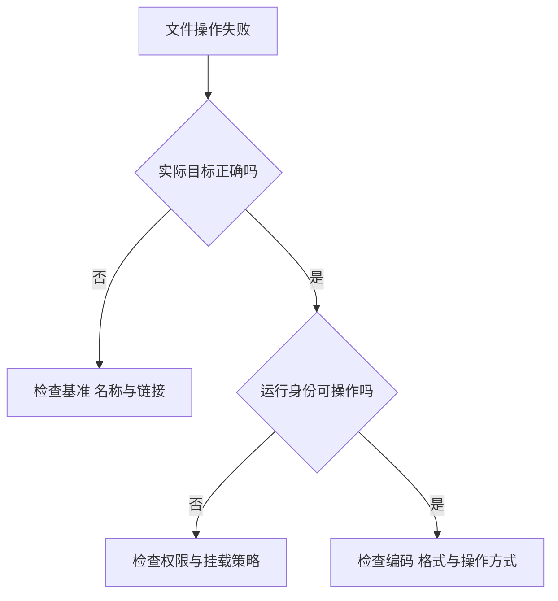

# 文件、路径与权限

> 面向会接触工程文件、配置与导出结果的初学者和协作人员。读完能解释一个路径究竟指向哪里，区分找不到文件、没有权限与编码错误，并理解为什么同一项目换一台机器可能出现不同结果。

## 文件、目录与路径是三种概念

普通文件保存字节，内容可以是源码、图片、配置或名单。文件系统还保存类型、大小、时间、属主等元数据。目录组织名称与对应对象，形成层次结构；路径描述从某个起点逐级寻找对象的路线。

扩展名是命名约定，不保证内容格式。把文本改名为 `.png` 不会使它变成图片；读取配置成功，也不代表其内容符合配置规则。文件是否可读、字节如何解码、解码后能否解析，需要分别判断。

路径也不是永久身份。文件可以被改名或移动，符号链接可以把一个路径指向另一个位置，目录挂载也可能改变路径看到的内容。排障时应核对实际对象，不能只看名称相似。

```text
registration/
├── config/
│   └── rules.json
├── src/
│   └── server.js
└── exports/
    └── attendees.csv
```

这是说明路径关系的示意目录，文件名与数据均为虚构。工程中的目录角色与配置关系见[工程目录与配置](/software/toolchain/project-structure)。

## 绝对路径、相对路径与工作目录

### 必须知道路径从哪里开始

绝对路径明确给出文件系统中的起点。在 Linux 等系统中，`/srv/registration/config/rules.json` 从进程可见的根目录开始；Windows 常见形式为 `C:\registration\config\rules.json`，网络共享还可以使用 UNC 路径，例如 `\\server\share\rules.json`。不同系统的分隔符、保留名称和命名空间规则不能直接照搬。[Linux 路径解析](https://man7.org/linux/man-pages/man7/path_resolution.7.html) · [Windows 命名规则](https://learn.microsoft.com/en-us/windows/win32/fileio/naming-a-file)

相对路径需要一个基准。`.` 表示该基准位置，`..` 表示父目录，但“相对”不意味着一定相对于源码文件。普通文件读取、模块引用、网页资源与工具配置，可能采用不同的基准规则。

**工作目录**是进程当前用来解析某些相对路径的位置，不等于源码所在目录，也不一定等于编辑器打开的项目目录。Node.js 的普通字符串文件路径以 `process.cwd()` 为基准；某些工具会自行调整工作目录，另一些 API 则允许显式指定基准。[Node.js 文件路径](https://nodejs.org/api/fs.html#file-paths) · [process.cwd](https://nodejs.org/api/process.html#processcwd)

假设工程位于 `/srv/registration`，Node.js 读取的是 `config/rules.json`：

| 进程工作目录 | 普通文件读取所指向的位置 | 判断 |
| --- | --- | --- |
| `/srv/registration` | `/srv/registration/config/rules.json` | 与示意目录一致 |
| `/srv` | `/srv/config/rules.json` | 指向另一处，不会自动寻找工程目录 |
| `/srv/registration/src` | `/srv/registration/src/config/rules.json` | 路径相同，结果仍不同 |

绝对路径也只能消除基准歧义，不能保证在另一台机器存在。容器、沙箱或挂载环境可能让同一个绝对路径看到不同内容。因此应把“目标环境中可见的路径”纳入配置说明。

### 按用途选择基准

工程自带、随源码或产物交付的资源，可以按模块或产物位置定位；运行时生成的导出文件，应使用明确配置的输出目录；用户提供的文件，应由产品流程确定访问范围。不要把某位开发者的本机绝对路径固化在共享配置中。

网页地址中的 `/api/events` 属于 URL 路径，通常由服务路由解释，并不等于服务器磁盘上的同名文件。类似地，导出的下载地址也不应直接暴露服务器目录。遇到一个“路径”，先识别它属于文件系统、模块还是网络地址。

## 权限检查的是谁对什么做什么

文件权限约束运行身份可以进行的操作。操作系统核对的是访问文件的进程或线程身份，用户能在编辑器中打开文件，不代表后台服务的身份也有权读取。

在 Linux 常见的基本权限模型中，普通文件与目录各有属主、所属组和其他人的读、写、执行权限。系统按访问身份选择对应类别；额外的访问控制列表（ACL）和安全策略可能继续影响结果。[Linux 路径权限说明](https://man7.org/linux/man-pages/man7/path_resolution.7.html)

| 权限 | 对普通文件的主要含义 | 对目录的主要含义 |
| --- | --- | --- |
| 读 `r` | 读取文件内容 | 列出目录中的名称 |
| 写 `w` | 修改文件内容 | 修改目录项，例如创建或删除名称，通常还需搜索权限 |
| 执行 `x` | 尝试作为程序执行，仍需格式等条件满足 | 搜索或穿过目录，访问已知名称 |

要读取一个深层文件，通常需要沿途目录的搜索权限和目标文件的读取权限。能列出名称，不代表能打开内容；不能列出目录，也不必然意味着无法访问其中一个已知名称。

删除文件主要涉及其父目录中的名称变更，不能仅根据文件的写权限判断。Linux 中还可能受 sticky bit（限制共享目录中删除与改名的特殊标志）、只读文件系统等约束。[Linux unlink 文档](https://man7.org/linux/man-pages/man2/unlink.2.html) · [特殊权限说明](https://man7.org/linux/man-pages/man7/inode.7.html)

Windows 使用安全描述符和 ACL 管理访问，并支持继承规则，不能把 Linux 的三组权限位视为通用模型。排障应读取目标平台的实际权限和运行身份。[Windows 文件访问控制](https://learn.microsoft.com/en-us/windows/win32/fileio/file-security-and-access-rights)

### 文件权限与业务权限分别成立

虚构报名系统的服务可能有权写入 `exports/`，但这只说明该服务身份可以创建文件。管理员能否导出名单、普通报名者能否下载某一份导出，仍由应用核验真实身份和授权。

如果导出目录被直接作为公开静态资源发布，隐藏下载按钮也无法阻止持有地址的人访问。工程建议是将导出文件置于受控位置，经授权接口交付，并限定保存期限与清理方式。路径校验也应考虑 `..`、符号链接和并发变化；字符串看起来位于某个目录内，不足以构成完整的访问隔离。

## 编码、换行与大小写的跨环境差异

### 文件内容必须按约定解码

字符编码规定文字如何映射为字节。UTF-8 很常见，但文件扩展名不会声明其实际编码。生产者用一种编码写入、消费者按另一种编码读取，可能出现乱码、替换字符或解析失败。

Node.js 的文件读取接口在未指定编码时返回字节缓冲区，指定编码后才返回字符串。这提醒我们把“拿到字节”和“得到正确文字”分开。[Node.js 文件读取](https://nodejs.org/api/fs.html#fspromisesreadfilepath-options)

工程建议为源码和文本配置明确约定 UTF-8，外部导入或导出则记录消费者支持的编码、换行和格式要求。LF 与 CRLF 是不同换行表示；BOM 是某些文本开头可能出现的标记。解析器与工具对它们的兼容能力不同，不宜把乱码一律归因于路径或权限。图片等二进制内容不应按文本方式重写。

### 大小写与 Unicode 形式影响名称

`Rules.json` 与 `rules.json` 在某些文件系统上可指向不同文件，在另一些系统上可能被视为同名。名称保留大小写和名称比较是否区分大小写，也是两件事。Windows 的常见默认行为与 Linux 常见文件系统不同，但应检查实际卷与配置，不能仅凭操作系统名称断言。[Windows 命名规则](https://learn.microsoft.com/en-us/windows/win32/fileio/naming-a-file)

Unicode 还允许外观看起来相同的文字由不同序列表示。跨文件系统复制时，名称可能因规范化规则不同而出现匹配差异。Node.js 官方建议保留实际文件名，并了解目标文件系统行为；批量转小写或改写所有名称，可能造成碰撞与数据损失。[不同文件系统的处理](https://nodejs.org/en/learn/manipulating-files/working-with-different-filesystems)

对新建的工程内部文件，可以约定一致的命名方式、精确匹配引用大小写。对用户文件，应保留原始名称并单独设计存储标识与比较规则，避免把内部命名约定强加到用户数据上。

## 用错误信息缩小范围

下图表示排查优先级。最终以实际打开或写入操作的结果为准，预先检查成功后，文件与权限仍可能发生变化。



| 现象或错误 | 优先核对 | 容易做错的处理 |
| --- | --- | --- |
| `ENOENT`：不存在 | 路径各层、工作目录、断开的链接 | 反复安装依赖或扩大权限 |
| `ENOTDIR`：某层不是目录 | 中间路径是否被同名文件替代 | 只检查最后的文件名 |
| `EACCES`：访问被拒绝 | 运行身份、沿途目录、目标操作 | 给整个工程所有人写权限 |
| 本机成功，另一环境找不到 | 名称大小写、挂载与基准 | 把问题归为“系统随机出错” |
| 读到内容但中文乱码 | 写入编码与读取编码 | 更改文件名或强制文本转换二进制文件 |
| 导出覆盖了旧结果 | 命名、并发写入与覆盖策略 | 只确认输出目录可写 |

一份可协作的文件约定至少应说明：文件的角色、路径基准、读写身份、编码与生命周期。它比仅给一个路径字符串更容易复现与验收。

## 参考资料

<Refs>

- [Linux man-pages：path_resolution(7)](https://man7.org/linux/man-pages/man7/path_resolution.7.html)——路径起点、逐级查找、符号链接与搜索权限（访问日期 2026-10-03）
- [Linux man-pages：unlink(2)](https://man7.org/linux/man-pages/man2/unlink.2.html) · [inode(7)](https://man7.org/linux/man-pages/man7/inode.7.html)——删除条件、元数据与特殊权限（访问日期 2026-10-03）
- [Node.js：File system](https://nodejs.org/api/fs.html) · [process.cwd](https://nodejs.org/api/process.html#processcwd)——普通文件路径基准与字节、文本读取（访问日期 2026-10-03）
- [Node.js：How to Work with Different Filesystems](https://nodejs.org/en/learn/manipulating-files/working-with-different-filesystems)——大小写、Unicode 形式及文件系统差异（访问日期 2026-10-03）
- [Microsoft：Naming Files, Paths, and Namespaces](https://learn.microsoft.com/en-us/windows/win32/fileio/naming-a-file) · [File Security and Access Rights](https://learn.microsoft.com/en-us/windows/win32/fileio/file-security-and-access-rights)——Windows 路径与访问控制（访问日期 2026-10-03）
- 站内相关：[从源码到运行中的程序](/software/foundations/source-to-runtime) · [工程目录与配置](/software/toolchain/project-structure) · [文件、目录与仓库导览](/software/guide/files-directories-repositories) · [验收标准](/software/requirements/acceptance-criteria)

- 深入阅读：[环境配置与注入](/software/toolchain/environment-configuration) · [密钥与最小权限](/software/security/secrets-permissions)

</Refs>
