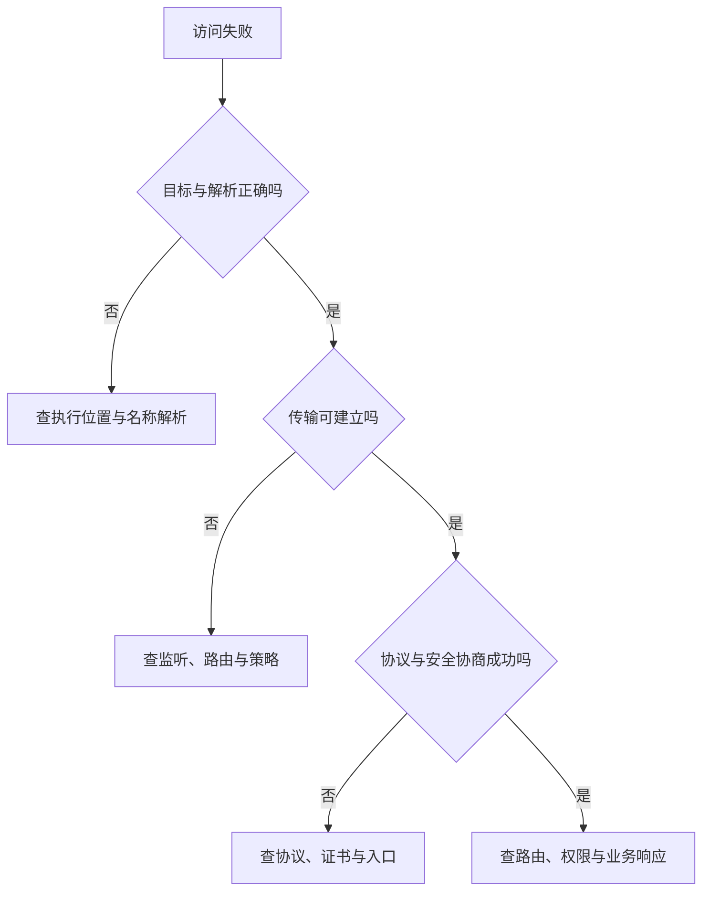

# 网络地址、端口与连接

> 面向需要运行服务、配置接口地址或解释“打不开”的初学者与开发者。读完能分清名称、地址、端口、监听与连接，判断 localhost 究竟指向谁，并按失败发生的层次查证，避免用启动成功代替可访问性验收。

## 一个网址包含不同层次的信息

网络通信需要确定目标和双方约定的协议。**IP 地址**用于 IP 网络中的寻址；**域名**是名称，需要由名称解析机制找到相关记录；**端口**帮助 TCP、UDP 等传输协议区分通信端点。端口是协议中的编号，并非磁盘目录或机器上的实体插口。

考虑虚构活动系统的示意地址：

```text
http://127.0.0.1:3000/api/events?limit=10
```

| 片段 | 回答的问题 | 常见混淆 |
| --- | --- | --- |
| `http` | 使用什么应用协议方案 | 把协议名当成程序名或认证方式 |
| `127.0.0.1` | 请求发往哪个地址 | 把本机地址当作远程服务地址 |
| `3000` | 使用哪个目标端口 | 认为所有开发服务固定使用同一端口 |
| `/api/events` | 服务如何定位资源或路由 | 当作服务器磁盘上的绝对路径 |
| `limit=10` | 传递什么查询信息 | 认为服务必然接受该参数且无需校验 |

HTTP URL 未显式指定端口时通常使用 80，HTTPS 使用 443；显式端口则要核对真实服务配置。IPv6 字面地址放在 URL 中时需用方括号分开地址与端口，例如 `http://[::1]:3000/`。路径和查询怎样解释属于应用契约。[MDN URL 主机与端口](https://developer.mozilla.org/en-US/docs/Web/URI/Reference/Authority)

地址正确不证明身份正确。HTTPS 在 HTTP 通信中加入传输安全机制，但仍需证书验证与应用授权；管理员导出名单的权限不会因改用 HTTPS 自动成立。接口约定见[HTTP、API 与接口契约](/software/backend/http-api-contracts)，线上入口见[域名、DNS、HTTPS 与入口](/software/delivery/dns-https)。

## 名称解析、路由与服务是不同环节

**DNS**是分布式名称系统，保存并解析多种记录。常见 A 记录关联 IPv4 地址，AAAA 记录关联 IPv6 地址。一次名称解析可能给出多个候选地址；结果还可能来自缓存，记录的存活时间 TTL 指示缓存可保留的时间。[RFC 1034](https://www.rfc-editor.org/rfc/rfc1034.html) · [RFC 3596](https://www.rfc-editor.org/rfc/rfc3596.html)

应用可以调用系统名称解析接口，结果也可能受本地配置影响，不应把“名称变成地址”简化为每次都向公网 DNS 发请求。改了权威记录后，不同客户端可能暂时仍使用不同缓存结果；清除某台机器的缓存也不能改变其他观察位置。

得到地址后，还需要可用的路由，把数据送到目标网络；目标环境的防火墙、服务监听和应用协议也要满足。DNS 成功只证明本次解析拿到了结果，不证明目标端口开放。反过来，直接用 IP 成功而用域名失败，也可能涉及 HTTPS 证书或 HTTP 主机选择，不能立即断言唯一原因是 DNS。

本文关注应用接入的定位与排障。子网、路由、NAT 和云网络设计复用[网络基础与云网络](/cloud/infra/network)，无需在本地运行教程中重新展开完整网络架构。

## 监听是等待请求，连接是双方的通信状态

**套接字**（socket）是程序使用操作系统网络能力的接口对象。对 TCP 服务，常见流程是创建套接字、绑定本地地址和端口、进入监听，再接受客户端连接。监听端点可以接受多个连接，它不因服务使用一个端口就只能同时处理一个用户。

TCP 连接由双方端点区分，通常可表示为源地址、源端口、目标地址、目标端口，并在具体网络环境中按传输协议识别。客户端端口通常由系统分配。多个客户端连接同一服务端口时，其源端点不同，连接便可分别管理。[RFC 9293](https://www.rfc-editor.org/rfc/rfc9293.html)

下面是同一机器内的虚构端点关系，不是抓包或实测结果：

```text
连接甲：127.0.0.1:51000 → 127.0.0.1:3000，TCP
连接乙：127.0.0.1:51001 → 127.0.0.1:3000，TCP
```

TCP 向应用提供可靠、有序的字节流，通过序号、确认和重传等机制处理传输问题；它不保留应用每次写入的消息边界，也不证明接收方业务已提交。报名数据发出后发生超时，可能是服务尚未处理，也可能是写入成功后响应丢失。业务重试要靠幂等与可查询状态，不能让传输可靠性代替重复报名约束。

**UDP**传递数据报，本身不承诺可靠交付或有序到达。UDP 的 `connect` 可以设置默认对端及相关接口状态，不等于 TCP 的连接握手。HTTP/3 使用 QUIC，QUIC 建立在 UDP 之上，因此“所有网页请求都建立 TCP 连接”也不准确。本文后续示例按普通 TCP HTTP 服务说明，实际诊断须确认所用传输协议。[Linux UDP](https://man7.org/linux/man-pages/man7/udp.7.html) · [RFC 9114](https://www.rfc-editor.org/rfc/rfc9114.html)

## 绑定地址决定从哪里接入

回环地址把通信留在当前网络环境中。IPv4 常见 `127.0.0.1`，IPv6 为 `::1`；`localhost` 是特殊名称，标准要求相关解析按回环地址处理。它可能得到 IPv4、IPv6 候选，不能保证始终只用 `127.0.0.1`。[RFC 6761](https://www.rfc-editor.org/rfc/rfc6761.html#section-6.3)

服务绑定 `127.0.0.1` 时，面向本机 IPv4 回环接入。Linux 中绑定 `0.0.0.0` 表示接受发往本网络命名空间各本地 IPv4 地址的连接；它是绑定时的通配地址，不应作为分享给其他设备的访问目标。[Linux IP 接口](https://man7.org/linux/man-pages/man7/ip.7.html)

| 监听选择 | 适合的接入范围 | 需要继续核对 |
| --- | --- | --- |
| `127.0.0.1` | 当前环境的 IPv4 回环 | 客户端是否也在同一环境，是否改用 IPv6 |
| `::1` | 当前环境的 IPv6 回环 | 客户端是否能使用 IPv6，以及解析候选 |
| 具体本地地址 | 指定接口地址的接入 | 地址是否仍存在，路由与访问策略 |
| `0.0.0.0` | 所有本地 IPv4 地址 | 可达网络、认证、访问控制和实际暴露面 |
| `::` | IPv6 通配监听 | 是否兼容 IPv4，取决于套接字选项与平台 |

IPv6 通配套接字是否还接收 IPv4 映射地址，受 `IPV6_V6ONLY` 等配置影响，不能跨平台一概断言。Node.js 的 `server.listen` 在省略 `host` 时可监听 `::`，或在 IPv6 不可用时监听 `0.0.0.0`；其他框架可以另外设定默认值。工程建议显式约定接入范围，并读取实际监听结果。[Linux IPv6 选项](https://man7.org/linux/man-pages/man2/IPV6_V6ONLY.2const.html) · [Node.js 监听接口](https://nodejs.org/api/net.html#serverlistenport-host-backlog-callback)

修改监听地址不会自动打开路由或防火墙，也不意味着应把开发服务直接公开。活动系统若仅供本机编辑调试，回环监听即可；若要在同一受控局域网用手机验证，应按该接入需求配置监听和允许来源，并确认接口仍执行权限检查。

### localhost 跟随发请求的一方

手机访问 `localhost:3000`，目标是手机自己的环境；浏览器运行在开发者电脑上时，它也不会因页面来自某台服务器，就把 `localhost` 解释成那台服务器。前端代码中的接口地址由实际执行代码的浏览器发请求。

Linux 的网络命名空间隔离网络设备、路由、端口等资源。容器若处于独立网络命名空间，其回环地址指向该空间；容器内服务的监听与宿主机端口映射是两个配置。不能仅凭“都在同一台物理机器”认为它们的 `localhost` 相通。[Linux 网络命名空间](https://man7.org/linux/man-pages/man7/network_namespaces.7.html)

还要分清请求的执行位置：浏览器中的请求从用户设备发出；服务端渲染或后端任务的请求可能从服务环境发出。同一文本地址在这两个位置可能到达不同对象。配置审查应标明“谁使用此地址”，而非只保存一串 URL。

## 按失败层次排查，避免一次改动全部配置



连接被拒绝、超时和 HTTP 错误提供不同线索，但不是唯一根因。拒绝常见于没有监听或被主动拒绝；超时也可能发生在解析、连接、协商或等待应用响应阶段。错误记录应包含失败阶段与目标，不能仅写“网络坏了”。

以下命令未执行，适用于 Linux/macOS 的 Bash，工作目录不限，需要已安装 `curl`。假定虚构服务已按项目说明启动；该 GET 请求用于查看活动接口的响应头与内容，不包含报名写入：

```bash
curl --noproxy '*' --max-time 5 -i 'http://127.0.0.1:3000/api/events'
```

这里 `--noproxy '*'` 避免此示例经过代理，`--max-time 5` 为本次传输设置 5 秒上限，`-i` 包含响应头。5 秒是示意诊断预算，不能当作生产性能标准。默认情况下收到 HTTP 404 等响应不一定让 curl 返回失败退出码，仍需阅读状态与响应内容。[curl 手册](https://curl.se/docs/manpage.html)

| 观察结果 | 支持什么判断 | 下一步与边界 |
| --- | --- | --- |
| 名称无法解析 | 此观察位置没拿到可用解析结果 | 查名称、解析配置与缓存；不能推断服务已停 |
| TCP 连接被拒绝 | 本次传输建立失败 | 查实际监听端点与拒绝策略 |
| 达到超时 | 预算内没完成指定操作 | 区分解析、连接、协议协商和响应等待 |
| HTTP 404 | 至少得到一个 HTTP 响应 | 核对入口、路径和方法，可能到达了错误服务 |
| HTTP 401 或 403 | 响应方在认证或授权层拒绝 | 查身份和权限，不把它归为端口未开放 |
| 命令行成功，浏览器读不到 | 工具间环境或策略不同 | 查真实地址、代理、证书及同源/CORS 行为 |
| 本机成功，手机失败 | 两个观察位置不同 | 查回环绑定、设备地址、路由和访问策略 |

浏览器的**源**通常由方案、主机、端口共同确定；不同端口也可以构成跨源。跨源资源共享 CORS 控制浏览器脚本读取跨源响应的权限，它既不替代服务端身份授权，也不能证明传输失败；某些情况下请求已经到达服务，脚本却无法读取响应。[MDN 同源策略](https://developer.mozilla.org/en-US/docs/Web/Security/Defenses/Same-origin_policy)

可访问性验收应保存请求发出位置、目标 URL、实际监听范围、协议、身份以及观察结果。然后分别验收活动列表、容量边界和管理员导出，避免一个“端口可连”结论遮住应用层错误。

## 参考资料

<Refs>

- [RFC 1034：Domain Names — Concepts and Facilities](https://www.rfc-editor.org/rfc/rfc1034.html) · [RFC 3596：DNS Extensions to Support IP Version 6](https://www.rfc-editor.org/rfc/rfc3596.html)——名称解析、缓存和地址记录（访问日期 2026-10-03）
- [RFC 6761：Special-Use Domain Names，6.3](https://www.rfc-editor.org/rfc/rfc6761.html#section-6.3)——localhost 的特殊用途（访问日期 2026-10-03）
- [RFC 9293：Transmission Control Protocol](https://www.rfc-editor.org/rfc/rfc9293.html) · [Linux man-pages：udp(7)](https://man7.org/linux/man-pages/man7/udp.7.html) · [RFC 9114：HTTP/3](https://www.rfc-editor.org/rfc/rfc9114.html)——连接、字节流与传输协议边界（访问日期 2026-10-03）
- [Linux man-pages：ip(7)](https://man7.org/linux/man-pages/man7/ip.7.html) · [IPV6_V6ONLY(2const)](https://man7.org/linux/man-pages/man2/IPV6_V6ONLY.2const.html) · [network_namespaces(7)](https://man7.org/linux/man-pages/man7/network_namespaces.7.html)——绑定范围、双栈与隔离（访问日期 2026-10-03）
- [Node.js：server.listen](https://nodejs.org/api/net.html#serverlistenport-host-backlog-callback)——主机省略时的监听行为；不推广为所有框架的默认值（访问日期 2026-10-03）
- [MDN：URI authority](https://developer.mozilla.org/en-US/docs/Web/URI/Reference/Authority) · [HTTPS](https://developer.mozilla.org/en-US/docs/Glossary/HTTPS) · [Same-origin policy](https://developer.mozilla.org/en-US/docs/Web/Security/Defenses/Same-origin_policy)——URL、传输安全与浏览器读取边界（访问日期 2026-10-03）
- [curl：How To Use](https://curl.se/docs/manpage.html)——示例选项与响应、退出状态的区别（访问日期 2026-10-03）
- 站内相关：[在本地运行项目](/software/guide/running-locally) · [终端、Shell 与命令行](/software/foundations/terminal-shell) · [HTTP、API 与接口契约](/software/backend/http-api-contracts) · [域名、DNS、HTTPS 与入口](/software/delivery/dns-https) · [消息、任务、调度与幂等](/software/backend/messages-jobs-idempotency) · [网络基础与云网络](/cloud/infra/network)

</Refs>
