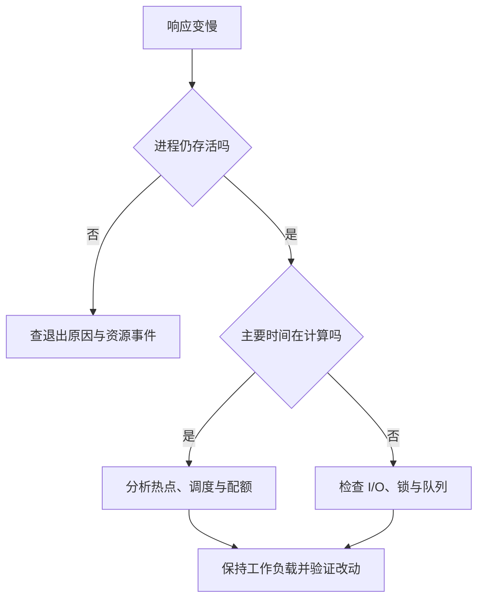

# 操作系统、进程线程与内存

> 面向希望理解软件为何变慢、占内存或突然退出的开发者与项目接管者。读完能分清进程、线程、运行时任务和内存指标，沿着执行、等待、资源限制三条线寻找证据，并判断增加线程或重启是否解决了问题。

本文活动系统与耗时数字均用于机制示意，未执行服务启动、资源采样或性能测试，不代表本仓库的实测行为。

## 操作系统提供资源，也划出边界

操作系统管理处理器、内存、文件与设备，把这些资源以受控接口提供给程序。**内核**是其中负责核心资源管理与保护的软件部分。应用通过系统调用请求文件读取、网络通信等操作；请求可以因权限不足、资源耗尽或参数错误失败，程序不能把“发出了请求”等同于“操作成功”。

这层边界带来两种价值：多个程序可以共享一台机器，一个程序通常也不能直接任意读取另一个程序的私有内存。隔离不意味着完全互不影响：它们仍可能竞争处理器时间、物理内存或存储吞吐。读懂系统需要同时看“属于谁”和“争用什么”。

源码和可执行文件保存程序描述，**进程**是一次执行所拥有的地址空间、身份及资源集合；**线程**是进程内的一条执行序列，具有自己的执行位置与栈。Windows 文档也用独立虚拟地址空间、资源与至少一个线程描述进程。文件成为运行实例的链路见[从源码到运行中的程序](/software/foundations/source-to-runtime)。[Microsoft 进程与线程](https://learn.microsoft.com/en-us/windows/win32/procthread/about-processes-and-threads)

## 进程、线程与任务不是一一对应

同一进程内的线程通常共享堆、全局数据和打开的文件等资源，各自保存调用栈及执行状态。POSIX 线程还共享工作目录；因此一个线程改变工作目录，可能影响另一个线程的相对路径访问。线程自己的栈也不意味着其中对象永远不可被别的线程引用，是否共享还取决于程序如何传递地址与引用。[Linux Pthreads](https://man7.org/linux/man-pages/man7/pthreads.7.html)

两个独立进程通常拥有各自的私有地址空间。同一数值的虚拟地址可能对应不同内容；进程间共享状态需要显式机制，例如共享内存、管道或网络通信。Linux 的共享内存映射可以让多个进程看见同一片存储，但同步与数据一致性仍须另行设计。[Linux mmap](https://man7.org/linux/man-pages/man2/mmap.2.html)

| 组织方式 | 状态关系 | 选择时承担的代价 |
| --- | --- | --- |
| 一个进程中的多个线程 | 通常直接共享进程数据 | 必须保护共同状态；故障可能影响整个进程 |
| 多个独立进程 | 私有内存通常互不直接可见 | 通信、复制数据、额外运行资源与实例管理 |
| 运行时任务、协程或回调 | 由运行时安排到一个或多个线程上 | 任务很多不代表处理器同时执行很多工作 |

**并发**表示多个工作在时间上交错推进；**并行**表示多个工作在同一时刻实际执行。一个处理器执行单元可以交错处理许多任务，但不能因此产生额外计算能力。协程和异步函数属于语言或运行时的组织方式，不应直接按其数量推断操作系统线程数。具体语言机制见[异步、并发同步与取消](/software/programming/async-concurrency)。

虚构活动系统若启动两个服务实例，实例甲内存中记下“活动还剩 1 个名额”，不会自动更新实例乙的变量。把服务扩为多个进程可以提高隔离和利用多个核，也会暴露原先藏在单实例内的状态问题。容量与去重应落到共同的数据写入边界，见[事务、并发与索引的应用选择](/software/data/transactions-indexes)。

## 程序慢，先区分计算与等待

调度器决定下一个由处理器执行的可运行线程。线程可能已经具备继续执行的条件，但在等待调度；也可能因等待文件、网络或锁而暂时无法继续。切换执行对象需要保存与恢复状态，还会影响缓存；盲目增加线程可能扩大争用。[Linux 调度](https://man7.org/linux/man-pages/man7/sched.7.html)

排障时可把墙上经过的时间与实际处理器时间分开。一个操作耗时 2 秒，并不表示处理器为它计算了 2 秒：时间可能花在排队、锁等待、数据库响应或网络重试上。反过来，多线程任务的处理器时间之和可能超过墙上时间，因为多个线程同时在计算。判断指标须说明统计对象、时间窗以及是否按单核归一化。

Node.js 展示了这一区别：普通 JavaScript 回调在对应事件循环线程上执行，一些文件、密码学等操作可由工作线程池处理，网络 I/O 也可以通过操作系统的非阻塞机制等待。给一个长循环套上 `async`，不会自动把循环移到其他线程；它仍可能推迟其他回调。将计算转交工作线程或进程，还要计入通信与调度成本。[Node.js 阻塞说明](https://nodejs.org/en/learn/asynchronous-work/dont-block-the-event-loop)

以下分流图表达排查顺序。多个原因可以同时存在，图中的“检查”是收集证据，不能仅凭一项指标定案。

## 虚拟内存、堆与常驻内存分别说明什么

**虚拟内存**让进程以自己的地址空间访问存储，由操作系统和硬件建立映射。地址空间中的区域可以用于代码、线程栈、堆、文件映射等。预留或映射了多大区域，与此刻占用了多少物理内存不是同一个问题。

栈保存函数调用相关的执行信息；堆用于更灵活的动态分配。具体对象放在哪里由语言、编译器与运行时决定，不能把“局部变量全部在栈上、对象全部在堆上”当成跨语言规律。常见的垃圾回收机制按对象是否仍可达判断回收资格；程序持续保存可达的强引用时，回收器不会替业务决定删除对象。打开的连接与文件也不应仅靠内存回收来管理。[MDN 内存管理](https://developer.mozilla.org/en-US/docs/Web/JavaScript/Guide/Memory_management)

| 指标或对象 | 能帮助回答 | 不能单独证明 |
| --- | --- | --- |
| 虚拟地址空间大小 | 进程映射或预留了多少地址空间 | 实际使用了同样多的物理内存 |
| RSS：常驻集大小 | 当前驻留在物理内存中的映射规模 | 全部是此进程独占，或全是语言堆 |
| PSS：比例分摊的常驻大小 | 将共享页按共享者分摊后的规模 | 与容器完整计费口径完全相同 |
| 语言堆用量 | 该运行时管理的堆对象规模 | 原生库、线程栈、映射和系统缓冲都已计入 |
| 队列长度与连接数 | 是否持续积压未完成工作 | 积压一定由内存泄漏造成 |

Linux `/proc` 的 `status` 提供虚拟内存、RSS 等摘要，但文档明确提示部分数值是近似统计；`smaps` 按映射给出更细的 RSS、PSS 等数据。简单相加多个进程的 RSS，可能重复计算共享页。[进程状态字段](https://man7.org/linux/man-pages/man5/proc_pid_status.5.html) · [内存映射统计](https://man7.org/linux/man-pages/man5/proc_pid_smaps.5.html)

以导出名单为例，一次把所有记录读入内存、复制为对象、再拼成完整 CSV，可能同时保留数份表示。分页或流式写入可降低峰值，但要处理背压，即下游较慢时让上游停止继续堆积。是否存在泄漏，应观察相同工作负载下对象、队列和常驻内存的变化，并解释增长是否会稳定；一次峰值不能定案。资源生命周期见[错误、异常与资源管理](/software/programming/errors-resource-management)。

## 机器还有资源，进程为何仍被限制

运行环境可以为一组进程设置资源边界。Linux cgroup v2 的 `cpu.max` 约束一段周期内可消耗的处理器时间；`memory.high` 施加内存回收压力，`memory.max` 在达到上限且无法回收时可能触发组内的 OOM 处理。**OOM**是内存不足情形，系统可能结束某个进程释放资源。[Linux cgroup v2](https://docs.kernel.org/admin-guide/cgroup-v2.html)

因此宿主机平均 CPU 较低，不排除应用用完自己的配额；机器还有空闲内存，也不排除容器触及限制。运行时自己的堆上限又是另一层边界。工程建议同时记录实例配额、运行时限制及实际资源事件，避免只看主机总量。

| 决策 | 有效前提 | 验证证据与边界 |
| --- | --- | --- |
| 增加线程或计算工作者 | 存在可并行计算，且有可用处理器资源 | 比较吞吐、尾延迟与同步成本；不得破坏正确性 |
| 增加服务实例 | 工作可分配，状态有明确共同归属 | 验证实例间容量、会话和去重，不只测单实例 |
| 提高内存限制 | 峰值合理且当前确受限制 | 同时检查队列与对象是否无界增长 |
| 减少同时处理的任务 | 下游容量有限，积压导致资源放大 | 观察排队时间、拒绝策略和总完成量 |
| 重启 | 需要恢复可用性，退出行为已受控 | 保留诊断证据；重启后的恢复不证明根因消失 |

## 退出与清理也属于程序行为

进程正常退出、因异常终止、收到终止信号和被资源管理机制结束，是不同原因。Linux 的 `SIGTERM` 可由程序处理以尝试有序停止；`SIGKILL` 不能被捕获、阻塞或忽略，因而不能依赖它触发应用清理。[Linux 信号](https://man7.org/linux/man-pages/man7/signal.7.html)

有序停止通常包括停止接收新工作、给在途任务限定等待时间、关闭资源，并留下可辨识的退出记录。任务是否已写入持久化数据，需要由业务协议判断；进程退出不自动撤销数据库中已提交的报名。操作系统回收进程资源，也不等于应用完成对账或删除临时产物。

| 现象 | 容易混淆的原因 | 应保留的证据 |
| --- | --- | --- |
| CPU 很低但请求卡住 | I/O 等待、锁、限流或排队 | 请求阶段耗时、线程栈、下游状态与配额 |
| 加线程以后更慢 | 共享锁、切换、内存或下游争用 | 工作负载、队列、热点和争用变化 |
| 内存增长后骤降 | 回收、缓存淘汰或进程重启 | 实例身份、堆与 RSS 时间序列、退出事件 |
| 多实例报名超额 | 私有内存被当作全局约束 | 共同存储的约束与并发写入记录 |
| 子进程结束却留下僵尸状态 | 父进程尚未收取退出状态 | 父子关系与等待逻辑；僵尸不再执行业务代码 |

最后一项在 Linux 中对应父进程未通过等待接口收取子进程状态：保留的是有限的退出信息，不能把它当成仍在计算的进程。[Linux wait](https://man7.org/linux/man-pages/man2/wait.2.html)

## 参考资料

<Refs>

- [Microsoft：About Processes and Threads](https://learn.microsoft.com/en-us/windows/win32/procthread/about-processes-and-threads)——进程资源、地址空间与线程定义（访问日期 2026-10-03）
- [Linux man-pages：pthreads(7)](https://man7.org/linux/man-pages/man7/pthreads.7.html) · [sched(7)](https://man7.org/linux/man-pages/man7/sched.7.html)——线程共享属性及调度对象（访问日期 2026-10-03）
- [Linux man-pages：mmap(2)](https://man7.org/linux/man-pages/man2/mmap.2.html) · [proc_pid_status(5)](https://man7.org/linux/man-pages/man5/proc_pid_status.5.html) · [proc_pid_smaps(5)](https://man7.org/linux/man-pages/man5/proc_pid_smaps.5.html)——映射与内存统计口径（访问日期 2026-10-03）
- [MDN：Memory management](https://developer.mozilla.org/en-US/docs/Web/JavaScript/Guide/Memory_management)——自动回收、引用与资源生命周期的边界（访问日期 2026-10-03）
- [Linux Kernel：Control Group v2](https://docs.kernel.org/admin-guide/cgroup-v2.html)——CPU 时间配额、内存压力与上限（访问日期 2026-10-03）
- [Node.js：Don't Block the Event Loop](https://nodejs.org/en/learn/asynchronous-work/dont-block-the-event-loop)——事件循环、工作线程池及计算任务边界（访问日期 2026-10-03）
- [Linux man-pages：signal(7)](https://man7.org/linux/man-pages/man7/signal.7.html) · [wait(2)](https://man7.org/linux/man-pages/man2/wait.2.html)——终止信号与子进程退出状态（访问日期 2026-10-03）
- 站内相关：[看懂软件项目全景](/software/guide/software-project-overview) · [从源码到运行中的程序](/software/foundations/source-to-runtime) · [异步、并发同步与取消](/software/programming/async-concurrency) · [错误、异常与资源管理](/software/programming/errors-resource-management) · [工程数学与度量基础](/software/foundations/engineering-math-measurement) · [性能分析、容量、弹性与成本](/software/operations/capacity-performance-cost)

</Refs>
