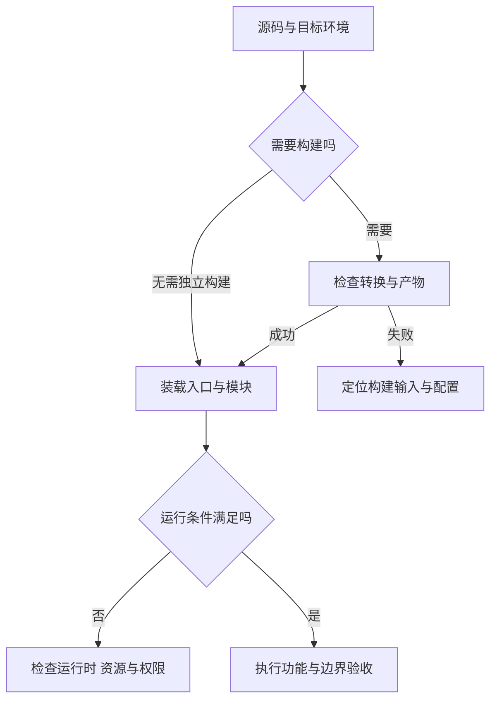

# 从源码到运行中的程序

> 面向需要读懂软件交付过程的初学者、产品人员和开发者。读完能分清源码、构建产物、运行时与进程，判断“构建成功”“服务启动”和“功能正确”各自证明了什么，并沿着执行链定位问题。

## 文件如何成为行为

源码是以编程语言表达的指令，通常保存在文本文件中。文件可以被复制、比较和保存，但磁盘上存在一个 `server.js`，不意味着系统正在接收请求。需要某个执行入口读取它，在合适的环境中解释或编译，再让处理器执行对应的机器指令。

运行中的程序具有不断变化的状态：当前处理的请求、已分配的内存、打开的文件、网络连接。操作系统通常以**进程**管理这些资源，以线程作为调度执行的单位。同一份代码可以运行多个实例，它们的内存状态通常相互独立；一个实例退出，也不会把磁盘上的源码一并删除。

理解这一区别直接影响交付判断：代码已保存，不等于正在运行；文件已上传，不等于新版本已装载；服务启动，不等于用户能够访问它。工程中需要明确“运行的是哪份产物、哪个入口、哪种环境”。

| 对象 | 它保存或负责什么 | 应核对的证据 |
| --- | --- | --- |
| 源码 | 人可修改的逻辑、类型、模块引用 | 版本标识、实际修改的文件 |
| 构建产物 | 转换、组合或打包后的交付文件 | 产物内容、构建记录、目标平台 |
| 运行时 | 执行语言与访问环境所需的软件能力 | 实际版本、可用接口、启动配置 |
| 进程 | 一次运行的内存与资源状态 | 启动入口、运行身份、日志、存活状态 |
| 外部资源 | 文件、网络服务、持久化数据等 | 路径、地址、权限、可用性 |

运行时一词有不同粒度：有时指语言虚拟机，有时指包含标准库和宿主接口的完整环境。讨论故障时应说明具体范围，避免把“装了 Node.js”当成所有依赖和配置都已满足。

## 编译、解释与构建的关系

### 编译是在转换表示

编译器把一种程序表示转换成另一种表示，目标可能是机器码、字节码，也可能是另一种语言的源码。机器码是处理器能够执行的指令；字节码是由特定虚拟机或解释器执行的中间指令。二者不能仅凭文件扩展名判断。

以 GCC 处理 C/C++ 为例，典型链路包含预处理、编译、汇编、链接。预处理展开宏与包含内容；编译转换语言表示；汇编产生目标文件；链接把目标文件和所需库组合，处理彼此引用。工具可以只完成部分阶段，因此“生成了一个目标文件”还不等于“生成了可启动程序”。[GCC 输出阶段文档](https://gcc.gnu.org/onlinedocs/gcc/Overall-Options.html)

**构建**是更大的工程流程，可能还包括类型检查、资源复制、代码生成、模块打包与压缩。构建脚本决定实际执行哪些步骤，并非所有项目都需要一个单独的编译命令，也并非所有构建都会运行测试。测试是否包含在构建中，应查项目配置。

### 解释与即时编译可以同时存在

解释器按照程序或中间表示执行操作，不要求事先交付一个独立的原生可执行文件。即时编译（JIT）则在运行期间生成机器码，例如根据运行中收集的信息优化经常执行的代码。

JavaScript 不能简单归类为“逐行读文本、完全不编译”。V8 的官方资料展示了解释器 Ignition 与优化编译器协作的机制：字节码可以成为执行与优化的基础。具体优化层级会随实现和版本变化，语言规范也不要求所有引擎采用相同流水线。[V8 Ignition](https://v8.dev/docs/ignition) · [V8 执行流水线说明](https://v8.dev/blog/launching-ignition-and-turbofan)

由此不能推出“编译型一定快、解释型一定慢”。实际性能还受算法、数据量、网络等待和资源限制影响。工程选择首先要满足目标环境与可维护性，再用实际工作负载验证性能。

## 引擎、宿主与操作系统各做什么

JavaScript 引擎处理语言规则，例如函数调用、对象与表达式。**宿主环境**把语言接到外部世界：浏览器提供页面、事件与 Web 接口，Node.js 提供服务端所需的文件和网络等能力。同一语言可以进入不同宿主，可用接口和安全边界因此不同。[MDN 执行模型](https://developer.mozilla.org/en-US/docs/Web/JavaScript/Reference/Execution_model)

引擎和宿主本身也是程序。操作系统负责装载程序、管理内存、调度线程，并为文件和网络访问提供系统接口；处理器最终执行机器指令。以 Linux 为例，`execve` 将已有进程的程序映像替换为指定程序，成功调用本身不创建新进程。这说明“启动程序”在底层可能由多个步骤协作，不能把源码文件、可执行文件与进程混为一体。[Linux execve 文档](https://man7.org/linux/man-pages/man2/execve.2.html)

下图是一条故障分流路径，不代表每种语言的内部实现都完全相同。

### 浏览器中的执行

浏览器获取 HTML、脚本和样式等资源，把页面内容建立为 DOM（可供程序读取和修改的页面结构），执行脚本并响应用户事件。网页脚本由浏览器管理，其文件与网络访问受浏览器安全模型和用户授权约束，不能默认拥有本机任意文件的访问权。

前端构建产物可能是 HTML、CSS 和 JavaScript 文件，交付后仍需浏览器执行。打包工具运行成功，只说明配置所要求的转换完成；脚本地址错误、资源未发布或浏览器不支持所用接口，仍会导致页面失败。

### Node.js 中的执行

Node.js 把 V8 放在浏览器之外，并提供自己的标准库与异步 I/O 能力。代码通常从配置指定的入口加载模块、初始化资源并开始工作。浏览器的 `document`、`window` 不会因此自动出现在 Node.js 中，Node.js 的文件系统模块也不是普通网页脚本的接口。[Node.js 简介](https://nodejs.org/en/learn/getting-started/introduction-to-nodejs) · [宿主环境差异](https://nodejs.org/en/learn/getting-started/differences-between-nodejs-and-the-browser)

事件循环使程序能组织异步任务，等待 I/O 时继续处理其他工作。它不等于所有业务操作都自动并行，也不替业务实现去重或容量控制。耗时的同步计算会占用执行时间，进而影响其他任务的响应。

## 从交付过程判断缺了哪一层证据

在虚构的小型活动报名系统中，浏览器显示活动详情并提交报名请求，服务端核对身份、活动容量和已有报名，再保存结果。前端禁用按钮可以改善体验，真正的重复报名与容量约束仍要在服务端及数据写入边界成立。持久化机制可继续阅读[数据库与数据模型](/cloud/data/database)。

| 已观察到的结果 | 可以支持的判断 | 仍需验证的事情 |
| --- | --- | --- |
| 构建命令成功退出 | 被配置的构建步骤完成 | 容量规则、权限和用户流程是否正确 |
| 服务进程存活 | 程序尚未退出 | 监听地址、资源连接和接口是否可用 |
| 页面可以打开 | 本次页面资源能够展示 | 报名请求是否到达正确服务 |
| 一次报名成功 | 某个输入与状态下流程成功 | 满额、重复提交、取消后再报名 |
| 测试全部通过 | 所执行的样本满足断言 | 未覆盖输入与目标环境中的差异 |

以上是证据层级，不能互相代替。功能验收需要把预期写成可检查的条件，见[验收标准](/software/requirements/acceptance-criteria)。发布记录还应关联源码版本、产物与实际运行实例，避免用户访问旧版本，而开发者只检查新源码。

## 常见失败模式

| 现象 | 可能的边界错误 | 排查方向 |
| --- | --- | --- |
| 改文件后行为没变 | 运行进程尚未重新装载，或修改了另一份源码 | 对照运行入口、产物版本与装载方式 |
| 本机能跑，目标环境失败 | 运行时接口、模块规则或平台不同 | 核对实际版本、启动配置与依赖 |
| 构建成功，网页空白 | 运行时异常或资源路径错误 | 查看浏览器加载结果与执行错误 |
| 服务启动，报名仍失败 | 数据、网络、权限或规则未满足 | 沿请求链核对资源与业务状态 |
| 重启后报名名单消失 | 把进程内存当成持久化存储 | 明确状态归属与恢复方式 |
| 单次测试正确，并发时超额 | 多次操作交错，约束未覆盖共同写入边界 | 设计容量与去重的并发验收 |

某些开发工具会监听文件并热更新，但这是工具提供的额外机制。是否重建、重新装载模块或重启进程，应查实际配置；它不能作为生产运行的默认假设。

## 参考资料

<Refs>

- [GCC：Options Controlling the Kind of Output](https://gcc.gnu.org/onlinedocs/gcc/Overall-Options.html)——预处理、编译、汇编与链接的阶段边界（访问日期 2026-10-03）
- [MDN：JavaScript execution model](https://developer.mozilla.org/en-US/docs/Web/JavaScript/Reference/Execution_model)——引擎、宿主、执行上下文与任务组织（访问日期 2026-10-03）
- [V8：Ignition](https://v8.dev/docs/ignition) · [Launching Ignition and TurboFan](https://v8.dev/blog/launching-ignition-and-turbofan)——解释与优化编译协作；后一篇为机制的历史说明（访问日期 2026-10-03）
- [Node.js：Introduction to Node.js](https://nodejs.org/en/learn/getting-started/introduction-to-nodejs) · [Differences between Node.js and the Browser](https://nodejs.org/en/learn/getting-started/differences-between-nodejs-and-the-browser)——运行环境与接口差异（访问日期 2026-10-03）
- [Linux man-pages：execve(2)](https://man7.org/linux/man-pages/man2/execve.2.html)——程序装载与进程映像替换（访问日期 2026-10-03）
- 站内相关：[文件、路径与权限](/software/foundations/files-paths-permissions) · [工程目录与配置](/software/toolchain/project-structure) · [依赖与锁文件](/software/toolchain/dependencies-lockfiles) · [验收标准](/software/requirements/acceptance-criteria)

- 深入阅读：[操作系统、进程与内存](/software/foundations/operating-systems-processes-memory) · [语言与运行时选型](/software/programming/languages-runtimes) · [构建制品](/software/toolchain/build-artifacts)

</Refs>
