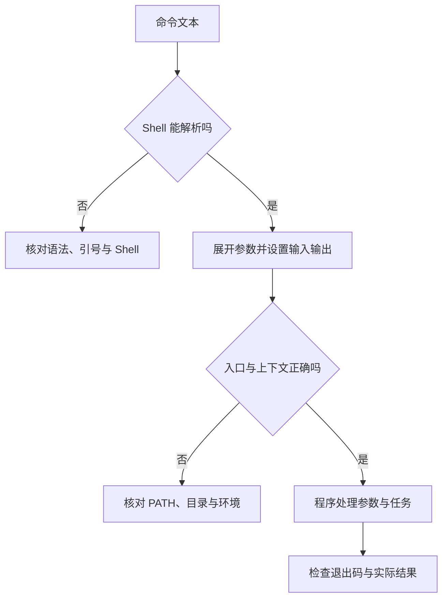

# 终端、Shell 与命令行

> 面向需要运行项目命令、读懂错误或审查 AI 给出的脚本的初学者。读完能拆解一条命令的执行对象、参数、上下文与副作用，区分 Shell 解析错误和程序报错，并知道哪些语法必须按平台重新核对。

## 三个经常被混用的名称

**终端**提供文字输入与输出的交互界面，现代桌面上常见的是终端模拟器。**Shell**是读取、解释并执行命令的程序，例如 Bash、Zsh 和 PowerShell。**命令行接口**（CLI）是程序接受命令与参数、输出结果的交互约定，例如 Git 的子命令接口。

终端可以容纳不同 Shell；Shell 又可以启动许多 CLI 程序。Windows Terminal 官方文档把它描述为可承载 PowerShell、命令提示符等命令行环境的终端应用。这也意味着换终端窗口样式不会自动换掉命令语法。[Windows Terminal 概览](https://learn.microsoft.com/en-us/windows/terminal/)

当输入被交给 `node` 后，终端主要展示程序输出；当 Node.js 退出，Shell 才再次接收下一条命令。提示符里的用户名、路径和 `$` 或 `>` 通常是界面提示，不属于待复制的命令。某些文档的 `$` 只是普通用户提示符约定，不能据此断言当前 Shell。

本文用 Bash 解释机制，用 PowerShell 对照差异。示例不要求全站采用这些工具，也不意味着 Zsh、`sh` 或 Windows 命令提示符行为相同。在 IDE 内嵌终端中，仍需确认实际启动的 Shell、当前目录和运行身份。

## 输入的文字经过两层解释

Bash 会把输入拆为词和操作符，处理引号与展开，设置重定向，再执行命令、收取退出状态。程序接收到的是处理后的参数，而不是用户敲下的整行原文。[Bash 运行步骤](https://www.gnu.org/software/bash/manual/html_node/Shell-Operation.html)

以下全部是未执行的示意，适用于 Linux 或 macOS 中的 Bash。假定工作目录为虚构的 `/srv/registration`，文件和脚本仅用于解释语法，不能直接作为本仓库的运行步骤。

```bash
node './scripts/check-config.js' --config './config/dev settings.json'
```

| 部分 | 由谁解释 | 含义 |
| --- | --- | --- |
| `node` | Shell 查找，然后操作系统装载 | 执行入口；应确认命中了哪一个程序 |
| `./scripts/check-config.js` | Node.js | 此处假定是待执行脚本路径 |
| `--config` | 示例脚本的参数解析逻辑 | 并非所有程序都支持这个选项 |
| `./config/dev settings.json` | 脚本及其文件读取接口 | 引号使带空格的路径作为一个参数传入 |

CLI 参数的长短名称、是否接受 `--`、默认值和退出码由程序定义。`--config` 不是 Shell 的通用功能。错误若发生在执行前，目标程序可能根本没有启动；若是“未知选项”，则应查实际程序的接口，而不是不断更换引号。



## 引号改变 Shell 的解释方式

在 Bash 中，单引号通常把其中字符按字面保留；双引号保留参数整体，同时仍允许变量展开和命令替换等机制。引号不是一概“加上就安全”的标记，它决定哪些字符继续参与解释。[单引号](https://www.gnu.org/software/bash/manual/html_node/Single-Quotes.html) · [双引号](https://www.gnu.org/s/bash/manual/html_node/Double-Quotes.html)

下面仍是未执行的 Bash 示意，工作目录不限，不依赖项目文件：

```bash
APP_MODE=development
printf '%s\n' '$APP_MODE'
printf '%s\n' "$APP_MODE"
```

按上述规则，第二行的参数是字面文字 `$APP_MODE`，第三行的参数是变量值 `development`。这是语义推导，没有附带实测输出。Bash 中未加适当引号的展开还可能发生分词或文件名匹配；一个原本应为单一文件名的值，可能变成多个参数。Zsh 对某些展开的默认行为不同，脚本迁移时应查其[展开规则](https://zsh.sourceforge.io/Doc/Release/Expansion.html)。

**命令替换**会先执行一段命令，再把输出用于外层命令，例如 Bash 的 `$(...)`。即使它位于双引号中，执行也不会被取消。因此审查命令应查看整条表达式里的嵌套执行，不能只看最左边的程序名。路径或用户输入若来自外部，工程建议优先通过程序 API 的独立参数列表传递，避免拼成一段需要再次解释的 Shell 文本。

PowerShell 有表达式模式和参数模式，参数中的变量、括号及特殊字符也受其解析规则影响。它的转义机制和原生程序参数传递方式与 Bash 不同；把 Bash 的反斜杠续行照搬过去，不能保证得到同样结果。[PowerShell 解析规则](https://learn.microsoft.com/en-us/powershell/module/microsoft.powershell.core/about/about_parsing)

## 命令的上下文决定实际行为

### 入口查找与工作目录

Bash 遇到没有斜杠的命令名，会考虑函数、内建命令和 `PATH` 中的可执行程序。**PATH**是程序搜索目录的列表；同名命令可能因其顺序、函数或缓存而指向不同对象。命令名含路径时，则按给定路径寻找入口。[Bash 命令查找](https://www.gnu.org/software/bash/manual/html_node/Command-Search-and-Execution.html)

工作目录决定普通相对文件路径的基准，但程序还可能自行规定配置或模块路径的解析方式。`cd` 是 Shell 内建命令，改变的是当前 Shell 的目录；一个子进程改变自己的目录，不能自动改变父 Shell。路径权限和编码细节见[文件、路径与权限](/software/foundations/files-paths-permissions)。

运行 `bash ./scripts/setup.sh` 与 `source ./scripts/setup.sh` 也有不同边界：前者启动另一个 Bash，后者在当前 Shell 上下文执行脚本，可能持久改变变量、目录或函数。是否需要这种改变，应由项目说明决定；`source` 不是读取文档的命令。[Bash 内建命令](https://www.gnu.org/software/bash/manual/html_node/Bourne-Shell-Builtins.html)

### 环境由进程继承

**环境变量**是随进程启动传入的名称和值。Bash 的普通变量不一定导出给子进程，`export` 可以标记导出；在外部命令前写变量赋值，可为该次调用提供环境。已启动的程序不会因父 Shell 后来改值而自动更新。[Bash 环境](https://www.gnu.org/software/bash/manual/html_node/Environment.html)

因此在一个窗口里设置配置，另一个窗口或后台服务未必得到同样的值；编辑器启动的任务也可能拥有不同环境。`.env` 是常见的配置文件约定，是否读取、何时读取与覆盖顺序由具体工具实现，Shell 不会因文件名自动载入它。项目配置与密钥处理见[开发环境、环境变量与配置注入](/software/toolchain/environment-configuration)。

## 输入输出是数据流，退出码是控制信号

在常见 Unix 模型中，标准输入、标准输出、标准错误分别对应文件描述符 0、1、2。重定向改变这些通道连接到哪里。Bash 的 `>` 通常创建或截断文件，`>>` 追加；重定向先后顺序有意义，不能仅凭命令文本中有“日志文件”就认为所有输出都被收集。[Bash 重定向](https://www.gnu.org/s/bash/manual/html_node/Redirections.html)

以下是未执行示意，适用于 Linux/macOS 的 Bash，工作目录为 `/srv/registration`，假定 `tmp` 目录已存在。它会执行虚构检查脚本并写日志，若同名日志存在会覆盖其原内容：

```bash
node './scripts/check-config.js' > './tmp/check.stdout.log' 2> './tmp/check.stderr.log'
```

标准错误有时包含诊断或进度，不等于每行都是失败；标准输出出现“成功”文字，也不能代替对退出码与目标产物的核对。把诊断与机器读取的数据混在同一通道，会使后续解析不稳定。

**管道**用 `|` 连接前一个命令的输出与后一个命令的输入。Bash 常见管道传递字节流，后续程序自行解析。PowerShell 命令之间通常传递对象，筛选属性和解析文本是不同操作；调用原生程序时还要按其边界核对。[Bash 管道](https://www.gnu.org/software/bash/manual/html_node/Pipelines) · [PowerShell 管道](https://learn.microsoft.com/en-us/powershell/module/microsoft.powershell.core/about/about_pipelines)

Bash 默认以管道最后一个命令的退出状态作为管道状态，因此上游失败可能被下游的成功掩盖。`pipefail` 可改变该规则，但消费者主动提前结束也可能让生产者遇到断管；脚本须按任务语义处理，不能把一项选项当作完整错误策略。

Bash 将零退出状态视为成功、非零视为失败，并提供 `$?` 取得上一条命令的状态。具体程序可能用非零表示“未找到匹配”等可预期结果，必须查接口约定；状态会被后续命令覆盖。PowerShell 的 `$?` 是布尔成功状态，原生程序的数字退出码通常读取 `$LASTEXITCODE`，两者不能按 Bash 用法互换。[Bash 退出状态](https://www.gnu.org/s/bash/manual/html_node/Exit-Status.html) · [PowerShell 自动变量](https://learn.microsoft.com/en-us/powershell/module/microsoft.powershell.core/about/about_automatic_variables)

## 从交互命令走向可审计的脚本

交互 Shell 可以把任务放到前台或后台。常见 Unix 终端设置下，Ctrl+C 向前台进程组发送中断信号；Ctrl+Z 通常暂停任务，暂停后仍可能保有资源。末尾加 `&` 只表示异步启动，不保证退出终端后继续运行，也不提供生产服务所需的重启与日志管理。[Bash 作业控制](https://www.gnu.org/s/bash/manual/html_node/Job-Control-Basics.html)

工程建议先把执行上下文写清，再把一组命令自动化。活动系统的“检查配置”脚本应说明读取哪份规则、如何报告缺项，以及是否会修改文件；“启动服务”应说明监听地址和停止方式。两者不能因为都在终端执行，就被当成相同风险与相同验收标准。

| 决策或现象 | 优先判断 | 可审计的处理 |
| --- | --- | --- |
| 同一命令在两个窗口结果不同 | 入口、目录、环境、身份是否一致 | 记录程序实际位置及有关配置，不倾倒全部环境变量 |
| `command not found` | Shell 是否找到入口 | 查安装状态和 PATH；不要先扩大文件权限 |
| 带空格的路径被拆开 | 参数在哪一层展开 | 按实际 Shell 引号规则保留参数整体 |
| 管道结束但上游没完成 | 是否只读了最后一个退出状态 | 保存相关状态，按消费者行为解释断管 |
| 脚本运行后目录或变量变化 | 是否在当前 Shell 执行 | 核对 `source`、内建命令和预期副作用 |
| 后台服务停止了 | 是否只靠交互作业维持运行 | 使用项目约定的进程管理与退出策略 |

一条可复现的操作记录应包含：目的、适用平台与 Shell、工作目录、入口版本、关键配置、读写对象、退出状态，以及实际验证的结果。命令复制成功，只能证明文本已输入；完成安装、构建或功能验收还需要各自的证据，见[在本地运行项目](/software/guide/running-locally)与[可复现开发与团队约定](/software/toolchain/reproducible-development)。

## 参考资料

<Refs>

- [Microsoft：Windows Terminal 概览](https://learn.microsoft.com/en-us/windows/terminal/)——终端与命令行环境的关系（访问日期 2026-10-03）
- [GNU Bash：Shell Operation](https://www.gnu.org/software/bash/manual/html_node/Shell-Operation.html) · [Single Quotes](https://www.gnu.org/software/bash/manual/html_node/Single-Quotes.html) · [Double Quotes](https://www.gnu.org/s/bash/manual/html_node/Double-Quotes.html)——解析过程与引号（访问日期 2026-10-03）
- [GNU Bash：Command Search and Execution](https://www.gnu.org/software/bash/manual/html_node/Command-Search-and-Execution.html) · [Environment](https://www.gnu.org/software/bash/manual/html_node/Environment.html) · [Bourne Shell Builtins](https://www.gnu.org/software/bash/manual/html_node/Bourne-Shell-Builtins.html)——入口、继承与当前 Shell 上下文（访问日期 2026-10-03）
- [GNU Bash：Redirections](https://www.gnu.org/s/bash/manual/html_node/Redirections.html) · [Pipelines](https://www.gnu.org/software/bash/manual/html_node/Pipelines) · [Exit Status](https://www.gnu.org/s/bash/manual/html_node/Exit-Status.html) · [Job Control Basics](https://www.gnu.org/s/bash/manual/html_node/Job-Control-Basics.html)——数据流、状态及交互作业控制（访问日期 2026-10-03）
- [Zsh：Expansion](https://zsh.sourceforge.io/Doc/Release/Expansion.html)——展开与选项差异（访问日期 2026-10-03）
- [PowerShell：about_Parsing](https://learn.microsoft.com/en-us/powershell/module/microsoft.powershell.core/about/about_parsing) · [about_Pipelines](https://learn.microsoft.com/en-us/powershell/module/microsoft.powershell.core/about/about_pipelines) · [about_Automatic_Variables](https://learn.microsoft.com/en-us/powershell/module/microsoft.powershell.core/about/about_automatic_variables)——解析、对象管道与状态变量（访问日期 2026-10-03）
- 站内相关：[在本地运行项目](/software/guide/running-locally) · [文件、路径与权限](/software/foundations/files-paths-permissions) · [操作系统、进程线程与内存](/software/foundations/operating-systems-processes-memory) · [可复现开发与团队约定](/software/toolchain/reproducible-development) · [CLI 与自动化工具](/software/specialized/cli-automation)

</Refs>
