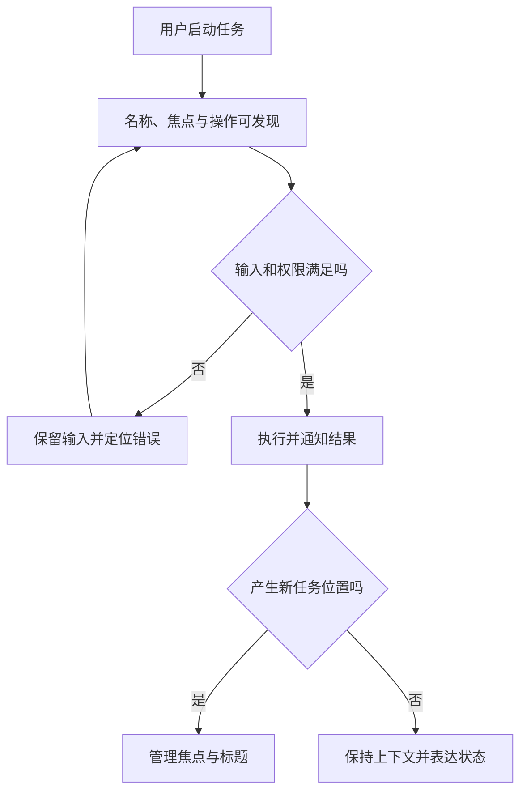

# 交互、可访问性与国际化

> 面向设计、实现与验收用户界面的协作人员。读完能把键盘、辅助技术、语言地区和时间语义纳入同一任务流程，确定需要人工验证的部分，避免把自动扫描通过或文字已翻译当成完整可用。

## 三种问题相互关联，但各有边界

**交互设计**规定用户怎样发现动作、完成任务并理解结果。**可访问性**（Accessibility）是让不同能力与使用条件的人能够感知、操作和理解产品。**国际化**（Internationalization）是使产品能适应不同语言和地区的工程准备，**本地化**（Localization）则是为具体语言和地区提供内容与约定。

这些问题都超出“页面看起来正确”。屏幕阅读器需要可访问名称和结构；键盘用户需要可见焦点与合理顺序；使用另一地区格式的人需要能正确理解日期和数字。文字翻译、响应式布局与认证流程会同时影响这些行为，不能把责任留到发布前统一补一遍标签。

**WCAG 2.2**是 W3C 的 Web 内容可访问性指南，按成功标准与符合级别组织。一个团队可以选定符合目标，但应明确范围和验证方式。单个页面某项检查通过，不代表全流程符合，更不能无依据宣布通过认证。[WCAG 2.2](https://www.w3.org/TR/WCAG22/)

## 原生语义提供行为基础

可访问名称是辅助技术识别控件用途的文字。图标按钮没有可读文本时，需要合适名称；字段标签必须与控件建立程序关系。可见标签和可访问名称应相互对应，避免用户听到的名称与画面文字不同。仅用颜色表示成功或失败，会让一些用户无法理解状态，应同时提供文字或其他可辨别信息。

**ARIA**（Accessible Rich Internet Applications）补充角色、状态与属性。它不会自动赋予键盘行为。WAI-ARIA APG 用“角色是一项承诺”解释：给 `div` 添加 `role="button"` 后，作者仍须实现相应操作与状态。能使用原生按钮时，通常比自行模拟完整行为更容易保持可靠。[APG 指导](https://www.w3.org/WAI/ARIA/apg/practices/read-me-first/)

自定义菜单、树、标签页与组合框，各有不同焦点和键盘约定。不能给每个项目都加 `tabindex="0"` 就认定完整：用户可能要按几十次 Tab，方向键却不能按预期导航。选用组件库前应核对具体模式的行为与目标浏览器、辅助技术组合，库的宣传语不替代任务验证。

## 焦点是任务过程中的位置

**焦点**是当前接收键盘输入的对象。弹窗打开时应把焦点放入合理位置，避免后台内容仍可无意操作；关闭后通常返回触发位置或后续任务的合理位置。路由切换、表单失败和列表更新也要规定焦点去向，不能只更新画面。

WCAG 2.2 的“焦点不被遮挡（最低要求）”要求获得键盘焦点的控件不被作者创建的内容完全遮住；更高标准还有不同要求。因此固定工具栏和浮动提示也要纳入焦点检查，不能把轮廓显示了就当作用户能看到控件。[焦点要求](https://www.w3.org/TR/WCAG22/#focus-not-obscured-minimum)

状态消息应让用户知道请求正在处理、已完成或失败。适当使用实时区域可以让辅助技术获知变化，但不要把每个输入字符与每次背景刷新都播报，避免噪声。对错误，既要说明位置，也要说明怎样修正；把“无效输入”显示在角落不能帮助完成任务。

## 国际化从数据语义开始

**语言地区标识**（Locale）影响语言、数字、日期和排序等约定，不等同于时区，也不能推出用户国籍或权限。界面语言可以由用户选择；内容语言、账号偏好与浏览器建议值可能不同，应规定优先级。页面语言标记帮助辅助技术选择读音，局部外语内容也可能需要相应标记。

国际化文字不宜靠零碎拼接。例如“删除”加“3”加“个项目”，在另一语言中可能要求不同词序或复数形式。应以完整消息和参数组织内容，为翻译提供字段含义与使用场景。不同语言的长度差异需要布局允许换行和增长，避免翻译者为了固定宽度牺牲含义。

**ECMA-402**规定 JavaScript 的 `Intl` 国际化接口，包括数字和日期格式化、排序与复数规则等。可以用它按明确 locale 和时区格式化，而不是硬编码逗号与日期顺序；它不会判断应用中的数值单位、日期业务含义或翻译质量。[国际化 API](https://tc39.es/ecma402/)

| 数据含义 | 合理表示 | 需要明确的边界 |
| --- | --- | --- |
| 一个实际时间点 | 统一时间点加展示时区 | 夏令时与用户所选时区 |
| 生日等日历日期 | 日期，不任意转换时区 | 不应因 UTC 转换变成前一天 |
| 每周当地时间的预约 | 当地时间、时区与重复规则 | 夏令时跳过或重复时刻 |
| 金额或测量值 | 精确值与单位分开保存 | 显示舍入不改变权威值 |
| 用户标识符 | 按业务规则比较 | 不应套自然语言排序做唯一性 |

时间点、当地日期和重复预约是不同模型。把所有日期都转换成 UTC 毫秒，无法表达所有业务含义。前端应与服务端确认输入输出语义，数据库字段的选择见[数据模型](/software/data/data-models)。

## 双向文本与输入方式

从右到左语言与从左到右的编号混排时，需要明确文档方向和局部隔离。W3C 建议用 HTML 的 `dir` 等标记表达文本方向，不能只靠 CSS 的视觉调整，因为方向也是内容含义的一部分。[双向文本指导](https://www.w3.org/International/questions/qa-bidi-css-markup)

姓名、地址和电话号码不要凭单一区域习惯限制。输入法组合阶段也不能被当成已经确认的最终输入；过早触发过滤或替换可能破坏输入。粘贴、语音输入与密码管理器都属于正常输入路径。认证页禁止粘贴或强迫依赖记忆，也可能使任务更难完成，应按所选可访问标准和安全机制评估。

移动、动画与颜色偏好同样影响交互。可提供减少动画的表现，保留同等含义；错误提示要避免只有短暂动画或短时弹窗。目标尺寸与间距影响触控，但合适大小不能脱离邻近动作与设备验证，应依据标准要求与任务风险设计。

## 将验证写成可复核任务

以虚构文件共享设置为例，任务是选定成员、修改访问范围并确认保存。仅键盘完成整条路径，检查名称、焦点、错误与最终状态；再用所选屏幕阅读器组合验证。同一任务切换长文本语言、右到左方向与不同时区，确认信息含义不变。本文提供验证方案，没有执行真实产品验收。

| 方法 | 擅长发现 | 无法独立证明 |
| --- | --- | --- |
| 自动扫描 | 部分缺少标签、结构与对比问题 | 操作流程与文案是否易懂 |
| 键盘人工检查 | 焦点、顺序、陷阱与遮挡 | 辅助技术实际播报 |
| 辅助技术任务验证 | 名称、角色、状态与操作反馈 | 所有实现组合兼容 |
| 翻译与伪本地化检查 | 文本外置、增长和拼接问题 | 母语含义与区域习惯 |
| 时间边界样本 | 日期与时区转换错误 | 所有历史时区规则 |

结果应标注浏览器、辅助技术、版本、语言、时区与任务。发布新组件、导航方式或翻译后，按影响范围复核。把自动分数作为唯一门槛，会遗漏弹窗无法关闭、错误后丢输入等直接阻断任务的问题。

## 内容编辑也参与可访问性

标题、链接文字、图片替代文本和错误提示不全由框架生成。内容维护者应说明图片承担的信息，避免把装饰图写成冗长播报；链接文字要让人理解去向，多个“点击这里”脱离上下文后很难区分。图表除了颜色，还应提供数值、标签或适当说明，让信息不只依赖视觉形式。

自动生成内容进入产品时，也应按同一规则审查。生成代码可能补齐 ARIA 属性，却遗漏真正键盘行为；生成译文可能语法通顺，却改变限制条件。验收要回到完整任务和语义，不应按属性数量或翻译字符覆盖率判断成果。

语言切换后应继续保留当前任务和合法输入，而不是无说明重新开始。页面标题、导航名称与错误消息也要同步切换；部分界面翻译成功不能掩盖核心动作仍无法理解。可在同一任务中验证切换前后的对象身份、草稿和焦点。

验收缺陷应按对任务的影响排序。无法提交、焦点无法退出和关键文字不可读通常直接阻断流程；次要视觉差异可以另行处理。严重程度要结合实际路径，而不是简单按自动工具报告顺序决定。

## 参考资料

<Refs>

- [W3C：Web Content Accessibility Guidelines 2.2](https://www.w3.org/TR/WCAG22/)（访问日期 2026-10-03）
- [WAI-ARIA APG：Read Me First](https://www.w3.org/WAI/ARIA/apg/practices/read-me-first/)（访问日期 2026-10-03）
- [W3C 国际化：CSS vs. Markup for Bidi Support](https://www.w3.org/International/questions/qa-bidi-css-markup)（访问日期 2026-10-03）
- [TC39：ECMA-402 国际化 API 规范](https://tc39.es/ecma402/)（访问日期 2026-10-03；使用稳定接口概念，不据滚动草案推断浏览器支持）
- 站内相关：[HTML 与响应式](/software/frontend/html-css-responsive) · [组件与表单](/software/frontend/components-state-routing) · [性能与兼容](/software/frontend/frontend-performance)

</Refs>
