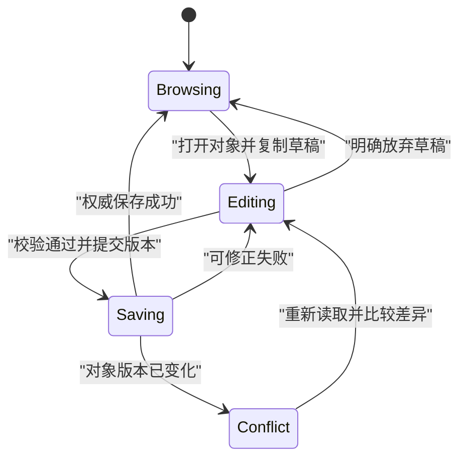

# 组件、状态、路由与表单

> 面向设计交互界面与审查前端数据流的开发者。读完能确定组件职责和状态归属，把 URL、编辑草稿与服务器事实分开，并解释刷新、回退、保存失败和对象切换时界面应该怎样变化。

## 组件划分的是责任，不只是形状

**组件**（Component）是封装一组界面结构、行为和公开接口的单元。组件的输入通常包括属性和事件回调，内部可以有局部状态。把按钮、工具栏与编辑区抽成组件，目的是让职责、复用与变更范围可理解；文件变短或截图能框出一块区域，不能单独证明边界合理。

纯展示组件只根据输入呈现结果，业务组件组织请求和任务，页面组件协调路由与页面级状态。这是工程划分方式，不是所有框架强制的三层。小页面可以把职责放在一起；当多个入口共享规则，或者组件必须知道过多外部细节时，才有理由调整。

**状态**（State）是影响后续行为、需要保存的一段信息，例如当前草稿或请求阶段。**派生值**是能够从已有信息计算的结果，例如根据项目列表与选中 ID 得到选中项目。把派生值再存一份状态，就增加了必须同步的关系。React 官方的状态组织建议包括避免矛盾、重复与冗余状态，适用于判断具体更新是否可能遗漏。[状态组织](https://react.dev/learn/choosing-the-state-structure)

## 给每种状态一个明确归属

**单一事实来源**指某项事实有明确的权威归属，不要求整个应用所有信息都存进一个对象。文本框草稿由编辑流程管理，收藏结果由服务器管理，筛选条件可能由 URL 表达。它们的有效期与共享范围不同，强行合并会模糊边界。

| 信息 | 合理归属 | 寿命与约束 |
| --- | --- | --- |
| 下拉菜单是否展开 | 局部组件 | 随组件消失，不必持久化 |
| 搜索词、页码与筛选 | URL 或页面状态 | 需要分享、刷新时优先 URL |
| 多步骤编辑草稿 | 任务级状态 | 需规定离开、切换与恢复行为 |
| 登录展示信息 | 会话相关状态 | 只是展示缓存，服务端仍需授权 |
| 已保存对象及版本 | 服务器事实与查询缓存 | 需要刷新、失效和冲突处理 |
| 列表总数、选中对象 | 尽量从已有事实派生 | 明确计算与缺失规则 |

Vue 文档以“状态、视图、动作”解释单向数据流；跨多个组件共享状态时，可提升到共同的拥有者或使用有明确更新入口的状态容器。共享容器不会自动减少耦合：所有组件能随意改任意字段，反而很难追踪谁改变了规则。[Vue 状态管理](https://vuejs.org/guide/scaling-up/state-management.html)

修改状态时应能回答输入是什么、允许的旧状态是什么、更新后的不变量是什么。页面同时保存 `isLoading`、`isSuccess` 和 `hasError`，可能出现三者都为真。对互斥阶段使用 `idle / loading / ready / failed` 等明确状态，比散落的布尔值更容易审查。复杂程度增长后可使用 reducer，即把动作与旧状态转换为新状态的函数，但它仍需要定义正确的转换规则。

图中的编辑状态不应因为一次后台刷新就被无声覆盖。服务器对象和本地草稿分开保存，可以同时显示最新事实与尚未保存的修改；发生冲突时由任务规则决定覆盖、合并或重新编辑。

## 组件身份决定状态何时重置

组件状态并不是因为某个函数名相同就永远保留。React 将状态与渲染树中的位置和组件身份关联，`key` 也可以影响身份。列表使用不稳定的索引作为身份，在插入、排序后可能把前一个条目的输入状态配给另一个条目。[保留与重置状态](https://react.dev/learn/preserving-and-resetting-state)

以虚构资料编辑器为例，从资料 A 切到资料 B，应明确定义未保存草稿的去向。可以让切换建立新的编辑实例，也可以按对象 ID 保留独立草稿；不能只改变标题，继续沿用 A 的文本并把它提交给 B。审查时应查看对象标识、组件身份和提交载荷是否一致。

状态容器也要有生命周期。模块级共享对象在浏览器单用户页面中可能方便，服务端渲染却可能由多个请求共享模块实例，用户数据不能未经隔离放进全局单例。渲染方式会改变共享状态的安全边界，详见[渲染与框架](/software/frontend/rendering-frameworks)。

## 路由是用户可以返回的位置

**路由**（Routing）是把 URL 与页面或视图映射的机制。客户端路由可以更新视图和浏览器历史而不重新加载完整文档，仍应保留直接打开、刷新、回退和前进的语义。路由不是简单的“把组件换一下”：页面标题、焦点、滚动位置和未保存工作也会受影响。

历史模式下，浏览器直接请求 `/documents/42`，服务器要能返回适当页面或应用入口。Vue Router 文档说明 HTML5 历史模式需要服务器回退配置，同时指出全量回退会掩盖真实 404。静态资源和 API 不应被统一回退到 HTML；应用还需处理不存在的对象与路径。[历史模式](https://router.vuejs.org/guide/essentials/history-mode.html)

适合分享的筛选条件应编码到 URL，并规定默认值和无效值。搜索词、排序与游标之间可能有关联：改变筛选后通常需要重置分页。URL 中的数据仍是不可信输入，不能通过拼接路径越过访问控制；也不适合保存密钥或私密草稿。

## 表单有草稿、校验与提交三个边界

**受控输入**指输入值由应用状态管理；另一种方式是在提交时从原生表单读取值。选择取决于是否需要即时联动、复杂校验和任务恢复，不应为了“统一架构”让简单字段也产生大量同步代码。HTML 的表单和标签为两种方式提供基础语义。

校验要区分格式和业务。邮箱格式、必填和长度可在客户端给出即时反馈；唯一性、对象状态和操作权限要由服务器裁决。对服务器返回的字段错误，应关联到对应控件，保留用户输入，并提供整体错误说明。提交失败后清空表单，会让用户无法修正，也会破坏重试上下文。

提交期间禁用按钮有助于避免误操作，但不提供服务端幂等。浏览器刷新、网络重试与其他客户端仍可再次提交。超时后的状态可能未知，应允许查询结果或用同一逻辑操作标识重试，不应立即显示“未保存”并新建另一项操作。

**乐观更新**是在服务器确认前先显示预期变化。它适合可撤销、冲突风险可控的动作，但要保留旧值、标记待确认状态，并定义失败时回滚或重新读取。对资源容量、权限等硬约束，乐观画面不能变成权威事实。失败时只弹一条消息而保留虚假的成功状态，是不完整的实现。

## 审查一项编辑功能

下面是未执行的验收设计。准备两个虚构对象、旧版本与新版本，分别走保存成功、格式错误、权限失效、版本冲突与响应丢失路径。记录初始服务器版本、草稿、操作 ID 和最终权威状态，判断页面是否能正确解释结果。

| 场景 | 应检查的行为 | 失败线索 |
| --- | --- | --- |
| 编辑中后台刷新 | 草稿不会无声丢失 | 查询结果直接覆盖输入 |
| 切换对象 | 状态归属与对象 ID 一致 | 标题变了，内容仍属于旧对象 |
| 直接打开深层 URL | 页面、对象与权限可重新构建 | 只有从首页点击才正常 |
| 回退到筛选结果 | 可恢复约定筛选与位置 | URL 与页面状态分离 |
| 保存超时 | 能查询或安全重试 | 自动再创建一次对象 |

组件单元测试可以检查状态转换，浏览器交互验证检查路由、焦点与原生表单，接口验证检查保存契约。任何一种单独通过都不涵盖整条任务链。相关功能变化后，应按受影响的边界重验，而不是重复所有截图。

## 状态结构怎样随复杂度演进

拆分共享状态前，列出读取者、修改者和失效条件。多个组件只是需要显示同一值，可以由共同拥有者传递；多个独立任务要协调同一事实，才需要更明确的共享入口。不要以组件嵌套层数单独决定全局化，否则瞬时菜单状态也会污染整个应用的公共协议。

调试状态时保留动作与对象身份，比只打印最终对象更能解释错误。一次后台刷新、一项用户编辑和一个迟到响应可能分别合法，但组合顺序错误会覆盖草稿。需要追踪“谁在何种旧状态下做了什么”，再决定应拒绝、合并或采用哪个结果。

状态迁移还应保留正常缺失的语义。对象已删除、列表为空和请求失败是不同情况，不能统一呈现为“没有数据”。查询状态和业务状态分开，可以让页面解释为什么没有结果，以及用户接下来能做什么。

## 参考资料

<Refs>

- [React：Choosing the State Structure](https://react.dev/learn/choosing-the-state-structure) · [Preserving and Resetting State](https://react.dev/learn/preserving-and-resetting-state)（访问日期 2026-10-03）
- [Vue：State Management](https://vuejs.org/guide/scaling-up/state-management.html)（访问日期 2026-10-03）
- [Vue Router：Different History Modes](https://router.vuejs.org/guide/essentials/history-mode.html)（访问日期 2026-10-03）
- [WHATWG：HTML Forms](https://html.spec.whatwg.org/multipage/forms.html)（访问日期 2026-10-03）
- 站内相关：[业务状态机](/software/backend/business-state-machines) · [API 契约](/software/backend/http-api-contracts) · [交互与可访问性](/software/frontend/accessibility-internationalization)

</Refs>
