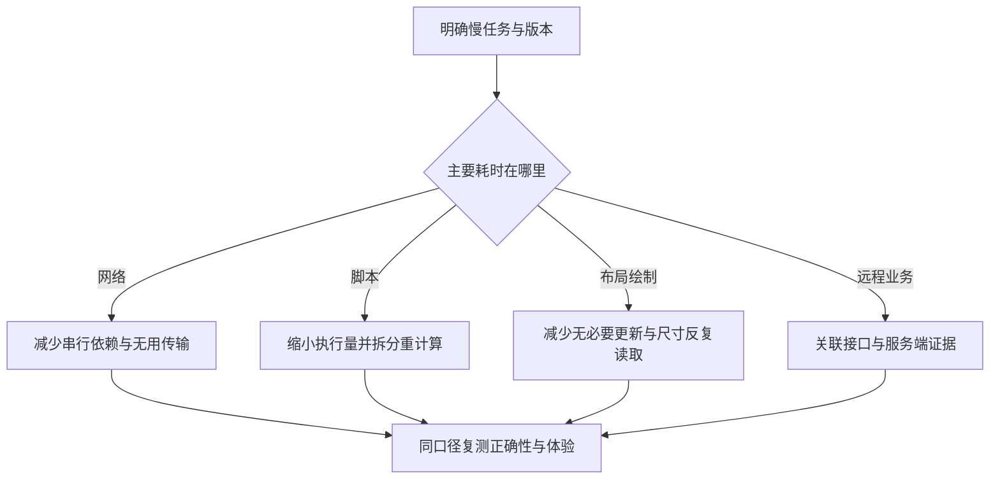

# 前端性能、兼容与观测

> 面向需要改善和验收页面体验的开发者。读完能从用户任务选择指标，区分实验室测试与线上观测，沿网络、主线程和布局找到原因，并把浏览器兼容范围与发布版本一起记录。

## 性能首先是用户等待了什么

**前端性能**不只是脚本包大小或接口响应时间，它描述页面从加载到可操作，以及交互反馈的时间与稳定性。页面很快显示骨架，却长期不能操作，与文字稍晚但动作立即可用，用户体验不同。应该先规定关键任务：读到正文、完成搜索、保存草稿或切换图表，然后选择能解释这些任务的证据。

**实验室测量**是在可控环境中运行指定操作；**真实用户监测**（RUM）是在实际使用环境采集限定数据。前者适合复现、比较和诊断，后者反映设备、网络、缓存和用户行为差异。二者互补，不能把一次高分当作所有用户体验的证明，也不能用总体线上变慢直接归因于某次代码改动。

指标还需分清阶段和口径。服务器响应时间不包含浏览器下载与执行全部资源；资源加载完成不等于页面业务就绪；平均值可能掩盖较慢用户。每次比较应保留设备、浏览器、网络、缓存条件、数据量、版本与样本范围。

## 三类核心体验指标如何使用

**Core Web Vitals**是 Google 定义的一组页面体验指标。实际复核的官方文档包含 LCP、INP 与 CLS：**LCP**（Largest Contentful Paint）关注最大内容元素出现的加载表现，**INP**（Interaction to Next Paint）关注交互到后续呈现的响应，**CLS**（Cumulative Layout Shift）关注意外布局移动的稳定性。[Web Vitals](https://web.dev/articles/vitals)

官方建议以页面加载样本的第 75 百分位并区分移动与桌面评估，而不是拿少数快速样本报告全面达标。这些指标不覆盖所有应用任务：搜索语义错误、保存丢失或键盘无法提交，即使指标优秀仍是任务失败。性能验收要与业务正确性并列。

| 观察方向 | 相关证据 | 常见原因与验证 |
| --- | --- | --- |
| 主要内容出现晚 | 响应、资源依赖、LCP 元素 | 查关键图片、样式与串行取数 |
| 点击后迟迟反馈 | 主线程轨迹、INP、任务标记 | 查同步计算、渲染与布局 |
| 页面内容突然移动 | CLS 与具体移位区域 | 查未预留尺寸、字体和插入内容 |
| 保存完成很慢 | 任务耗时、请求与权威状态 | 查网络、服务器及界面更新 |
| 内存持续增加 | 重复任务后的对象与监听器 | 查订阅、缓存和未释放资源 |

不要把每一项延迟都归入同一个指标。交互发生后等待远程计算，可以立即显示进度，同时单独测量完成任务所需时间；仅优化“按下后出现动画”的时间，不能缩短真实任务等待。

## 沿着因果链优化

资源优化应先识别关键路径。减少首屏不必要脚本、合理拆分路由代码、选择合适图片尺寸，可以降低传输和执行量。但拆分过细可能增加请求与依赖等待，预加载过多则可能争用真正关键资源。是否预取由使用概率、网络成本和隐私范围共同决定。

主线程上运行大批同步工作，会延迟事件处理。对长列表可考虑分批更新或虚拟化，后者只渲染可视区域附近内容，但必须验证键盘导航、辅助技术、查找与滚动恢复。对可分离计算可评估 Worker；消息传递和序列化也有成本。减少计算应优先于给同一低效算法增加调度包装。

布局优化要定位实际触发点。交错修改样式和读取几何信息可能造成重复工作；固定尺寸、无尺寸图片与晚到字体可能影响布局稳定。使用缓存或记忆化时，应评估输入变化、命中率与保留内存，不能因为 API 名称带“优化”就假定收益。

## 兼容性是明确的支持承诺

**兼容性**是产品在约定浏览器与环境中保持预期行为。规范存在不代表目标环境已经实现，某个新 API 在开发机器可用也不能证明嵌入式 WebView 支持。需要记录支持矩阵，结合真实使用与维护成本决定最低范围。

**Baseline**是 Web 平台特性互操作支持状态的参考。web.dev 定义 newly available 为核心浏览器均支持，widely available 为达到互操作后经过 30 个月。它有规定的浏览器集合，不能覆盖全部 WebView、辅助技术、企业版本或用户策略。[Baseline](https://web.dev/baseline)

**特性检测**检查环境是否具备某项能力，比只解析用户代理名称更能对应实际接口。即使检测成功，也要验证相应行为与错误路径。**渐进增强**是先保留可完成核心任务的基础，再为支持能力的环境增加体验；polyfill 可以补一些 API 行为，不能自动模拟所有布局、权限和宿主能力。

| 决策 | 适用条件 | 验证边界 |
| --- | --- | --- |
| 使用较新 API 并检测 | 有可接受降级路径 | 不支持与权限拒绝都能继续 |
| 引入 polyfill | 目标环境缺少可模拟能力 | 语义、体积与维护来源可审查 |
| 限定浏览器范围 | 产品能明确告知并支持更新 | 入口、故障与支持记录一致 |
| 保留原生基础流程 | 核心任务可以简单表达 | 无脚本或部分脚本失败仍可用 |

## 观测数据必须能定位版本与任务

**PerformanceObserver**订阅浏览器提供的性能条目。可用条目类型依赖实现，采集代码应检测支持，并按需要处理缓冲条目。它是数据入口，不会自动定义正确的指标聚合与页面生命周期。[PerformanceObserver](https://developer.mozilla.org/en-US/docs/Web/API/PerformanceObserver)

应用观测可记录路由、应用版本、任务阶段、错误类别与关联请求 ID。不要把用户输入、访问令牌或私密文档内容作为标签。高基数对象 ID 会增加观测成本，也可能引入隐私风险；使用有限、稳定的分类更便于比较。采样要保留口径，避免某版本只采快速请求，另一个版本采所有请求。

单页应用还需区分首次加载与后续导航，后台标签页与前台使用。用户从缓存恢复、网络切换或离开页面，都会改变采集窗口。报表必须标注样本范围和缺失情况；未知数据不能以零代替。错误率应明确分母，是请求、会话还是任务，三者不能直接互比。

## 一次优化如何验收

假设虚构文件列表在展开详情时迟缓，先取得可复现输入与轨迹，确定耗时是重复转换数据还是布局。建立原始版本和候选版本，固定数据和环境，多次运行相同操作并查看分布。同时验证选中、键盘、筛选与错误状态。这是教学验证方案，本文没有产生任何基准或提升百分比。

发布后把观测与版本对应，比较相近用户群和任务，检查错误率是否增加。若总体改善却某类低端设备退化，应回到分组证据判断。优化过程中引入的新缓存或虚拟化，可能改变正确性与交互行为，需要把它们纳入验收。

| 失败模式 | 为什么结论不可靠 | 修正方向 |
| --- | --- | --- |
| 只报告一次跑分 | 随机条件与缓存影响大 | 固定条件并保留多次样本 |
| 只比较总包大小 | 不反映首屏执行与依赖 | 查实际加载和执行路径 |
| 总体百分位掩盖群体退化 | 用户构成发生变化 | 按设备、网络与版本分组 |
| 观测没有源码版本 | 无法关联具体变化 | 为发布产物保留版本标识 |
| 兼容问题用“刷新”处理 | 根因仍在资源或 API 边界 | 记录环境并验证降级 |

性能是持续的证据工作，但不要求无止境跑所有测试。只有新变化、异常和未解决边界才需要扩大验证。浏览器机制、渲染选择与后端耗时分别由相邻专题解释，本文负责把它们连接成可审计的用户体验判断。

## 性能预算应连接到发布判断

性能预算是项目选定的资源或体验边界，例如关键路由允许交付的脚本范围、某任务的等待目标。预算应由用户任务和实际环境得到，而不是复制别人的数字。检查超出预算时，应说明增加了哪些能力、影响哪些群体，以及是否有足够理由接受。

自动构建可以检查产物变化，浏览器测量可以检查执行，线上观测可以检查实际群体。把三种证据与版本关联，才能解释一个新依赖为何增加包大小、是否进入关键路径、用户是否受到影响。任何单一门槛都应保留例外的具体依据和后续复核条件。

性能回归的定位应保留变化范围。依赖更新、路由数据变化和发布缓存配置都可能影响同一指标，不能只从源码差异猜原因。对照实际产物与网络路径后，再提出最小可验证修正。

## 参考资料

<Refs>

- [web.dev：Web Vitals](https://web.dev/articles/vitals) · [Baseline](https://web.dev/baseline)（访问日期 2026-10-03）
- [MDN：PerformanceObserver](https://developer.mozilla.org/en-US/docs/Web/API/PerformanceObserver)（访问日期 2026-10-03）
- [WHATWG：HTML Event Loops](https://html.spec.whatwg.org/multipage/webappapis.html#event-loops)（访问日期 2026-10-03）
- 站内相关：[浏览器运行](/software/frontend/web-browser) · [渲染方式](/software/frontend/rendering-frameworks) · [可访问性](/software/frontend/accessibility-internationalization) · [后端性能](/software/backend/backend-frameworks-performance)

</Refs>
