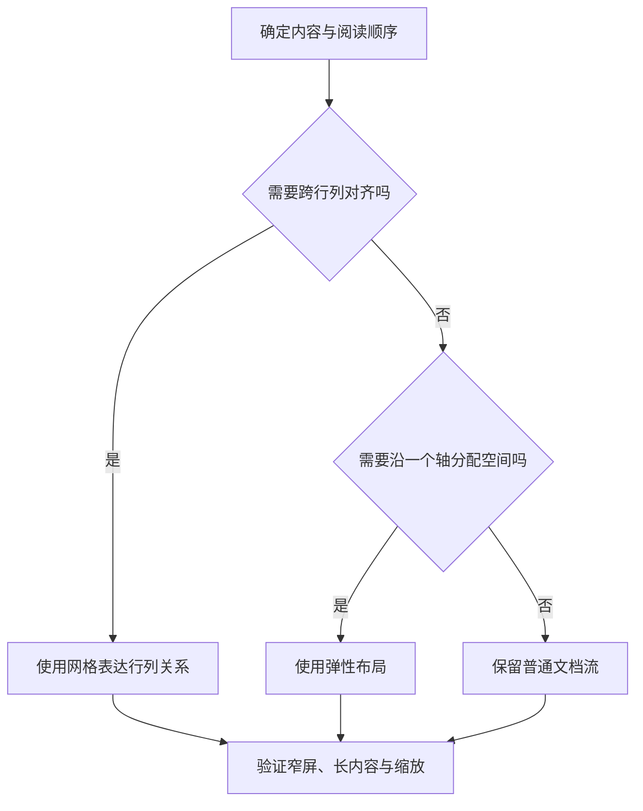

# HTML、CSS 与响应式布局

> 面向编写页面和审查界面成果的开发者。读完能把内容语义、样式规则和空间布局分别设计，选择适合的流式、弹性或网格布局，并用长内容、缩放和真实交互验证响应式行为。

## 先表达内容，再决定它在哪里

**HTML**（HyperText Markup Language）是描述文档结构与语义的标记语言。标题、导航、段落、列表、表格和表单不是若干外观不同的盒子，它们表达内容的关系和用途。**CSS**（Cascading Style Sheets）是规定这些内容如何呈现的样式语言。一个元素视觉上像按钮，不能因此获得按钮的键盘行为、可访问名称与表单语义。

链接用于导航，按钮用于执行动作；数据表格表达行列关系，不能为了排列两个区域就使用表格。页面只有一个视觉大标题，不意味着所有小标题都该写成 `div`。合理的标题层级帮助读者、辅助技术和自动化工具定位内容，文字大小则由 CSS 决定。

表单控件要有能被程序识别的标签。`placeholder` 是输入提示，填写后可能消失，不能替代持久的字段名称。HTML 的 `required`、输入类型和约束校验改善用户输入体验，却不能替代服务端校验：客户端可被绕过，浏览器也无法判断业务对象的权限。[HTML 表单规范](https://html.spec.whatwg.org/multipage/forms.html)

## 样式为什么“写了却没生效”

**级联**（Cascade）是浏览器从多个候选声明中决定生效值的机制。规则先涉及来源、重要性和层等次序，再考虑选择器优先级、相关顺序等条件，不能简化为“后写的一定覆盖先写的”。**继承**指某些属性在没有另行指定时从父元素取得值；它与两条规则争夺同一个元素并不是一回事。[CSS 级联规范](https://www.w3.org/TR/css-cascade-5/)

排障时在开发者工具中读计算样式，查明声明有没有匹配、是否被覆盖、是否受父容器限制。盲目追加 `!important` 会把问题变成更难维护的优先级竞争。第三方组件、主题和局部样式并存时，可以规定样式层与组件边界，让公共基础、主题和特例的关系显式化，而不是用越来越长的选择器夺取控制权。

**盒模型**描述内容、内边距、边框与外边距的关系。尺寸计算还受 `box-sizing`、最小尺寸、最大尺寸与包含块影响。一个盒子写了 `width: 100%`，再增加内边距后是否溢出，不能离开盒模型判断。**普通流**是文档默认的排布方式，尽量先让内容在普通流中正确表达，再对真正需要覆盖的浮层使用定位。

## 从内容约束选择布局机制

**Flexbox**是主要沿一个轴分配空间的弹性布局，适合按钮组、工具栏与局部横纵排列；**Grid**是同时描述行列关系的网格布局，适合页面分区和需要跨项对齐的卡片。二者可以嵌套，不是互斥框架。[Flexbox](https://www.w3.org/TR/css-flexbox-1/)与[Grid](https://www.w3.org/TR/css-grid-1/)分别定义其布局算法。



视觉排序要谨慎。Flex 的 `order` 或网格定位可以改变画面位置，却不自动改变 DOM 阅读与焦点顺序。若视觉左侧步骤实际上位于 DOM 最后，键盘使用者可能按另一顺序移动。应先使源顺序符合任务逻辑，再决定宽屏如何组织。

| 布局任务 | 可优先考虑 | 决策边界 |
| --- | --- | --- |
| 连续阅读的文章 | 普通流、限制正文宽度 | 不需要每段都变成网格 |
| 搜索框与操作按钮 | Flexbox、允许换行 | 长标签与最小尺寸会挤压空间 |
| 多列卡片与页面区域 | Grid | 列宽必须容纳真实内容 |
| 二维数据比较 | 语义表格 | 窄屏可局部滚动，保留表头关系 |
| 提示气泡与模态遮罩 | 合理定位与层级 | 还需处理焦点和遮挡 |

## 响应式依据内容，而不是设备名称

**响应式设计**（Responsive Design）是让同一内容和任务在不同可用空间与输入条件下保持可用。媒体查询检查视口等环境条件，不直接判断用户是不是“手机用户”。断点应来自内容开始拥挤的位置，而不是照搬某个机型宽度。[媒体查询规范](https://www.w3.org/TR/mediaqueries-4/)

流式尺寸让布局随空间变化，最小与最大尺寸负责保持可读范围。字体通常应允许相对尺寸与用户缩放；图片需要约束显示宽度，避免撑开容器。为图片预留尺寸有助于稳定排版。长 URL、没有空格的标识符与更长的翻译文本都应纳入设计，不能只测试短中文标题。

Flex 子项的自动最小尺寸可能依据内容确定。即使设置 `flex: 1`，长字符串仍可能阻止它缩小。根据语义为可收缩区域设置 `min-width: 0`，并为文本选择换行、截断或局部滚动；截断不能成为重要信息的唯一呈现方式。把全页面的横向溢出隐藏起来只会掩盖内容被切掉的事实。

下面是虚构资源目录的布局片段，仅用于解释约束，未在实际应用中执行。`18rem` 是示例设计值，应由真实卡片内容验证。

```css
.catalog {
  display: grid;
  grid-template-columns: repeat(auto-fit, minmax(min(100%, 18rem), 1fr));
  gap: 1rem;
}
.catalog-card { min-width: 0; }
.catalog-card img { max-width: 100%; height: auto; }
.catalog-card a { overflow-wrap: anywhere; }
```

这段样式允许可用空间容纳更多列，又避免最小列宽超过容器。它没有决定标题语义、图片替代文本、加载顺序或卡片是否能键盘操作，仍需要相应 HTML 与交互设计。

## 一个界面如何验收

以虚构知识资源目录为例，先确认每个条目拥有标题、说明与明确的访问入口，再检查宽屏多列、窄屏单列和内容为空时的表达。用同一任务验证不同空间：能否发现筛选条件、读到完整标题并进入资源，而不是只比较截图是否相似。

| 输入条件 | 观察目标 | 可记录证据 |
| --- | --- | --- |
| 最长标题与长 URL | 内容可读、不挤掉操作 | 指定输入与布局截图 |
| 页面缩放与大字号 | 主流程仍可操作 | 缩放比例、浏览器与遮挡位置 |
| 横竖屏和窄视口 | 分区与导航能重排 | 视口尺寸和滚动范围 |
| 仅键盘操作 | 焦点顺序符合任务 | 操作路径与可见焦点 |
| 图片失败或延迟 | 仍能理解条目 | 失败条件和文字替代 |

截图只是部分证据。页面在默认字号下很好看，放大后按钮遮住输入框，就是实际使用失败。桌面浏览器拖窄窗口也不能覆盖移动浏览器地址栏、软键盘与触摸行为。支持哪些环境要形成明确范围，再按风险选择真实设备验证。

## 失败模式与维护边界

| 现象 | 常见机制 | 修正方向 |
| --- | --- | --- |
| 窄屏突然横向溢出 | 固定宽度、长内容、自动最小尺寸 | 查最先超宽的元素并调整约束 |
| 按钮样式正确却无法键盘激活 | 使用无语义容器模拟控件 | 使用原生控件或补全完整行为 |
| 一个页面改色影响其他页面 | 全局选择器与隐式继承 | 明确公共样式和组件范围 |
| 页面顺序与焦点顺序不一致 | 视觉排序脱离 DOM 顺序 | 先修正文档顺序 |
| 翻译后控件重叠 | 固定高度与短文本假设 | 允许内容增长并验证最长文本 |

样式维护应记录设计变量、组件职责与例外原因。这里讨论文档和布局，不规定具体 UI 库；组件库能减少重复劳动，也会带来主题与升级边界。可访问性、国际化与动态表单仍需结合[交互专题](/software/frontend/accessibility-internationalization)和[状态专题](/software/frontend/components-state-routing)独立核对。

## 设计约束应能随内容维护

可以把颜色、间距、字号和区域宽度组织成设计变量，减少页面逐个复制常量。变量命名应表达用途，例如正文宽度或危险动作颜色，而不是只记录某个十六进制值。局部特例有实际任务原因时，可以保留并写明依据；为了绝对统一而压缩长文本，同样会损害使用。

样式审查应追查组件外部约束：一个弹性项可以收缩，祖先固定宽度却仍然会撑开页面；子元素高度正确，固定定位工具栏仍可能遮住它。把问题压到最小结构，逐层检查包含块、尺寸和溢出规则，比连续追加媒体查询更容易解释。页面布局的缺陷不能简单归因于“某个分辨率特殊”。

印刷或导出也是不同呈现场景。交互控件、折叠内容与滚动区域在纸面中可能无法表达，若产品确实要求打印，应单独规定输出内容和分页，保留标题、表头与必要说明。屏幕响应式通过，并不自动证明纸面结果可阅读。

对重要操作区域，还要检查触控、鼠标与键盘是否获得同等明确反馈。悬停状态可以补充说明，但不能让说明只在悬停时存在，触屏和键盘用户也需要可发现入口。交互状态应同时考虑默认、焦点、禁用和错误表现。

## 参考资料

<Refs>

- [WHATWG：HTML Forms](https://html.spec.whatwg.org/multipage/forms.html)（访问日期 2026-10-03）
- [W3C：CSS Cascading and Inheritance Level 5](https://www.w3.org/TR/css-cascade-5/)（访问日期 2026-10-03）
- [W3C：CSS Flexible Box Layout Module Level 1](https://www.w3.org/TR/css-flexbox-1/) · [CSS Grid Layout Module Level 1](https://www.w3.org/TR/css-grid-1/)（访问日期 2026-10-03）
- [W3C：Media Queries Level 4](https://www.w3.org/TR/mediaqueries-4/)（访问日期 2026-10-03）
- 站内相关：[浏览器运行](/software/frontend/web-browser) · [可访问性与国际化](/software/frontend/accessibility-internationalization) · [前端性能](/software/frontend/frontend-performance)

</Refs>
