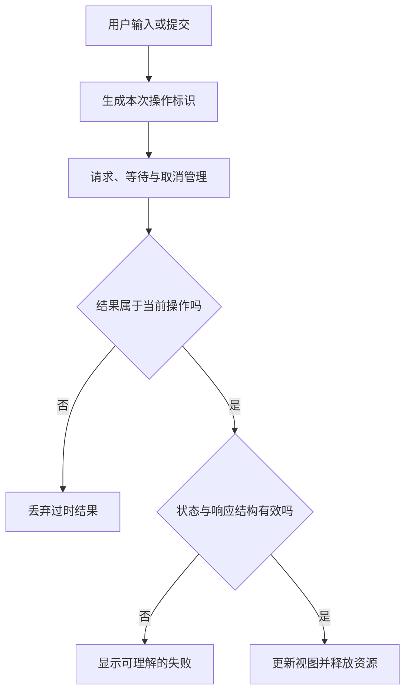

# JavaScript 交互与浏览器 API

> 面向编写页面交互、接手浏览器端代码的开发者。读完能组织事件与异步请求，区分网络失败和业务失败，正确处理取消、过时结果与资源清理，并判断浏览器存储能承担什么责任。

## 语言能力与宿主能力分开理解

JavaScript 提供变量、函数、对象、Promise 等语言机制；浏览器提供文档、网络、历史记录和存储等平台接口。**API**（Application Programming Interface）是程序调用某项能力的公开接口及其约定。浏览器 API 的可用性可能受安全上下文、权限、来源与实现支持限制，不能只依据语言语法判断。

**Promise**表示未来成功或失败的一次结果，`async` 函数返回 Promise，`await` 让函数在等待点交还执行机会。这些机制不会自动取消网络操作，也不会自动解决“两个结果应该采用哪个”的业务判断。语言层面的异步控制与应用层面的有效性是两道不同约束。

**DOM 事件**把输入连接到程序。注册监听器时应确定事件类型、目标和生命周期，移除时应保持一致的监听函数与相关选项。反复挂载界面却不清理旧监听器，可能一次点击触发多次保存，也可能保留本应释放的对象。[DOM 事件规范](https://dom.spec.whatwg.org/#events)

## 从一个动作到可信反馈

交互可以拆为意图识别、输入读取、请求或本地计算、结果验证和反馈。先读原生语义：表单监听 `submit` 可以覆盖点击提交与键盘提交，单独监听某个按钮的 `click` 往往遗漏其他路径。`preventDefault()` 用来取消可取消事件的默认行为；它不阻止其他监听器，不等于把整个操作“锁住”。

**事件委托**是在稳定父节点上利用传播处理子节点交互的方式。它适合动态列表，但要验证命中元素确实属于目标范围，并区分 `target` 与监听器所注册的 `currentTarget`。事件不一定都冒泡，影子 DOM 等封装环境还会改变可见目标路径，不能把委托写成通用万能入口。

向界面展示外部文字时，优先使用文本接口。把不可信字符串直接交给 `innerHTML`，会把数据当作标记解释，扩大注入风险。需要富文本时应定义允许的内容并使用合适的清理机制；单纯替换几个字符不能覆盖所有 HTML 上下文。



图中结果有效性检查比“拿到 JSON 就渲染”多一步。浏览器不会替应用判断最新搜索词、当前页面或对象版本，开发者必须明确这个条件。

## Fetch 成功不等于业务成功

**Fetch**是浏览器发起资源请求的接口。其 Promise 通常在收到 HTTP 响应时兑现，即使响应状态是 404 或 500；网络错误等情况才会以拒绝等形式表现。代码应检查状态，再按契约解释响应体。`response.json()` 也可能失败，例如服务器返回 HTML 错误页，或响应本来没有正文。[Fetch 使用文档](https://developer.mozilla.org/en-US/docs/Web/API/Fetch_API/Using_Fetch)

请求应写清方法、头、载荷与凭据策略。JSON 是数据格式，不能赋予字段业务含义；接口类型定义也不能证明运行时数据一定符合类型。对于外部输入与重要边界，要验证结构、必需字段和数值范围。返回错误消息不应直接拼入 HTML，也不应向用户展示服务器堆栈和内部凭据。

跨源请求还受 Fetch 与 CORS 规则约束。设置 `mode: 'no-cors'` 并不会让脚本自由读取跨源接口，它可能得到不可读取正文的 opaque 响应。带凭据访问需要核对客户端配置与服务器允许范围，不能通过“放开所有源”替代设计。[Fetch Standard](https://fetch.spec.whatwg.org/)

| 观察 | 可能含义 | 合理处理 |
| --- | --- | --- |
| Promise 被拒绝 | 网络、策略、取消等错误 | 区分取消与需通知的失败 |
| HTTP 4xx | 输入、身份、权限或状态冲突 | 按接口契约给出修正路径 |
| HTTP 5xx | 服务端或依赖处理失败 | 判断重试是否安全、保留关联 ID |
| 2xx 但结构不符 | 契约或路由错误 | 视为边界失败并采集诊断 |
| 超时后重新提交 | 首次操作结果可能未知 | 查询或采用服务端幂等机制 |

## 取消和过时结果要同时处理

**AbortController**提供取消信号，可用于支持 `AbortSignal` 的操作。取消 Fetch 可终止相应客户端读取或请求过程，却不能承诺服务器撤销已经完成的写入。[AbortController](https://developer.mozilla.org/en-US/docs/Web/API/AbortController)因此适合限制资源与废弃无用读取，不能当作业务回滚协议。

下面是搜索读取的教学片段，未实际执行。它用取消减少浪费，用序号防止旧结果覆盖新结果；响应结构的正式校验需要按项目契约补充。

```js
let current = 0;
let active;
async function search(term) {
  const revision = ++current;
  active?.abort();
  const controller = new AbortController();
  active = controller;
  try {
    const url = new URL('/api/search', location.origin);
    url.searchParams.set('q', term);
    const response = await fetch(url, { signal: controller.signal });
    if (!response.ok) throw new Error('查询失败');
    const data = await response.json();
    if (revision !== current) return;
    renderValidatedResults(data);
  } catch (error) {
    if (revision === current && !controller.signal.aborted) showError();
  }
}
```

离开页面时还应取消活动读取并释放监听器。**防抖**是在输入停止一段时间后执行，用来降低无用请求；**节流**是限制一定时间内的执行频率。它们改善负载与反馈节奏，不提供正确性。即使防抖生效，请求仍可能乱序，仍需有效性检查。

## 存储、对象 URL 与权限的寿命

`localStorage` 按源保存字符串，接口同步执行，空间与可用性受浏览器策略影响。它适合少量可丢失的偏好，不是可靠的业务数据库。用户可以清除存储，某些隐私或权限条件下访问会失败，因此读取与写入应允许降级。[localStorage](https://developer.mozilla.org/en-US/docs/Web/API/Window/localStorage)

不要把“本地”解释成“安全”。同源脚本能访问相应内容，跨站脚本漏洞可能导致暴露。身份令牌的存放方案要根据威胁模型和会话架构设计，不能为了方便把所有敏感信息写进本地存储。大量结构化离线数据可能需要 IndexedDB 等机制，但还要考虑配额、迁移、冲突和同步，超出本文范围。

临时对象 URL、定时器、观察器和订阅都有生命周期。创建下载预览后，要在不再使用时释放资源；后台页面仍运行的轮询可能消耗带宽。浏览器能力需要权限时，应在用户能理解用途的动作附近请求，拒绝后给出可用替代，而不是进入重复弹窗循环。

## 验证方法与失败边界

对搜索功能，至少设计慢旧请求、快新请求、取消、错误状态、非 JSON 正文与离开页面六类场景。记录当前输入、采用的请求标识和最终画面，判断是否采用正确结果。这是验证方案，不是本文已经取得的测试结果。

| 失败模式 | 机制原因 | 检查动作 |
| --- | --- | --- |
| 搜索结果倒退 | 过时响应覆盖当前状态 | 控制两次响应顺序 |
| 重试产生重复写入 | 客户端超时被当成未执行 | 查权威状态与幂等契约 |
| 点击一次执行两次 | 监听器重复注册 | 观察挂载、卸载与回调次数 |
| 页面长时间卡顿 | 同步存储或大量 DOM 更新 | 录制执行轨迹并限制工作量 |
| 错误内容变成页面标记 | 数据与 HTML 混用 | 检查输出接口与清理边界 |

这些基础可以用于任何框架。框架负责组织组件更新，开发者仍负责请求有效性、资源清理与用户反馈。更完整的状态归属见[组件、状态与表单](/software/frontend/components-state-routing)，写操作的未知结果与重试见[消息与幂等](/software/backend/messages-jobs-idempotency)。

## 将交互结果组织成可维护接口

浏览器操作可以封装为职责明确的小函数：请求函数返回受验证的数据或稳定错误类别，状态协调者决定结果是否仍有效，呈现函数负责文本与焦点。这样同一接口被多个页面使用时，网络策略不会散落到每个点击处理器。封装仍应公开取消和期限等重要能力，不能为了调用简短把它们藏掉。

错误反馈要区分用户主动取消、输入问题和暂时故障。取消搜索通常不必弹窗；输入无效需要指出字段；保存结果未知需要保留草稿与操作身份。把所有异常统一显示“请重试”会让用户重复触发不能安全重试的操作。错误边界的设计应该从任务后果决定。

验证资源释放时，可以连续进入离开页面、重复打开弹窗和切换对象，观察监听器、计时器和活动请求是否随任务结束。一次成功点击不能证明长期会话不会积累无用工作。记录应连接到具体资源拥有者，不能仅凭内存短时下降就宣布没有泄漏。

异步函数应显式返回可等待的结果，让调用者能够跟踪结束和错误。启动后不等待的后台 Promise 需要独立错误处理，否则失败容易成为无人处理的拒绝。页面级任务的结束、取消与释放应由一个明确拥有者协调，不能靠任意回调顺手处理。

接口封装还应保留对无正文响应的处理。删除完成可能没有 JSON，代码若一律解析正文，会把已完成动作误报为失败。具体读取方式应由状态、媒体类型和接口契约共同决定。

## 参考资料

<Refs>

- [WHATWG：DOM Standard](https://dom.spec.whatwg.org/) · [Fetch Standard](https://fetch.spec.whatwg.org/)（访问日期 2026-10-03）
- [MDN：Using the Fetch API](https://developer.mozilla.org/en-US/docs/Web/API/Fetch_API/Using_Fetch)（访问日期 2026-10-03）
- [MDN：AbortController](https://developer.mozilla.org/en-US/docs/Web/API/AbortController) · [Window.localStorage](https://developer.mozilla.org/en-US/docs/Web/API/Window/localStorage)（访问日期 2026-10-03）
- 站内相关：[浏览器运行](/software/frontend/web-browser) · [接口契约](/software/backend/http-api-contracts) · [身份认证与权限](/software/backend/authentication-authorization)

</Refs>
