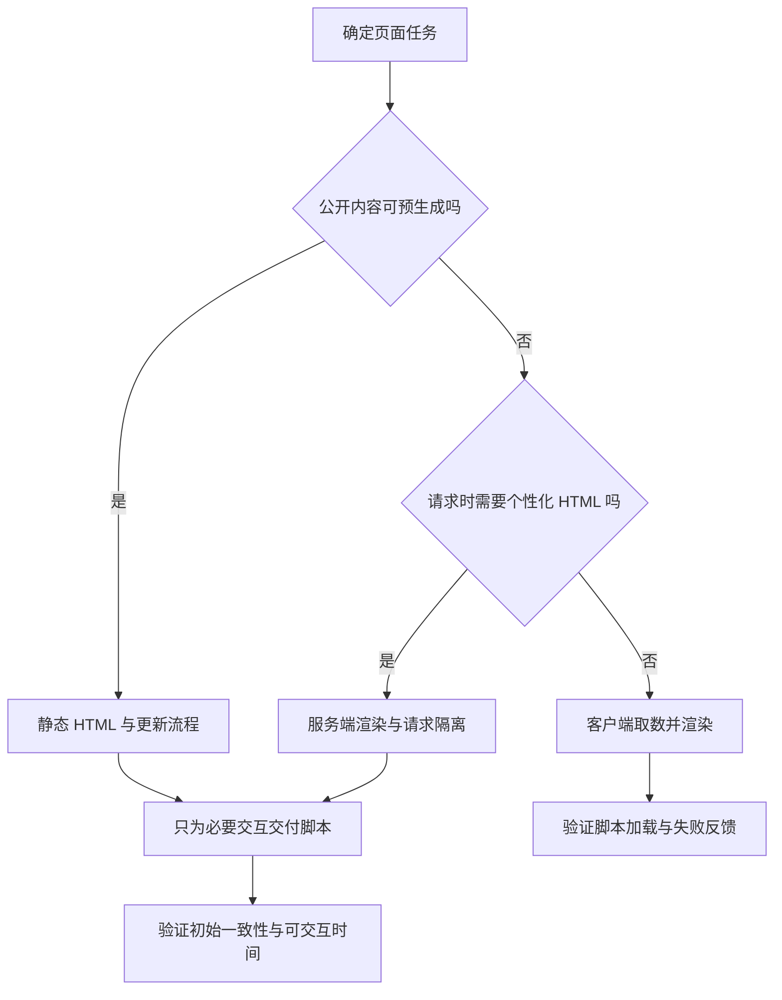

# 渲染方式与框架选型

> 面向决定 Web 应用交付方式的开发者与技术负责人。读完能区分渲染发生的时间、位置与交互代码边界，根据内容新鲜度、个性化、部署能力和团队维护成本选择方案，并设计公平的验证口径。

## 先问页面怎样产生，再问用什么框架

**渲染**（Rendering）在本文指把应用数据和组件转换成页面内容，不特指浏览器最终绘制像素的阶段。**框架**组织路由、数据、组件和构建等约定；渲染方式描述内容在哪里、何时产生。React 或 Vue 这样的界面库与包含服务器、构建和路由的应用框架，不宜放进同一个“最快”榜单。

**客户端渲染**（CSR）主要让浏览器下载脚本后生成界面。**服务端渲染**（SSR）在请求处理时生成 HTML。**静态生成**（SSG）在构建等预生成阶段产生页面，可由静态资源设施交付。一个项目可以按页面混合这些方式，不必用单一标签解释全部行为。

预生成页面不代表没有 JavaScript，SSR 也不代表浏览器没有执行组件代码。用户能看见文字与能执行复杂交互可能发生在不同阶段。公开文章、账号设置和图形编辑器的任务不同，合理组合往往比整站统一某种模式更重要。

## 初始 HTML 与交互如何连接

**水合**（Hydration）是在已存在的 HTML 上连接客户端组件与交互的过程。React 的 `hydrateRoot` 要求客户端初次输出与服务端内容一致，官方将不匹配视为需要修复的错误，不能假定所有属性差异都会被自动修补。[React 水合](https://react.dev/reference/react-dom/client/hydrateRoot)

日期、随机数、用户地区、浏览器专属 API 和不同数据快照，都可能导致初始内容不一致。问题的解决方向是明确初始数据和环境，或者把确实属于浏览器的变化留到适当阶段执行。隐藏水合警告不会让语义和交互自动正确。

图中每个分支都有维护责任：静态生成要有更新与失效流程，SSR 要运行服务并隔离用户数据，CSR 要处理脚本、请求与错误阶段。把成本转移到另一处不等于成本消失。

## 服务端执行增加了可信边界

服务端可以访问数据库、秘密和受保护服务，浏览器只能得到明确允许公开的结果。序列化到页面、传给客户端组件或进入前端包的数据，都已经越过公开边界。即使 UI 不显示字段，下载内容中仍可能存在它。敏感对象应在服务端按权限查询，并按最小响应原则输出。

SSR 中模块可能在服务启动时初始化一次，被多个请求复用。Vue 文档特别说明：把用户特定数据写进共享单例，可能造成跨请求状态污染。请求级应用实例与状态应有独立归属，缓存键也应包含必要的身份和权限维度。[Vue SSR](https://vuejs.org/guide/scaling-up/ssr.html)

**服务端组件**描述组件代码的执行和数据交付边界，与“每次请求都 SSR”不是同一个概念。Next.js App Router 文档说明服务端组件生成 RSC 数据载荷，客户端组件参与初始 HTML 预渲染并在浏览器获得交互能力；`use client` 标记客户端模块边界，不能简单解释为“该文件永远只在浏览器运行”。[服务端与客户端组件](https://nextjs.org/docs/app/getting-started/server-and-client-components)

因此选型时应查具体框架和版本的行为：哪些模块进入客户端、哪些输出被缓存、初次请求与后续导航有什么不同。框架提供能力并不替应用定义权限，服务器动作或加载函数仍需在实际执行入口验证身份、参数与对象访问范围。

## 按同一任务比较交付方案

| 维度 | 客户端渲染 | 请求时服务端渲染 | 静态生成 |
| --- | --- | --- | --- |
| 初始内容 | 通常依赖脚本与取数 | 响应可含完整初始内容 | 直接交付预生成内容 |
| 数据新鲜度 | 请求接口取得 | 请求时计算或受缓存影响 | 依赖重新生成与失效策略 |
| 个性化 | 浏览器按会话取数 | 服务端按请求处理 | 通常另加动态部分 |
| 运行责任 | 静态资源与 API | 还需渲染服务容量 | 还需构建与更新流程 |
| 主要风险 | 脚本失败、加载串行 | 状态隔离、缓存与水合 | 旧内容、构建规模 |

表格描述机制差异，不是性能结论。SSR 可以让内容更早出现在响应里，但服务端计算、依赖请求和水合仍可能变慢；静态页面可能交付大量无必要脚本；CSR 也可能因资源精简而很好用。真正比较需要同一内容、数据、设备、网络和任务，并记录版本与部署配置。

公开技术资料页适合评估预生成与按需交互；登录后的表格管理页适合评估客户端状态和 API；需要公开索引且数据持续变化的目录页，可评估 SSR 或有明确更新策略的静态生成。这些是按任务提出的候选方案，不是宣布某一种模式覆盖所有网站。

## 框架的选择成本怎样审查

组件语法只是入口。需要核对路由、表单、错误边界、可访问组件、国际化、构建资源路径、服务器部署方式与维护周期。现有团队能否诊断依赖问题、是否拥有目标平台经验，也会影响总成本。对短期展示页，新增复杂服务器能力可能没有收益；对长期应用，自己拼接所有能力也可能产生持续维护成本。

选择前可以准备一份虚构的两页面试验：一个公开目录页和一个带草稿的编辑页。验证直接访问、客户端导航、刷新、退出会话、依赖失败与旧资源缓存。这是建议的验证方法，本文没有实现或测量候选框架。

| 必需能力 | 可审计证据 | 排除条件 |
| --- | --- | --- |
| 目标部署可用 | 构建产物、启动要求与资源路径 | 依赖部署环境不提供的能力 |
| 数据不会跨用户混用 | 请求隔离与缓存键设计 | 全局可变用户状态 |
| 复杂表单可维护 | 草稿、错误和冲突流程 | 只展示成功路径 |
| 交互性能可解释 | 浏览器执行和网络记录 | 只有营销基准图 |
| 升级与接管可持续 | 依赖范围、迁移说明与维护入口 | 关键插件无人维护或不可替换 |

记录选型理由时应写清实际约束及何时重选。例如页面进入频繁个性化阶段，原先静态生成的更新成本就需要重新评估。仅写“生态好”无法指导后续演进，明确依赖哪些生态能力才可以审查。

## 常见失败与相邻专题边界

水合错误可能来自初始数据不一致，而不是网络未到达；跨用户缓存错误可能来自未区分权限，而不是“缓存不够快”；深层 URL 的 404 可能来自服务器路由，而不是组件没有注册。这些问题必须沿实际请求与渲染边界定位。

| 失败模式 | 触发条件 | 修正方向 |
| --- | --- | --- |
| 私密内容进入公共缓存 | 缓存未考虑会话与可见性 | 明确公共和私密响应契约 |
| 首屏有内容但交互很迟 | 下载与执行大量客户端代码 | 缩小交互边界并测量 |
| 静态页长期过时 | 生成完成后没有更新入口 | 明确新鲜度与失效责任 |
| 发布后旧页面加载新脚本失败 | 产物版本与缓存周期不协调 | 保留资源兼容并规划缓存 |
| 换框架仍有同样错误 | 状态与接口规则未解决 | 回到任务与权威事实设计 |

框架选型不能代替[HTML 语义](/software/frontend/html-css-responsive)、[状态归属](/software/frontend/components-state-routing)和[性能观测](/software/frontend/frontend-performance)。本文限定于 Web 界面交付，服务端进程容量与数据库事务分别由后端和数据专题承担。

## 数据加载顺序是独立决策

渲染位置确定后，还要检查数据依赖能否并行。页面先等待自身请求，再让子组件各自取数，可能形成瀑布；把必要数据放在合理边界协调，有机会减少串行等待。并行也有代价：可能读取用户最终不会查看的内容，增加依赖压力，因此应依据任务必要性选择。

错误边界应与页面结构对应。公开说明取得成功、个人状态失败时，未必需要把整页改为空白；权限验证失败又不能继续显示私密数据。选型试验要验证部分失败怎样落到对应区域，以及后续导航是否保留旧页面状态。只比较理想首次请求，会遗漏最影响维护的行为。

试验应同时观察构建和运行。构建期依赖外部服务的页面可能因临时故障无法发布，运行期依赖则影响请求。团队应明确各阶段允许使用的输入、缓存和失败策略，让交付能力与渲染选择一起可审查。

## 参考资料

<Refs>

- [React：hydrateRoot](https://react.dev/reference/react-dom/client/hydrateRoot)（访问日期 2026-10-03）
- [Vue：Server-Side Rendering](https://vuejs.org/guide/scaling-up/ssr.html)（访问日期 2026-10-03）
- [Next.js：Server and Client Components](https://nextjs.org/docs/app/getting-started/server-and-client-components)（访问日期 2026-10-03；限定 App Router 文档所述边界）
- 站内相关：[浏览器运行](/software/frontend/web-browser) · [后端框架与资源](/software/backend/backend-frameworks-performance) · [缓存边界](/software/data/cache-search-storage)

</Refs>
