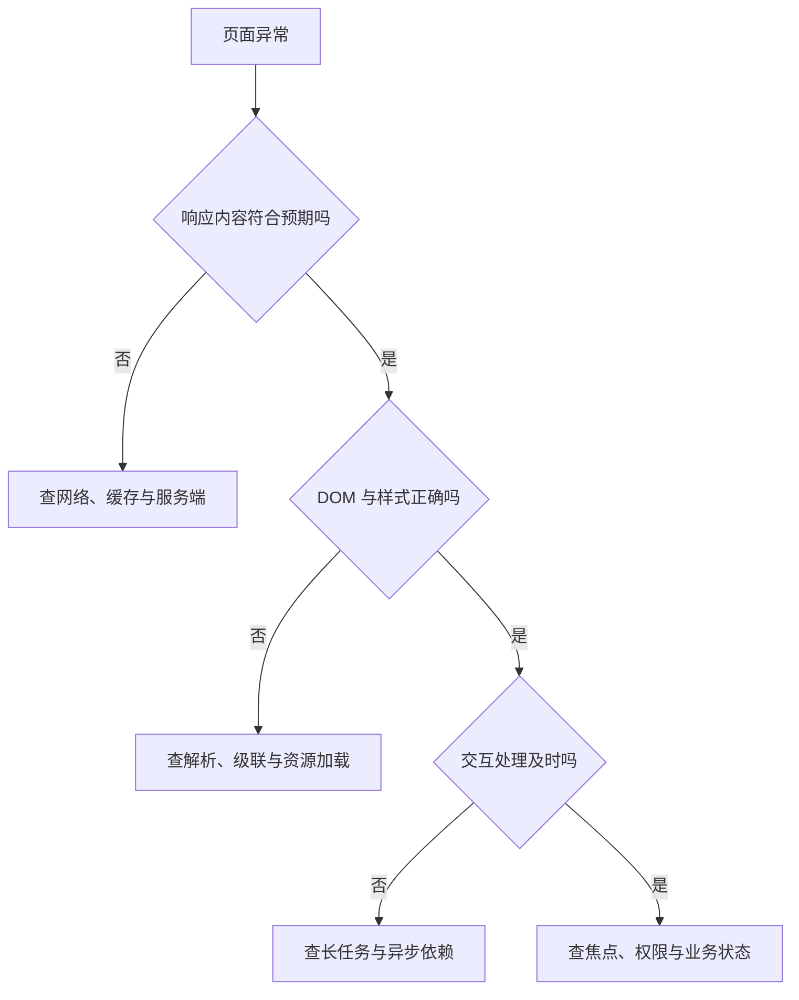

# Web 标准与浏览器运行

> 面向希望解释页面行为的开发者与验收人员。读完能区分语言、浏览器平台和框架的责任，沿着文档加载、脚本执行、渲染与请求的路径定位问题，避免把“浏览器能显示”当成程序已正确完成。

## Web 是契约集合，浏览器是实现者

**Web 标准**是多个组织制定的互操作契约：HTML 定义文档元素与大量浏览器行为，CSS 定义样式与布局，DOM 定义文档对象与事件，ECMAScript 定义 JavaScript 语言。**浏览器 API**是宿主提供给程序的接口，例如 `document`、`fetch` 和存储；它们不是 JavaScript 语言本身的一部分。同一段语言代码运行在服务器中，不一定拥有窗口与文档。

**浏览器引擎**负责实现相应标准，但标准通常约束可观察行为，而不规定每个实现必须使用相同进程、线程或内部数据结构。框架通过这些接口组织应用，也无法替代浏览器的网络策略与布局规则。一个按钮响应慢，可能是服务端慢、脚本占用主线程、布局成本高或组件重复更新；“框架性能差”不足以解释故障。

阅读规范也要区分标准中的要求、正在演进的功能和目标浏览器实际支持。本文复核的是公开机制，不能据此承诺所有历史浏览器一致；具体兼容范围应在项目支持矩阵中记录，并由[性能与兼容专题](/software/frontend/frontend-performance)验证。

## 从资源到可操作页面

浏览器通过 URL 定位资源，经过连接与 HTTP 请求得到响应。服务器返回 HTML 字节并不意味着页面已可交互：还要确定编码、解析文档、加载样式及脚本，应用程序也可能继续请求数据。**DOM**（Document Object Model）是文档的对象树，代码操作的是这棵树，而非原始 HTML 字符串。

HTML 解析包含词法处理与树构建。浏览器对不合法嵌套有规定的恢复行为，因此“查看源码”的层次不一定等于开发者工具中的 DOM。服务端输出与客户端渲染若对结构作出不同假设，就可能在水合时出错。浏览器容错帮助显示内容，不能证明作者的语义结构合理。[HTML 解析规则](https://html.spec.whatwg.org/multipage/parsing.html)

教学上可把显示过程分为样式计算、布局、绘制与合成。**布局**确定几何尺寸和位置，**绘制**产生视觉内容，**合成**将相应图层组织为最终画面；这是一种排障模型，不是每种浏览器每一帧都完整执行四步的承诺。样式变化可能只影响颜色，也可能改变整段文档的几何关系。频繁交错写样式和读取尺寸，可能迫使浏览器提前完成相关布局，具体成本需用性能记录判断。

这条判断路径先确认输入，再确认解释与执行。只盯控制台可能遗漏服务器返回了旧文档、样式文件被缓存，或者按钮根本没有获得焦点等问题。

## 事件循环为什么影响交互

**事件循环**（Event Loop）协调任务、微任务与渲染机会。窗口相关的 JavaScript 通常在对应执行线程中运行；一个执行中的同步回调不会因为用户又点击一下就自动分成两段。耗时的循环、解析大对象或构造大量节点，会推迟后续交互。

**任务**是浏览器调度的一组工作，例如某些事件回调与定时器回调；**微任务**是通常在规定检查点处理的工作，例如 Promise 的后续处理。不能把它们简化成唯一的全局先来后到队列。HTML 规定多个任务来源和微任务检查点，浏览器还有判断渲染时机的规则。不断追加微任务同样可能占住执行机会。[事件循环规范](https://html.spec.whatwg.org/multipage/webappapis.html#event-loops)

`setTimeout(fn, 0)` 表达稍后安排回调，不保证立即执行。`await` 等待一个 Promise，并不会把等待后执行的所有计算自动移到后台。**Web Worker**是在另一执行环境中运行脚本的机制，适合可分离的计算，但不能直接操作窗口 DOM，消息传递也有成本。是否拆工作应依据测量结果与数据边界，而不是看到 `async` 就推断界面不会阻塞。

**事件传播**包括捕获、目标与冒泡等阶段。给父元素注册处理器可以利用传播处理子元素交互，但需要判断真正目标。阻止默认行为与停止传播是两种动作：取消表单默认提交不等于禁止其他监听器执行。原生按钮、链接与表单的默认行为本来就是产品交互的一部分，覆盖前应理解它们。[DOM 事件](https://dom.spec.whatwg.org/#events)

## 源、请求与权限是不同边界

**源**（Origin）通常由协议、主机与端口构成；路径不同不必然跨源，端口不同则可能跨源。**同源策略**限制脚本对其他源资源的某些读取与访问。它不是网络防火墙，也不能保证跨源请求从未发出。

**跨源资源共享**（CORS）是服务器通过响应头允许浏览器共享跨源响应的协议。某些请求会先预检，某些请求可以直接发送。控制台中的 CORS 错误意味着浏览器未按策略向脚本开放相应结果，不意味着服务器没有接收到或处理请求。非浏览器客户端不会把 CORS 当成接口访问控制，服务端仍须认证、授权和必要的跨站请求防护。[Fetch 的 CORS 协议](https://fetch.spec.whatwg.org/#http-cors-protocol)

HTTPS 保护传输并建立服务器身份验证基础，浏览器权限提示则控制摄像头等能力的使用；二者都不能证明业务规则正确。将服务端秘密放进前端包，用户就能取得相应内容，压缩与混淆不会建立可信隔离。处理敏感操作必须回到服务端的权威判断。

## 一次可审计的页面诊断

以虚构的在线文档编辑器为例，用户说“点击保存无效”。先记录浏览器版本、页面 URL、应用版本和复现输入，再依次保留三类证据：事件是否发生，保存请求是否发出，服务端是否保存且响应被界面采用。这些是建议的诊断动作，本文没有运行实际应用。

在网络面板检查方法、状态码、请求载荷、响应类型与耗时；确认响应对应本次编辑，而不是旧请求。查看 DOM 中保存控件的类型、禁用状态与标签。录制性能轨迹判断点击后是否有长时间同步执行。最后查看保存后的权威数据，避免把“请求返回 200”当成编辑已持久化。

| 证据 | 能支持的判断 | 仍需补充 |
| --- | --- | --- |
| 控制台没有异常 | 当前没有被记录的脚本异常 | 网络失败和静默逻辑错误 |
| `DOMContentLoaded` 已触发 | 初始文档解析达到相应阶段 | 图片、后续数据与交互就绪 |
| `load` 已触发 | 相应加载阶段完成 | 应用之后启动的异步工作 |
| 请求成功且返回资源版本 | 服务端给出本次操作结果 | 界面是否采用、持久性契约 |
| 重新读取看到目标内容 | 所选读取路径可见目标内容 | 缓存、副本及多用户并发边界 |

## 失败模式与使用边界

页面首屏出现而按钮无响应，先区分事件没有绑定、脚本未装载与主线程被占用。资源返回 200 却无法执行，检查响应体是否被错误的页面回退替换，以及内容类型是否匹配。两个请求返回顺序颠倒，应由应用确定哪个结果仍有效，浏览器不理解“最新输入”这条业务含义。

| 失败模式 | 原因方向 | 验证与修正 |
| --- | --- | --- |
| 开发正常，发布后空白 | 路径、模块或缓存不匹配 | 读实际响应与部署资源路径 |
| 定时器延迟被当成服务器慢 | 同步脚本占用执行机会 | 结合主线程记录与网络时间 |
| CORS 放行被当成安全完成 | 浏览器共享与业务授权混淆 | 直接请求敏感接口验证权限 |
| 容错 DOM 被当成合法结构 | 解析恢复掩盖嵌套问题 | 比较源码、DOM 与语义检查 |

浏览器机制能解释界面如何执行，不能代替[HTML 与 CSS 的语义和布局](/software/frontend/html-css-responsive)、[组件状态设计](/software/frontend/components-state-routing)以及后端的数据约束。诊断结论应写成“在哪种输入、版本与路径上看到了什么”，才能让下一位维护者继续复核。

## 文档位置与运行环境一起看

同一 URL 在不同条件下可能得到不同内容：已登录会话、缓存验证、服务工作线程或代理都可能影响读取路径。排查要保留是否首次访问、是否刷新以及相应请求头和响应，不能仅记录地址。开发者工具显示的来源、实际网络响应和浏览器最终采用的文档可以交叉核对。

服务器返回 HTML 后继续加载数据的页面，还需要区分文档导航失败与应用取数失败。前者可能导致整个页面无法取得，后者可能只影响一个区域。界面应表达相应故障范围，保留仍可用的内容，诊断也应沿具体区域的请求和状态继续。

诊断要避免把浏览器内部实现图当成跨产品保证。某个引擎的进程隔离、合成策略或调度优化可以帮助解释其行为，通用知识仍应以平台契约为准。记录引擎和版本后，才能把实现细节用于具体结论。

## 参考资料

<Refs>

- [WHATWG：HTML 解析](https://html.spec.whatwg.org/multipage/parsing.html) · [事件循环](https://html.spec.whatwg.org/multipage/webappapis.html#event-loops) · [源](https://html.spec.whatwg.org/multipage/browsers.html#concept-origin)（访问日期 2026-10-03）
- [WHATWG：DOM Standard](https://dom.spec.whatwg.org/)（访问日期 2026-10-03）
- [WHATWG：Fetch Standard](https://fetch.spec.whatwg.org/)（访问日期 2026-10-03）
- [MDN：Populating the Page — How Browsers Work](https://developer.mozilla.org/en-US/docs/Web/Performance/Guides/How_browsers_work)（访问日期 2026-10-03）
- 站内相关：[JavaScript 与浏览器 API](/software/frontend/javascript-browser-apis) · [渲染与框架](/software/frontend/rendering-frameworks) · [认证与授权](/software/backend/authentication-authorization)

</Refs>
