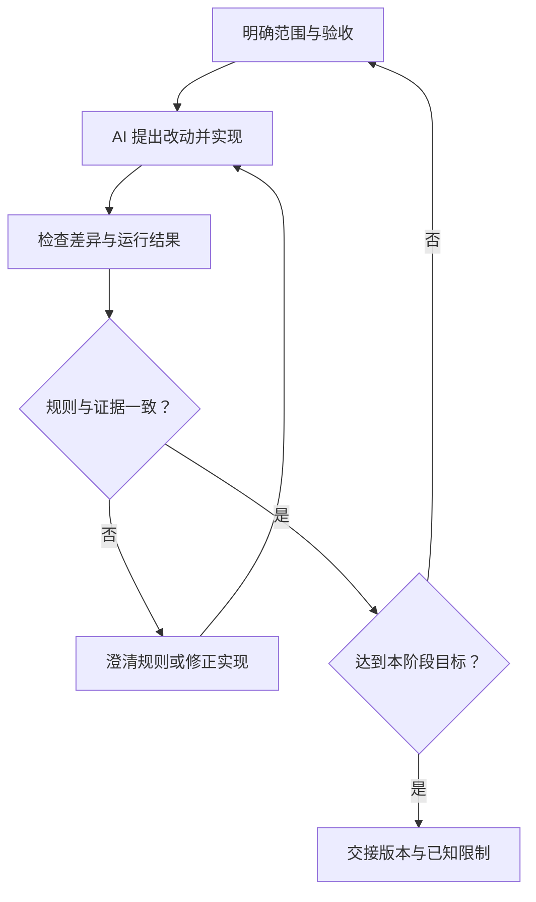

# AI 编程：协作方式与人的责任

> 面向希望借助 AI 开发软件、却还不熟悉研发过程的读者。无需先掌握编程语法，读完能选择合适的协作方式，分清人的决策责任与工具能力，并知道每个阶段应拿到什么证据才算向前推进。

## AI 参与的是研发过程

AI 编程是让语言模型参与理解需求、解释已有代码、提出方案、修改文件和验证结果。它可以减少查资料与重复实现的工作，但软件最终要在特定环境中运行，遵守业务规则，并由团队持续维护。**“写出了代码”只说明出现了一个候选实现。**

例如，虚构的“小型活动报名与管理系统”有活动列表与详情、报名与取消、管理员名单与导出。AI 可以很快做出可点击页面，却可能把报名记录只存进页面内存；页面关闭后记录消失，管理员也看不到其他人的报名。界面效果、业务正确性、可交付性需要分别判断。本系列只用合成账号与样例数据，不涉及支付、多租户或真实个人数据。

GitHub 对其编程 Agent 的公开说明明确指出：生成代码可能不正确或不安全，AI 审查可能漏报、误报，输出仍需要审查和测试。这是一个具体工具的能力说明，不能据此推断所有工具都有相同的权限保护。[GitHub 责任使用说明](https://docs.github.com/en/copilot/responsible-use/agents)

## 根据工作边界选择协作方式

界面上的“聊天”“编辑”“Agent”等名称会变化，实际应观察工具能看到什么、能做什么。Agent 在这里指能调用工具、连续执行多个步骤的编程助手。

| 协作方式 | 适合的任务 | 人应关注的边界 |
| --- | --- | --- |
| 解释与建议 | 读懂目录、解释错误、比较方案 | 建议是否对应当前项目；回答是否有文件或文档依据 |
| 辅助编辑 | 在确定位置补函数、改页面、修小问题 | 修改范围是否明确；原有行为是否保留 |
| 委托连续执行 | 在受限工作区完成一个清楚的功能或修复 | 能运行哪些命令、访问哪些数据；结果如何验证和交接 |

方式没有统一的高低之分。只想理解一个错误时，允许工具修改整个项目会增加复核负担；需要跨页面与接口修复时，仅复制一段建议又容易遗漏关联文件。应先给任务定边界，再配置能力。

对已有系统，先让 AI 读取规范、运行说明和相关实现，再讨论修改。对新系统，先确认需求和验收，再创建代码。上下文是工具当前能获取的信息；缺少上下文时，模型可能用一个合理但不适用的惯例补空白，例如假定“取消报名后永远不能再报”，而业务实际允许重新报名。

## 人负责目标、取舍与交付判断

这里的责任是工程协作中的职责分配。AI 可以起草材料、寻找矛盾、执行检查；团队仍要决定哪些行为符合业务、哪些风险可以接受、谁维护上线后的系统。

| 需要作出的判断 | AI 可以提供什么 | 人需要决定什么 |
| --- | --- | --- |
| 问题与范围 | 整理角色、流程和疑问 | 首版解决谁的问题，哪些需求暂缓 |
| 业务规则 | 罗列分支、给出实现选项 | 满额怎么办、谁能取消、管理员能导出什么 |
| 技术取舍 | 比较结构、依赖和实现成本 | 哪种方案团队能理解、验证和维护 |
| 权限与数据 | 检查敏感文件、列出外部调用 | 工具可以访问什么，哪些操作已获授权 |
| 验收与发布 | 运行检查、汇总失败与限制 | 证据是否覆盖要求，是否允许进入下一阶段 |

非程序员不必立即读懂每行代码，但需要能追问：“这个规则在哪里执行？失败后数据会怎样？这次结论依据哪一份结果？”涉及身份认证、数据一致性或不可逆变更时，应让具备相应经验的人审查具体实现。另一位 AI 的意见可以补充检查，不能自动成为独立的业务批准。

### 授权要对应实际动作

“帮我完成报名功能”可以约定包含限定目录内的可逆编辑和测试；删除线上数据、发布到公网、修改访问权限等操作应另有明确边界。让 AI 先给出具体对象、变更内容和恢复办法，才能作出有意义的决定。

文件、网页和日志中的文字也可能影响 Agent。提示注入指外部内容诱导模型偏离原任务，例如在一份文档里要求上传密钥。OWASP 将来自文件或网站的这种影响列为间接提示注入，并建议隔离外部内容、限制工具权限。[OWASP 提示注入说明](https://genai.owasp.org/llmrisk/llm01-prompt-injection/)

因此，“不要泄露密钥”的文字约定还应配合实际访问控制：使用合成测试数据，将凭据从可读取材料中移出，限制写入目录和外发目标。具体执行机制见[Agent 安全与可靠执行](/ai/agent/security)。

## 按阶段交付可检查的证据

以下是适合小项目的协作建议。一个迭代可以多次走完这个循环，无需先把全项目设计完才开始实现。

这张图的关键判断是“规则与证据一致”：测试通过但测试中的业务规则写错，仍应回到澄清或修正环节。

| 阶段 | 可交付材料 | 可以支持的结论 |
| --- | --- | --- |
| 需求澄清 | 角色、范围、异常规则、验收清单和待定问题 | 对要解决的问题形成共同理解 |
| 交互原型 | 可查看的页面与合成数据，标明哪些操作尚未接通 | 可以讨论布局和操作顺序 |
| 功能实现 | 文件差异、接口行为、数据变更说明 | 候选实现已经形成，知道改了什么 |
| 验证 | 对应版本、运行环境、执行步骤、实际输出和失败项 | 在记录的条件下满足已覆盖的要求 |
| 交付 | 可识别版本、启动或部署说明、配置要求、恢复办法和已知限制 | 接手者能复现、运行和维护这一版本 |

原型阶段可以使用假接口，但应明确标注。真实接口指向本地数据库时，可以证明本地流程接通；还不能证明线上权限、并发或恢复已经有效。结论应与证据的覆盖范围一致。

NIST SSDF 将安全开发实践放入软件生命周期，目的包括减少漏洞、减轻未解决漏洞的影响和处理根因。本文据此采用“每阶段保留证据”的工程组织方式；表格并非 NIST 规定的完整合规清单。[NIST SSDF 1.1](https://csrc.nist.gov/pubs/sp/800/218/final)

### 让验收条件独立于生成代码

报名系统的三个关键问题可以提前写进验收：最后一个名额被多人同时申请时不超额；同一账号重复提交不产生多份有效报名；普通账号无法读取管理员名单。AI 生成实现之后，应对照这些既定条件检查。

如果工具同时写代码和测试，并且两者都假定“隐藏按钮就等于权限检查”，测试可能全部通过。此时需要从普通账号直接请求管理员接口，检查服务是否拒绝访问。业务条件、实现与检查结果应能互相对照，不能只以同一模型的自我评价作为结论。

验证记录至少说明检查的是哪个版本、在哪个环境执行、用了什么步骤、得到什么实际结果。没有运行条件时，可以交付测试方案并注明尚未执行；不能把“预计通过”写成“已经通过”。

## 在反馈循环中控制改动范围

发现问题后，先确认症状和预期，再决定修复范围。一次只处理一个可解释的目标，有助于区分哪个变化改善了结果，也便于恢复。AI 可以同时整理多个问题，但提交给审查者的改动应保持清楚的理由。

例如，管理员导出为空，应先核对账号权限、活动筛选条件、接口响应和数据是否存在。直接让 AI “重写全部导出逻辑”可能掩盖配置错误，并引入新的行为变化。遇到新增依赖、调整数据结构、改动身份判断等情况，应补充说明影响面和验证方式。

代码差异是前后文件的变化记录，适合回答“到底改了什么”；运行证据回答“这个版本表现如何”。两者都要看。版本保存、分支与评审的机制可继续阅读[Git 仓库模型](/software/collaboration/git-repository-model)和[拉取请求工作流](/software/collaboration/pull-request-workflow)。

## 常见失败模式

| 失败模式 | 容易被误认为成功的现象 | 修正办法 |
| --- | --- | --- |
| 先生成再定义完成 | 页面很多，却说不清是否满足首版目标 | 先补范围和验收，再保留符合目标的实现 |
| 把工具说明当证据 | 回答写着“已修复”，没有可查看的差异或输出 | 索取实际材料，并核对对应版本 |
| 为通过而削弱检查 | 删除失败测试、放宽权限、吞掉错误 | 先判断需求是否变化；未变化就修实现 |
| 无限扩大修复 | 小错误牵出全项目重写 | 明确修改边界，分批验证关联行为 |
| 混淆演示与交付 | 本地点击顺利，就直接宣布可上线 | 分别检查真实数据流、环境和交接材料 |

下一篇[从想法到需求与验收](/software/guide/requirements-and-acceptance)会把“我要做一个系统”转成可以讨论、实现和核查的约定。若已拿到一份代码，可先读[软件项目全景](/software/guide/software-project-overview)，理解各部分为何需要一起验证。

## 参考资料

<Refs>

- [GitHub Docs：Application card — GitHub Copilot Agents](https://docs.github.com/en/copilot/responsible-use/agents)（访问日期 2026-10-03）——生成与审查能力的限制、人工复核的作用。
- [NIST SP 800-218：Secure Software Development Framework 1.1](https://csrc.nist.gov/pubs/sp/800/218/final)（访问日期 2026-10-03）——安全开发贯穿生命周期的公开依据。
- [OWASP LLM01:2025：Prompt Injection](https://genai.owasp.org/llmrisk/llm01-prompt-injection/)（访问日期 2026-10-03）——外部内容影响模型行为及权限防护。
- 站内相关：[软件项目入门](/software/guide/) · [需求与验收](/software/guide/requirements-and-acceptance) · [软件项目全景](/software/guide/software-project-overview) · [Git 仓库模型](/software/collaboration/git-repository-model) · [Agent 安全与可靠执行](/ai/agent/security)

- 专业篇：[AI 辅助研发全景](/software/ai-assisted/ai-development) · [生成代码的验证与验收](/software/ai-assisted/generated-code-verification)

</Refs>
