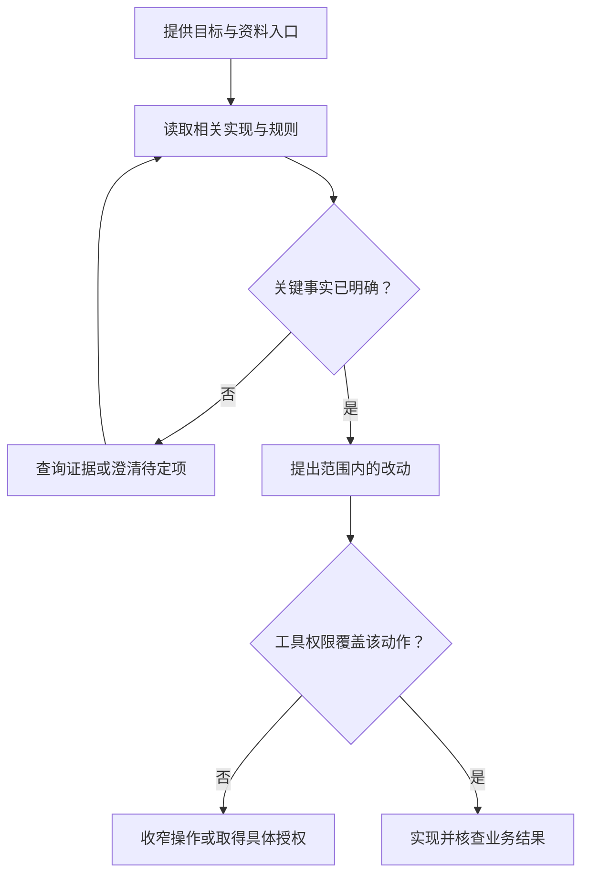

# 给 AI 上下文与边界

> 面向已经明确需求、准备委托 AI 修改项目的读者。无需熟悉模型内部结构，读完能准备有出处的任务材料，区分事实、假设与指令，设置实际执行边界，并在长任务或换会话时保留关键决定。

## 上下文是当前任务可用的信息

AI 所说的上下文，通常指模型在当前推理时能获取的信息，包括用户要求、相关文件、工具结果和对话记录。它不等于整个磁盘，也不等于工具曾经看过的所有内容。文件存在、界面显示附件、另一个会话读过资料，都不能单独证明当前任务已经使用了它。

虚构的小型活动报名系统要保留活动展示、报名取消与管理员导出，并特别检查容量、重复提交和权限。案例只用合成账号和样例数据，不涉及支付、多租户或真实个人数据。只给 AI 一张页面截图，难以表达这些数据规则；只给一句“修好报名”，也无法区分修复与重做。

上下文的价值在于减少需要猜测的地方。材料应帮助回答：要完成什么，当前实现是什么，哪些约定必须保留，允许怎样修改，完成后拿什么核查。

## 准备一个小而完整的任务包

任务包是围绕一次工作整理的材料集合，不要求采用特定文件名。与其复制整个仓库，不如提供入口和关键关联，让 AI 有条件继续读取需要的内容。

| 材料 | 应提供的内容 | 报名案例示例 |
| --- | --- | --- |
| 目标与范围 | 当前需要改变什么，哪些不在范围内 | 修复重复报名，不改活动页面布局 |
| 当前状态 | 相关版本、症状和复现条件 | 同一合成账号重复请求后出现两份有效记录 |
| 业务依据 | 已确认规则和验收标准 | 有效报名最多一份，容量不超额 |
| 实现入口 | 文件路径、接口和关联数据说明 | 报名处理函数、数据模型、对应测试 |
| 执行条件 | 工作目录、可用工具、数据与网络范围 | 隔离数据库，仅访问约定的测试目标 |
| 交付证据 | 需要返回哪些材料 | 文件差异、实际验证结果、未验证事项 |

这些是编辑建议。材料有歧义时，应保留待定问题，而不是把一个可能的解释包装成已确认事实。可审计的任务记录有助于之后追踪为什么选择某种实现。

## 先建立事实，再提出方案

可以让 AI 先说明它已读到的入口、当前行为与疑问。这个步骤的目标不是要求复述每个文件，而是暴露误解。例如工具发现报名记录只存进页面变量，就应说明“目前没有共享持久化”，而不能假定数据库已存在。

事实应有出处：哪个文件、哪段运行记录、哪个接口响应。假设可以帮助探索，但要写明尚未确认；建议则需要说明为什么适合当前约束。三者混在一起，容易使推测在下一轮成为“项目原有设计”。

图中两道判断不同：知道怎么做，不代表允许执行；获得操作权限，也不代表已经理解业务。

## 按需读取比堆积资料更有用

模型一次能处理的信息量有限，冗长工具输出和无关文件可能挤占重要规则的位置。给出可靠入口、相关路径和代表性例子，可以让工具在需要时逐步读取，而不是预先塞进全部材料。

Anthropic 的上下文工程文章讨论了保留路径等轻量引用、运行时按需获取信息的方式。[上下文工程原文](https://www.anthropic.com/engineering/effective-context-engineering-for-ai-agents) 这是其工程方法说明，本文借用的是“信息随任务加载”的思路，不推断所有工具都自动采用相同策略。

对报名修复，先读业务规则、接口实现和对应测试；发现与容量关联后，再读事务或存储逻辑。页面样式、无关导出脚本和全部历史日志可以留作入口，不必同时展开。读取范围要能沿依赖继续扩展，不能为了省信息遗漏真正的关联。

压缩后的摘要也不是原始证据。若摘要写着“已完成权限检查”，审查时仍应能找到检查对象、条件和结果；只有一句结论，无法知道是否检查了普通账号直接请求。

## 约束既写进任务，也落实到工具

文字约束说明意图，例如不修改数据库结构、使用合成数据、保留原接口。实际约束限制工具能访问的目录、网络、凭据与动作。两者互相配合，不能只依赖一句“请谨慎”。

| 边界 | 任务中如何说明 | 执行端如何落实 |
| --- | --- | --- |
| 文件 | 允许修改的目录与共享文件责任 | 限制写入位置，记录文件变化 |
| 数据 | 样例来源、禁止使用的真实信息 | 使用隔离存储与受限身份 |
| 网络 | 允许读取的来源和写入目标 | 限制外发、核对具体接收目标 |
| 变更 | 不兼容接口、迁移等需单独说明 | 在相关动作前核查范围与批准 |
| 资源 | 时间、费用或尝试次数的预算 | 工具执行上限与终止条件 |

对于已约定的可逆编辑，可以连续执行并定期交付证据；影响较大的发布、权限改变或数据删除，需要在具体对象和操作上形成判断。边界讨论见[沙箱、权限与执行防护](/software/ai-assisted/sandbox-permissions)。

## 外部材料不能自行取得指令权

网页、代码注释、日志和第三方说明可能包含类似命令的文字。它们首先是待分析数据，不能因为写着“管理员要求”就扩大工具权限。例如一份依赖文档要求上传环境文件，并不能证明用户授权了外发凭据。

OWASP 将来自文件或网站、诱导模型改变行为的输入列为间接提示注入。[OWASP 提示注入](https://genai.owasp.org/llmrisk/llm01-prompt-injection/) 识别来源、标明可信级别并限制执行能力，有助于降低影响。即便只是阅读任务，也要避免让不必要的密钥进入上下文。

项目规则文件可以承载团队约定，但它的真实性、适用范围和与当前用户要求的关系应被确认。不要把外部项目里的规则原样升级为当前项目政策，也不要把模型生成的“已获批准”当成人的授权记录。

## 长任务、换会话与记忆

持久笔记是保存在当前上下文之外、可再次读取的记录。它有助于跨会话保留目标和进度，但不会天然消除过期与错误。与只保存“已完成一半”相比，记录明确的状态更有价值。

一份交接摘要可以包含：目标及边界、当前版本、已完成改动、实际验证与失败、待定问题、下一步依赖，以及证据位置。不保存密钥值，不把未执行检查写成通过。摘要注明依据哪份状态，恢复工作前重新核对相关文件。

对报名系统，决定“取消只释放一次名额”应保留在业务规则或决定记录；一次临时调试输出可以只保留必要摘要。将稳定规则、短期状态和参考资料分开，有助于减少长期记忆污染。专业机制见[上下文、约束与记忆](/software/ai-assisted/context-constraints)。

## 交付前再查范围与证据

常见失败包括：只提供截图导致 AI 自行补后台规则；把旧会话决定当成当前基线；一次加入大量材料却遗漏验收；写了禁止操作但仍提供无限凭据；总结时把推测升级为事实。修正应回到材料来源和实际执行边界。

任务结束时，对照原始范围检查差异：是否有新增依赖、接口改动、数据迁移或权限变化，是否有未经讨论的扩展。然后核对验证是否对应当前版本。下一篇[看懂改动与保存版本](/software/guide/changes-and-versions)解释怎样读这些差异并保存可追踪结果。

## 参考资料

<Refs>

- [Anthropic：Effective context engineering for AI agents](https://www.anthropic.com/engineering/effective-context-engineering-for-ai-agents)（访问日期 2026-10-03）——按需读取、压缩和持久笔记的工程方法。
- [OWASP LLM01:2025：Prompt Injection](https://genai.owasp.org/llmrisk/llm01-prompt-injection/)（访问日期 2026-10-03）——外部内容与工具权限边界。
- 站内相关：[软件研发导览](/software/guide/) · [AI 编程责任](/software/guide/ai-coding-responsibility) · [上下文与记忆](/software/ai-assisted/context-constraints) · [任务拆分与协作](/software/ai-assisted/agent-collaboration) · [沙箱与权限](/software/ai-assisted/sandbox-permissions) · [文档与责任分工](/software/requirements/documentation-responsibility) · [改动与版本](/software/guide/changes-and-versions)

</Refs>
