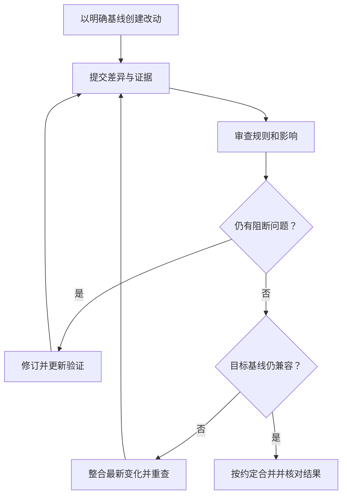

# 分支、PR、审查与合并

> 面向准备把自己或 AI 的改动交给团队共同使用的读者。建议先理解提交和差异，读完能区分分支、拉取请求、审查与合并，识别文本冲突和业务冲突，并判断一份改动何时可以进入主线。

## 分支给变化一个可追踪的方向

分支是指向一系列提交的可移动引用，可以让不同工作沿各自方向推进。它不是复制整个项目的人工文件夹，也不自动隔离数据库、网络和凭据。当前工作树能编辑哪份内容，仍取决于所检出的版本与现有修改。

虚构的活动报名系统可以用一个分支修复重复取消，另一个分支调整管理员导出。两项工作采用合成账号和样例数据，不包含支付、多租户或真实个人数据。分支分开后更容易比较和审查，但共享规则仍可能互相影响。

开始工作应确认从哪个基线出发、目标分支是什么，以及是否已经有人在处理相关规则。分支名说明用途，具体提交标识说明内容；名称相同不保证两个人看到相同版本。

## PR 组织一次合并提议

拉取请求（PR）是托管平台中提议把来源分支变化合入目标分支的协作记录；一些平台称为合并请求（MR）。它把差异、讨论、检查和决定放在同一入口。GitHub 的 PR 审查说明提供了评论、批准与要求修改等状态。[PR 审查说明](https://docs.github.com/en/pull-requests/reference/pull-request-reviews)

PR 不等于已批准，也不等于已部署。作者可以先交付可审查草稿，再补齐证据；完成目标后再进入合并决定。平台允许的按钮动作与团队接受标准，应分别核对。

| 对象 | 主要作用 | 不能单独证明什么 |
| --- | --- | --- |
| 分支 | 组织一条变化方向 | 业务规则已经正确 |
| PR/MR | 提供差异与协作入口 | 审查已经覆盖风险 |
| 自动检查 | 执行配置的程序化判断 | 所有需求都被检查 |
| 人工审查 | 判断设计、行为和证据 | 未执行的环境行为已成立 |
| 合并 | 将变化纳入目标历史 | 线上已经更新或数据可回退 |

## 作者要交付可审查的具体变化

说明应以问题和结果为中心。例如：“有效报名被重复取消时，旧逻辑会多次增加余量；现在只在状态从有效转为已取消时释放一次，并增加重复取消检查。”接手者能据此找到关键逻辑和验收，而不是只看到“优化代码”。

还应说明影响范围、兼容或迁移要求、实际执行的验证与限制。引用测试输出时，明确对应版本和条件；没有执行，就列出待检查的方案。AI 生成的完成报告应与文件差异、工具记录逐项对照。

范围适中的 PR 通常更容易发现错误，但大小不能只按行数判断。一次跨界面的协议改动可能必须同时更新后端、前端和测试；无关格式化或依赖升级则可以分开，减少审查噪声。详见[代码审查与变更证据](/software/collaboration/code-review-evidence)。

## 审查关注规则与失败路径

审查者先理解目标，再检查关键行为：身份来源是否可信，容量条件是否在并发下成立，重复取消是否只释放一次，拒绝与未知结果怎样处理。代码风格有价值，但应避免用格式问题替代业务判断。

| 审查问题 | 可以查看的证据 | 案例中的重点 |
| --- | --- | --- |
| 是否解决原问题 | 需求、旧行为与新结果 | 重复取消后的最终余量 |
| 是否改变其他约定 | 接口与相关调用 | 已取消状态返回是否兼容 |
| 是否保留访问边界 | 身份、对象归属与拒绝检查 | 普通账号不能取消别人的记录 |
| 是否具备有效验证 | 用例前提、断言和实际结果 | 不只检查响应文字，还检查状态 |
| 是否能交接或恢复 | 配置、迁移和版本说明 | 数据变更与旧代码兼容性 |

审查意见宜指出具体触发条件、影响与建议，而不是只写“不好”或“建议重构”。作者修订后，应重新检查受影响内容；新增关键变化不能沿用旧审查结论不加判断。

作者回应问题时，可以说明采用了什么改动、对应证据在哪里；不同意某项建议，也应说明规则或实现依据。一个讨论被标为已解决，只说明协作记录的状态，不能替代实际修复。仓库可以按风险要求指定审查者和必要检查，但平台门槛需要正确配置。对权限或数据规则等关键变化，即使按钮允许合并，责任人仍应确认当前差异和证据覆盖了约定条件。

第二道判断处理共同主线已经变化的情况。单独分支通过检查，不自动代表与当前主线组合后仍正确。

## 文本冲突与业务冲突是两类问题

Git 合并通常利用共同祖先与两端内容确定怎样组合变化；无法自动组合时，工作树会标记需要处理的位置。[Git merge](https://git-scm.com/docs/git-merge) 冲突不是证明某一方写错，而是要求人理解双方意图。

例如一方修改取消逻辑，另一方在相同位置加入权限检查，应组合成“先判断身份和对象，再完成受控状态转换”，而不是简单保留看起来更长的一边。处理完标记后，还需检查语法与行为。

有些错误没有文本冲突：一方改变接口字段，另一方继续读旧字段；一方改变容量口径，另一方仍导出全部历史记录。Git 可以成功合并不同文件，却不了解业务约定。集成验证负责发现这些组合问题。

遇到不理解的冲突，应查看共同祖先、两侧改动理由与相关检查，再请求责任人澄清。批量选择一侧可能丢失另一方必要行为。完整策略见[分支、合并与冲突](/software/collaboration/branches-merges-conflicts)。

## 合并方式影响历史阅读

| 方式 | 历史怎样组织 | 适合考虑的情境与代价 |
| --- | --- | --- |
| 保留合并提交 | 留下分支整合节点 | 有助于追踪整条工作；历史可能较复杂 |
| 压缩为一个提交 | 将一组改动组织为一个主线变化 | 适合单一目标；分支中间步骤不直接保留在主线 |
| 重新组织线性提交 | 按团队约定重放或整理变化 | 历史更线性；提交标识和共享协作边界需处理 |

不同平台具体实现与权限可能不同，应遵守仓库策略。导览不要求每个团队采用同一种方式，也不建议在不了解他人依赖时改写共享历史。重要的是能定位最终内容、解释变化并找到验证记录。

合并后核对目标分支中的结果，并按风险执行必要集成检查。如果流水线自动部署，合并可能触发外部动作，应提前了解触发关系；合并权限与发布职责也应明确。

## 回退仍需判断数据与外部影响

发现问题，可以通过新的纠正变化撤销部分效果，但已发生的数据写入、导出或权限调整不会被 Git 自动撤销。若一个合并包含迁移，应检查旧代码是否仍能读取当前结构，再决定代码回退、向前修复或数据恢复。

常见失败是把自动检查通过当成批准，把“没有冲突”当成兼容，把已关闭 PR 当成已合并，或只复核旧版本。通过明确的差异、责任和证据，才能让主线变化有可审计理由。

下一篇[验证与验收成果](/software/guide/verification-acceptance)进一步区分局部测试、系统验收和发布准备，说明不同材料能支持哪些结论。

## 参考资料

<Refs>

- [Git：git-merge](https://git-scm.com/docs/git-merge)（访问日期 2026-10-03）——共同祖先、组合变化与冲突处理。
- [GitHub Docs：Pull request reviews](https://docs.github.com/en/pull-requests/reference/pull-request-reviews)（访问日期 2026-10-03）——审查状态与协作流程。
- 站内相关：[软件项目入门](/software/guide/) · [改动与版本](/software/guide/changes-and-versions) · [PR 工作流](/software/collaboration/pull-request-workflow) · [分支与冲突](/software/collaboration/branches-merges-conflicts) · [代码审查证据](/software/collaboration/code-review-evidence) · [验证与验收](/software/guide/verification-acceptance)

</Refs>
