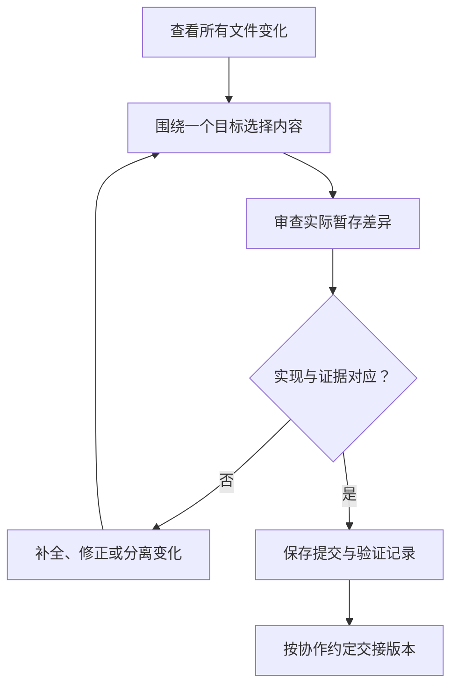

# 看懂改动与保存版本

> 面向已经由自己或 AI 修改过项目、希望确认改了什么并保存成果的读者。认识文件与仓库即可阅读，读完能区分工作区、暂存内容和提交，读懂差异的业务含义，并为撤销和交接保留明确版本。

## 保存文件与保存版本是两个动作

编辑器保存把内容写到当前文件；Git 提交把选定内容记录成一个可引用的版本。暂存区是准备下一次提交内容的地方，它可以与当前磁盘文件不同。比如一个文件先暂存，再继续修改，下一次提交通常记录已暂存的那份，而非后来所有变化。

虚构的小型活动报名系统正在修复重复取消后名额多次释放的问题。案例只用合成账号和样例数据，不包含支付、多租户或真实个人数据。保存这次修复时，目标应是形成可解释、可验证的变化，而不是把目录中所有新文件一起收入历史。

Git 状态会区分工作区与暂存区的差异，也报告未跟踪文件。[Git status](https://git-scm.com/docs/git-status) 因而“没有看到差异”要先问查看的是哪两份内容；尚未跟踪的文件也不会自动出现在普通文件差异中。

| 状态 | 表示什么 | 交付前的判断 |
| --- | --- | --- |
| 工作区修改 | 当前文件与暂存内容不同 | 是否属于本次目标，是否需要纳入 |
| 已暂存变化 | 已选择进入下一次提交的内容 | 是否完整，有无误选或遗漏 |
| 未跟踪文件 | 尚未纳入 Git 管理 | 是新增源码、样例，还是临时产物 |
| 已提交版本 | Git 已保存的选定快照 | 是否对应说明和验证结果 |
| 远端已有版本 | 版本已通过交换到另一仓库 | 是否进入目标分支，仍不等于已部署 |

## 先看范围，再读具体变化

差异比较回答“相对于什么，哪些内容发生变化”。工作区对暂存区、暂存区对上次提交、两个已保存版本之间，都能比较，但结论不同。[Git diff](https://git-scm.com/docs/git-diff)

下面是仓库根目录中的只读教学命令，未在案例中执行：

```bash
git status --short
git diff --stat
git diff
git diff --cached
```

先看文件清单和变化规模，发现与任务无关的目录、依赖或配置；再看具体行。最后检查暂存差异，确定实际将记录的内容。工具显示的统计只是定位入口，行数少也可能改变关键权限。

如果修复取消规则，却出现全部页面格式化、依赖升级和环境配置变化，应询问每项变化的理由。不要一概认为“自动生成所以没影响”，也不要为了让清单好看而删掉必要迁移。判断应基于作用和关联。

## 将文本差异翻译成行为差异

常见差异视图用减号表示旧内容、加号表示新内容；周围保留的行帮助理解上下文。下面是未运行的伪代码差异，表达判断顺序，而不是某种框架的完整实现：

```diff
- 只要收到取消请求，就释放一个名额
+ 先确认该账号拥有有效报名
+ 只有有效状态成功转为已取消，才释放一个名额
+ 已取消状态再次收到请求时，返回当前状态
```

读者应从这份变化问出三个问题：状态归属是否检查，转换与释放是否共同成立，重复请求是否保持同一结果。增加几行判断看起来合理，却仍可能在并发取消时重复释放，需要对应检查。

| 变化类型 | 表面上看到什么 | 需要进一步判断什么 |
| --- | --- | --- |
| 条件变化 | 多一个判断或改比较符号 | 临界值、空值与拒绝路径是否正确 |
| 调用变化 | 换一个函数或接口 | 输入、返回和失败处理是否兼容 |
| 数据变化 | 新字段、迁移文件 | 已有数据、旧代码和恢复是否适用 |
| 依赖变化 | 清单与锁文件更新 | 为什么需要，是否影响构建与运行 |
| 测试变化 | 新增或删改断言 | 检查是否更有效，还是绕过失败 |
| 配置变化 | 地址、权限或开关调整 | 目标环境和访问范围是否改变 |

非程序员可以先核查目标、影响与实际输出；不能理解的关键代码应交给相应开发者审查。AI 可以解释差异，但它的解释仍需对应真实文件，不能以解释替代文件内容。

## 以一个可解释目标组织提交

提交是一次明确的版本记录，不需要等整个系统完成。通常将同一目标所需的实现、测试和说明放在一起，让接手者能理解为什么变化以及如何验证。多个无关目标混合后，审查、定位和恢复都会更困难。

报名修复可以包含状态转换逻辑、重复取消用例和相关接口说明；更换主题颜色通常是另一个目标。拆分也不能机械按文件分割：一个业务变化可能跨多个文件，分开记录反而产生不能运行的中间状态。



图中的“对应”包括验证所用版本与将提交的内容一致。测试之后继续修改代码，先前通过的结果不能自动覆盖新增变化。

## 版本标识连接代码与证据

提交标识可以精确引用一个 Git 版本；分支名则随新的提交移动。发布编号可以关联一次交付，但应知道它对应哪个提交、构建和配置。文件时间、聊天里的“最新版”或远端默认分支名称，都不足以稳定定位一份结果。

可以记录“目标：取消只释放一次名额；版本：具体提交；证据：合成数据、执行条件与实际结果；限制：未验证的范围”。如果检查发生在未提交工作区，应同时保留其差异状态，不能借用旧提交标识假装代码完全相同。

Git 不自动保存被忽略的运行数据、数据库内容或外部服务设置。代码版本有了历史，不代表业务数据有备份。配置与数据的独立保存见[配置、密钥、权限与数据](/software/guide/configuration-secrets-data)。

## 撤销前先说明撤销什么

撤销有几种不同目标：取消暂存但保留编辑，恢复某个文件，反向撤销已提交变化，或让运行环境返回先前版本。它们不是一个通用按钮。

Git `restore` 可以用指定来源恢复工作树或暂存区内容，可能覆盖当前变化；`revert` 则通过新提交记录对已有变化的反向操作。[文件恢复](https://git-scm.com/docs/git-restore) · [反向提交](https://git-scm.com/docs/git-revert) 本篇不提供直接丢弃工作区的示例命令，操作前应确认对象与保留材料。

| 所处情况 | 优先做的判断 | 需要保留的边界 |
| --- | --- | --- |
| 修改尚未保存为版本 | 是否有其他人的工作、是否需备份差异 | Git 无法保证恢复从未记录的内容 |
| 已提交但未共享 | 是否需要修正或重新组织 | 核对工具具体影响与项目约定 |
| 已共享给协作者 | 他人是否基于它继续工作 | 通常保留可追踪的纠正记录 |
| 已上线且改变数据 | 旧代码能否读取现在的数据 | 代码反向变化不自动撤销数据 |

撤销同样需要验证。取消修复被撤销后，旧缺陷可能回来；数据库结构已改变时，简单换回旧代码可能不能启动。机制详见[提交、差异、历史与撤销](/software/collaboration/commits-history-undo)。

## 常见失败模式与下一步

只读工作区差异而漏掉暂存文件，会使记录内容与预期不符；只看通过声明，会遗漏测试削弱；把临时名单或凭据收入仓库，会增加后续处理；未经协调改写共享历史，会打乱别人的基线。

开始修改前保存初始状态，提交前审查内容，交接时标注版本和证据，是一条可重复的习惯。接下来[分支、PR、审查与合并](/software/guide/branches-review-merge)解释怎样让一个版本进入共同使用的主线，以及合并后还需要判断什么。

## 参考资料

<Refs>

- [Git：git-status](https://git-scm.com/docs/git-status)（访问日期 2026-10-03）——工作区、暂存与未跟踪状态。
- [Git：git-diff](https://git-scm.com/docs/git-diff)（访问日期 2026-10-03）——不同内容层次的比较。
- [Git：git-restore](https://git-scm.com/docs/git-restore)（访问日期 2026-10-03）——恢复来源与目标。
- [Git：git-revert](https://git-scm.com/docs/git-revert)（访问日期 2026-10-03）——以新提交记录反向变化。
- 站内相关：[软件研发导览](/software/guide/) · [Git 仓库模型](/software/collaboration/git-repository-model) · [提交与撤销](/software/collaboration/commits-history-undo) · [代码审查证据](/software/collaboration/code-review-evidence) · [版本与基线](/software/collaboration/tags-versions-baselines) · [分支与合并导览](/software/guide/branches-review-merge)

</Refs>
