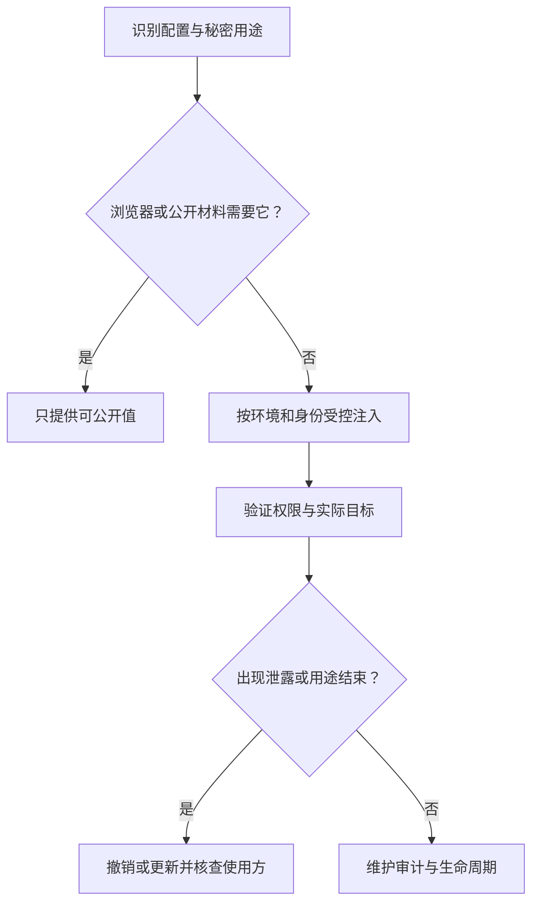

# 配置、密钥、权限与数据

> 面向准备运行、接管或发布项目，却容易把配置文件和数据当成普通代码的读者。理解前端、后端和存储的基本分工即可阅读，读完能区分可共享配置与秘密、识别权限层次，并为数据保存、恢复和清理建立明确边界。

## 相同代码可以产生不同影响

配置是程序使用的可变参数，例如服务地址、数据库连接、端口和功能开关。代码不变，连接目标或账号权限改变，行为和影响范围就可能完全不同。

虚构的小型活动报名系统只使用合成账号、样例活动和报名数据，不涉及支付、多租户或真实个人数据。本地演示应连接隔离存储；把数据库地址换成另一目标，不是无影响的文字修改。

秘密是需要限制访问的认证或加密材料，例如服务令牌、数据库凭据和私钥。秘密通常也是配置的一部分，但不能因此与普通配置采用相同传播方式。Twelve-Factor 的配置原则要求区分随部署变化的值与代码。[配置分离](https://12factor.net/config)

| 材料 | 可以怎样共享 | 不能据此推断什么 |
| --- | --- | --- |
| 无凭据配置模板 | 说明变量名称、含义和占位值 | 名称存在就会被程序自动加载 |
| 环境专用配置 | 通过受控渠道提供给对应环境 | 配置文件一定不会被打包 |
| 秘密值 | 交给必要身份，通过受控机制注入 | 环境变量本身具有加密作用 |
| 合成样例数据 | 标明来源与构造方法后用于检查 | 能代表全部实际数据情况 |
| 运行产生的数据 | 按用途、权限和生命周期保存 | Git 代码历史包含它的备份 |

## 配置从哪里来，需要明确优先级

程序可能读取文件、环境变量、启动参数或远端配置。多个来源同时存在时，覆盖顺序由工具和项目规则决定。文件名相同、放在相同位置，也可能因启动方式不同而没有被加载。

一份教学配置约定可以说明：活动接口地址用于页面请求，数据库目标只给后端使用，报名截止采用统一时区。变量值需要解析和校验；缺少必须值应产生明确启动或请求错误，而不是悄悄连到默认未知目标。

环境变量常以字符串形式提供，数字、布尔值和列表需要按约定转换。把字符串“false”直接当成非空值判断，可能得到与业务意图相反的结果。配置类型与范围检查应和源代码规则一起维护。

前端构建工具可能把部分配置写入浏览器资源。可供浏览器下载的值应按公开信息处理；不要把数据库密码或服务私钥放进去。哪些变量被公开由工具约定决定，不能仅靠变量名称猜测。

## 秘密需要完整生命周期

秘密管理包含创建、分发、使用、更新、撤销和审计。把值从源码挪到一个文件只是减少一种暴露渠道，还要考虑文件权限、备份、日志、构建和工具读取。

OWASP 的秘密管理资料讨论了自动化轮换、动态秘密及撤销等机制。[秘密管理指导](https://cheatsheetseries.owasp.org/cheatsheets/Secrets_Management_Cheat_Sheet.html) 更新服务凭据时，要确认使用方切换并验证新值，再按计划撤销旧值；不能只改配置而忘记依赖端。

这里讨论服务秘密，不把所有用户密码一概安排为固定周期轮换。不同认证材料有不同策略，泄露后的处理也应根据实际有效范围制定。

若秘密已被提交，删除当前文件或添加忽略规则不能使已获得该值的人失去能力。应先处理有效凭据的撤销或更新，再处理历史传播与相关记录。秘密不应进入给 AI 的普通任务上下文。

## 权限有不同层次

认证确认身份，授权判断这个身份能对哪些对象做什么。操作系统文件权限、数据库权限、托管平台角色和业务管理员权限属于不同层次，不能互相替代。

报名系统中，数据库连接成功只说明服务身份能连接；普通参与者能登录，也不说明可以导出名单。隐藏入口改善界面，服务端仍要检查每个请求及目标对象。OWASP 授权资料强调请求级检查。[授权指导](https://cheatsheetseries.owasp.org/cheatsheets/Authorization_Cheat_Sheet.html)

| 身份或位置 | 必要能力 | 应避免的额外能力 |
| --- | --- | --- |
| 浏览器页面 | 使用公开信息和当前用户允许的业务接口 | 直接获得数据库管理凭据 |
| 参与者账号 | 查看自己的报名，按规则报名取消 | 读取全部名单或修改别人状态 |
| 管理员账号 | 取得约定活动名单与导出 | 自动取得基础设施全部权限 |
| 业务服务 | 按业务访问必要数据 | 无理由使用数据库超级管理身份 |
| 构建与发布工具 | 完成本次准备或发布 | 长期保留无关环境的凭据 |

最小权限是只提供完成工作所必需的能力。它需要实际配置和验证，不是一句“谨慎使用”。还要确定权限撤销后缓存、会话和工具是否仍能使用旧能力。

## 数据保存与备份独立于代码

源码仓库保存工程输入，数据库或文件存储保存运行状态。代码回退通常不会把已发生报名恢复到旧时点；数据库备份也不等于运行环境和配置都已恢复。

报名数据应明确保存位置、结构版本和查询口径。迁移改变结构时，先判断当前记录如何转换、旧代码能否读取、失败时怎样恢复。样例初始化应只针对隔离数据，避免用通用重置操作处理未知目标。

备份是为了在约定情境下恢复，需要知道范围、保存周期、访问权限与恢复步骤。只有备份文件存在，不能证明它可读取、完整或适用于当前代码。使用合成数据演练恢复，再对照有效名单与容量，是可核查的方法；本文没有执行这种演练。

恢复还有时间边界：恢复到过去的状态可能丢失后来合法报名，补录或对账需要另外安排。进一步见[导入、数据质量与恢复](/software/data/data-quality-recovery)。

## 日志和导出同样属于数据边界

日志记录请求与错误，导出文件记录业务结果，二者可能产生新的数据副本。即使原数据库权限严格，副本放进公开目录仍可能破坏边界。

OWASP 日志指导列出访问令牌、认证密码等不应直接记录的内容。[日志保护](https://cheatsheetseries.owasp.org/cheatsheets/Logging_Cheat_Sheet.html) 可以保留合成对象标识、请求关联、状态和错误分类，而不把全部输入原样打印。审计与排障需要信息，信息量应与用途相配。

管理员导出应确认活动范围、字段和时点，明确文件保存与清理方式。例子中的数据均为合成数据；实际应用还需依其用途和适用要求制定数据生命周期，不能从示例推导通用保留期限。

## 上线前怎样核对

核查可以从配置来源到实际目标逐步进行：模板是否与程序要求一致，必须值是否校验，浏览器资源是否只含公开值，服务身份是否受限，普通账号是否被拒绝，数据是否持久，日志是否去掉秘密。

常见失败是直接打印全部环境变量、把测试与线上配置混用、用管理员权限消除所有错误、只备份代码、忘记导出和日志副本。每项处理都应说明对象、目的和结果，避免用一个宽泛开关代替逐层判断。

下一篇[从本地到线上](/software/guide/local-to-production)以这些边界为前提，讨论产物、运行环境、入口与数据怎样组成一次可交付部署。

## 参考资料

<Refs>

- [The Twelve-Factor App：Config](https://12factor.net/config)（访问日期 2026-10-03）——部署配置与代码分离。
- [OWASP：Secrets Management Cheat Sheet](https://cheatsheetseries.owasp.org/cheatsheets/Secrets_Management_Cheat_Sheet.html)（访问日期 2026-10-03）——服务秘密生命周期与撤销更新。
- [OWASP：Authorization Cheat Sheet](https://cheatsheetseries.owasp.org/cheatsheets/Authorization_Cheat_Sheet.html)（访问日期 2026-10-03）——身份、对象与请求级授权。
- [OWASP：Logging Cheat Sheet](https://cheatsheetseries.owasp.org/cheatsheets/Logging_Cheat_Sheet.html)（访问日期 2026-10-03）——日志中的秘密与敏感数据边界。
- 站内相关：[软件研发导览](/software/guide/) · [环境配置](/software/toolchain/environment-configuration) · [身份与权限](/software/backend/authentication-authorization) · [密钥与审计](/software/security/secrets-permissions) · [应用安全](/software/security/application-security) · [隐私生命周期](/software/security/privacy-lifecycle) · [本地到线上](/software/guide/local-to-production)

</Refs>
