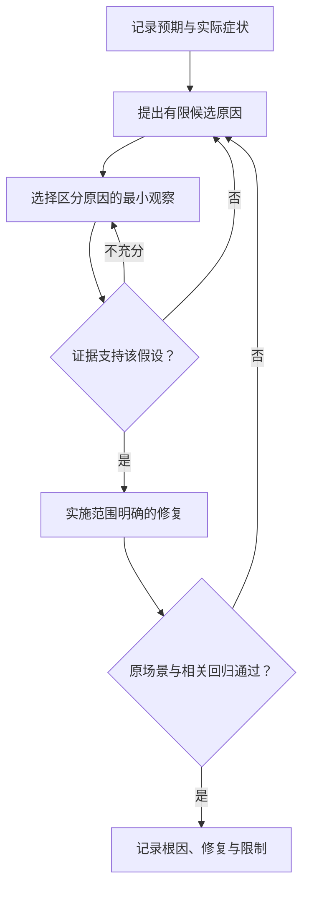

# 定位问题与修复

> 面向遇到报错、页面异常或业务状态不一致，准备自己或让 AI 修复的读者。建议先理解一次请求经过哪些组件，读完能记录可复现症状、用观察缩小原因、控制改动范围，并区分暂时恢复与真正解决缺陷。

## 症状是线索，还不是根因

“报名失败”可能意味着按钮没有发送请求、服务拒绝身份、数据保存失败，或保存成功但响应丢失。根因是产生问题的机制与条件；错误文字只是某一层的观察，不能直接当作全部原因。

虚构的小型活动报名系统采用合成账号和样例数据，支持活动查看、报名取消、管理员名单与导出，不涉及支付、多租户或真实个人数据。本篇所有诊断情境是教学设计，没有执行案例应用。

开始时先说明预期与实际：哪个账号、哪个活动、什么动作、何时发生、能否重复、影响哪些人和状态。与“请把项目修好”相比，这些信息能减少无关修改，也使修复后可以重新检查同一问题。

## 保存最小但足够的现场

现场记录包含复现条件、环境与版本，以及相关输出。应保留最早的有效错误，而不是只截取最后一行“启动失败”。日志中的因果链、请求关联和近期变化，也可能比错误数量更有帮助。

| 信息 | 为什么需要 | 案例中的记录方式 |
| --- | --- | --- |
| 版本与环境 | 避免在不同代码或数据上比较 | 提交标识、运行目标、配置差异 |
| 操作前状态 | 判断触发条件 | 开放活动、有效报名、当前余量 |
| 复现步骤 | 使别人能观察同一现象 | 合成账号重复取消的操作顺序 |
| 实际结果 | 区分界面与业务状态 | 页面提示、接口结果、最终名单 |
| 近期变化 | 提供候选原因 | 是否修改接口、依赖、配置或迁移 |

记录不应包含令牌、密码或不必要的敏感信息。OWASP 日志指导明确列出不宜直接记录的访问令牌和认证密码等内容。[日志数据边界](https://cheatsheetseries.owasp.org/cheatsheets/Logging_Cheat_Sheet.html) 给 AI 的日志也应先按此边界整理。

## 沿请求找到最早偏离的位置

先观察页面是否发送请求，再看目标地址、请求参数和响应，随后查看服务端处理与数据终态。每一步比较预期，找出最早偏离的边界，避免同时重写多个组件。

Chrome 开发者工具的 Network 面板可以查看请求头、响应以及请求发起关系。[网络活动检查](https://developer.chrome.com/docs/devtools/network/) 其他浏览器也有相应工具；面板名称不同，不影响“观察实际请求”的方法。

| 现象 | 候选边界 | 有助于缩小原因的观察 |
| --- | --- | --- |
| 点击后没有请求 | 事件、表单或页面状态 | 事件是否触发，是否被校验阻止 |
| 请求发往旧地址 | 配置、构建或代理 | 当前页面实际使用哪个服务目标 |
| 接口拒绝 | 身份、权限或业务规则 | 拒绝原因是否符合当前状态 |
| 服务异常 | 处理逻辑或外部依赖 | 最早异常与关联调用结果 |
| 成功响应但状态错误 | 事务、模型或错误返回 | 数据是否提交、查询是否同一环境 |
| 只在并发下出现 | 竞争、时序或共享状态 | 同步构造竞争条件并观察终态 |

网络可达不等于应用身份有效；数据库可以连接也不代表事务正确。不同观察应支持不同结论，而不是以一次成功连接排除所有相关问题。

## 提出可以被反驳的假设

假设应包含明确因果，并给出能区分它与其他原因的检查。Google SRE 的排障方法讨论了怎样用实验排除候选原因。[有效排障原文](https://sre.google/sre-book/effective-troubleshooting/) 本文采用这条思路组织小项目诊断，不要求复制其全部运维流程。

例如“导出为空，因为页面仍请求旧接口”可通过实际请求地址检验；若地址正确而服务返回空列表，就需要转向筛选和数据状态。“系统可能坏了”则没有明确检查方式。

近期变化是候选线索，不能仅因问题发生在一次升级后，就认定升级是根因。比较时保持相同账号、数据和配置，观察哪个条件改变了结果。如果只能证明重启后暂时恢复，应保留这一事实与未知原因；进一步调查需要能区分资源泄漏、依赖故障和状态错误的观察。

检查优先采用只读、低影响方式。需要写入或模拟故障时，使用隔离环境和合成数据，明确恢复方法；不要为了验证一个猜测先删除未知数据库。

## 用重复取消解释最小修复

假设原实现收到取消请求就增加余量，没有确认报名是否仍有效。第一次取消得到正确结果，第二次却再次释放名额。这个机制会导致容量显示与有效名单不一致。

修复目标可以明确为：只在有效状态成功变为已取消时释放一次名额，并检查记录归属。如果存在并发取消，状态转换与余量变化还需共同受控，不能仅在前端禁用按钮。

这项修复不必顺便替换页面框架或重命名全部字段。若发现当前模型无法表达正确转换，应说明为何需要扩大范围，列出关联影响，再调整方案。变更预算是对这次允许改变哪些对象与行为的约定，详见[任务拆分与变更预算](/software/ai-assisted/agent-collaboration)。

## 让调试工具回答具体问题

断点可以暂停程序，以观察当前变量和调用路径；日志可以记录程序运行时的事件；追踪可以关联跨组件请求。工具的选择应取决于需要观察什么，而不是全部同时打开。

暂停并发程序会改变时序，可能使竞争问题消失。增加大量日志也会影响性能并产生噪声。对偶发问题，应保存触发条件、采用有界观察，并结合可重复的竞争场景分析。

给 AI 的任务可以要求先给出依据和假设，再提出最小改动。输出应指向真实文件和实际观察，不能只要求模型“解释为什么一定有效”。IDE 与工具细节见[IDE、调试与开发工具](/software/toolchain/ide-debugging)。

## 修复后检查原场景和周边行为

原问题不再出现是必要条件，还需检查关联行为。重复取消修复后，应核对正常取消、无权取消、取消后重新报名和管理员名单。拒绝所有取消虽然避免重复释放，却也破坏了合法功能。

回归测试应保留能触发原缺陷的条件；若只检查新代码存在某个判断，就可能在后来重构时失去保护。测试关注行为，代码审查解释实现，二者互补。

暂时重启可能恢复服务，却没有解决引发异常的条件。应区分止损动作与根因修复：恢复后保留现场和待调查项，再安排有证据的改动。生产故障中的分工和手册见[故障响应、手册与复盘](/software/operations/incident-response)。

## 常见失败模式与交接

看到错误就升级全部依赖，可能增加变量；不断重试直到通过，会隐藏不稳定；捕获所有异常并返回成功，可能让业务状态更难确认；只改测试预期，会让原缺陷失去观察。

交接修复时写清：症状与影响、触发条件、原因依据、实际变化、验证版本和结果、未验证事项。原因仍不确定时可以交付临时缓解，但应明确它的边界，避免把“暂时正常”写成“已经彻底解决”。

下一篇[配置、密钥、权限与数据](/software/guide/configuration-secrets-data)进一步说明那些不能靠改页面解决的运行边界，也是本地排错与上线前经常遗漏的部分。

## 参考资料

<Refs>

- [Google SRE：Effective Troubleshooting](https://sre.google/sre-book/effective-troubleshooting/)（访问日期 2026-10-03）——假设、观察与区分候选原因。
- [Chrome DevTools：Inspect network activity](https://developer.chrome.com/docs/devtools/network/)（访问日期 2026-10-03）——请求、响应与发起关系检查。
- [OWASP：Logging Cheat Sheet](https://cheatsheetseries.owasp.org/cheatsheets/Logging_Cheat_Sheet.html)（访问日期 2026-10-03）——日志内容与敏感信息边界。
- 站内相关：[软件研发导览](/software/guide/) · [请求链路](/software/guide/request-through-system) · [IDE 与调试](/software/toolchain/ide-debugging) · [调试与缺陷](/software/quality/debugging-defects) · [故障响应](/software/operations/incident-response) · [配置与数据](/software/guide/configuration-secrets-data)

</Refs>
