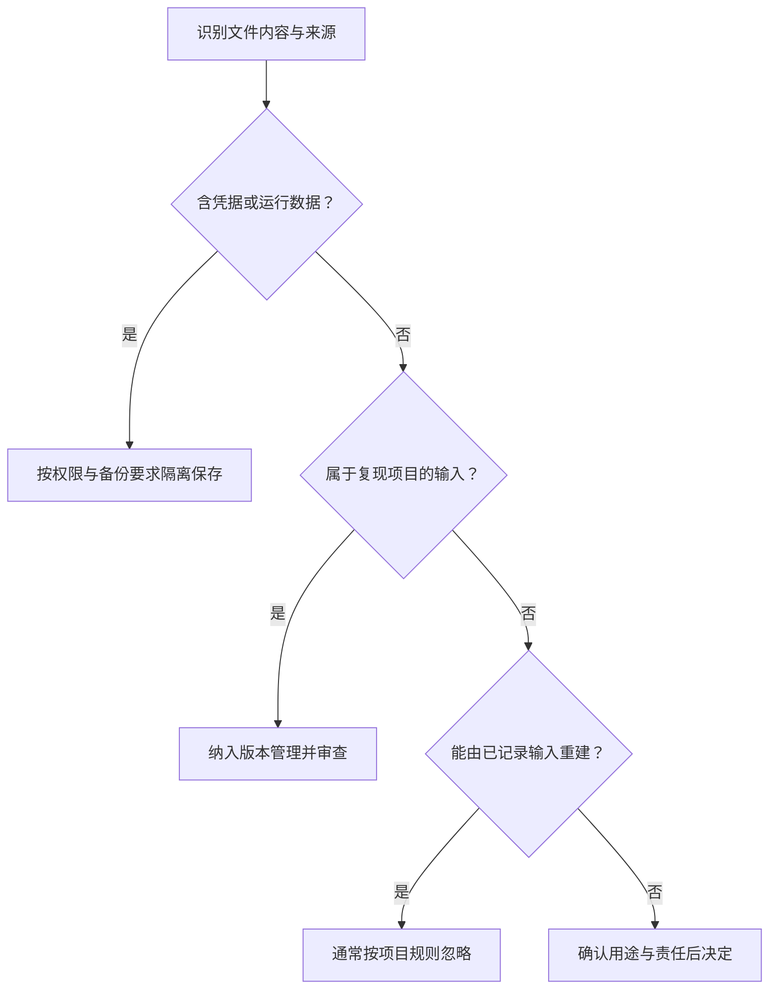

# 文件、目录与代码仓库

> 面向刚下载或打开软件项目、还不清楚文件作用的读者。无需先会 Git 命令，读完能区分目录、工作目录与仓库，识别源码、配置、数据和产物，并知道从哪些入口了解项目，而不因文件名相似就随意修改。

## 目录组织位置，仓库组织版本

文件保存内容，例如一段代码、一份说明或一张图片；目录组织文件与其他目录。项目目录通常把完成同一项软件工作的材料放在一起，但其中可能同时存在源码、工具下载内容、临时日志和运行数据。

代码仓库则用版本控制保存被纳入管理的文件及其历史。版本控制可以理解为有结构的变化记录：不仅知道当前文件是什么，还能追踪一次改动包含哪些内容。Git 是常见的版本控制工具，其提交在概念上记录一组受管理文件的快照。[Git 官方入门说明](https://git-scm.com/book/en/v2/Getting-Started-What-is-Git%3F)

因此，“在项目目录里”不等于“已经进入仓库历史”。刚创建的文件可能还未被跟踪，编辑过的文件可能尚未提交，依赖和日志也可能被明确忽略。保存编辑器中的文件与保存一个 Git 版本，是不同动作。

在普通 Git 检出目录中，工作树是当前可编辑的文件，`.git` 保存或指向版本管理所需的信息。某些工作树里的 `.git` 是一个指向其他位置的文件，而非完整目录；不能仅凭看到或没看到一个隐藏文件夹判断仓库是否有效。

## 托管平台保存远端副本并组织协作

Git 可以在本地保存版本、比较变化，并不依赖先注册网站。代码托管平台，如 GitHub、GitLab、Gitee 类服务，提供远端仓库和围绕它的协作功能。GitHub 的公开说明展示了这种组合：仓库文件与历史之外，还有问题跟踪和拉取请求等协作入口。[GitHub 仓库说明](https://docs.github.com/en/repositories/creating-and-managing-repositories/about-repositories)

| 对象 | 主要回答的问题 | 容易混淆的地方 |
| --- | --- | --- |
| 项目目录 | 这些文件在哪里、怎样组织 | 包含的文件不一定都受版本控制 |
| 本地仓库 | 本地有哪些版本与变化 | 本地提交不会自动出现在远端 |
| 远端仓库 | 在另一处保存和交换哪些版本 | 它不等于已经运行的线上程序 |
| 托管平台 | 谁能协作、怎样讨论和审查改动 | 网站功能不全属于 Git 本身 |
| 运行环境 | 程序在哪里执行、数据在哪里变化 | 部署运行与推送代码是不同过程 |

下载源码压缩包通常得到某一版本的文件；克隆仓库则取得 Git 仓库数据及工作树，具体历史范围取决于克隆方式。若项目还需依赖、环境配置或外部素材，两种方式都不一定能单凭下载立即运行。

一个项目可以使用一个或多个仓库；一个仓库也可以包含多个应用。“前端和后端要分别建仓库”不是普遍规则，分工关系见[软件项目全景](/software/guide/software-project-overview)。版本交换与评审的细节见[Git 仓库模型](/software/collaboration/git-repository-model)。

## 用案例目录建立阅读地图

下面是虚构“小型活动报名与管理系统”的一种目录示意。为便于识别，采用 JavaScript 生态常见的文件名，省略了工具细节；这张目录树不是可直接运行的工程，也不代表项目必须按此布局。

```text
event-registration/
├── README.md
├── docs/
│   ├── requirements.md
│   └── acceptance.md
├── apps/
│   ├── web/
│   │   └── src/
│   └── api/
│       └── src/
├── contracts/
│   └── api.yaml
├── database/
│   └── migrations/
├── fixtures/
│   └── sample-accounts.json
├── tests/
├── scripts/
├── package.json
├── package-lock.json
├── .env.example
├── .gitignore
├── .git/
├── node_modules/
├── dist/
├── data/
└── logs/
```

这棵树可以分三组读。第一组解释项目意图：`README.md` 提供入口与运行说明，`docs/` 保存需求和验收，`contracts/` 描述接口约定。第二组表达实现：`apps/web/src/` 处理页面，`apps/api/src/` 处理服务端规则，`database/migrations/` 保存调整数据结构的步骤，`tests/` 与 `scripts/` 帮助检查和执行约定任务。

第三组与复现或运行有关：依赖清单、锁文件和配置模板说明需要准备什么；`node_modules/` 是安装得到的第三方依赖，`dist/` 是示意性的构建产物目录；`data/` 和 `logs/` 表示本地运行可能生成的数据与记录。真实系统的数据库还可能在项目外部，不能从目录里没有数据文件就推断“没有数据库”。

`fixtures/` 中的合成账号用于构造检查场景，便于反复验证容量、重复提交和权限。它们是为复现而准备的输入，区别于运行过程中产生的报名记录。本案例不使用真实个人数据，也不包含支付或多租户材料。

目录名只是线索。遇到陌生项目，应对照说明和工具配置确定实际职责；例如 `public/` 可能是要直接发送给浏览器的资源，文件放进去后就可能对访问者可见。更深入的结构分析见[项目结构](/software/toolchain/project-structure)。

## 判断一个文件应怎样保存

先判断文件在工程中的作用，再判断是否需要进入代码仓库。自动生成、文本格式、目录大小，都不足以单独作出决定。



这是小项目的判断起点，具体策略仍需结合交付方式。例如发布用的构建产物可以进入专门的制品存储，而不必与源码混放；受控归档的数据也需要独立的保存策略。

| 类别 | 案例中的例子 | 保存与修改原则 |
| --- | --- | --- |
| 源码与工程约定 | 页面、业务逻辑、需求、接口、测试 | 通常纳入版本管理；改动应有明确理由 |
| 可共享的配置材料 | 配置模板、构建规则 | 可以入仓库，但模板使用占位值，不含真实凭据 |
| 复现所需数据 | 合成账号、样例活动、迁移步骤 | 确认内容可公开且确有用途后纳入管理 |
| 环境专用材料 | 实际凭据、运行配置、生成的名单 | 限制访问，明确保存位置与生命周期 |
| 可重建内容 | 已安装依赖、缓存、构建输出 | 通常不纳入源码仓库；保留重建方法 |

`.gitignore` 描述 Git 应忽略哪些尚未跟踪的路径。Git 官方文档明确说明，已被跟踪的文件不受新增忽略规则影响。[Git 忽略规则](https://git-scm.com/docs/gitignore) 所以给一个已提交文件加规则，不会自动删除其当前跟踪状态，更不会抹去历史。

忽略也不是保密机制。被忽略的文件仍存在于磁盘，可能被打包、备份或工具读取；已泄露的凭据需要处理凭据本身的有效性。对本案例，更直接的做法是只提供合成数据和无凭据模板。

## 工作目录决定相对位置从哪里算起

工作目录是某个正在执行的程序当前所在的目录。编辑器打开哪个项目，与终端或脚本使用哪个工作目录，可能不同。Python 官方提供获取和切换工作目录的接口，体现了这一进程运行时的概念。[Python 工作目录说明](https://docs.python.org/3/library/os.html#os.getcwd)

假设项目位于 `/work/event-registration/`。从项目根目录寻找 `docs/acceptance.md` 会到达案例中的验收文件；如果当前目录已经是 `apps/api/`，同一相对路径通常会指向 `apps/api/docs/acceptance.md`，可能根本不存在。

路径描述怎样定位文件。绝对路径指定完整位置，相对路径依赖某个起点；这个起点可能是工作目录，也可能由配置明确指定。代码中导入另一个文件时，解析规则还可能以当前模块为起点，不能把所有相对路径都理解为“相对终端所在目录”。

开始执行项目命令前，可以做几项只读确认：

```bash
pwd
git rev-parse --show-toplevel
git status --short
```

第一条查看当前工作目录，第二条查看当前工作树的根目录，第三条查看文件变化概况。后两条在非 Git 仓库中可能报错，这是定位信息，不应据此立即重新初始化仓库。详解见[文件、路径与权限](/software/foundations/files-paths-permissions)。

## 依赖清单与锁文件为什么通常都要保留

依赖是项目使用的第三方代码或工具。案例中的 `package.json` 用于描述项目和依赖要求，`package-lock.json` 记录解析得到的具体依赖树，`node_modules/` 则是实际安装后的内容。它们分别对应“要求什么”“确定了哪些版本”和“已经安装了什么”。

npm 官方说明建议将锁文件提交到源码仓库，以便协作者和构建过程复现依赖树，而不必提交整个依赖目录。[npm 锁文件说明](https://docs.npmjs.com/cli/v11/configuring-npm/package-lock-json/) 因而锁文件虽由工具生成，仍是重要输入；“自动生成文件都删掉”会破坏复现条件。

锁文件也不能保证任何机器上的结果完全相同，运行时、操作系统、安装参数和外部资源仍可能不同。不同语言和包管理工具有不同文件名，阅读时应识别它们的职责。版本解析与复现边界见[依赖与锁文件](/software/toolchain/dependencies-lockfiles)。

## 从入口开始，避免按文件数量猜复杂度

阅读陌生项目时，先看运行说明和需求，确定仓库根目录，再找到启动入口、依赖清单与关键规则。随后沿一个真实操作追踪页面、接口和数据。大量依赖文件不代表团队自己写了很多业务代码；目录树很整齐也不能证明权限和容量正确。

常见错误包括：直接修改依赖目录，重新安装后修改消失；修改构建产物，下次构建覆盖；复制整个项目却遗漏隐藏配置或历史；删除“看不懂的目录”，同时丢失运行数据。处理文件前，应先回答它从哪里来、由谁维护、能否重建、是否有独立备份。

这四篇导览建立了责任、需求、系统与文件之间的联系。后续第 5 至 16 章将继续展开软件研发的基础与工作过程；阅读顺序以导览实际发布内容为准。当前还可以通过下列专业文章加深理解，无需先掌握全部工具再开始阅读。

## 参考资料

<Refs>

- [Git Book：What is Git?](https://git-scm.com/book/en/v2/Getting-Started-What-is-Git%3F)（访问日期 2026-10-03）——快照、本地操作与文件状态。
- [Git：gitignore Documentation](https://git-scm.com/docs/gitignore)（访问日期 2026-10-03）——忽略规则及已跟踪文件的边界。
- [GitHub Docs：About repositories](https://docs.github.com/en/repositories/creating-and-managing-repositories/about-repositories)（访问日期 2026-10-03）——远端仓库与协作功能。
- [Python：os.getcwd 与 os.chdir](https://docs.python.org/3/library/os.html#os.getcwd)（访问日期 2026-10-03）——工作目录的获取和切换。
- [npm Docs：package-lock.json](https://docs.npmjs.com/cli/v11/configuring-npm/package-lock-json/)（访问日期 2026-10-03）——具体依赖树、复现用途与入库建议。
- 站内相关：[软件研发导览](/software/guide/) · [软件项目全景](/software/guide/software-project-overview) · [文件、路径与权限](/software/foundations/files-paths-permissions) · [项目结构](/software/toolchain/project-structure) · [依赖与锁文件](/software/toolchain/dependencies-lockfiles) · [Git 仓库模型](/software/collaboration/git-repository-model)

</Refs>
