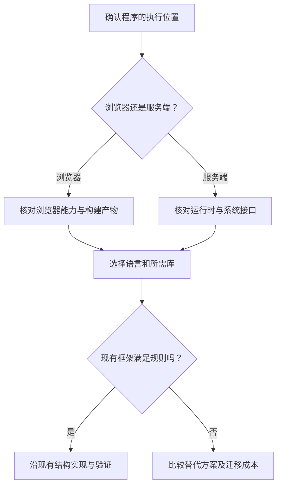

# 语言、框架、运行时与依赖

> 面向看见项目使用多种技术名称、却不清楚它们怎样配合的读者。了解文件与项目目录即可阅读，读完能识别语言、框架、运行时和依赖各自解决的问题，判断现有项目需要什么环境，并避免按流行度随意更换技术。

## 四种名称对应四种问题

编程语言规定怎样表达计算与控制流程；运行时提供执行程序所需的机制和接口；库提供可调用的功能；框架为某类应用安排组织结构和执行流程。一个第三方库或框架被项目使用时，也成为项目的依赖。

例如，虚构的小型活动报名系统可以用 JavaScript 或 TypeScript 描述交互，用浏览器执行页面，用服务端运行时执行报名规则，再用 Web 框架组织路由和请求处理。数据库驱动负责访问数据，也属于依赖。案例仅采用合成账号与样例数据，不涉及支付、多租户或真实个人数据。

| 层次 | 核心问题 | 在项目中寻找什么 |
| --- | --- | --- |
| 语言 | 逻辑怎样表达，哪些写法有效 | 源文件、语言配置、类型定义 |
| 运行时 | 谁执行程序，能使用哪些系统能力 | 运行说明、版本要求、启动命令 |
| 库与框架 | 哪些工作交给现成代码，流程怎样组织 | 导入语句、框架入口、依赖清单 |
| 工具链 | 源文件如何检查、转换和打包 | 构建脚本、测试脚本、产物目录 |

这些层次不能直接互相排名。“选某语言还是选某框架”往往是在比较不同问题。先确认程序在哪里运行、需要什么能力，再比较同一层次的候选方案。

## 源文件与运行文件不总是相同

浏览器认识的网页资源与开发者维护的文件可能不同。TypeScript 为 JavaScript 增加静态类型表达，工具可以在运行前发现部分不匹配，再生成 JavaScript。静态检查是依据程序描述推断错误的过程，不代表已经执行了所有用户操作。

报名表单里的类型声明可以表示“容量是数值”，但 TypeScript 的普通 `number` 类型不保证整数或非负。整数需要运行时判断，例如 `Number.isInteger`；非负和允许范围还要另行检查。网络传来的数据也可能缺失、被修改或格式不符。服务端需要在实际请求到达时检查输入和身份；编译通过不能代替这些检查。[TypeScript 类型与编译](https://www.typescriptlang.org/docs/handbook/2/basic-types.html) · [整数判断](https://developer.mozilla.org/en-US/docs/Web/JavaScript/Reference/Global_Objects/Number/isInteger) 输入、接口与权限的关系见[需求如何穿过界面、接口与数据库](/software/guide/request-through-system)。

同一种语言也可能在不同运行时使用不同接口。浏览器提供页面、导航和用户交互能力；服务端环境可能提供文件、进程和网络监听能力。把访问磁盘的服务端代码直接放进浏览器，不能因为都叫 JavaScript 就获得相同权限。

图中的起点是执行位置，而不是工具名称。源文件到运行程序的转换方式，详见[程序从源码到运行](/software/foundations/source-to-runtime)和[语言、运行时与工程选型](/software/programming/languages-runtimes)。

## 框架安排流程，业务规则仍需实现

库通常由业务代码调用；框架通常规定某些入口，再在适当时机调用业务代码。例如开发者注册“报名请求由这个处理函数负责”，框架接收请求后找到该函数。这种由框架安排调用流程的方式，常称为控制反转。

框架可以提供路由、表单处理、会话和数据访问等基础设施。MDN 对 Web 框架的介绍也强调这种通用工作复用。[MDN 服务端开发概览](https://developer.mozilla.org/en-US/docs/Learn_web_development/Extensions/Server-side/First_steps/Introduction) 但是“最后一个名额不能被两个人同时获得”属于业务一致性要求，不能只因使用了框架便认定已满足。

报名系统中，框架可以把请求交给处理函数；处理函数仍须验证账号、截止时间和当前状态，并选择正确的数据操作。框架默认的错误页面、数据库连接或身份功能，也要核对是否符合项目约定。

框架还会带来约束：目录组织、生命周期、插件接口、升级方式。现成能力减少重复工作，团队却需要理解它的运行方式。更换框架可能影响路由、测试、数据访问和发布，不能只比较演示页面生成速度。

## 依赖形成一棵需要复现的关系树

直接依赖是项目主动声明使用的包；间接依赖是这些包进一步需要的包。安装一个框架，可能同时得到许多间接依赖。它们的变化可能影响功能、构建、许可证和安全，项目不能只关注自己写的文件。

依赖清单描述允许或期望使用的版本，锁文件记录解析结果。两者作用不同：清单可能允许一个版本范围，而锁文件让特定安装流程复现选定的依赖树。npm 的 `ci` 文档说明，清单与锁文件不一致时会报错，而不会替使用者重新选择一套版本。[npm ci](https://docs.npmjs.com/cli/v11/commands/npm-ci/)

这也解释了为什么不能看到安装错误就删掉锁文件。删掉后重新解析可能得到另一组依赖，原问题被掩盖，还增加了变化。应先确认工作目录、包管理工具、工具版本和项目约定，再决定是否确实需要更新依赖。详见[依赖、清单与锁文件](/software/toolchain/dependencies-lockfiles)。

## 隔离环境，保留可重复准备的方法

不同项目可能要求不同版本。把所有包都装进同一个全局环境，容易出现“安装另一个项目后，原项目不工作”的现象。隔离环境让各项目维护自己的依赖集合，减少无关影响。

Python 官方教程用虚拟环境解决应用间包版本冲突，并说明创建环境所用的解释器决定了其中的 Python 版本。[Python 虚拟环境](https://docs.python.org/3/tutorial/venv.html) 虚拟环境不会自动替项目选择兼容版本，也不等于隔离所有文件和网络权限。

其他生态可能采用项目依赖目录、运行时版本管理或容器。容器将程序及一部分运行条件打包，仍需考虑操作系统内核、持久存储与配置。隔离方式不同，目标都是把“需要准备什么”写清楚，而不是要求所有项目采用同一种工具。

一个能交接的准备说明至少包括：运行时及包管理工具要求、安装依据、必要配置、启动入口和最小验证。保留这些信息，比复制别人电脑上已安装的依赖目录更适合持续维护。

## 沿已有工程选择，什么时候才重选

对于接手的项目，首先建立当前版本的运行基线。基线是在明确条件下可重复得到的结果。没有这份结果便同时升级运行时、替换框架和改业务，出现错误时就难以分辨原因。

| 现状 | 优先判断 | 建议与边界 |
| --- | --- | --- |
| 已有项目，只新增一项报名规则 | 现有结构能否表达和验证规则 | 优先沿用结构，保留相关回归 |
| 框架缺少某项辅助能力 | 是否可用小型库或局部代码补足 | 比较维护和安全成本，避免引入重复体系 |
| 运行时即将失去项目所需支持 | 兼容性、依赖和部署限制 | 分阶段升级，建立回退或恢复安排 |
| 新项目、需求尚不清楚 | 最小工作流程和团队能力 | 先确认需求，做有明确验收的小样 |
| 确有无法满足的长期约束 | 替代方案是否有可核查收益 | 评估迁移数据、测试和交接成本后重选 |

这是一条编辑建议，不是语言优劣榜单。运行正确、团队可维护、资料可查和交付可复现，是比名称数量更实际的判断维度。

## 常见误区与下一步

“安装好了”只证明安装步骤完成；“编译通过”只证明工具接受了相应输入；“框架自带认证”也只表示提供了某些机制。业务状态、权限和持久化仍需在系统中验证。

直接修改已安装依赖，可能在重装时丢失；只升级主包而忽略兼容要求，可能破坏工具链；把生成类型当成实际数据检查，可能接受无效请求。遇到问题，应先确定出错层次，再做最小必要改变。

下一篇[在本地运行项目](/software/guide/running-locally)把这些层次转成准备顺序和检查步骤。它提供教学命令示例，不要求在阅读本文时立即安装工具。

## 参考资料

<Refs>

- [TypeScript：The Basics](https://www.typescriptlang.org/docs/handbook/2/basic-types.html)（访问日期 2026-10-03）——静态类型与运行行为的边界。
- [MDN：Number.isInteger](https://developer.mozilla.org/en-US/docs/Web/JavaScript/Reference/Global_Objects/Number/isInteger)（访问日期 2026-10-03）——运行时整数判断。
- [MDN：Introduction to the server side](https://developer.mozilla.org/en-US/docs/Learn_web_development/Extensions/Server-side/First_steps/Introduction)（访问日期 2026-10-03）——客户端、服务端与 Web 框架职责。
- [npm Docs：npm ci](https://docs.npmjs.com/cli/v11/commands/npm-ci/)（访问日期 2026-10-03）——依据锁文件安装及不一致处理。
- [Python：Virtual Environments and Packages](https://docs.python.org/3/tutorial/venv.html)（访问日期 2026-10-03）——项目依赖隔离与解释器版本。
- 站内相关：[软件研发导览](/software/guide/) · [源码到运行](/software/foundations/source-to-runtime) · [语言与运行时](/software/programming/languages-runtimes) · [依赖与锁文件](/software/toolchain/dependencies-lockfiles) · [构建工具链与制品](/software/toolchain/build-artifacts) · [本地运行](/software/guide/running-locally)

</Refs>
