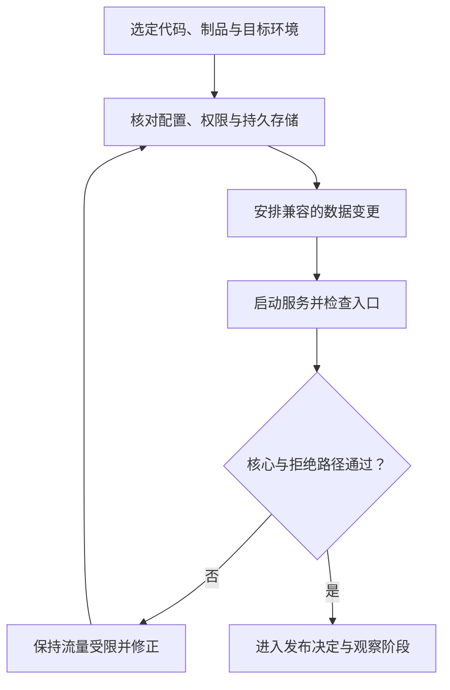

# 从本地到线上

> 面向项目已经本地可用、准备讨论正式部署的读者。建议先了解运行环境和配置边界，读完能区分构建、部署与开放使用，核对入口、服务和持久数据，并知道选择托管方式时该比较哪些责任。本文不执行部署，也不提供某个平台的一键安装方案。

## 上线要交付一组协作关系

把源文件放到远端机器，只完成文件传递。正式服务还需要可运行产物、兼容的运行环境、配置和凭据、数据结构、访问入口，以及观察与恢复方式。

虚构的小型活动报名系统使用合成账号与样例数据，包含活动查看、报名取消和管理员名单与导出，不涉及支付、多租户或真实个人数据。即使页面部署成功，后端未启动或连接临时存储，仍不能完成报名需求。

“线上”描述通过网络可达的运行位置，不自动表示生产用途。预览、测试和生产承担不同责任，应该有可识别的目标与数据边界。发布决定见下一篇，本篇先解释部署需要准备的对象。

## 从确定版本构建确定产物

构建是把工程输入加工成运行产物，例如浏览器资源、可执行包或镜像。制品是可以存储、传递和部署的产物。构建需要知道源版本、依赖、工具链和参数，否则同名文件可能代表不同内容。

Twelve-Factor App 将构建、发布和运行区分开：产物结合环境配置成为可运行发布，再由目标环境启动。[构建、发布与运行](https://12factor.net/build-release-run) 这种区分有助于避免在服务器临时编辑代码后失去可追踪来源。

尽可能部署已经检查的产物，并保留内容标识与来源；不应在测试通过后又无说明地重新解析依赖、重建另一份内容。某些前端配置在构建时写入，变更目标地址就可能需要新的产物；配置注入方式必须说明。

| 交付对象 | 需要标明什么 | 容易遗漏的关系 |
| --- | --- | --- |
| 页面产物 | 内容版本、接口地址、缓存策略 | 新页面是否调用兼容接口 |
| 后端产物 | 源提交、依赖、运行时与启动方式 | 是否适配当前数据结构 |
| 配置 | 来源、环境、必要变量与秘密注入 | 值改变是否需要重启或重建 |
| 数据迁移 | 目标结构、执行顺序、兼容范围 | 旧代码能否继续运行 |
| 运行说明 | 入口、健康判断、观察和恢复 | 接手者能否重复部署 |

## 选择平台是在选择责任分工

托管平台、虚拟机和容器都能承载某些应用，但负责的工作不同。静态资源托管适合发送已生成文件；需要持续执行报名规则的服务，还要有相应后端能力与持久存储。

| 方式 | 可以承担的工作 | 团队仍需判断什么 |
| --- | --- | --- |
| 静态资源托管 | 页面与资源分发 | 真实业务接口在哪里，如何认证 |
| 托管应用服务 | 按平台能力运行服务与管理部分生命周期 | 运行约束、数据连接、观测和退出方式 |
| 容器平台 | 根据镜像启动隔离进程 | 网络、持久卷、配置、权限与资源 |
| 自管虚拟机 | 提供较广泛的系统控制 | 更新、进程管理、备份和故障责任 |

这些是责任比较，不是价格或能力排名。应先确认团队能承担什么，以及平台能否满足接口、任务、存储和恢复要求，再考虑长期成本。详细比较见[托管、部署与平台工程](/software/delivery/hosting-platforms)。

容器镜像不是整个系统的备份。容器将程序运行组织成进程与隔离环境，数据是否持久取决于存储设计。删除并重建实例后应保留的报名，不宜只放在临时容器文件层。

## 入口让用户找到正确服务

域名提供便于使用的名称，DNS 将名称与目标网络信息关联，HTTPS 使用 TLS 保护传输。证书与名称匹配、续期、入口路由和后端连接都需要安排；浏览器能访问一个 IP，不能直接证明正式域名入口已经正确。

MDN 的 TLS 资料说明了传输保护的作用。[TLS 说明](https://developer.mozilla.org/en-US/docs/Web/Security/Defenses/Transport_Layer_Security) HTTPS 保护传输，不会替业务实现管理员权限，也不会让错误接口变正确。应用仍要校验身份、输入与目标对象。

入口可能终止 TLS，再转发到后端；页面与接口也可能使用不同地址。要核对哪些端口对外开放、代理路径怎样映射、浏览器是否允许相应来源。数据库通常不需要直接向所有用户开放。

Docker 官方文档区分镜像声明端口与真正发布端口，并提醒默认发布可能监听所有主机网卡。[容器端口发布](https://docs.docker.com/get-started/docker-concepts/running-containers/publishing-ports/) 因此，看见端口声明不代表外部可达；扩大监听范围也不是通用排错方法。

## 按依赖顺序准备环境

先确认目标环境身份、存储和配置，再准备必要数据结构，启动业务服务，检查其依赖和入口，最后开放实际用户流量。具体顺序要依据迁移兼容性和平台机制制定。

“启动”与“开放使用”分开，有助于先检查实际目标，避免服务刚能监听就直接接收全部业务请求。图中的通过是待执行门槛，本文没有部署或测试案例。

## 核对本地与目标环境差异

开发环境可能有自动重载、模拟接口和宽松调试设置；目标环境则需要确定进程管理、数据保存和访问策略。本地权限宽松可能掩盖文件访问错误，本地空数据也可能掩盖迁移问题。

对报名系统，目标环境最小检查包括：页面连接预期后端，合成参与者可报名并重新查询，普通账号不能导出，管理员名单与状态一致，服务按约定重启后数据仍可读取。并发、负载和故障恢复按另行约定的场景验证。

入口检查还要包含真实域名与 HTTPS、资源路径和错误页面。只在服务器内部调用成功，不能证明用户的网络路径可用；只看到健康页面，也不能证明数据库写入和权限成立。

部署完成后，应留下目标环境、实际制品、配置版本、数据迁移状态和检查结果的记录。若平台显示部署成功，却没有核心流程证据，状态应写为“部署已完成，业务检查待完成”。不同环境使用独立身份和合成检查数据，避免把一次预览验证误记为生产验收，也便于之后定位哪个环节需要重查。

## 交接后能够发现并处理问题

运行环境应记录实际版本、配置版本与迁移状态，提供必要日志和业务指标。值守者需要知道出现什么现象要采取行动，怎样联系责任人，如何停止新变化和恢复服务。

上线计划还应包括旧版本与新数据是否兼容、备份怎样恢复、回退后怎样对账。恢复时间与可接受数据损失应根据使用情境约定，不从教学案例推导通用数值。更多机制见云领域的[可靠性与灾备](/cloud/architecture/reliability-dr)。

常见失败是上传源码但缺少运行时，部署页面却仍连本地接口，把秘密打包到浏览器，使用临时目录保存报名，以及构建时通过但目标环境无法读取数据。应沿制品、配置、入口和状态逐项确认。

下一篇[安全发布、观察与回退](/software/guide/release-observe-rollback)接着判断什么时候扩大使用范围、什么信号要求停止，以及回退代码之外还要处理哪些后果。

## 参考资料

<Refs>

- [The Twelve-Factor App：Build, release, run](https://12factor.net/build-release-run)（访问日期 2026-10-03）——版本、构建、发布配置与运行。
- [Docker Docs：Publishing and exposing ports](https://docs.docker.com/get-started/docker-concepts/running-containers/publishing-ports/)（访问日期 2026-10-03）——声明、发布、监听地址与访问范围。
- [MDN：Transport Layer Security](https://developer.mozilla.org/en-US/docs/Web/Security/Defenses/Transport_Layer_Security)（访问日期 2026-10-03）——TLS 传输保护。
- 站内相关：[软件项目入门](/software/guide/) · [本地运行](/software/guide/running-locally) · [配置与秘密](/software/guide/configuration-secrets-data) · [构建与 CI](/software/delivery/build-ci) · [容器与镜像](/software/delivery/containers-images) · [托管与部署](/software/delivery/hosting-platforms) · [DNS 与 HTTPS](/software/delivery/dns-https) · [发布观察与回退](/software/guide/release-observe-rollback)

</Refs>
