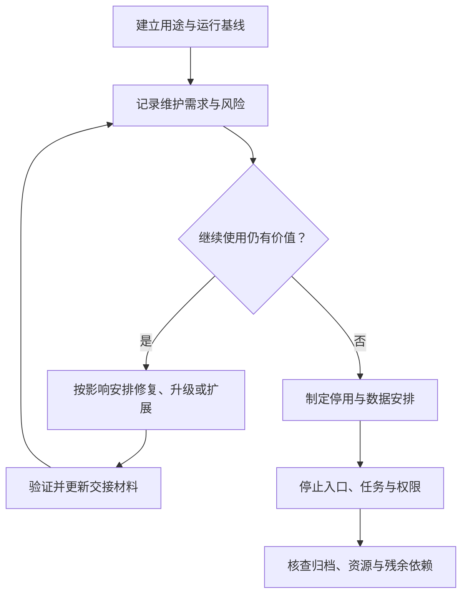

# 接管、维护、扩展与停用

> 面向已经拿到可运行软件、准备长期使用或接手 AI 生成项目的读者。建议了解版本、部署和恢复，读完能建立接管基线，安排缺陷、升级与扩展，评估维护成本，并在系统不再需要时完整处理数据、身份和资源。

## 交付后，软件仍在变化

软件会因需求、数据、依赖、运行环境和使用规模变化而继续需要维护。最初能运行，不代表以后无需检查；某位作者离开或一个 AI 会话结束，也不能代替系统的长期责任人。

虚构的小型活动报名系统支持活动查看、报名取消与管理员名单导出，只使用合成账号和样例数据，不涉及支付、多租户或真实个人数据。本篇讨论怎样接管这样一个项目，以及之后如何有计划地演进和停用。

NASA 软件工程手册将运行、维护和退役作为需要提前规划的生命周期活动。[运行维护与退役规划](https://swehb.nasa.gov/spaces/SWEHBVD/pages/102695456/SWE-075%2B-%2BPlan%2BOperations%2BMaintenance%2BRetirement) 本文采用适合小项目的组织方式，不要求复制其任务文档规模。

## 接管先建立当前系统的地图

接管不是立即重写代码，而是先确定正在运行什么、承担什么用途、有哪些边界，以及谁有能力维护。文档可以帮助理解，但应对照实际版本、配置和行为核查。

| 接管对象 | 需要回答的问题 | 合适的证据 |
| --- | --- | --- |
| 业务规则 | 容量、重复与权限按什么约定执行 | 当前规则、验收及决定记录 |
| 代码与制品 | 哪份源码对应正在使用的程序 | 提交、构建与发布关联 |
| 数据 | 保存在哪里、结构怎样变化 | 模型、迁移与恢复记录 |
| 配置与身份 | 谁能改配置、谁能发布或访问数据 | 权限清单、秘密注入方式 |
| 运行责任 | 谁接收故障、怎样恢复 | 值守入口、手册与联系人职责 |
| 限制与成本 | 哪些尚未验证，哪些外部服务需持续承担 | 缺口、资源清单和费用口径 |

不把凭据值复制进接管文档。接手的是访问流程和责任，秘密应通过受控机制提供。若原有权限范围不清，应先收集证据、限制影响，再安排受控调整。

## 用基线检查证明可以接手

接管基线是对当前版本和环境的可重复观察。先保留现状，再在隔离环境准备合成数据，检查核心与拒绝路径。不能只凭 README 写着“可运行”就宣布完成。

报名案例可以核对参与者报名取消、重复请求、普通账号拒绝和管理员名单，同时检查启动、停止与数据读取。恢复演练还应证明备份能用于约定的环境与结构；本文仅描述待执行方法，没有运行案例应用。

发现文档与实际不一致，先记录差异：是配置已经变化、说明过期还是行为缺陷。暂时不知道的地方保留为未知，不让 AI 用合理猜测补成项目历史。详细方法见[阅读与接管既有系统](/software/maintenance/system-takeover)。

## 维护变化可以按目的分类

修复已发现的错误、适应环境变化、改善体验与结构、预防未来风险，都属于维护。目的不同，检查与优先级也不同。紧急缺陷不能与大规模重构混在一项含糊的“优化”中。

| 变化目的 | 案例中的例子 | 应先明确的判断 |
| --- | --- | --- |
| 修正错误 | 重复取消造成余量不一致 | 原触发条件和业务终态 |
| 适应环境 | 运行时或依赖支持范围改变 | 兼容要求与验证环境 |
| 改善能力 | 名单增加约定筛选方式 | 新需求、权限和导出口径 |
| 改善结构 | 将混合页面与规则拆为明确模块 | 行为保持与维护收益 |
| 预防风险 | 建立秘密撤销和恢复演练 | 风险依据、责任和成功标准 |

维护事项记录问题、影响、责任、目标版本和结果。不能只以实现快慢排序，也要考虑数据风险、后续依赖和错误扩散。问题管理见[维护变更与问题管理](/software/maintenance/maintenance-changes)。

## 技术债与重构需要可解释收益

技术债描述会增加后续修改成本的设计或实现负担。它可以来自为快速推进而作出的时间取舍，也可以来自当时认识不足、后来才发现更合适设计等非刻意原因。Fowler 的技术债四象限区分了刻意与非刻意债务。[技术债四象限](https://martinfowler.com/bliki/TechnicalDebtQuadrant.html) 并非所有不喜欢的代码都属于技术债，也不能只因 AI 生成便认定质量差。应指出具体后果，例如每次改报名规则都需要同时修改多处不同判断。

重构是调整内部结构而保持约定的外部行为。有效的重构需要行为基线、影响范围和回归。没有验收与可观察结果的大规模重写，很难证明是改善还是替换成另一组未知问题。

可以从局部减少重复规则、明确接口或补齐可诊断错误开始，再观察后续修改是否更容易。涉及结构与数据迁移时，分阶段保留兼容，避免用一次全量切换承担所有风险。详见[重构、技术债与架构演进](/software/maintenance/refactoring-debt)。

## 升级与扩展分别处理

依赖升级需要看兼容说明、锁文件变化、运行条件和相关测试。更新数量多不等于更安全；拒绝所有更新也会积累支持与安全风险。应按实际影响分批检查，并记录需要撤回或向前修复的边界。

扩展首先确认新用途和负载，不能只增加服务器或引入微服务。若管理员导出变慢，应观察查询、数据量与资源，找出瓶颈；若需要新增候补，先补业务状态和验收，再讨论技术结构。

这张图把停用作为正常选择。继续维护与扩大范围，都应依据用途和成本，而不是只因代码已经存在。

## 停用是一项需要验收的变更

停止网页访问，只关闭一个入口。后台任务、接口、导出副本、数据库、秘密、域名绑定和计算资源可能继续存在。应先盘点对象和依赖，确认谁仍需要读取或迁移材料，再按计划关闭。

| 停用对象 | 处理目标 | 应核查的结果 |
| --- | --- | --- |
| 用户入口和写入 | 停止新的业务动作并说明后续方式 | 旧链接与直接接口不再接受新写入 |
| 数据与归档 | 按用途和既定要求迁移、保存或删除 | 范围、格式、权限和可读取性明确 |
| 后台与自动化 | 停止不再需要的任务 | 调度、队列和外部调用确实停止 |
| 秘密与身份 | 撤销无用途的能力 | 旧凭据与服务身份不能继续操作 |
| 资源与依赖 | 解除不再需要的服务关系 | 计算、存储、网络和费用清单更新 |
| 工程材料 | 保存必要的解释与版本 | 后续可以理解归档范围与原因 |

OWASP 的秘密生命周期包括撤销。[秘密管理指导](https://cheatsheetseries.owasp.org/cheatsheets/Secrets_Management_Cheat_Sheet.html) 系统停用后只删除本地配置，不能证明远端凭据已失效。仍需验证实际授权与连接边界。

数据安排应依据用途与适用要求，不从本篇推导统一保留年限。迁移后核对记录数量、状态和语义；单纯文件大小相同不能证明内容完整。对报名案例，有效名单、取消历史和容量口径都需要明确归档含义。

## 持续可维护依赖持续交接

文档和手册应随实际变化更新，保留为什么选择某项方案及其验证范围。资源清单、责任与权限也应周期性核对，避免作者或工具配置变化后没人知道如何恢复。

常见失败是接管即重写、仅靠聊天记忆、无限扩大首版、升级后不查数据兼容、停用时只关页面，以及归档后无法解释记录。改进应形成可查材料和实际验证，而不只是新增更多说明文字。

至此，导览从责任与需求走到运行、协作、验证、发布、维护和退出。继续学习可以按当前工作选择专业主文；使用 AI 写软件的工作机制见[AI 辅助研发全景](/software/ai-assisted/ai-development)，开发 AI 应用则另有模型与应用工程边界。

## 参考资料

<Refs>

- [NASA：SWE-075 — Plan Operations, Maintenance, Retirement](https://swehb.nasa.gov/spaces/SWEHBVD/pages/102695456/SWE-075%2B-%2BPlan%2BOperations%2BMaintenance%2BRetirement)（访问日期 2026-10-03）——运行、维护、支持和退役的规划。
- [Martin Fowler：Technical Debt Quadrant](https://martinfowler.com/bliki/TechnicalDebtQuadrant.html)（访问日期 2026-10-03）——技术债的审慎、鲁莽及刻意、非刻意来源。
- [OWASP：Secrets Management Cheat Sheet](https://cheatsheetseries.owasp.org/cheatsheets/Secrets_Management_Cheat_Sheet.html)（访问日期 2026-10-03）——秘密生命周期及撤销。
- 站内相关：[软件项目入门](/software/guide/) · [系统接管](/software/maintenance/system-takeover) · [重构与技术债](/software/maintenance/refactoring-debt) · [升级与兼容](/software/maintenance/upgrades-compatibility) · [维护变更](/software/maintenance/maintenance-changes) · [停用与可持续性](/software/maintenance/retirement-sustainability) · [估算与成本](/software/requirements/estimation-risk-economics) · [容量与成本](/software/operations/capacity-performance-cost) · [AI 辅助研发](/software/ai-assisted/ai-development)

</Refs>
