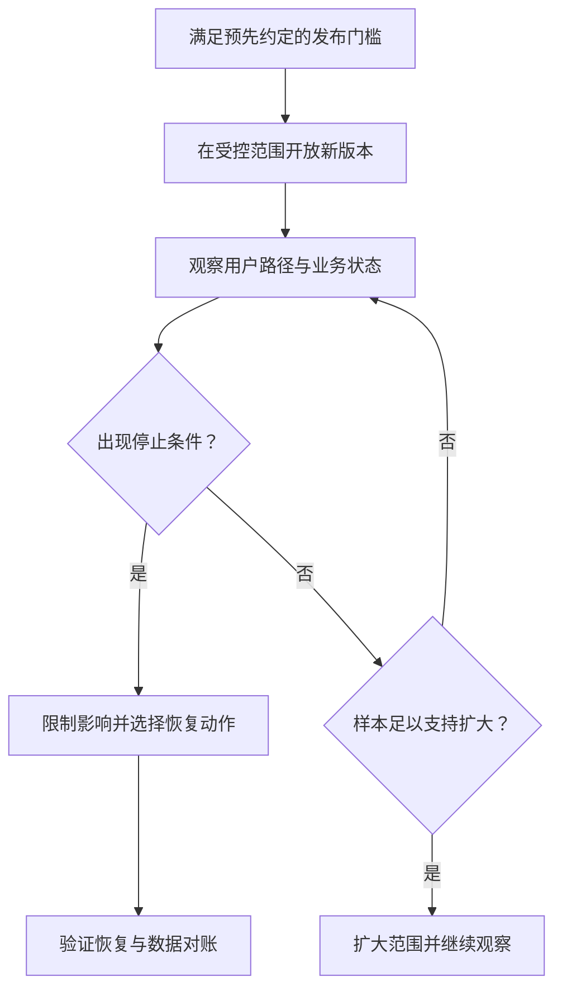

# 安全发布、观察与回退

> 面向已经准备好目标环境、需要决定何时开放新版本的读者。建议先了解构建、配置和部署，读完能制定发布门槛与停止条件，选择有用的观察信号，并区分回退程序、关闭功能和恢复数据。

## 发布决定控制影响范围

部署把程序放进目标运行环境，发布让某个版本或功能进入实际使用范围。它们可以同时发生，也可以先部署、检查后再开放。把这两个动作分开，有助于在扩大影响前发现问题。

虚构的小型活动报名系统只使用合成账号与样例数据，包含活动查看、报名取消、管理员名单与导出，不涉及支付、多租户或真实个人数据。本文以“修复重复取消”为发布例子，所有步骤和检查均是教学设计，没有实际执行上线。

发布的目标既包括新规则生效，也包括原有报名、权限和名单继续成立。不能只用启动成功或一个正常请求判断整个版本值得继续扩大使用。

## 先规定门槛与停止条件

发布计划需要回答：部署哪份制品，配置和数据结构是什么，哪些检查已完成，何种异常要求停止，谁可以决定回退，以及处理后怎样确认恢复。条件宜在发布前约定，避免出问题后临时降低标准。

| 发布问题 | 应具备的材料 | 报名案例的检查点 |
| --- | --- | --- |
| 版本明确吗 | 提交、制品、配置与迁移标识 | 取消修复确实进入当前运行版本 |
| 关键行为成立吗 | 正常、边界与拒绝路径证据 | 不重复释放，不越权，名单一致 |
| 数据兼容吗 | 迁移顺序与新旧读取范围 | 回退后仍能理解当前报名状态 |
| 能观察问题吗 | 信号、记录、责任与响应方式 | 请求错误和异常余量能够关联 |
| 能停止或恢复吗 | 具体动作、权限和验证方法 | 控制新请求，恢复后重新对账 |

未验证事项不能因发布窗口到来而变成通过。确需例外时，记录影响范围、缓解方式和决定责任。阻断标准应与实际风险相配，而不是所有项目都采用同一个分数。

## 选择开放方式与样本

一次全部切换最直接，但问题可能同时影响全部使用者。逐步开放可以降低最初影响，并用新旧结果比较帮助判断；它需要正确分流、代表性样本和清楚的版本标识。

金丝雀发布是先让较小范围接触新版本，根据观察决定是否扩大。Google SRE 资料讨论了样本、时长和指标归因的重要性。[金丝雀发布原文](https://sre.google/workbook/canarying-releases/) 少量请求没有出现错误，可能只是没有遇到取消、重复或管理员场景，不能直接推导全部流程安全。

| 方式 | 适合考虑的情境 | 需要承担的代价 |
| --- | --- | --- |
| 受控窗口整体切换 | 影响范围可承受，恢复路径简单 | 切换期间的集中风险与协调 |
| 逐步开放新版本 | 能分流并比较代表性请求 | 双版本兼容、指标区分和流量控制 |
| 功能开关 | 代码已部署，但希望控制功能入口 | 开关权限、状态组合和后续清理 |
| 先内部或测试使用 | 可以构造典型场景 | 样本不一定代表完整使用情境 |

功能开关控制执行路径，不能自动撤销该功能已经写入的数据。关闭报名写入后，既有有效报名仍需查询和管理；开关设计也要确认哪些路径继续可用。

图中“没有停止信号”与“有足够证据扩大”不同。流量很少、观测丢失或样本不代表关键路径时，应继续核查。

## 观察用户效果，也观察业务不变量

指标是按定义计算的观测数值，日志记录具体事件，追踪关联一次请求跨组件的过程。它们应帮助判断用户和业务效果，而不只证明进程还在运行。

报名案例可以观察请求成功与拒绝比例、响应时间、异常状态转换，以及有效名单与容量的关系。不变量是在所有允许操作中都必须保持的条件，例如有效人数不超过容量，同一账号不产生多份有效报名。

业务拒绝不一定是系统错误。满额时正确拒绝会降低表面的成功比例；如果把全部拒绝算故障，又可能错误回退。指标应区分合法业务结果、技术失败和结果未知，并说明分母与时间范围。

对新旧版本比较，尽量区分版本和请求类型。总量指标可能掩盖新版本异常，时间前后比较也可能受流量变化影响。若新旧版本共享数据，一个版本的写入还可能改变另一个版本的结果，需检查兼容与归因。

更多观察机制见[应用指标、日志与追踪](/software/operations/application-observability)，完整云原生体系见[可观测性体系](/cloud/native/observability)。

## 回退代码不是恢复整个系统

程序回退让环境重新运行先前产物或配置；数据恢复将存储返回指定状态；业务补偿处理已发生但需要纠正的动作。三个目标可能配合，却不能互相替代。

Kubernetes 文档明确说明，Deployment 回滚只回滚其 Pod 模板部分。[Deployment 回滚范围](https://kubernetes.io/docs/concepts/workloads/controllers/deployment/) 这是一个具体平台的例子：控制器能恢复的对象有明确边界，不能推断数据库和外部操作也一并恢复。

| 动作 | 可以解决的问题 | 不能自动撤销的影响 |
| --- | --- | --- |
| 回退程序或配置 | 新代码或配置造成的错误 | 已保存的报名、导出与结构变化 |
| 关闭功能入口 | 限制继续发生的新动作 | 已执行操作及后台任务 |
| 恢复数据备份 | 部分存储损坏或错误状态 | 备份后产生的合法变化 |
| 向前修复与对账 | 保留当前合法数据并纠正规则 | 仍需识别和处理已产生的不一致 |

如果新版本增加一个旧代码不理解的报名状态，直接回退可能让旧页面误读名单。数据变更宜安排兼容阶段：先让新旧代码都能理解扩展，再切换使用，最后移除旧结构。具体策略见[ORM、迁移与兼容](/software/data/orm-migrations)。

## 出问题时先止损，再恢复和核查

异常发生后，先记录运行版本和影响范围，暂停扩大或限制导致错误的新动作，保护已有状态和必要现场。不要同时发布另一项无关变化，使原因与结果更难区分。

恢复动作需要具体目标和权限。选择旧程序、关闭功能、修正配置还是恢复数据，应依据错误机制和当前兼容性，而不是只选择最快找到的按钮。涉及结果未知的请求，应确认实际是否执行，避免恢复过程中重复操作。

恢复后检查正常报名、重复取消、权限拒绝和名单一致，再核对错误期间的记录。入口可达或健康检查恢复，只说明局部条件成立；受到影响的业务状态还需要对账。

## 把发布结果变成后续维护输入

记录时间、版本、开放范围、关键观察、决定及未解决事项，能帮助后续定位。复盘关注触发条件、为何未被先前检查发现、哪种防护可以降低再发生概率，而不只寻找某个操作人的错误。

常见失败包括没有停止条件、只看总体成功率、开关关闭却后台继续执行、回退后忘记数据，以及恢复完成就删除现场。应保留可审计的发布记录，并把有效改进纳入测试、手册或流程。

下一篇[接管、维护、扩展与停用](/software/guide/maintenance-takeover)走完软件使用后的生命周期：怎样持续保持可理解、可运行，何时升级或重构，以及怎样有计划地退出。

## 参考资料

<Refs>

- [Google SRE Workbook：Canarying Releases](https://sre.google/workbook/canarying-releases/)（访问日期 2026-10-03）——受控开放、代表性样本与指标归因。
- [Kubernetes：Deployments](https://kubernetes.io/docs/concepts/workloads/controllers/deployment/)（访问日期 2026-10-03）——修订历史与 Pod 模板回滚范围。
- 站内相关：[软件项目入门](/software/guide/) · [本地到线上](/software/guide/local-to-production) · [发布与回滚](/software/delivery/release-rollback) · [SLO 与健康检查](/software/operations/slo-health-oncall) · [应用观测](/software/operations/application-observability) · [故障响应](/software/operations/incident-response) · [数据迁移兼容](/software/data/orm-migrations) · [接管与维护](/software/guide/maintenance-takeover)

</Refs>
