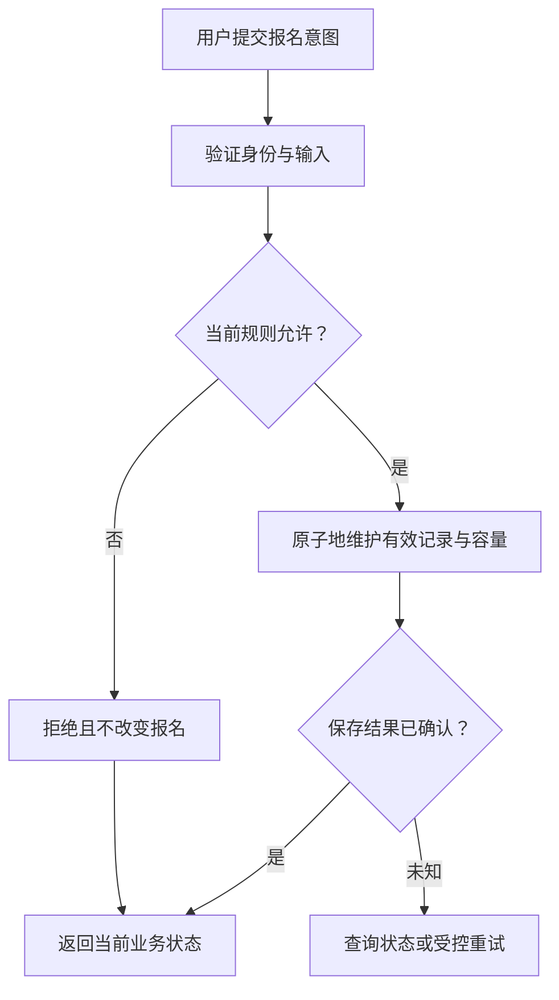

# 需求如何穿过界面、接口与数据库

> 面向已经能打开项目、希望知道一个按钮怎样产生真实业务结果的读者。理解前端与后端的基本分工即可阅读，读完能把需求落实到请求、规则和数据变化，核查容量、重复提交与权限，并发现只改界面造成的缺口。

## 从用户目标开始追踪

“参与者成功报名”包含多个可观察结果：参与者收到明确反馈，重新打开页面仍可查询，管理员名单与名额占用一致。按钮颜色改变只是其中一个界面状态，不能独自证明整个需求成立。

虚构的小型活动报名系统提供活动列表与详情、报名与取消、管理员名单与导出。案例只使用合成账号与样例数据，不包含支付、多租户或真实个人数据。系统总体分工见[软件项目全景](/software/guide/software-project-overview)，本篇进一步追踪状态如何跨越这些分工。

业务规则是每次操作必须遵守的约定，例如同一账号最多一份有效报名，有效总数不能突破容量。规则应该贯穿界面、接口与数据，而不应在三处分别采用不同解释。

## 界面表达意图，服务端判断能否执行

参与者选择活动后，页面可以检查必要输入，显示提交中的状态，避免误点。前端检查有助于及时反馈，但页面状态可能过期，也可以被绕过。请求抵达后端时，仍要重新核对身份、对象、截止时间与当前报名状态。

请求应携带能识别目标的活动标识，而不是让服务端根据活动名称猜测。请求者身份来自经过验证的认证信息，不能直接相信请求中的 `isAdmin` 字段。字段名称只是教学例子；真正可信的是验证后的身份与权限关联。

对于名单导出，服务不仅要知道账号是不是管理员，还要判断其被允许获取哪份名单。对于取消报名，也要判断记录是否属于请求者。权限的允许路径与拒绝路径应共同检查，机制见[身份认证、会话与权限](/software/backend/authentication-authorization)。

## 接口契约把动作和结果连起来

接口契约是调用方与服务对请求和响应的共同约定，通常包含地址、动作、输入、身份要求、成功结果与错误语义。HTTP 方法和状态码提供通用语义，但不能替项目规定全部业务规则。[RFC 9110](https://www.rfc-editor.org/rfc/rfc9110.html)

例如，重复报名可以按项目约定返回“当前已经有效报名”，而不是产生第二条有效记录；满额可以返回可识别的拒绝结果。前端应该按契约显示反馈，不能把“请求返回了”统一理解为报名成功。

浏览器的 Fetch API 在收到 HTTP 错误响应时通常仍会得到响应对象；网络失败与 HTTP 拒绝不是同一情况。MDN 提醒调用方检查状态，而不是只依靠异常捕获。[Fetch 响应处理](https://developer.mozilla.org/en-US/docs/Web/API/Fetch_API/Using_Fetch)

| 请求结果 | 页面应该表达什么 | 还需要核对什么 |
| --- | --- | --- |
| 报名成功 | 显示有效状态与后续入口 | 查询与管理员名单是否一致 |
| 已有有效报名 | 显示当前状态，不再次占位 | 数据是否确实只有一份有效记录 |
| 满额或已截止 | 说明业务拒绝，保留可用操作 | 拒绝后没有错误的数据变化 |
| 身份失效或无权操作 | 要求重新认证或显示拒绝 | 未暴露受保护信息 |
| 网络中断或超时 | 说明结果尚未确认 | 查询终态，避免把未知当成未执行 |

契约的作用是让两端使用相同语言。具体设计见[HTTP、API 与接口契约](/software/backend/http-api-contracts)。

## 保存报名需要共同维护约束

数据库约束是数据存储层必须满足的条件。唯一约束可以限制某一列或列组合不重复；但如何表示有效报名、是否保留取消历史，需要先设计数据模型。PostgreSQL 文档分别说明了唯一约束和外键约束的作用。[数据库约束](https://www.postgresql.org/docs/current/ddl-constraints.html)

不能因为活动标识和账号标识分别合法，就认定组合状态正确。若保留历史，多条历史记录可以合理存在，但有效记录仍应受业务规则限制。只在应用中先查询再决定写入，可能在并发请求之间产生竞争。

事务把一组数据操作作为一个整体提交或撤销。[PostgreSQL 事务教程](https://www.postgresql.org/docs/current/tutorial-transactions.html) 在报名案例中，保存有效报名与更新容量状态需要相互一致。然而，把“先读余量、再写报名”放进事务，并不自动防止两个事务同时读到相同余量；还需结合隔离、锁或原子条件更新等方案。

这些方案有不同代价，导览不指定某一种数据库实现。验收要求是不超额、不重复，而设计要解释为何在并发情况下仍成立。应用层的选择见[事务、并发与索引](/software/data/transactions-indexes)，数据库引擎机制见[数据库选型](/cloud/data/database)。

图中的“当前”强调服务端执行时的状态；“已确认”强调网络返回与数据提交之间可能存在信息缺口。

## 取消是有条件的状态转换

状态机用状态和允许的转换表达规则。报名案例可以区分未报名、有效和已取消，但每次转换还要看时间与身份。状态名称相同，不意味着所有转换都允许。

| 当前情况 | 请求 | 案例中的预期行为 |
| --- | --- | --- |
| 未报名且有名额 | 报名 | 产生一份有效报名 |
| 已有效报名 | 再次报名 | 保持有效，不再次占位 |
| 有效且允许取消 | 取消 | 转为已取消，只释放一次名额 |
| 已取消 | 再次取消 | 保持已取消，不额外释放 |
| 已取消且仍开放、有名额 | 重新报名 | 按新的申请判断容量 |
| 任何状态但无权操作该对象 | 取消或查询 | 拒绝，不改变受保护状态 |

这组规则是教学设计，实际活动可以采用不同政策。关键在于规则表先得到确认，再让实现和测试引用它。状态机的专业说明见[业务逻辑、规则与状态机](/software/backend/business-state-machines)。

## 失败后先确认业务终态

假设服务已经保存报名，但响应丢失。页面只能知道没有及时拿到结果，不能据此证明保存失败。再次请求时，应能查询已有状态，或依据稳定的逻辑操作标识重复执行而不增加副作用。

幂等性指同一逻辑操作重复执行后，业务效果不会因重复而额外增加。它与 HTTP 方法的通用语义相关，却仍需要具体业务实现。给请求换一个新标识，可能使服务把它当成另一次操作；前端防连点也无法处理代理重试或网络恢复。

取消后容量没有恢复，可能是关联写入未共同提交；页面显示已报名而名单没有账号，可能是页面用了乐观更新却未处理失败。乐观更新是先在界面预测结果，再根据真实响应确认或恢复，它不能替代服务端保存。

导出也要说明时点：文件是请求开始时的名单快照，还是生成结束时的状态？当报名仍变化时，不同查询可能产生差异。小系统可选择清楚、可核查的口径，并在文件或记录中说明活动与生成时点。

## 用一条追踪线核查完整结果

检查时记录活动、合成账号、逻辑操作和请求关联标识，沿页面请求找到后端结果，再核对最终状态。关联标识帮助连接记录，不应包含凭据或完整个人资料。不同层的观察应指向同一个环境和版本。

一个完整教学检查可以包含：余量充足时报名、两个账号竞争最后一个名额、同一账号重复报名、重复取消、普通账号直接访问导出，以及保存后返回丢失。上述是待执行场景，不是本文已经得到的测试结果。

常见错误是只改变页面提示、不修改数据规则；只测试管理员成功、不测普通账号拒绝；只检查响应、不检查持久状态；把一个字段重命名却遗漏另一端。每次修改应问清：哪个业务约定变化，哪些边界受到影响，什么证据可以确认最终结果。

下一篇[给 AI 上下文与边界](/software/guide/ai-context-boundaries)会把这条业务追踪线转成任务输入，让 AI 理解需要保留的规则，而不只模仿页面外观。

## 参考资料

<Refs>

- [RFC 9110：HTTP Semantics](https://www.rfc-editor.org/rfc/rfc9110.html)（访问日期 2026-10-03）——方法、响应与幂等语义。
- [MDN：Using the Fetch API](https://developer.mozilla.org/en-US/docs/Web/API/Fetch_API/Using_Fetch)（访问日期 2026-10-03）——网络失败与 HTTP 响应状态的区别。
- [PostgreSQL：Constraints](https://www.postgresql.org/docs/current/ddl-constraints.html)（访问日期 2026-10-03）——唯一与关系约束。
- [PostgreSQL：Transactions](https://www.postgresql.org/docs/current/tutorial-transactions.html)（访问日期 2026-10-03）——成组提交、撤销与持久结果。
- 站内相关：[软件项目入门](/software/guide/) · [项目全景](/software/guide/software-project-overview) · [接口契约](/software/backend/http-api-contracts) · [业务状态机](/software/backend/business-state-machines) · [数据模型](/software/data/data-models) · [事务与并发](/software/data/transactions-indexes) · [给 AI 上下文](/software/guide/ai-context-boundaries)

</Refs>
