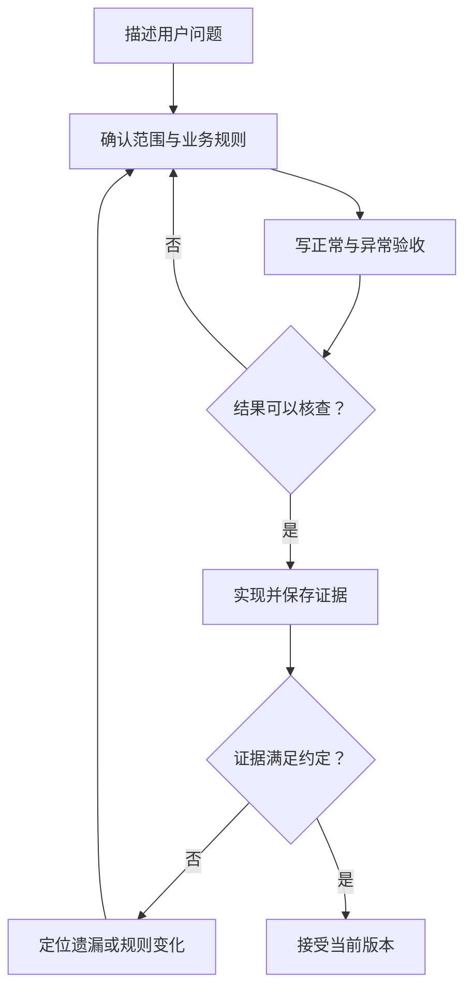

# 从想法到需求与验收

> 面向准备提出软件需求、与开发者或 AI 协作的读者。无需会写代码，读完能把模糊想法变成有边界的需求，写出正常、异常与质量要求，并用实际证据判断一个版本是否完成。

## 需求说明要改变什么

“做一个活动报名系统”是方向，还不足以指导实现。需求应说明谁在什么情境下遇到了什么问题，系统需要提供什么行为，以及受到哪些限制。验收条件则规定：满足哪些可核查结果，才能接受这次交付。

这两者相互补充。需求只有功能名称，开发者就会自行补充规则；验收只有“页面能打开”，可能接受一个看起来完整、实际不能保存报名的演示。即使全部代码由 AI 生成，也需要先建立这些约定，人的职责见[AI 编程：协作方式与人的责任](/software/guide/ai-coding-responsibility)。

NASA 的需求确认资料区分了两个问题：结果是否满足预期用途，以及实现是否符合规定要求。本文借用这种区分帮助小项目澄清目标，采用的是轻量方法，无需照搬航天项目的文档规模。[NASA 需求确认说明](https://swehb.nasa.gov/spaces/SWEHBVD/pages/102695440/SWE-055%2B-%2BRequirements%2BValidation)

## 先找问题，再画首版边界

用户说“加一个导出按钮”时，先理解导出的用途：管理者是要核对名单、制作签到表，还是分析历史趋势？同一个按钮可能对应不同字段、筛选范围和权限。理解用途后，才能判断首版是否需要这个功能，以及做到什么程度。

可以用一段话记录目标：

> 在虚构的小型活动中，参与者需要查看活动并确认自己的报名状态，管理员需要取得某场活动的有效报名名单。首版解决名额、重复提交和查看权限问题，使用合成账号与样例数据。

这是教学案例的目标，不是任何真实项目的需求或效果证明。围绕这个目标，再划出范围：

| 范围层次 | 案例中的约定 | 对实现的影响 |
| --- | --- | --- |
| 本次交付 | 预置活动列表与详情、报名与取消、管理员名单与导出 | 每项都要有对应的可观察结果 |
| 明确排除 | 支付、多租户、真实个人数据、复杂营销流程 | 不引入相应接口、数据或承诺 |
| 待讨论 | 候补、通知、活动创建与编辑 | 先记录问题；未确认前不作为首版验收项 |

排除项并不意味着以后永远不做，它们表示这次交付的边界。把待定问题与已确认需求分开，也能避免 AI 将一个建议直接实现成默认规则。更系统的目标、角色与范围分析见[问题定义与范围](/software/requirements/problem-scope)。

## 把功能名展开成业务规则

“参与者可以报名”只覆盖动作名称。还需要说明身份、时间、容量、已有状态和操作后的结果。先记录这些规则，再讨论采用什么框架或数据库。

例如，可以为本案例提出以下首版规则，由需求方确认后成为基线。基线指这次实现和验收共同采用的已确认版本。

- 活动详情可公开查看；报名和取消需要已登录的合成账号。
- 同一账号在同一活动中至多有一份有效报名；取消后的历史状态与当前有效状态可以区分。
- 名额按有效报名计算；报名截止前允许取消，首次成功取消释放一个名额。
- 截止时间由服务端统一判断；到达截止时间后，禁止新报名和取消。
- 取消后如仍未截止且有名额，可以重新报名；重复取消不能再次释放名额。
- 普通账号只能查看自己的报名状态；管理员可查看和导出指定活动的有效名单。

这些不是报名系统必然采用的行业规则。另一场活动可能允许截止后取消，或要求人工审核；那就应修改需求与验收。关键是业务取舍有明确出处，不能让实现细节悄悄决定政策。

## 用前提、动作与结果写验收

一句好的验收条件，应让需求方、开发者和检查者对同一个场景作出一致判断。“支持报名”可以展开为：

> **前提**：账号 A 已登录、尚未报名，活动未截止且仍有名额。**动作**：A 提交报名。**结果**：页面显示已报名；刷新后状态仍保留；管理员名单包含 A，有效名额占用增加一个。

这种“前提—动作—结果”的写法对应 Gherkin 中的 Given、When、Then。Cucumber 官方说明强调，结果应优先描述用户或外部系统能观察到的输出。[Gherkin 参考文档](https://cucumber.io/docs/gherkin/reference/) 不使用该工具，也可以采用这种表达；要成为自动化测试，还需有人实现具体执行与判断步骤。

不要把条件写成“调用某个函数成功”，除非正在验收一个开发接口。对业务交付，更有用的是报名状态、错误提示、名单和导出内容是否正确。开发测试可以进一步检查内部数据约束，但不能取代用户可见结果。

图中的第一道判断发生在开发前：“体验流畅”“权限安全”都值得追求，但还需转成能执行的检查。第二道判断发生在交付时，要求对照实际结果，不能只看完成声明。

## 异常是需求的一部分

异常不只指程序报错。多人争抢最后一个名额、用户重复点击、网络断开和身份失效，都是系统会遇到的情境。只描述正常路径，会让这些情境的行为没有依据。

| 场景 | 案例中的验收结果 | 核查重点 |
| --- | --- | --- |
| 两个不同账号同时申请最后一个名额 | 只有一个成功，另一个得到名额已满的结果 | 最终有效名单不超过容量，而非只看按钮提示 |
| 同一账号重复提交报名 | 保持一份有效报名，返回一致的当前状态 | 不重复占用名额；刷新后仍一致 |
| 同一账号重复取消 | 第一次取消生效，之后保持已取消 | 名额只释放一次 |
| 请求已提交但返回超时 | 界面说明结果尚未确认，允许查询当前状态 | 不能直接断言失败并产生第二份报名 |
| 普通账号直接访问管理员接口 | 请求被拒绝，不返回名单或导出内容 | 隐藏页面入口不足以证明权限有效 |
| 到达报名截止时间 | 新报名与取消被拒绝，已有状态不被错误改写 | 临界时刻按约定的服务端时间判断 |

每个失败结果都要说明数据是否发生变化、用户下一步能做什么。例如“网络错误，请重试”并不总是足够：第一次请求可能已经写入，返回却丢失。这里先规定可观察行为；怎样实现重复请求安全、怎样处理并发，是后续设计问题。

完整的验收还应覆盖输入缺失、活动不存在、会话失效、导出空名单等与首版有关的分支。无需枚举无限可能，但必须检查关键规则的边界、拒绝路径和恢复路径。具体写法见[验收条件与检查方法](/software/requirements/acceptance-criteria)。

## 质量要求也要带上条件

功能要求描述系统提供什么；质量要求描述在什么条件下，它表现得是否足够好。两者的界限不必机械划分，目的都是减少交付歧义。

| 模糊表达 | 可以讨论和核查的写法 | 需要补齐的信息 |
| --- | --- | --- |
| 系统要快 | 在约定负载与环境下，报名接口的响应时间达到指定门槛 | 数据量、请求组成、并发方式、时间统计口径 |
| 手机上好用 | 约定手机宽度下可完成查看、报名和取消，不被横向溢出阻挡 | 页面范围、设备或浏览器、错误状态 |
| 操作无障碍 | 核心流程可以仅用键盘完成，焦点与错误提示可识别 | 检查步骤；更完整的无障碍目标另行定义 |
| 服务重启不丢报名 | 已确认成功的合成报名，在正常重启后仍可查询 | 重启方式、存储位置；故障恢复单独验收 |
| 出错能排查 | 失败请求有可关联的记录，且不记录凭据或不必要数据 | 记录内容、查阅权限、保留期限 |

若需要演示性能门槛的写法，可以提出一个**待验证的教学假设**：“在指定测试环境、500 条合成报名、30 个并发请求下，95% 的报名请求在 2 秒内响应，拒绝结果也纳入统计。”这些数字只是示范，不是实测结果或通用推荐值。实际需求应依据使用情境与资源约束确定，并在记录的条件下验证。

键盘可操作性的依据可以参考 W3C 对 WCAG 2.2 条款 2.1.1 的解释；仅完成一次键盘检查，不能据此宣称满足全部 WCAG 条款。[W3C 键盘操作说明](https://www.w3.org/WAI/WCAG22/Understanding/keyboard.html)

## 让需求、版本与证据可以对照

给需求和验收条件起简短编号，可以在改动后迅速找到需要重新检查的内容。例如 R-01 是“有效报名不超容量”，A-01 是“同时申请最后名额”，交付记录标注对应版本、执行条件和实际结果。小项目用一张表即可，无需先购买复杂管理工具。

验收状态应区分通过、失败和未执行。原型截图能帮助确认页面；并发结果需要相应执行记录；权限结果需要不同角色的请求证据。证据类型要适合所判断的要求，不能用一张成功截图替代所有检查。

规则变化时，先记清改变了什么以及原因，再同步验收和实现。例如增加候补后，“名额已满”可能由拒绝变为进入候补，但有效报名仍不能超额。旧证据支持旧版本的结论，受影响的条件需要重新检查。

## 常见坑与下一步

常见问题包括：把需求清单写成页面清单，遗漏后台规则；只用管理员账号演示，漏掉普通账号拒绝路径；把“后续考虑”悄悄加入首版；验收时不断新增未约定目标。应先判断是实现缺陷、需求遗漏还是正式变更，再决定当前交付如何处理。

需求与验收也不等于完整交付约定。接手者还需要知道运行方式、配置要求、版本和已知限制。下一篇[软件项目全景](/software/guide/software-project-overview)会说明这些材料与前端、后端、数据和环境之间的关系。

## 参考资料

<Refs>

- [NASA Software Engineering Handbook：SWE-055 — Requirements Validation](https://swehb.nasa.gov/spaces/SWEHBVD/pages/102695440/SWE-055%2B-%2BRequirements%2BValidation)（访问日期 2026-10-03）——需求确认与预期使用环境的关系。
- [Cucumber：Gherkin Reference](https://cucumber.io/docs/gherkin/reference/)（访问日期 2026-10-03）——前提、动作、预期结果及可观察输出。
- [W3C WAI：Understanding WCAG 2.2 SC 2.1.1 — Keyboard](https://www.w3.org/WAI/WCAG22/Understanding/keyboard.html)（访问日期 2026-10-03）——键盘可操作性的要求和适用边界。
- 站内相关：[问题定义与范围](/software/requirements/problem-scope) · [验收条件与检查方法](/software/requirements/acceptance-criteria) · [AI 编程责任](/software/guide/ai-coding-responsibility) · [软件项目全景](/software/guide/software-project-overview)

- 专业篇：[需求分析与追踪](/software/requirements/requirements-analysis) · [文档与责任分工](/software/requirements/documentation-responsibility)

</Refs>
