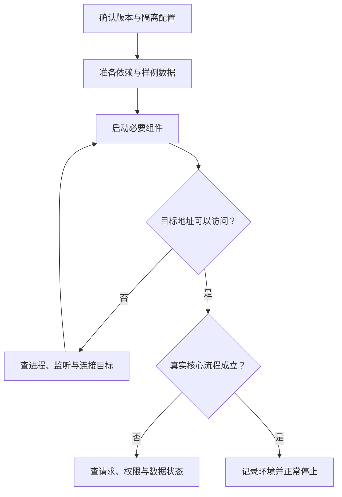

# 在本地运行项目

> 面向下载了项目、希望在自己电脑上理解和检查结果的读者。建议先认识目录、运行时和依赖，读完能按顺序准备环境、确认连接目标、启动必要组件，并区分“进程启动了”和“核心流程可用”。本文命令是教学示意，未在案例应用中执行。

## 本地运行先确认对象与目标

本地运行通常指在开发电脑上启动程序并观察结果。它可以用于理解代码、试验界面和验证修复，但电脑上的页面也可能连接远端数据，因此不能单凭“本地”推断所有操作都被隔离。

虚构的小型活动报名系统需要页面、业务服务和数据存储共同工作。本文只使用合成账号和样例活动，不涉及支付、多租户或真实个人数据。成功目标是：参与者可查看活动、报名并查询状态，管理员可取得对应名单，普通账号不能越权。

开始前，应找到可信来源的项目说明，确认当前版本、运行要求和需要启动的组件。不要从一条来源不明的启动命令推断全部准备过程；脚本还可能安装包、初始化数据或调用外部服务。

| 准备项 | 需要知道什么 | 可查看的依据 |
| --- | --- | --- |
| 项目版本 | 当前检查的是哪一份代码 | 提交标识、分支、工作区变化 |
| 运行环境 | 运行时、包管理工具及版本范围 | README、清单、版本配置 |
| 数据与身份 | 使用哪套存储、哪些合成账号 | 配置模板、样例说明、初始化步骤 |
| 启动入口 | 哪些组件先后启动 | 脚本定义和运行说明 |
| 停止与清理 | 怎样退出，哪些数据保留 | 进程管理方式、存储位置 |

## 第一步：确认目录和原始状态

终端是输入命令并查看程序输出的界面；Shell 是解释命令的程序。编辑器打开了项目，不表示终端当前就在项目根目录。很多工具从当前目录寻找清单和配置，位置错误会产生与源码无关的报错。

以下是支持相应命令的 Shell 中的只读示例，应在实际项目目录中使用。它们不代表本文已经执行过检查：

```bash
pwd
git status --short
node --version
npm --version
```

`pwd` 显示工作目录，`git status` 帮助识别已有修改，后两条查看一个 JavaScript 工程常见的工具版本。其他语言应按项目要求查看相应工具，而不是为了套用示例安装 Node.js。工作目录是进程的运行属性，Python 官方的获取与切换接口也体现了这一机制。[工作目录说明](https://docs.python.org/3/library/os.html#os.getcwd)

记录初始变化，是为了防止后续安装或格式化混入别人的未保存工作。若目录来自源码压缩包而没有 Git 历史，可以记录下载来源和版本；不应为消除提示就随意创建新仓库。

## 第二步：按项目约定准备依赖

先核对项目使用的包管理工具和锁文件，再执行其约定的安装方式。安装会下载或运行第三方代码，不能把它视作纯文本读取。应理解脚本权限、网络目标和产生的文件，避免用管理员权限掩盖普通文件权限错误。

对于已经采用 npm 并提供相符锁文件的项目，`npm ci` 可以作为锁定安装的示意：

```bash
# 教学示例：先确认项目确实使用 npm 和相应锁文件
npm ci
```

npm 文档说明，这种安装要求锁文件与清单一致，会移除已有的 `node_modules`，并不会替使用者更新清单或锁文件。[npm ci 官方说明](https://docs.npmjs.com/cli/v11/commands/npm-ci/) 因此，有人在依赖目录中直接做过修改时，必须先处理这些修改；报错也不应直接通过删除锁文件解决。

Python 项目可能使用虚拟环境，将依赖从其他项目隔离。官方教程解释了环境激活会改变当前 Shell 找到的解释器。[Python 虚拟环境](https://docs.python.org/3/tutorial/venv.html) 激活一个终端，不会自动影响另一个终端；应核对实际执行工具，而不只看提示符。

安装成功后，仍需确认源文件、清单和锁文件是否出现意外变化。缓存命中和下载完成都不证明业务正确；它们只完成了运行准备的一部分。

## 第三步：配置隔离的数据与连接

配置决定程序连接哪里、用什么身份、保存什么状态。可以根据项目提供的无凭据模板准备本地值，但模板是否自动加载、文件应放在哪里，都取决于项目工具。文件叫 `.env` 并不保证程序会读取它。

报名案例应准备独立测试数据，核对服务实际使用的数据库目标，并说明初始化是否会覆盖已有记录。初始化是建立结构或样例的动作；迁移是调整结构和数据的受控步骤。对未知存储执行“重置”可能丢失数据，不应作为默认排错办法。

地址也要看运行位置。浏览器中的 `localhost` 指向浏览器所在电脑；容器中的相同名称通常指向该容器。端口是主机上区分网络服务的入口编号，只有进程在目标地址监听，连接才可能成功。详见[网络地址、端口与连接](/software/foundations/network-addresses-ports)。

本地开发通常无需向整个网络开放服务。如果需要同一网络的另一设备访问，应核对监听地址和访问范围，再使用合成数据检查。把服务监听到所有网卡是扩大访问范围，不是解决所有连接问题的方法。

## 第四步：启动组件并逐层检查

先阅读脚本定义，再按说明启动数据依赖、后端和前端；有些项目由一个命令统一管理，有些需要多个进程。开发服务器可能提供热更新，也可能代理接口，它的行为与正式运行方式不完全相同。



浏览器能打开活动列表，只说明页面入口可达。还要检查报名请求去了哪个服务、服务返回什么、刷新后状态是否仍存在，以及管理员读取的是否是同一份数据。模拟接口和固定样例可以帮助开发界面，但应明确它们的位置，不能当成后端接通证据。

一次最小检查可以安排：查看样例活动，用合成参与者报名，刷新查询，取消后再查询；随后用管理员读取名单，用普通账号直接访问受保护入口。并发、恢复和安全检查另有范围，最小检查不应声称覆盖了全部验收。

## 报错后沿边界排查

| 观察到的现象 | 先检查哪里 | 避免的盲目操作 |
| --- | --- | --- |
| 命令不存在 | 工具是否安装、当前 Shell 找到哪个可执行文件 | 随意复制另一套启动命令 |
| 找不到清单或配置 | 工作目录、文件名和加载规则 | 修改业务代码补偿路径错误 |
| 端口已占用 | 哪个进程监听、是否是自己之前启动的组件 | 终止全部同名进程 |
| 页面可见但接口失败 | 实际请求地址、后端是否可达、代理配置 | 将所有错误归结为页面代码 |
| 报名成功但刷新消失 | 是否只保存页面状态、存储是否同一套 | 不查数据便宣布后端故障 |
| 普通账号能读名单 | 服务端身份和对象权限 | 只隐藏管理员按钮 |

保留最早的错误信息及相关上下文，去掉凭据，再请求开发者或 AI 分析。每次只改变一个明确条件，有助于观察因果。进一步的诊断方法见[定位问题与修复](/software/guide/diagnosis-repair)。

## 正常退出并留下运行记录

前台开发进程通常可用终端的中断操作请求退出；后台服务、容器或托管进程应使用对应管理方式。关闭浏览器只停止页面访问，不一定停止后端；退出进程也不应自动删除持久数据。

记录项目版本、工具版本、必要配置名称、启动顺序和实际检查结果，保留未验证事项。配置记录不包含密钥值，数据记录使用合成标识。这份材料能帮助另一个人重复准备，而不只是知道“某台电脑曾经成功打开”。

下一篇继续追踪一次报名从页面到数据的状态变化；之后再学习给 AI 上下文、审查改动和正式验收。本地运行只是开始，还不能推导线上环境已经可交付。

## 参考资料

<Refs>

- [npm Docs：npm ci](https://docs.npmjs.com/cli/v11/commands/npm-ci/)（访问日期 2026-10-03）——锁文件一致性、安装目录与冻结安装。
- [Python：Virtual Environments and Packages](https://docs.python.org/3/tutorial/venv.html)（访问日期 2026-10-03）——项目环境隔离与激活机制。
- [Python：os.getcwd](https://docs.python.org/3/library/os.html#os.getcwd)（访问日期 2026-10-03）——进程工作目录。
- 站内相关：[软件研发导览](/software/guide/) · [语言与依赖](/software/guide/languages-frameworks-dependencies) · [终端与 Shell](/software/foundations/terminal-shell) · [网络地址与端口](/software/foundations/network-addresses-ports) · [可复现开发](/software/toolchain/reproducible-development) · [环境配置](/software/toolchain/environment-configuration) · [请求穿过系统](/software/guide/request-through-system)

</Refs>
