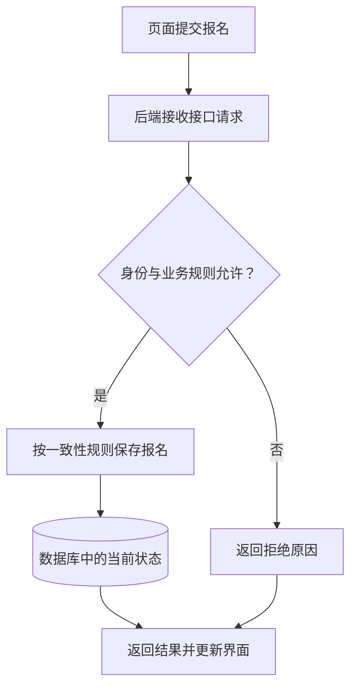

# 软件项目全景：从操作到交付

> 面向刚拿到一份软件项目、或准备与开发者和 AI 讨论方案的读者。只需知道网页可以显示内容并接受操作，读完就能沿一次请求理解前端、后端、接口和数据库的分工，并分清本地运行、线上部署与版本交付。

## 一个项目要让多种工作相互配合

软件项目不只是几个页面或一批代码文件。它还包含业务规则、组件间的约定、数据结构、运行条件以及交付方式。看到页面能打开，只能确认其中一部分工作已经生效。

本篇用虚构的“小型活动报名与管理系统”解释这些关系：参与者查看活动、报名或取消，管理员查看名单并导出。案例使用合成账号与样例数据，不包含支付、多租户或真实个人数据。首版范围和验收写法见[从想法到需求与验收](/software/guide/requirements-and-acceptance)。

理解系统可以从两条线入手：**操作线**追踪用户的动作经过哪些边界；**交付线**追踪源文件怎样变成某个环境中可运行、可接手的版本。两条线交汇后，才知道应检查哪里。

## 沿一次报名看系统如何协作

活动列表首先让浏览器取得页面和展示资源；页面可能已经包含活动数据，也可能再向服务端请求数据。用户点击报名后，界面发起请求，服务端判断身份与规则、保存结果，再返回可以显示的状态。

前端是用户直接接触的界面及相关交互逻辑，通常运行在浏览器等客户端。后端是处理请求和业务规则的服务端程序。MDN 用 HTTP 请求与响应说明这种浏览器和服务器之间的协作：请求表明要获取或操作什么，响应提供结果和状态。[MDN 客户端与服务端概览](https://developer.mozilla.org/en-US/docs/Learn_web_development/Extensions/Server-side/First_steps/Client-Server_overview)

图中的判断应发生在服务端。禁用报名按钮能减少误操作，但请求也可以从另一个页面、脚本或客户端发出，服务不能依赖按钮状态作最终判断。

### 展示和规则不能相互替代

前端负责让人理解并完成操作，例如显示余量、提交中的状态、拒绝原因，以及提供合适的取消入口。后端负责在实际请求到达时判断：这个账号是谁、允许操作哪个活动、是否已截止、是否已有有效报名。

页面显示“还剩一个名额”是展示时获得的信息，到提交时可能已经过期。服务端要依据当时的真实状态决定，而不能相信请求自带的“还有名额”或“我是管理员”。OWASP 建议对每次请求检查权限，并校验具体对象与功能的访问资格。[OWASP 授权检查说明](https://cheatsheetseries.owasp.org/cheatsheets/Authorization_Cheat_Sheet.html)

前端与后端是职责划分，不要求两个独立仓库或两台机器。一个程序可以同时提供页面和业务接口；一个项目目录也可以包含两端源码。框架还可能在服务端生成页面的一部分。判断依据是工作在哪里执行、哪一侧掌握可信身份和数据，而不是目录叫什么。

## 接口约定决定两端怎样交流

接口（API）是组件之间的操作约定。Web API 经常通过 HTTP 传输，但“有一个地址”还不足以说明接口。调用方还需要知道如何表达动作、提供什么参数、如何证明身份，以及如何理解成功、拒绝和错误。

例如报名接口可以约定“已报名”也返回当前有效状态，而不再创建一条记录；取消接口可以约定再次取消保持已取消。前端据此决定显示什么，后端据此保持一致行为，测试据此比较实际结果。

| 用户操作 | 前端需要知道的结果 | 后端必须保证的行为 |
| --- | --- | --- |
| 查看活动详情 | 活动内容、截止时间、当前状态 | 返回对应活动，区分不存在与不可访问 |
| 报名 | 成功、已报名、满额或已截止 | 不超容量，同一账号不重复占用 |
| 取消 | 已取消或不允许取消的原因 | 校验本人资格，名额只释放一次 |
| 管理员导出 | 文件内容、字段与筛选范围 | 校验管理员权限，只提供约定范围的名单 |

前端开发时可以用模拟接口，按约定返回固定数据，以便先确认交互。这能证明页面如何处理某些结果，不能证明后端真的执行了规则。接入真实服务后，需要再检查真实请求、响应和最终状态。

接口也是版本之间的边界。后端把“有效人数”字段改名，或改变错误结果的含义，旧页面就可能显示错误。两端一起存放并不自动解决兼容问题；应记录约定，判断是否需要兼容旧调用方，并检查发布顺序。

## 数据让操作具有持续结果

数据库保存和查询结构化状态。在案例中，可以记录活动容量、报名所属账号与活动、有效或已取消状态。页面临时变量或浏览器存储也能保存某些信息，但通常不能单独承担多人共享的有效报名名单。

关键不只是“写进数据库”。若两个请求都先读到剩余一个名额，再各自写入一份报名，最终仍可能超额。因此，容量判断与报名变更需要共同满足一致性规则；可以结合事务和数据约束等机制实现，再用并发场景验证。事务是将一组数据操作作为一个整体处理的机制，具体能力与适用边界见[数据库选型](/cloud/data/database)。

取消也要同时维护关联状态：报名转为已取消，相应名额恢复；重复取消不能再次增加名额。界面、接口响应、管理员名单若来自互不一致的状态，即使每个页面都能显示，也不能认定系统正确。

数据结构会随软件变化。迁移指按照受控步骤调整已有数据结构或数据，例如增加一个状态字段。迁移说明应与代码版本一起交接；删除源码目录、切换代码版本，都不会自动把数据库恢复到过去。数据库备份与恢复需要单独安排。

## 本地和线上是运行条件的区别

运行环境是程序实际执行时所依赖的条件，包括操作系统、语言运行时、服务地址、配置、权限与数据。语言运行时是执行某类程序所需的软件，例如解释器或虚拟机；有些程序则以原生可执行文件运行。

本地运行常用于开发者电脑上的快速修改与检查，线上部署表示程序放到可通过网络访问的目标环境。线上环境可以用于测试，也可以承担正式服务；公网可访问不等于已经适合生产使用。

| 环境问题 | 为什么会影响同一份代码 | 案例中应核对的内容 |
| --- | --- | --- |
| 服务地址不同 | 页面可能连到另一套后端 | 活动与报名实际写入哪里 |
| 配置与权限不同 | 服务可能无法访问存储，或账号权限过大 | 数据连接、服务身份、管理员角色 |
| 数据不同 | 空数据演示不能代表已有数据可迁移 | 合成样例、数据结构及迁移步骤 |
| 浏览器与网络不同 | 请求可能受证书、跨来源限制或网络失败影响 | 真实访问入口和错误处理 |
| 存储生命周期不同 | 临时目录可能随进程或实例重建消失 | 已确认报名是否存到持久位置 |

配置是随部署而变化的参数，如后端地址、数据库连接和凭据。Twelve-Factor App 建议把这类配置与代码分开；它提出的环境变量方式是具体方法之一。[Twelve-Factor 配置说明](https://12factor.net/config) 在实践中还需控制配置访问，避免凭据被打包进浏览器可下载的资源。

本地页面也可能连接远端后端，因此“在自己电脑上打开”不能推断使用的是隔离数据。反过来，本地后端和数据库可以组成完整测试环境。判断环境时，应沿请求找实际目标，而不只看页面地址。`localhost` 指向发起连接的那个运行环境，也不是所有机器共享的地址。

## 从源文件到可识别的交付版本

源文件是供人维护和工具处理的代码与材料。构建会将这些输入加工成运行所需的产物，例如可执行文件或浏览器资源包；某些解释执行的程序不需要先编译为机器码，也仍需准备依赖和运行条件。机制可继续阅读[从源码到运行](/software/foundations/source-to-runtime)。

Twelve-Factor App 将构建、发布和运行区分为三个阶段：构建生成产物，发布把产物与配置结合，运行在目标环境启动相应进程。[构建、发布与运行说明](https://12factor.net/build-release-run) 小项目可以采用简单脚本，但这三个问题仍要分别回答。

例如，“新增取消报名”不应只交付一份改好的页面。接手者需要知道后端是否也更新、数据库是否需要迁移、用了哪些依赖与配置，以及哪个可识别版本包含这些变化。版本可以通过代码提交标识与发布编号关联，文件修改时间不足以准确识别交付内容。

回退代码也有边界。新代码已经改变数据结构时，旧代码可能不再适用。交付记录应说明受影响的数据、兼容条件和恢复步骤，并记录已执行与尚未执行的检查。关于如何识别源文件、配置和构建产物，见[文件、目录与代码仓库](/software/guide/files-directories-repositories)。

## 用边界定位问题与控制复杂度

发生问题时，可以依次观察：页面是否发起请求，接口返回什么，服务在哪一步拒绝或失败，数据最终是什么状态，环境是否对应预期版本。例如导出按钮无反应可能是界面没有发送请求；接口拒绝可能是权限不足；接口成功但名单错误则需要核对筛选规则和数据。

常见失败模式包括：用模拟接口演示后就宣布业务完成；只在页面隐藏管理员入口；把临时文件当持久数据；把全部问题归因于前端；发布了新页面却仍连接旧接口。沿边界检查，才能减少无目的的重写。

系统各部分有不同职责，也不意味着必须拆成微服务。小项目可以在一个清楚的应用中实现这些职责；当独立演进与运维收益足以覆盖额外通信成本时，再评估拆分。更深入的服务拆分讨论见[微服务架构](/cloud/native/microservice)。

下一篇从项目目录入手，帮助识别哪些文件描述系统、哪些文件保存工具状态，哪些只是安装或运行生成的结果。

## 参考资料

<Refs>

- [MDN：Client-server overview](https://developer.mozilla.org/en-US/docs/Learn_web_development/Extensions/Server-side/First_steps/Client-Server_overview)（访问日期 2026-10-03）——浏览器、服务器及 HTTP 请求响应关系。
- [OWASP Cheat Sheet：Authorization](https://cheatsheetseries.owasp.org/cheatsheets/Authorization_Cheat_Sheet.html)（访问日期 2026-10-03）——每次请求与目标对象的权限检查。
- [The Twelve-Factor App：Config](https://12factor.net/config)（访问日期 2026-10-03）——部署配置与代码的分离。
- [The Twelve-Factor App：Build, release, run](https://12factor.net/build-release-run)（访问日期 2026-10-03）——构建、发布和运行阶段。
- 站内相关：[需求与验收](/software/guide/requirements-and-acceptance) · [文件、目录与仓库](/software/guide/files-directories-repositories) · [从源码到运行](/software/foundations/source-to-runtime) · [数据库选型](/cloud/data/database) · [微服务架构](/cloud/native/microservice)

- 专业篇：[Web 与浏览器](/software/frontend/web-browser) · [服务生命周期](/software/backend/service-lifecycle) · [应用数据模型](/software/data/data-models)

</Refs>
