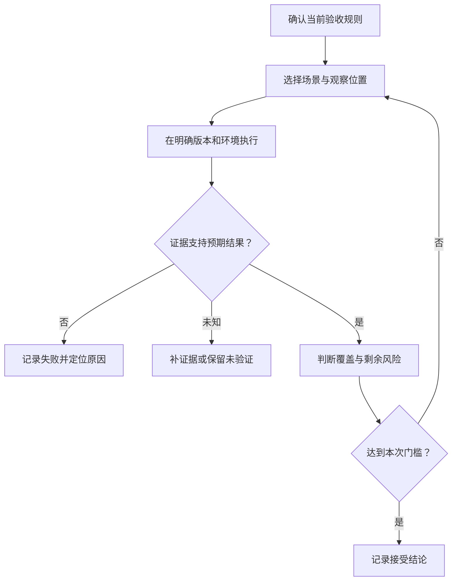

# 验证与验收成果

> 面向需要判断自己、开发者或 AI 是否交付了合格结果的读者。建议已明确需求和验收，读完能选择与风险相配的检查、识别无效通过结果，并把版本、环境和实际证据连接起来。

## 不同检查回答不同问题

验证关注实现是否符合规定要求；验收是相关责任人依据约定决定是否接受交付。产品是否解决预期用途，还需结合真实使用情境判断。术语在不同流程中可能有不同译法，关键是说明比较对象与决定责任。

编译通过可以表明工具接受了代码输入，自动测试通过可以表明某些检查得到了预期结果。它们都不自动证明需求完整、检查有效，或目标环境已经具备发布条件。

虚构的小型活动报名系统使用合成账号和样例数据，包含活动查看、报名取消及管理员名单与导出，不涉及支付、多租户或真实个人数据。验收重点包括容量不超额、重复动作不增加副作用、普通账号不能获取管理员信息。

| 检查层次 | 主要问题 | 案例中的观察 |
| --- | --- | --- |
| 静态检查 | 描述和结构是否违反已配置规则 | 类型、语法、明显危险用法 |
| 局部测试 | 某个规则在构造条件下是否成立 | 已取消状态再次取消不释放名额 |
| 集成测试 | 真实组件组合后是否正确 | 接口与数据库共同维护状态 |
| 端到端检查 | 用户是否完成一条业务旅程 | 报名后刷新，再由管理员读取名单 |
| 验收与发布准备 | 是否满足本次交付和目标环境要求 | 规则、配置、数据变更与恢复材料 |

这些层次可以组合组织，但不能仅凭数量相互替代。详见[单元、集成、契约与端到端测试](/software/quality/test-levels)。

## 从已确认规则生成场景

先列出正常行为，再找边界、拒绝与恢复。容量规则需要余量充足、刚好满额和最后名额竞争；重复规则需要顺序重复与并发重复；权限规则需要允许操作与禁止操作。

每个场景写清前提、触发和可观察结果。Cucumber 的 Gherkin 资料用 Given、When、Then 表达这类场景，并强调结果应体现可观察输出。[Gherkin 场景表达](https://cucumber.io/docs/gherkin/reference/) 不采用该工具，也可以使用这种组织方式。

教学场景：“给定两个未报名的合成账号和最后一个名额，同时提交两个报名请求；预期只有一个成功，最终有效记录只增加一份。”这里需要最终状态，不能只检查其中一个成功响应。数字用于构造边界，本文没有实际执行此场景。

质量要求也要先确定条件。页面在什么宽度可用、性能在什么负载下测量、重启包含什么操作，都会影响结论。没有约定的“足够快”，不能在交付时用一次主观体验补成客观证据。

## 检查必须包含有效断言

断言是将实际结果与预期条件进行比较。测试只点击按钮却没有判断结果，即使程序退出正常，也不能证明报名完成。只断言页面出现“成功”，又可能漏掉记录没有保存或容量超额。

| 弱检查 | 遗漏的风险 | 更有意义的补充 |
| --- | --- | --- |
| 页面能够打开 | 接口未接通 | 执行真实报名并重新查询 |
| 响应是成功状态 | 数据终态错误 | 检查有效记录和容量 |
| 按钮被隐藏 | 可绕过界面访问 | 普通账号直接请求受保护接口 |
| 重复请求未报错 | 重复副作用仍存在 | 比较最终记录数与释放次数 |
| 导出得到文件 | 字段、范围和时点错误 | 对照指定活动的有效名单 |

自动化界面测试还要处理异步更新。Playwright 官方文档区分了会持续等待条件成立的 Web 断言与普通断言。[Playwright Assertions](https://playwright.dev/docs/test-assertions) 固定等待一段时间可能太短或无谓变长；应等待实际条件，并规定合理超时。

等待成功不代表允许无限等待。超时需要报告当前观察与失败位置，避免吞掉失败、降低断言或不断重试直到偶然通过。测试偶发失败时，先区分环境噪声、测试缺陷与业务竞争。

## 让实现和检查使用不同证据来源

AI 可以帮助起草用例和运行检查，但生成代码与测试可能共享同一误解。例如二者都把前端按钮限制当成权限保证，就可能得到看似完整的通过报告。

业务规则应从需求或责任人的决定获得，检查再对照实际实现。关键场景可以交给另一位人员复核，或用不同层次的观察交叉验证。额外 AI 审查可以补充发现问题，不等于独立的业务批准。

“未知”是一种有意义的结果。没有权限、环境不可用或输出不足时，应保留它，而不是为了汇报整齐转成通过。

## 建立轻量的证据矩阵

给要求和场景编号，关联版本、环境与结果，可以发现哪些要求没有证据，也便于规则变化时重新检查。小项目不需要复杂系统，一张可维护的表就能提供价值。

| 要求 | 检查方法 | 应保存的证据 | 本文状态 |
| --- | --- | --- | --- |
| 容量不超额 | 最后名额竞争 | 并发条件、响应、最终名单与计数 | 教学设计，未执行 |
| 重复取消安全 | 同一有效报名重复取消 | 转换前后状态与余量 | 教学设计，未执行 |
| 名单权限 | 普通与管理员身份分别请求 | 角色、请求结果与信息范围 | 教学设计，未执行 |
| 持久状态 | 报名后重新读取，按约定重启 | 存储目标、重启方式、读取结果 | 教学设计，未执行 |

原始记录应能追溯，但不应包含完整令牌、密钥或不必要数据。截图适合说明界面，请求记录适合说明协议，数据库状态适合说明保存结果；单一形式通常不能支持全部判断。

运行记录至少包含检查对象、版本、必要配置、数据构造、步骤、实际结果和偏差。若验证后又修改了实现，评估旧证据是否还适用，补查受影响部分。

## 回归与发布门槛有不同范围

回归检查是在修改后确认原来需要保留的行为没有被破坏。修复取消时，除重复取消外，还要检查正常报名、重新报名和名单统计是否继续成立。选择范围应基于影响关系，而不是一律全跑或只跑新用例。

验收某项功能之后，版本仍可能缺少发布准备，例如目标配置、迁移方案、健康检查或恢复能力。发布门槛应由团队根据风险预先约定，包括阻断问题、例外决定者和未验证事项处理方式。

通过率和覆盖率只是辅助观察。测试执行了代码，却没有检查关键结果，覆盖率可以很高；过度模拟真实依赖，也可能隐藏组合错误。应回到具体规则判断断言是否有效、数据是否真实代表使用情境。

## 失败与例外如何处理

失败后先确定是实现缺陷、检查条件错误还是需求正式变化。只有需求确实改变，才能同步修改验收；不能为了让当前实现通过而悄悄降低标准。

如果确需带着限制交付，应记录缺口、影响、补救措施和决定责任。容量超额或越权通常与核心约定直接矛盾，不能被一个漂亮页面抵消；其他低影响缺口则由明确的业务取舍决定。

常见失败模式是只看报告结论、用管理员覆盖所有身份、删除失败用例、把未执行标成通过，以及用过去版本的结果证明今天的代码。保持规则、版本和证据一致，才能让验收成为可解释决定。

下一篇[定位问题与修复](/software/guide/diagnosis-repair)接着处理失败结果：先缩小原因，再改代码，并用原场景与相关回归确认修复。

## 参考资料

<Refs>

- [Cucumber：Gherkin Reference](https://cucumber.io/docs/gherkin/reference/)（访问日期 2026-10-03）——前提、动作与可观察结果。
- [Playwright：Assertions](https://playwright.dev/docs/test-assertions)（访问日期 2026-10-03）——断言、异步等待和重试边界。
- 站内相关：[软件项目入门](/software/guide/) · [验收标准](/software/requirements/acceptance-criteria) · [测试层次](/software/quality/test-levels) · [测试场景与数据](/software/quality/test-cases) · [验收与回归](/software/quality/acceptance-regression) · [AI 代码验证](/software/ai-assisted/generated-code-verification) · [诊断与修复](/software/guide/diagnosis-repair)

</Refs>
