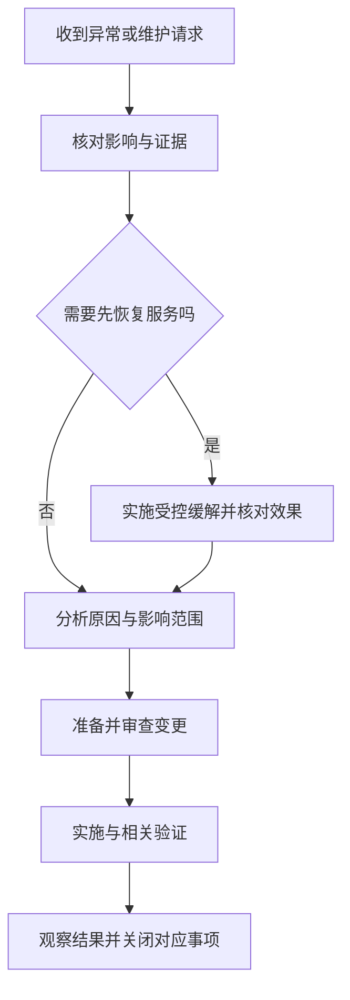

# 维护变更与问题管理

> 本文面向维护已有软件、处理缺陷和跟进事故后续的人员。读完能区分恢复、原因分析与变更，按影响安排优先级，并用实施和验证证据关闭问题。

## 维护延续软件的责任

**软件维护**（software maintenance）是在交付后修正、适应或改善软件，使它继续满足使用和支持需要。它不只是修补错误，也包括环境变化、性能与可维护性改善以及功能增加。

SWEBOK V4.0a 列出纠正、预防、适应、新增和完善五类维护，并介绍紧急维护。分类表达变更目的，不决定优先级，也不保证各类工作互不重叠。[SWEBOK 软件维护章节](https://ieeecs-media.computer.org/media/education/swebok/swebok-v4.pdf)

| 类别 | 主要目的 | 示例 |
| --- | --- | --- |
| 纠正型 | 修复交付后发现的问题 | 修正重复写入缺陷 |
| 预防型 | 修正尚未在运行中显现的潜在缺陷 | 处理已识别的资源泄漏路径 |
| 适应型 | 保持在变化环境中可用 | 适配运行时或外部协议变化 |
| 新增型 | 增加功能或特性 | 增加新的批量操作能力 |
| 完善型 | 改善属性、文档或实现 | 改善查询性能与维护说明 |
| 紧急维护 | 临时恢复可用状态等紧迫处理 | 受控关闭失效路径并安排后续修复 |

类别可帮助盘点维护负担。某个升级既适应环境，也修复缺陷，应记录主要目标和相关影响，不能因为分类争论拖延必要行动。

## 事件、问题与变更的不同用途

本文使用三种管理对象：**事件**（incident）记录已经发生的服务异常及恢复；**问题**（problem）记录需解释或处理的原因、缺陷或持续风险；**变更**（change）记录对系统进行的具体修改。各组织术语可能不同，应明确自己的口径。

虚构的夜间报表服务发生重复记录。当天恢复可以暂停任务、核对重复范围并提供修正输出；原因分析需要确认请求重试与去重记录的关系；长期变更可能增加事务边界与幂等处理。恢复成功并不意味着长期问题已经解决。

同一个问题可能引起多次事件，一次事件也可能暴露多个问题。维护记录宜建立关联，同时分别说明状态。把所有事项合在一个“已处理”标签下，会使未完成风险消失在表面进度中。

## 受理先保留可用证据

缺陷描述应包含观察到的行为、预期依据、版本和环境、输入或操作、影响及可复现程度。日志、截图和数据样本需要控制访问，尽量使用虚构或脱敏内容；记录关联标识通常比复制全部敏感数据更合适。

无法复现不代表问题不存在。低频并发、特定旧数据和外部抖动可能使复现困难。应记录观察事实、假设和需要补充的证据，避免在缺乏依据时认定使用者误操作。

重要证据应对应具体版本。最新代码已经修复，但事故发生在旧制品上；只分析当前源码可能找不到原因。源码、制品、配置和数据关系见 [标签、版本与配置基线](/software/collaboration/tags-versions-baselines)。

## 优先级由影响和风险决定

**严重性**描述问题的损失或潜在后果，**优先级**描述处理顺序。高严重性通常需要快速处理，但也要考虑当前是否暴露、是否可缓解、依赖与资源。低影响文案可能有明确窗口，不能据此把它描述为高严重缺陷。

| 判断维度 | 应确认的问题 |
| --- | --- |
| 影响 | 哪些用户、数据和功能受影响，是否持续扩大？ |
| 紧迫 | 是否有明确期限，等待会增加什么损失？ |
| 恢复 | 是否可通过缓解控制，有无数据修复能力？ |
| 发生 | 当前是否正在发生，哪些条件会触发？ |
| 检测 | 能否及时发现再次发生，证据是否完整？ |
| 依赖 | 是否阻碍其他交付或受支持版本？ |

涉及数据破坏、权限绕过或无法恢复的关键路径时，应优先分析和控制暴露。分类为“历史问题”不能降低实际风险；新增请求也不能自动压过长期关键缺陷。

排队记录应有负责人、状态、下一步和重新评估条件。长期没有处理的事项可以接受保留、缩减范围或关闭重复项，但需要理由；不能仅因时间长就认为已无影响。

## 原因分析连接事实与机制

报表重复可能由重复请求、任务并发、导入重放或数据库约束遗漏造成。每个候选原因需要说明机制，并寻找能区分它们的证据。例如同一请求标识出现两次业务写入，可以支持幂等边界问题；两次不同合法请求相同内容，不应简单去重为一次。

原因通常不止一个。重试触发是近因，缺少原子去重是机制，测试未覆盖失败窗口、运行观察不足和手册不明确可能是促进因素。停止在“某人点击两次”会错过系统应该如何应对正常重复行为。

Google SRE 的复盘强调记录影响、缓解、原因与后续行动，关注系统条件并建立预防措施。本文采用这种学习思路，不将复盘当作惩罚或证明某个人负责。[复盘文化](https://sre.google/sre-book/postmortem-culture/)

复盘深度应按损失、重复风险和学习价值安排。重大或重复事件宜形成完整记录，小型已理解缺陷可以保留简短分析。没有必要为每个拼写错误召开正式会议，也不能为节省时间省掉关键事故的后续责任。

## 准备最小有效变更

变更应说明触发条件、修复机制、受影响路径及验证计划。宜先写能够暴露缺陷的用例或其他可复核步骤，再确认修复后的结果。测试必须约束错误行为，不能只确认函数返回成功。

紧急修复应尽量控制范围，避免顺便升级依赖或全面重构。长期结构改善可以另建关联工作项，说明为何需要。临时缓解要有有效期和退出条件，例如暂停任务后谁恢复、补跑是否重复以及如何核对数据。

对已经错误的数据，代码修复和数据修复是不同工作。修复脚本需要条件、范围、预演结果、执行记录和后验校验；重复执行是否安全也要明确。程序以后不再产生重复，不表示过去数据已经正确。

## 关闭状态需要对应结果

“修复代码已合并”可以作为实现状态，“受影响版本已发布并验证”才支持交付状态。若有多个受支持版本，需要分别记录传播情况。若只能在测试环境确认，应明确生产结果尚未观察。

关闭问题时核对：原触发条件如何验证，相关旧路径是否回归，错误数据是否处理，临时缓解是否退出，文档和观察是否更新。允许部分关闭时，应留下仍需处理的关联事项和责任，避免重复开关同一个模糊记录。

后续行动宜有负责人、结果定义和检查时间。增加监控、完善用例和改善发布流程都是具体工作，不能只写“加强注意”。措施还应对应原因：培训无法替代原子写入，增加日志也不直接修复数据错误。

## 问题管理的边界

常见失败是恢复后立即关闭全部事项、用一个“根因”忽略系统条件、只修新增路径、修复后没有覆盖旧版本，以及临时开关长期存在无人清理。另一方面，过多低价值流程会拖慢修复，应按风险保留必要证据。

维护管理的结果应让团队知道哪些异常已经恢复、哪些原因已经解释、哪些变更已经验证以及哪些风险仍被接受。清楚状态与责任，才能把紧急工作连接到持续改进。

## 实例：重复报表问题何时可关闭

幂等修复已经发布，还应核对历史重复数据是否有处理决定、受支持旧任务是否采用修复，以及故障后的手工重跑方式是否更新。若错误输出已交给使用方，需要按实际职责处理更正，不能仅删除数据库重复行就认为全部影响结束。

一个问题可以拆为程序修复、数据修正和观察改善三个关联事项，各自保留完成证据。服务已恢复时可关闭事件，尚未实施的长期措施仍保持可见。这样的状态安排既避免无限挂起同一事件，也不会丢掉后续责任。

## 参考资料

<Refs>

- [IEEE Computer Society：SWEBOK V4.0a，Software Maintenance](https://ieeecs-media.computer.org/media/education/swebok/swebok-v4.pdf)、[Google SRE：Postmortem Culture](https://sre.google/sre-book/postmortem-culture/)；访问日期：2026-10-03。
- [诊断与修复](/software/guide/diagnosis-repair)：从现象到验证。
- [调试与缺陷](/software/quality/debugging-defects)、[事件响应](/software/operations/incident-response)：分析代码与恢复服务。
- [重构、技术债与架构演进](/software/maintenance/refactoring-debt)：安排后续结构改善。

</Refs>
