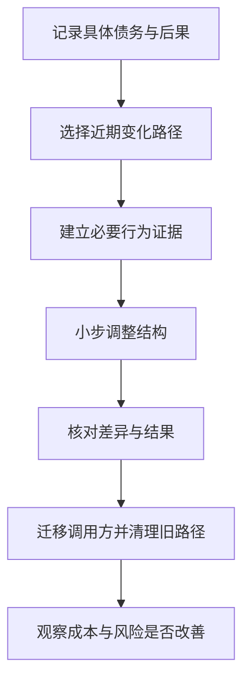

# 重构、技术债与架构演进

> 本文面向持续维护系统、安排改善投入或规划现代化的人员。读完能把技术债写成可判断的成本与风险，区分重构和替换，并为渐进演进设置验证与退出条件。

## 技术债要连接实际后果

**技术债**（technical debt）是描述当前结构或技术选择导致未来额外成本的比喻。它可以来自有意识的时间权衡，也可以来自后来获得的新理解。并非所有缺陷、旧技术或不喜欢的代码都应不加分析地称为债务。

虚构的排班系统把班次规则复制到页面、批量导入和后台任务中。每次改规则要同步三处，曾发生一处遗漏导致排班不一致。这里的债务有具体对象和后果：重复的规则权威、修改与验证成本、遗漏风险。

可以用**本金**表示改善所需工作，用**利息**表示继续保留带来的额外成本。但它们通常是估计和观察，不是固定货币账目；不同改善路径的本金也不同。不能随意宣称某种债务必然按固定比例增长。

Fowler 的技术债象限区分审慎与鲁莽、主动与无意产生的债务，并指出是否偿还取决于后续成本与场景。该分类帮助讨论成因，不应当作用于责备个人。[Technical Debt Quadrant](https://martinfowler.com/bliki/TechnicalDebtQuadrant.html)

## 让债务成为可审查工作项

| 记录内容 | 排班示例 |
| --- | --- |
| 对象及证据 | 三个入口分别实现同一班次冲突规则 |
| 当前后果 | 变更需多处同步，已有不一致缺陷记录 |
| 触发条件 | 新增班次类型或改变重叠判断 |
| 候选改善 | 建立共同规则边界，逐个入口迁移 |
| 预期收益 | 减少规则副本，使验证集中 |
| 代价与风险 | 行为误改、旧入口遗漏、迁移期间双轨 |
| 完成证据 | 入口均使用共同规则，边界用例与旧副本清理 |

示例没有提供实际工时或事故数字。真实记录可以引用修改历史、等待、重复工作和缺陷，而不是只写“代码质量差”。对安全缺陷、数据破坏等已确认问题，应直接按风险处理，不能以债务长期排队代替修复。

优先级应结合变化频率、损失、系统剩余寿命和改善成本。经常修改且影响关键规则的重复逻辑值得优先处理；长期稳定、即将停用且风险低的部分可能选择保留。债务清单不应无期限增长而没有决定，接受保留也需说明理由和触发条件。

## 重构与行为修改分开判断

**重构**（refactoring）通过结构变换保持可观察行为。修复错误、增加能力和改变兼容承诺属于行为变化。Fowler 的定义强调小步和行为保持，具体原则见 [设计原则、模式与重构](/software/architecture/principles-patterns)。[重构定义](https://refactoring.com/)

排班系统可以先为当前重叠判断建立必要验证，提取共同函数，再分别迁移入口。若同时把“相邻班次允许”改为“不允许”，就需要单独说明规则变化及验收依据。将两类变化混在一个大提交，会使回归归因困难。

**特征测试**记录现有行为，可用于保护不了解的旧路径；现有行为未必正确，应标识待确认规则。测试只覆盖选定条件，也需要阅读外部接口、时间边界和资源影响，不能将通过测试当作完整等价证明。

每一步应有可理解目标与恢复方式。为了便于审查，可以将格式整理、纯结构调整和规则变化分别组织。中间状态仍应满足团队约定的构建和运行条件。

## 从局部重构走向架构演进

**架构演进**改变更广的边界、数据责任、部署或依赖。它可能包括重构，但也包含接口迁移、运行方式和行为变化，不能全部用“内部优化”概括。

选择演进方向时，先确认具体压力：修改难、运行资源争用、支持成本高、平台不再维护，还是团队责任不清。升级框架只能解决一部分工具约束，不能自动消除重复规则或跨模块写入。服务拆分也可能增加失败与协调成本，见 [单体、模块化单体与服务](/software/architecture/monolith-services)。

可以先调整源码边界和数据访问，再考虑独立部署。也可以通过适配层保留旧契约，将新实现逐步接入。临时层次有维护成本，必须记录移除条件，否则演进会留下更多长期复杂度。

## 渐进替换与完整重写

**Strangler Fig** 以逐步替换旧系统能力的方式进行现代化。Fowler 的文章强调明确结果、拆成可交付部分，并承认新旧共存的过渡结构与组织变化成本。[渐进替换思路](https://martinfowler.com/bliki/StranglerFigApplication.html)

| 路径 | 可能适用的条件 | 关键风险 |
| --- | --- | --- |
| 局部重构 | 行为清楚，当前结构可逐步改善 | 缺少保护、范围扩张 |
| 边界适配后替换 | 能识别稳定入口和契约 | 适配泄漏、旧路径遗漏 |
| 渐进迁移数据与能力 | 系统必须持续服务，能力可切分 | 双轨状态、数据一致性、退出困难 |
| 完整重写 | 范围可控，旧实现确难维持 | 隐藏行为、长期平行建设、支持中断 |
| 保留或停用 | 收益不足或已无业务需要 | 未识别依赖、数据责任遗漏 |

完整重写有时合理，但需要证明范围、替代能力和转换成本。旧系统长期存在的细节可能是隐含需求，也可能是无需保留的偶然行为。应逐项确认，而不是声称“照旧系统做一遍”就已经得到完整规格。

渐进替换可以先迁移只读查询或边缘能力，再处理核心写入。哪一部分先做取决于收益、依赖和风险，不能固定按页面或表数量安排。对强不变量和不可逆副作用，需要更严格的切换与恢复设计。

## 迁移期间控制两套事实

新旧实现并存时，要明确路由条件、数据权威、支持责任和允许组合。读结果可以在受控条件下比较，写操作的影子执行必须避免真实副作用。差异要分类：规则修复、数据异常、格式不同和真实缺陷不能混在一起。

双写需要特别谨慎。两个写入独立成功或失败，可能使状态分化；恢复任务也可能重复执行。可采用可靠变更记录、幂等处理和对账，但应按实际技术语义验证，不能只在图上连两条箭头。

回退条件也要说明。新实现产生的数据是否能被旧实现读取？新规则是否允许旧系统继续写入？保留旧制品并不自动意味着可回退。不可逆迁移可以采用前向修复或分阶段兼容设计，详见 [依赖升级、弃用与兼容](/software/maintenance/upgrades-compatibility)。

## 以完成证据避免永久过渡

一项改善的完成条件可以包括调用方迁移、旧实现删除、文档更新、观察指标和运行交接。仅合并新代码不意味着旧债务消失。过渡开关、适配器和双轨任务应有维护者及到期检查。

收益应回到最初问题：规则变化是否只需改一个权威位置，故障是否更容易定位，构建与升级是否更可控。没有测量依据时，可以记录定性观察及局限，不应虚构节省工时或缺陷下降比例。

如果实际收益不足或成本超过预期，调整范围、改变路径或停止投入都可以是合理决定。历史记录保留当时假设，有助于理解为什么改变计划。相关决定可写入 [架构决策与验证](/software/architecture/architecture-decisions)。

## 技术债治理的边界

常见失败是给所有旧代码贴债务标签、追求统一风格而忽略关键风险、借重构加入大量功能，以及一直建设新系统却不退出旧路径。另一类失败是完全不给改善时间，导致每次新工作重复支付相同成本。

改善安排应嵌入真实变化，同时为高风险或跨模块工作提供明确投入。没有通用的固定比例适合所有团队。用具体后果、可选路径和验证条件沟通，才能让技术工作进入可判断的产品与运行计划。

## 实例：改善完成后验证收益

共同排班规则上线后，可以用下一次真实规则变更核对修改范围，并检查是否仍有入口独立判断。若新边界只增加了一层调用，旧副本还在使用，债务尚未偿还。应追踪剩余消费者、移除旧逻辑，并记录无法迁移的原因与责任。

## 参考资料

<Refs>

- [Fowler：Technical Debt Quadrant](https://martinfowler.com/bliki/TechnicalDebtQuadrant.html)、[Refactoring](https://refactoring.com/)、[Strangler Fig](https://martinfowler.com/bliki/StranglerFigApplication.html)；访问日期：2026-10-03。
- [维护与接管](/software/guide/maintenance-takeover)：先理解现有系统。
- [估算、风险、成本与自建采购](/software/requirements/estimation-risk-economics)：分析投入与机会成本。
- [停用、数据迁移与可持续性](/software/maintenance/retirement-sustainability)：完成旧路径与资源退出。

</Refs>
