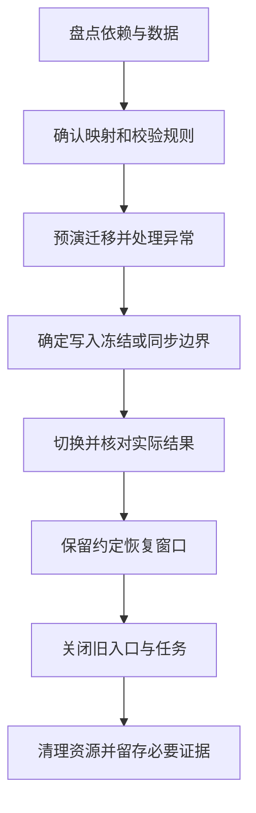

# 停用、数据迁移与可持续性

> 本文面向迁移系统、关闭旧能力或管理长期资源的人员。读完能追踪停用依赖，设计数据校验与切换，确认旧资源退出，并区分资源节省与可证明的环境影响。

## 停用结束的是一组责任

**停用**（retirement）使软件或能力退出正常服务，并完成使用方、数据、资源和支持责任的处理。**资源退役**（decommissioning）涉及关闭、移除或释放运行资产。停止一个进程只完成其中一部分，数据库、任务、账号和账单仍可能存在。

虚构的资料归档系统被新工具替代。网页入口已经关闭，但月末报表仍直接读取旧数据库，历史文件链接指向旧域名，定时任务还在生成索引。若直接删除旧存储，会破坏新工具之外的使用路径。

AWS 的退役指南强调依赖盘点、受控关闭、必要数据与配置保留、运行工具及资产清理。本文采用这些工程原则，不表示正在执行真实停用或删除。[应用退役实践](https://docs.aws.amazon.com/prescriptive-guidance/latest/migration-app-retirement-best-practices/best-practices.html)

## 先确认依赖与决定范围

**依赖盘点**既要看系统调用谁，也要看谁调用它。入站请求、数据库访问、消息订阅、文件链接、定时任务、手工流程和导出文件都可能形成依赖。架构图和旧知识可以提供线索，需要与实际证据核对。

| 依赖类型 | 需要检查 | 停用前的处理 |
| --- | --- | --- |
| 在线调用 | API、域名、客户端和回调 | 迁移消费者或提供明确结束行为 |
| 数据读取 | 报表、脚本、直接 SQL | 转移查询或约定归档访问 |
| 异步处理 | 队列、订阅、定时和重试任务 | 停止生产，处理积压与重放 |
| 文件引用 | 下载地址、索引和外部链接 | 迁移、重定向或说明失效条件 |
| 人工操作 | 值班、审核、月末与年度流程 | 确认替代过程及责任 |
| 运行支持 | 监控、备份、账号和许可证 | 在需要结束后按计划撤销 |

观察窗口应覆盖实际使用周期。某入口一周没有调用，不证明年度任务不需要它；网络记录也可能看不到离线读取和人工操作。未知依赖应显性记录并确认，不能以“没有发现”代替“没有存在”。

停用决定要说明范围、理由、替代能力、日期条件、负责人和恢复边界。关闭一个功能不必删除整个产品；数据只读归档也不等于继续提供全部业务服务。准确描述保留能力，可以减少隐含支持承诺。

## 数据迁移先定义语义

**数据迁移**将数据从一种存储、结构或系统移动到另一处，同时保持约定含义。格式转换、身份映射、状态映射、时间与编码都可能改变结果。逐行拷贝不能自动保持业务语义。

旧归档系统以目录标识分类，新工具采用标签。需要说明目录层级如何映射、重名如何处理、失效记录是否保留、权限如何继承。未确认的映射不宜由脚本默认值决定，否则迁移会把新的业务规则隐藏在实现中。

迁移计划应覆盖源数据基准、映射规则、工具版本、异常清单、进度与重跑方式。对关键对象使用稳定标识或映射表，便于校验和恢复；不能为了方便重新生成标识后丢掉外部引用关系。

图表示一种顺序，真实系统可能采用分批或长期同步；每种方式都要说明变化如何进入新系统，以及何时认为同步完成。不能把迁移演练结果直接视为最终切换成功。

## 校验覆盖数量、内容和关系

行数相同只是一个信号。关键字段、文件摘要、对象关系、权限、不变量和业务汇总都可能不同。可设计分层校验：全量结构与数量，关键字段和摘要，异常清单，代表性业务操作。抽样适合部分语义检查，但不能冒充全量完整性证据。

| 校验层 | 可检查对象 | 局限 |
| --- | --- | --- |
| 数量 | 分类型记录数和文件数 | 数量相等可能仍有重复与遗漏 |
| 内容 | 字段、编码、摘要与大小 | 摘要一致不解释权限或业务含义 |
| 关系 | 外键、引用与归属映射 | 结构正确不保证规则正确 |
| 业务 | 查询、审批、读取与汇总 | 代表路径不能覆盖全部组合 |
| 权限 | 新旧角色及对象范围 | 名称相同不表示授权等价 |

数据异常应按规则处理并留痕。无效日期、孤立文件和重复标识可以进入待处理清单，不能静默丢弃后宣称迁移完整。若决定不迁移某类数据，应说明决定依据、后续访问或删除安排及责任。

## 切换时控制写入与恢复

可以采用停写后迁移，也可以持续同步到切换点。前者需要业务接受停写窗口；后者需要明确变更捕获、顺序、重复和滞后。两边同时独立写入，会引入冲突与分化，必须有领域合并或单一权威设计。

切换前定义停止条件与恢复动作。新系统开始写入后，旧系统是否能接收这些变化？若不能，回到旧入口可能丢失新业务记录。保留旧备份或服务器不足以证明可回退，应验证数据和接口兼容方向。

对于不可逆变化，可以准备前向修复、只读核对和人工恢复，而不是承诺随时回滚。恢复窗口、额外资源与支持责任需要明确结束条件，避免迁移后两套系统永久维持。消息及工作流的恢复见 [事件、工作流与补偿](/software/architecture/events-workflows)。

## 清理资源而不遗漏共享对象

停用应核对计划和实际状态：入口是否停止、定时任务是否移除、积压是否处理、账号和令牌是否撤销、监控与备份是否按计划调整、资产和费用是否更新。自动重启策略和任务调度可能重新拉起已停进程。

清理前先确认所有权。旧数据库实例可能还承载另一个应用，存储桶可能含共享文件，域名可能需要保留重定向。按名字猜测用途并批量删除，会破坏未识别依赖。每类资产需要对应负责人和核验结果。

数据保留、归档和删除应依据组织要求与适用义务确定，本文不提供具体法律期限。备份、缓存、导出、副本和日志也要纳入范围；在线数据删除后，历史备份仍可能恢复它。应说明保留策略、访问限制和恢复后的处理。

归档需要可读性和维护责任。只留一个数据库文件，而没有结构、读取方式、密钥和工具兼容安排，未来可能无法使用。另一方面，无期限保存全部内容会增加资源和信息管理负担，应确定必要范围。

## 可持续性需要可比较口径

软件可持续性可以讨论长期可维护性、资源效率和环境影响，但这些含义应分开说明。资源费用下降不直接证明碳排放等比例下降，服务器利用率升高也不自然保证总能耗减少。

绿色软件基金会的**软件碳强度**（Software Carbon Intensity，SCI）规范要求明确系统边界与功能单位，考虑运行能耗、区域碳强度及硬件隐含排放，并披露方法。比较前后结果需要一致口径。[SCI 规范](https://sci.greensoftware.foundation/)

可用表达为 `SCI = (E × I + M) / R`：E 是能耗，I 是相应碳强度，M 是分配给软件的硬件隐含排放，R 是功能单位。单位与分配方法必须一致，不能只拿 CPU 使用率代替全部输入。本文没有计算任何实际 SCI 数值。

例如每份成功归档资料可以作为一种功能单位，同时观察总资源与总排放。单份成本降低而处理量显著增加，总量仍可能上升。关闭无用任务、减少重复数据和按需求分配资源可以成为候选改善，但需要证据判断实际效果。

## 停用完成的证据

完成应包括依赖迁移或明确结束、数据校验与访问责任、旧入口和任务关闭、资源清理及必要记录保存。仅有一张“迁移成功”截图，不足以证明所有数据与消费者完成切换。

常见失败是删除资源早于依赖确认、只有数量校验、双写没有恢复机制、旧凭据长期有效，以及无人维护归档。按可复核条件收尾，才能让旧系统的责任实际结束，而不是从项目列表消失后继续产生风险和费用。

## 参考资料

<Refs>

- [AWS：Application retirement best practices](https://docs.aws.amazon.com/prescriptive-guidance/latest/migration-app-retirement-best-practices/best-practices.html)、[Green Software Foundation：SCI Specification](https://sci.greensoftware.foundation/)；访问日期：2026-10-03。
- [维护与接管](/software/guide/maintenance-takeover)：盘点责任和运行对象。
- [依赖升级、弃用与兼容](/software/maintenance/upgrades-compatibility)、[数据质量与恢复](/software/data/data-quality-recovery)：维护迁移与恢复条件。
- [隐私与数据生命周期](/software/security/privacy-lifecycle)、[容量、性能与成本](/software/operations/capacity-performance-cost)：管理保留与资源口径。

</Refs>
