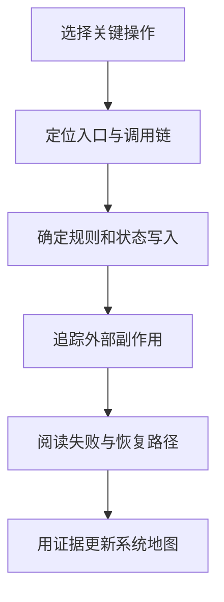

# 阅读与接管既有系统

> 本文面向第一次维护已有项目、接手运行责任或准备交接的人员。读完能建立基于证据的系统地图，按风险安排阅读与验证，并判断是否具备独立修改和恢复的条件。

## 接管从责任与事实开始

**系统接管**是将理解、访问、变更和运行责任转移给能够持续承担它们的人。拿到仓库和账号只是开始。源码可能无法直接构建，生产环境可能使用不同版本，任务脚本也可能不在主仓库中。

虚构的资料归档系统由新团队接手。旧说明写着每晚归档，实际有两个定时任务；文件存储由外部账号管理；失败后有人手动重跑。若先改界面，新团队仍不知道如何避免重复归档或恢复缺失数据。

Google SRE 的生产准备评审从服务具体情况识别可靠性要求，覆盖依赖、观察、应急、容量、变更、培训和渐进责任转移。本文借用这种按实际系统准备接管的思路，不要求普通项目建立专门 SRE 团队。[SRE 接管模型](https://sre.google/sre-book/evolving-sre-engagement-model/)

初期应记录已知事实、证据位置、待确认事项和暂时限制。不要把旧文档、口头说明或代码注释单独当作全貌；它们可以提供线索，需要与构建、配置和实际运行状态核对。

## 建立最小系统地图

先回答系统为何存在、谁使用、哪些路径重要、数据在哪里、谁依赖它。然后核对运行对象、源码位置和发布记录。**系统地图**可以是短文、表格和小图，关键是标识稳定且能指向证据。

| 对象 | 应收集的信息 | 需要核对的事实 |
| --- | --- | --- |
| 源码与制品 | 仓库、分支、发布及制品标识 | 实际运行版本能否对应 |
| 构建与依赖 | 工具版本、锁文件、生成步骤 | 能否在允许环境重复构建 |
| 入口与任务 | API、界面、定时与消息入口 | 是否还有隐藏写入路径 |
| 数据与文件 | 模型、存储、迁移、备份责任 | 谁可读写，恢复范围是什么 |
| 外部依赖 | 身份、服务、协议及支持边界 | 失败时影响哪些功能 |
| 运行支持 | 观察、告警、手册与联系人 | 新团队是否具备访问与操作能力 |

访问清单应说明权限来源与获取流程，不能把机密值复制到交接材料。遗留个人账号、即将过期证书和无人维护的外部集成需要明确迁移责任。权限授予完成后，还应核对最小必要范围和替代人员。

**配置漂移**指声明或记录与实际状态不同。生产手工调整、遗漏任务或旧资源都可能造成漂移。接管时应先记录差异及影响，再决定是否统一；直接把运行环境覆盖为文档状态，可能破坏仍被依赖的隐含条件。

## 用一条路径带动代码阅读

按目录从头读到尾往往低效。选择一个关键业务路径，从入口、校验、领域规则、持久化到副作用与返回逐步追踪。归档系统可以先追踪“提交文件并确认归档完成”，再追踪“定时任务失败后恢复”。

源码检索可以查路由、任务注册、关键字段和外部客户端。调用图帮助定位候选路径，动态导入、反射和配置选择可能不在静态图中。运行记录显示已观察路径，不能证明没有其他路径。应把两种证据组合使用。

阅读时特别关注状态在哪里改变、哪些条件必须同时成立、什么结果属于未知，以及资源何时释放。函数名叫 `archive`，可能只是创建任务；数据库记录完成，也可能仍有文件复制未完成。需要核对成功含义，而不是根据名字推断。

理解历史可以查询变更、议题和架构决定。奇怪实现可能是兼容约束或事故后的保护，也可能已经失效。先查理由与当前条件，避免立即删除看似多余的逻辑；历史读取方法见 [提交、差异、历史与撤销](/software/collaboration/commits-history-undo)。

## 验证当前行为再安排修改

接管应确认可运行入口和代表性结果。优先在隔离、允许的环境中使用虚构或脱敏数据。启动成功只证明进程起来了，不能证明任务、数据库、权限和外部依赖都能正确工作。

**特征测试**（characterization test）记录既有行为，为后续结构调整提供保护。它可能保留现有不合理行为，因此应标记需要领域确认的部分，不能把观察到的行为一律宣布为正确需求。

例如同一文件重复提交后，当前系统返回两条记录。先确认这是允许多份归档还是缺陷，再决定预期。测试可以先记录当前结果以保护阅读理解，后续按确认规则新增或修改断言；行为修复与结构重构应分别说明。

| 当前情况 | 合适的下一步 | 不宜据此宣称 |
| --- | --- | --- |
| 可构建，核心路径已验证 | 选择低风险变更练习流程 | 所有行为都已正确 |
| 可运行，但版本无法对应 | 补齐制品和源码关系 | 已能安全发布替换 |
| 数据恢复未验证 | 设计并执行允许的恢复演练 | 有备份就能恢复 |
| 核心规则未知 | 找到领域决定者并整理例子 | 代码就是最终规则 |
| 存在高影响未知写入 | 先盘点入口与数据责任 | 可以直接重写数据层 |

本文没有实施这些验证。真实接管记录应注明步骤、环境、版本、结果和未覆盖范围，避免把计划清单当成完成证据。

## 交接运行能力

新团队需要知道如何判断健康、如何识别故障、如何发布及恢复。可以由原维护者演示，再由接管者在允许环境独立执行，原维护者观察并纠正。仅观看演示不能证明独立操作能力。

运行手册应说明症状、诊断入口、操作前提、动作、结果检查和升级通道。对“重跑归档任务”，还要说明哪些状态可重跑、是否幂等、需要核对什么，不能只留下一个命令。

发布练习宜先选择低影响且范围清楚的变化，使接管者走完构建、验证、评审、发布和观察。恢复练习要确认制品、配置和数据兼容；备用账号也需实际核对权限。运行恢复基础见 [发布、观察与回滚](/software/guide/release-observe-rollback)。

责任转移可以分阶段：先共同值守，后由新团队主责、旧团队提供支持，最后关闭旧支持安排。阶段时间与条件应由实际约定决定。关键是每阶段谁接警、谁决定变更、谁提供业务解释都清楚。

## 风险排序与交接完成

接管风险优先看可能损失、发生条件、检测能力与恢复难度。无法恢复的重要数据、无人维护的机密、隐藏写入和生产版本不明，往往比代码格式混乱更急。低风险风格整理可以等待。

可以维护一份短风险记录，写明证据、影响、应对、负责人和接受状态。完成接管不要求历史问题全部消失，但必须知道关键未知、谁有权接受它们，以及发生问题后如何处理。

接管完成的可核对条件包括：版本和运行对象可对应，核心路径有证据，访问与支持责任可用，发布和恢复流程已按约定演练，重要未决事项有负责人。缺少资源或权限时，应明确部分接管范围，避免在名义上承担无法执行的责任。

## 阅读与接管的边界

常见失败是先全面重构、只交源码、把备份存在当作恢复可用，以及原维护者离开后才发现外部账号与任务无人拥有。另一类失败是把盘点做成庞大材料，关键路径仍无人理解。

系统地图应随事实更新，优先服务于修改、故障和恢复。接管者不可能立刻掌握全部系统，应明确阅读覆盖并持续学习。AI 可以帮助检索和概括，但需要用代码、契约和运行证据校正，不能由生成的总结代替实际接管。

## 实例：交接一个隐藏任务

发现第二个归档任务后，先核对注册位置、执行身份、输入范围和最近结果，再确认它是补漏流程还是重复实现。记录与主任务的关系，并由接管者复述失败后如何判断是否可重跑。未确认其目的前直接删除，可能让月末才执行的必要处理失效。

## 参考资料

<Refs>

- [Google SRE：The Evolving SRE Engagement Model](https://sre.google/sre-book/evolving-sre-engagement-model/)；访问日期：2026-10-03。
- [维护与接管入门](/software/guide/maintenance-takeover)、[本地运行](/software/guide/running-locally)：建立操作入口。
- [建模与架构描述](/software/architecture/architecture-modeling)、[文档、沟通与责任分工](/software/requirements/documentation-responsibility)：整理可维护的知识记录。
- [维护变更与问题管理](/software/maintenance/maintenance-changes)：接管后的持续处理。

</Refs>
